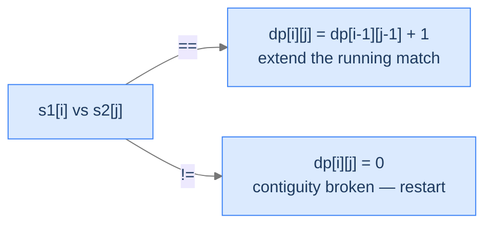

# 4. Longest Common Substring

The previous lesson found the longest common *subsequence* — characters in order, with arbitrary skipping allowed. **Substring** is the contiguous version: matched characters must be adjacent in both original strings, no gaps. The change sounds tiny ("the matched characters must touch"). The recurrence change is one operator. But the *consequences* — where the answer lives in the DP table, what a mismatch does, why the answer might be in any cell — flip the whole shape of the algorithm.

By the end of this lesson you'll know the **Longest Common Substring** recurrence (`dp[i][j] = dp[i-1][j-1] + 1` if match, else **0**), why mismatches reset rather than fall back to a max, why the answer is `max(dp[i][j])` over the entire table (not just `dp[m][n]`), and how to extract the actual substring once you've computed its length.

## Table of contents

1. [Substring vs Subsequence — The One-Operator Difference](#substring-vs-subsequence--the-one-operator-difference)
2. [The Recurrence](#the-recurrence)
3. [Top-Down Solution (Memoization)](#top-down-solution-memoization)
4. [Bottom-Up Solution (Tabulation)](#bottom-up-solution-tabulation)
5. [Longest Common Substring](#longest-common-substring)

***

# Substring vs Subsequence — The One-Operator Difference

A **substring** is a contiguous slice of a string — every character is adjacent to its neighbour in the original. A **subsequence** allows skipping. Same character set; different rule on skips.

```d2
direction: right
ss: "Substring vs Subsequence in 'abcdef'" {
  grid-rows: 3
  grid-columns: 7
  grid-gap: 0
  l1: "substring 'cde'"
  v1a: "a"
  v1b: "b"
  v1c: "c" {style.fill: "#fde68a"; style.stroke: "#d97706"}
  v1d: "d" {style.fill: "#fde68a"; style.stroke: "#d97706"}
  v1e: "e" {style.fill: "#fde68a"; style.stroke: "#d97706"}
  v1f: "f"
  l2: "subsequence 'ace'"
  v2a: "a" {style.fill: "#fde68a"; style.stroke: "#d97706"}
  v2b: "b"
  v2c: "c" {style.fill: "#fde68a"; style.stroke: "#d97706"}
  v2d: "d"
  v2e: "e" {style.fill: "#fde68a"; style.stroke: "#d97706"}
  v2f: "f"
  l3: "indices 0..5"
  i0: "[0]"
  i1: "[1]"
  i2: "[2]"
  i3: "[3]"
  i4: "[4]"
  i5: "[5]"
}
```

<p align="center"><strong>The substring "cde" picks consecutive indices 2-3-4. The subsequence "ace" picks 0, 2, 4 — gaps allowed. Both preserve order; only the substring requires adjacency.</strong></p>

The longest common *substring* of `s1` and `s2` is the longest contiguous slice that appears in both. The longest common *subsequence* is the longest non-contiguous selection. The latter is always at least as long as the former (every substring is a subsequence; not every subsequence is a substring).

> *Predict before reading on — for <code>s1 = "abcdef"</code>, <code>s2 = "axcyef"</code>, what's the LCSubstr? What's the LCS?</em>

LCSubstr: `"ef"` (length 2). LCS: `"acef"` (length 4). The contiguity requirement strictly reduces what counts.

---

## Why a Mismatch Resets, Not Falls Back

In LCS, when characters don't match, we drop one side and try the other (`max(dp[i-1][j], dp[i][j-1])`). That's because in a *sub*sequence, dropping a character is allowed — we can keep building the subsequence using the remaining characters.

In LCSubstr, a mismatch breaks the *running adjacency*. Once you've broken contiguity, the substring ending at this position is dead. You can't recover; you have to start a new substring. So `dp[i][j] = 0` on mismatch — not `max`, just zero.



<p align="center"><strong>The two-case recurrence for LCSubstr. Match extends the diagonal predecessor exactly like LCS. Mismatch resets to 0 — the substring ending at this position has length 0.</strong></p>

---

## Why the Answer Is Not `dp[m][n]`

`dp[i][j]` is the length of the LCSubstr that **ends exactly at indices `i` and `j`**. The actual longest common substring could end *anywhere* in either string. The final answer is `max(dp[i][j])` over the entire table.

In LCS, the recurrence at `dp[m][n]` covers every smaller subproblem because mismatch carries forward via `max`. In LCSubstr, mismatches reset, so each cell is independent of mismatched ancestors. The table's last cell only knows about the substring ending right at the end — which usually isn't the longest.

> *Pause. For <code>s1 = "abcde"</code>, <code>s2 = "xyzcde"</code>, the LCSubstr is "cde" — but neither string ends at "cde". Which cell of the table holds the answer?</em>

For `s1[2..4] = "cde"` and `s2[3..5] = "cde"`, the match accumulates at `dp[3][4] = 1` ('c' matches 'c'), `dp[4][5] = 2` (extends with 'd'), `dp[5][6] = 3` (extends with 'e'). The answer is `dp[5][6] = 3` — but `dp[5][6]` happens to be `dp[m][n]` here only by accident. For other inputs the maximum lives mid-table.

---

## Key Takeaway

LCSubstr's recurrence is LCS's with mismatch's `max(...)` swapped for `0`. The answer is `max(dp[i][j])` because the substring can end anywhere. Every later difference flows from those two changes.

***

# The Recurrence

`dp(i, j)` = length of the longest common substring **ending at indices `i` in `s1` and `j` in `s2`**.

```
dp(i, j) = 0                           if i < 0 or j < 0
dp(i, j) = 0                           if s1[i] != s2[j]
dp(i, j) = 1 + dp(i - 1, j - 1)        if s1[i] == s2[j]

answer   = max( dp(i, j) ) over all (i, j)
```

State is 2D, so the table is 2D. Same shape as LCS, different transitions.

---

## Key Takeaway

Match → extend the diagonal predecessor. Mismatch → reset to 0. Answer = max over the table.

***

# Top-Down Solution (Memoization)

The recursive function returns the LCSubstr ending at `(i, j)`. Because the answer might end anywhere, the caller iterates over all `(i, j)` and takes the max.

<details>
<summary><h2>Algorithm</h2></summary>


> **lcs(i, j, s1, s2, memo):**
>
> 1. If `i < 0` or `j < 0`, return 0.
> 2. If `memo[i][j] != -1`, return cached.
> 3. If `s1[i] != s2[j]`: set `memo[i][j] = 0`; return 0.
> 4. Else: `memo[i][j] = 1 + lcs(i-1, j-1, ...)`; return `memo[i][j]`.
>
> **caller(s1, s2):**
>
> 1. If either string is empty, return 0.
> 2. Init `memo` as `m × n` of `-1`. Init `result = 0`.
> 3. For each `(i, j)`: `result = max(result, lcs(i, j, ...))`.
> 4. Return `result`.

</details>
<details>
<summary><h2>Solution &amp; Analysis</h2></summary>

### The Solution

```python run viz=graph viz-root=memo
from typing import List

class Solution:
    def lcs(self, i: int, j: int, s1: str, s2: str, memo: List[List[int]]) -> int:
        # Returns the length of the longest common substring
        # ending at s1[i] and s2[j]

        # If either index goes out of bounds,
        # no substring can exist
        if i < 0 or j < 0:
            return 0

        # Return cached result if already computed
        if memo[i][j] != -1:
            return memo[i][j]

        # If characters don't match, the common substring
        # ending at these indices breaks
        if s1[i] != s2[j]:
            memo[i][j] = 0
            return 0

        # If characters match, extend the substring
        # by checking the previous characters
        memo[i][j] = 1 + self.lcs(i - 1, j - 1, s1, s2, memo)
        return memo[i][j]

    def longest_common_substring(self, s1: str, s2: str) -> int:
        m: int = len(s1)
        n: int = len(s2)

        # If either string is empty, result is 0
        if m == 0 or n == 0:
            return 0

        # memo[i][j] stores the length of the longest common substring
        # ending at s1[i] and s2[j]
        memo: List[List[int]] = [[-1] * n for _ in range(m)]

        result: int = 0

        # Try every pair of indices as potential substring endings
        for i in range(m):
            for j in range(n):
                result = max(result, self.lcs(i, j, s1, s2, memo))

        # Return the maximum substring length found
        return result


if __name__ == "__main__":
    print(Solution().longest_common_substring("abcdefgh", "bxcdelx"))   # 3 ("cde")
```

```java run
import java.util.Arrays;

public class Main {
    static class Solution {
        // Returns the length of the longest common substring
        // ending at s1[i] and s2[j]
        private int lcs(int i, int j, String s1, String s2, int[][] memo) {

            // If either index goes out of bounds,
            // no substring can exist
            if (i < 0 || j < 0) return 0;

            // Return cached result if already computed
            if (memo[i][j] != -1) {
                return memo[i][j];
            }

            // If characters don't match, the common substring
            // ending at these indices breaks
            if (s1.charAt(i) != s2.charAt(j)) {
                memo[i][j] = 0;
                return 0;
            }

            // If characters match, extend the substring
            // by checking the previous characters
            memo[i][j] = 1 + lcs(i - 1, j - 1, s1, s2, memo);
            return memo[i][j];
        }

        public int longestCommonSubstring(String s1, String s2) {

            int m = s1.length();
            int n = s2.length();

            // If either string is empty, result is 0
            if (m == 0 || n == 0) return 0;

            // memo[i][j] stores the length of the longest common substring
            // ending at s1[i] and s2[j]
            int[][] memo = new int[m][n];
            for (int[] row : memo) {
                Arrays.fill(row, -1);
            }

            int result = 0;

            // Try every pair of indices as potential substring endings
            for (int i = 0; i < m; i++) {
                for (int j = 0; j < n; j++) {
                    result = Math.max(result, lcs(i, j, s1, s2, memo));
                }
            }

            // Return the maximum substring length found
            return result;
        }
    }

    public static void main(String[] args) {
        System.out.println(new Solution().longestCommonSubstring("abcdefgh", "bxcdelx"));   // 3
    }
}
```

### Complexity

| Aspect | Cost | Why |
|---|---|---|
| Time | `O(m × n)` | Each cell computed once. |
| Space | `O(m × n)` | Memo table + recursion stack. |

</details>

***

# Bottom-Up Solution (Tabulation)

The same `(m+1) × (n+1)` shift as LCS — `i` and `j` count characters, not index them. The recurrence becomes `dp[i][j] = dp[i-1][j-1] + 1` when `s1[i-1] == s2[j-1]`, else 0. Track the running max.

```d2
direction: right
table: "dp for s1 = 'aba', s2 = 'adab'" {
  grid-rows: 5
  grid-columns: 5
  grid-gap: 0
  h0: ""
  h1: "j=0<br/>(empty)"
  h2: "j=1<br/>'a'"
  h3: "j=2<br/>'d'"
  h4: "j=3<br/>'a'"
  r0: "i=0 (empty)"
  v00: "0"
  v01: "0"
  v02: "0"
  v03: "0"
  r1: "i=1 'a'"
  v10: "0"
  v11: "1"
  v12: "0"
  v13: "1"
  r2: "i=2 'b'"
  v20: "0"
  v21: "0"
  v22: "0"
  v23: "0"
  r3: "i=3 'a'"
  v30: "0"
  v31: "1"
  v32: "0"
  v33: "1" {style.fill: "#fde68a"; style.stroke: "#d97706"}
}
```

<p align="center"><strong>The DP table for <code>s1 = "aba"</code>, <code>s2 = "ada"</code>. Note how mismatches reset cells to 0 — values don't propagate downward or rightward through them. Multiple cells reach the maximum value 1 (single-character matches "a"); the answer is <code>max = 1</code>.</strong></p>

<details>
<summary><h2>The Solution</h2></summary>


```python run viz=grid viz-root=lcs
from typing import List

class Solution:
    def longest_common_substring(self, s1: str, s2: str) -> int:

        m: int = len(s1)
        n: int = len(s2)
        if m == 0 or n == 0:
            return 0

        # lcs[i][j] stores the length of the longest common substring
        # that ends at the last character of the length-i prefix of s1
        # and the length-j prefix of s2
        lcs: List[List[int]] = [[0] * (n + 1) for _ in range(m + 1)]

        # Initialize the result variable to track
        # the length of the longest common substring
        result: int = 0

        # Fill the table
        for i in range(1, m + 1):
            for j in range(1, n + 1):
                if s1[i - 1] == s2[j - 1]:
                    lcs[i][j] = lcs[i - 1][j - 1] + 1

                result = max(result, lcs[i][j])

        return result


if __name__ == "__main__":
    print(Solution().longest_common_substring("abcdefgh", "bxcdelx"))   # 3
```

```java run
public class Main {
    static class Solution {
        public int longestCommonSubstring(String s1, String s2) {

            int m = s1.length();
            int n = s2.length();
            if (m == 0 || n == 0) return 0;

            // lcs[i][j] stores the length of the longest common substring
            // that ends at the last character of the length-i prefix of s1
            // and the length-j prefix of s2
            int[][] lcs = new int[m + 1][n + 1];

            // Initialize the result variable to track
            // the length of the longest common substring
            int result = 0;

            // Fill the table
            for (int i = 1; i <= m; i++) {
                for (int j = 1; j <= n; j++) {
                    if (s1.charAt(i - 1) == s2.charAt(j - 1)) {
                        lcs[i][j] = lcs[i - 1][j - 1] + 1;
                    }

                    result = Math.max(result, lcs[i][j]);
                }
            }

            return result;
        }
    }

    public static void main(String[] args) {
        System.out.println(new Solution().longestCommonSubstring("abcdefgh", "bxcdelx"));   // 3
    }
}
```

</details>


***

# Longest Common Substring

The actual problem: return the *substring*, not just its length. Two extra trackers — the maximum length seen and the index where it ends — let us slice the result out of `s1` after the table is built.

## The Problem

Given two strings `s1` and `s2`, return their longest common substring. If there's a tie, returning any of them is acceptable.

```
Input:  s1 = "abcdefgh", s2 = "bxcdelx"
Output: "cde"

Input:  s1 = "xyzabc", s2 = "xzalfbc"
Output: "za"  (or "bc" — both are length 2)

Input:  s1 = "lx", s2 = "lx"
Output: "lx"
```

---

<details>
<summary><h2>Applying the Diagnostic Questions</h2></summary>


| # | Question | Answer |
|---|---|---|
| **Q1** | Optimal substructure on prefixes? | **Yes** — match extends the diagonal predecessor; mismatch resets. |
| **Q2** | Overlapping subproblems? | **Yes** — `(i, j)` is reachable from `(i-1, j-1)` for matched chains; without caching the recursion is exponential. |
| **Q3** | 2D state? | **Yes** — `(i, j)` indexed by both prefix lengths. |
| **Q4** | Where does the answer live in the table? | **Anywhere** — track the running max + end-index, not just `dp[m][n]`. |

### Q4 — Why "Anywhere"?

**Mental model.** The substring's "ending position" is wherever the last matching character of the longest run lands — and that depends on where the longest run of consecutive matches happens. It's a property of the input, not of the table's geometry.

**Concrete numbers.** For `s1 = "xxxabc"`, `s2 = "abc"`, the LCSubstr is `"abc"`, ending at `dp[6][3]` = `dp[m][n]`. For `s1 = "abcxxx"`, `s2 = "abc"`, the LCSubstr is also `"abc"`, but it ends at `dp[3][3]`, not `dp[m][n] = dp[6][3]`.

**What breaks otherwise.** Reading just `dp[m][n]` gives the LCSubstr ending at *the very end of both strings*, not the global longest. Wrong answer for any input where the match doesn't extend to both ends.

</details>
<details>
<summary><h2>Solution &amp; Analysis</h2></summary>

### The Solution

We add two trackers: `max_length` and `end_index` (an index in `s1`). After the table is full, slice `s1[end_index - max_length + 1 .. end_index + 1]`.


```python run viz=grid viz-root=dp
from typing import List

class Solution:
    def longest_common_substring(self, s1: str, s2: str) -> str:
        n: int = len(s1)
        m: int = len(s2)

        # Create a 2D list to store the lengths of common substrings
        dp: List[List[int]] = [[0] * (m + 1) for _ in range(n + 1)]

        # Initialize variables to store the maximum length and end index
        # of the common substring
        max_length: int = 0
        end_index: int = 0

        # Iterate through each character of s1
        for i in range(1, n + 1):

            # Iterate through each character of s2
            for j in range(1, m + 1):

                # If the characters at the current positions match
                if s1[i - 1] == s2[j - 1]:

                    # Update the length of the common substring by adding
                    # 1 to the length of the substring
                    # ending at the previous positions
                    dp[i][j] = dp[i - 1][j - 1] + 1

                    # Check if the current substring length is greater
                    # than the maximum length seen so far
                    if dp[i][j] > max_length:

                        # Update the maximum length and the end index of
                        # the common substring
                        max_length = dp[i][j]
                        end_index = i - 1

        # If no common substring is found, return an empty string
        if max_length == 0:
            return ""

        # Extract the longest common substring from s1 using the end
        # index and the maximum length
        return s1[end_index - max_length + 1: end_index + 1]


# Examples from the problem statement
print(Solution().longest_common_substring("abcdefgh", "bxcdelx"))  # cde
print(Solution().longest_common_substring("xyzabc", "xzalfbc"))    # za (or bc)
print(Solution().longest_common_substring("lx", "lx"))             # lx

# Edge cases
print(Solution().longest_common_substring("", ""))                  # ''
print(Solution().longest_common_substring("abc", ""))               # ''
print(Solution().longest_common_substring("", "abc"))               # ''
print(Solution().longest_common_substring("abc", "xyz"))            # ''
print(Solution().longest_common_substring("abc", "abc"))            # abc
print(Solution().longest_common_substring("a", "a"))                # a
```

```java run
public class Main {
    static class Solution {
        public String longestCommonSubstring(String s1, String s2) {
            int n = s1.length();
            int m = s2.length();

            // Create a 2D array to store the lengths of common substrings
            int[][] dp = new int[n + 1][m + 1];

            // Initialize variables to store the maximum length and end index
            // of the common substring
            int maxLength = 0;
            int endIndex = 0;

            // Iterate through each character of s1
            for (int i = 1; i <= n; i++) {

                // Iterate through each character of s2
                for (int j = 1; j <= m; j++) {

                    // If the characters at the current positions match
                    if (s1.charAt(i - 1) == s2.charAt(j - 1)) {

                        // Update the length of the common substring by
                        // adding 1 to the length of the substring ending at
                        // the previous positions
                        dp[i][j] = dp[i - 1][j - 1] + 1;

                        // Check if the current substring length is greater
                        // than the maximum length seen so far
                        if (dp[i][j] > maxLength) {

                            // Update the maximum length and the end index of
                            // the common substring
                            maxLength = dp[i][j];
                            endIndex = i - 1;
                        }
                    }
                }
            }

            // If no common substring is found, return an empty string
            if (maxLength == 0) {
                return "";
            }

            // Extract the longest common substring from s1 using the end
            // index and the maximum length
            return s1.substring(endIndex - maxLength + 1, endIndex + 1);
        }
    }

    public static void main(String[] args) {
        // Examples from the problem statement
        System.out.println(new Solution().longestCommonSubstring("abcdefgh", "bxcdelx"));  // cde
        System.out.println(new Solution().longestCommonSubstring("xyzabc", "xzalfbc"));    // za (or bc)
        System.out.println(new Solution().longestCommonSubstring("lx", "lx"));             // lx

        // Edge cases
        System.out.println(new Solution().longestCommonSubstring("", ""));                  // ''
        System.out.println(new Solution().longestCommonSubstring("abc", ""));               // ''
        System.out.println(new Solution().longestCommonSubstring("", "abc"));               // ''
        System.out.println(new Solution().longestCommonSubstring("abc", "xyz"));            // ''
        System.out.println(new Solution().longestCommonSubstring("abc", "abc"));            // abc
        System.out.println(new Solution().longestCommonSubstring("a", "a"));                // a
    }
}
```


<details>
<summary><strong>Trace — s1 = "abcdefgh", s2 = "bxcdelx"</strong></summary>

```
Build dp (9 × 8). Highlighted cells = matching characters; non-highlighted = 0.
dp[2][1] = 1 ('b' = 'b')
dp[3][3] = 1 ('c' = 'c')                              max_length=1, end_index=2
dp[4][4] = 2 (extends [3][3]: 'd' = 'd')              max_length=2, end_index=3
dp[5][5] = 3 (extends [4][4]: 'e' = 'e')              max_length=3, end_index=4
... mismatches set the rest to 0 ...

max_length=3, end_index=4 → s1[2..4] = "cde" ✓
```

</details>

### Complexity Analysis

| Aspect | Cost | Why |
|---|---|---|
| Time | `O(m × n)` | Fill the table; constant work per cell. |
| Space | `O(m × n)` | DP table. Reducible to `O(min(m, n))` (rolling row), but reconstruction needs the index trackers. |

### Edge Cases

| Case | Example | Expected | Reasoning |
|---|---|---|---|
| Either empty | `s1 = ""` | `""` | Guard returns empty. |
| No shared character | `"abc", "xyz"` | `""` | Every cell stays 0; `max_length == 0` triggers the empty-result branch. |
| Identical strings | `"abc", "abc"` | `"abc"` | Diagonal matches every step; `dp[m][n] = m`. |
| Substring at start | `"abcXY", "abcZZ"` | `"abc"` | Match accumulates at top-left of table; ends mid-table. |
| Substring at end | `"YYabc", "ZZabc"` | `"abc"` | Match accumulates at bottom-right; ends at `dp[m][n]`. |
| Multiple LCSubstrs of equal length | `"xyzabc", "xzalfbc"` | `"za"` or `"bc"` | First-found wins because `>` is strict; `>=` would prefer later matches. |

</details>
<details>
<summary><h2>Final Takeaway</h2></summary>


LCSubstr is LCS with one structural change: mismatches reset to 0, and the answer is the global table maximum, not the corner. The code change is two characters and a tracker variable — **but the conceptual change (contiguity vs gap-allowed) is everything**.

> *Transfer challenge for the next lesson:* Edit Distance asks: how many *edits* (insert, delete, substitute) does it take to transform `s1` into `s2`? The recurrence has *three* cases on mismatch (one per edit). Predict what they look like before reading on.

<details>
<summary><strong>Answer</strong></summary>

The three cases all decrement the cost by 1 from a different predecessor: `dp[i-1][j-1] + 1` (substitute), `dp[i-1][j] + 1` (delete from `s1`), `dp[i][j-1] + 1` (insert into `s1`). On match the cost stays the same: `dp[i][j] = dp[i-1][j-1]`. The next lesson formalises this.

</details>

</details>

<!-- ============================================== -->
<!-- SWEEP 2 — missing sections (placeholders only) -->
<!-- ============================================== -->

<!-- TODO: The Hook — missing, needs to be written -->
<!--       Guidance: real-world story opening before any definition -->

<!-- TODO: Understanding the Problem — missing, needs to be written -->
<!--       Guidance: frame the gap the structure/algorithm fills -->

<!-- TODO: Supported Operations — missing, needs to be written -->
<!--       Guidance: table: operation / time / notes -->

<!-- TODO: Internal Mechanics — missing, needs to be written -->
<!--       Guidance: how it actually works under the hood -->

<!-- TODO: Working Example — missing, needs to be written -->
<!--       Guidance: one fully worked end-to-end example -->

<!-- TODO: Production Reality — missing, needs to be written -->
<!--       Guidance: 4–6 entries: System — uses X — because Y -->

<!-- TODO: Quiz — missing, needs to be written -->
<!--       Guidance: 3–5 questions, each labeled [Recall]/[Reasoning]/[Tradeoff] -->

<!-- TODO: Practice Ladder — missing, needs to be written -->
<!--       Guidance: table: 5 links into pattern problems + hints -->

<!-- TODO: Further Reading — missing, needs to be written -->
<!--       Guidance: annotated: ★ Essential / ◆ Advanced / → Reference -->

<!-- TODO: Cross-Links — missing, needs to be written -->
<!--       Guidance: Prerequisites | What comes next -->

<!-- TODO: Final Takeaway — missing, needs to be written -->
<!--       Guidance: exactly 3 typed bullets: Core mechanic / Dominant tradeoff / One thing to remember -->
