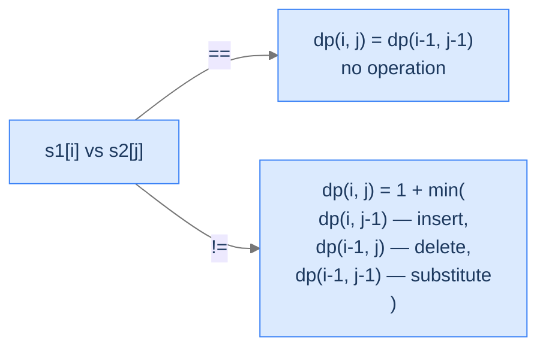

# 5. Edit Distance

You type `recieve` into a search box. The site doesn't say "no results"; it asks "did you mean *receive*?" Behind the scenes the site computed the **edit distance** between your query and every word in its dictionary and returned the closest match. Edit distance is the minimum number of single-character operations — insertions, deletions, substitutions — needed to turn one string into another. It powers spell-checkers, fuzzy search, DNA alignment, version-control diffs, and OCR error correction.

By the end of this lesson you'll know the **edit distance** recurrence (one case for match, three cases for mismatch — one per operation), the `(m+1) × (n+1)` table whose first row and column initialise to `j` and `i` respectively, and the bottom-up algorithm that fills the table in `O(m × n)`.

## Table of contents

1. [The Edit-Distance Problem](#the-edit-distance-problem)
2. [The Three-Case Mismatch — One Per Operation](#the-three-case-mismatch--one-per-operation)
3. [Base Cases — Why Row 0 Is `j` and Column 0 Is `i`](#base-cases--why-row-0-is-j-and-column-0-is-i)
4. [Edit Distance — The Algorithm](#edit-distance--the-algorithm)

***

# The Edit-Distance Problem

Given two strings `s1` and `s2`, an **edit operation** is one of:
- **Insert** a character at any position.
- **Delete** a character from any position.
- **Substitute** a character with a different one.

The **edit distance** between `s1` and `s2` is the minimum number of operations to transform `s1` into `s2`. Each operation costs 1; the cost is symmetric (insertions in `s1` and deletions in `s2` are equivalent).

```d2
direction: right
edit: "Editing 'sunday' into 'saturday' — 3 operations" {
  grid-rows: 4
  grid-columns: 1
  grid-gap: 0
  s1: "sunday"
  op1: "insert 'a' at position 1 → s_a_unday"
  op2: "insert 't' at position 2 → sat_unday"
  op3: "substitute 'n' → 'r'    → satur_day"
  s2: "saturday"
}
```

<p align="center"><strong>Three operations transform "sunday" into "saturday". The "s" prefix and "day" suffix don't change. The middle "un" needs to become "atur" — one substitute and two inserts.</strong></p>

The brute force would enumerate every sequence of operations and pick the shortest — exponential in the worst case. DP brings it to `O(m × n)`.

> *Predict before reading on — what's the edit distance between <code>"abc"</code> and <code>""</code>? Between <code>""</code> and <code>"abc"</code>?</em>

Both are 3. The first needs three deletions; the second needs three insertions. The minimum number of operations to turn anything into nothing (or vice versa) equals the length of the non-empty string.

---

## Key Takeaway

Edit distance counts insertions, deletions, and substitutions. Each costs 1. Brute force is exponential; DP is `O(m × n)`.

***

# The Three-Case Mismatch — One Per Operation

Define `dp(i, j)` = the edit distance between prefixes `s1[0..i]` and `s2[0..j]`. Look at the last characters `s1[i]` and `s2[j]`:

**Case 1 — `s1[i] == s2[j]`.** The last characters already match — no operation needed. The edit distance is whatever it was for the prefixes one shorter on each side:
```
dp(i, j) = dp(i - 1, j - 1)
```

**Case 2 — `s1[i] != s2[j]`.** Three choices, each costing 1, all reducing to a smaller subproblem:

```
Insert s2[j] into s1 at position i+1:   1 + dp(i, j - 1)
  — s1's character count unchanged; s2 reduces by one.

Delete s1[i]:                           1 + dp(i - 1, j)
  — s1 reduces by one; s2 unchanged.

Substitute s1[i] with s2[j]:            1 + dp(i - 1, j - 1)
  — both reduce by one; the substituted char now matches.

dp(i, j) = 1 + min(dp(i, j - 1), dp(i - 1, j), dp(i - 1, j - 1))
```



<p align="center"><strong>The four-case recurrence. Match → free; mismatch → pay 1 and pick the cheapest of the three operations.</strong></p>

> *Pause. Why do we use <code>min</code> here, but <code>max</code> for LCS? Predict the answer.</em>

Different goal. LCS *maximises* the length of a shared subsequence; we want as many matched characters as possible. Edit distance *minimises* the number of operations; we want as few moves as possible. Same shape of recurrence, opposite optimisation direction.

---

## Why Three Cases and Not Two?

LCS had two cases on mismatch — drop from `s1` or drop from `s2` — because it doesn't model "substitute." Edit distance models substitution explicitly: change one character into another in *one* operation rather than two (delete + insert). That third case (`dp(i-1, j-1) + 1`) is the substitute. Without it, the algorithm would always pay 2 to substitute (delete + insert), and the answer would equal the LCS-based metric, not Levenshtein distance.

---

## Key Takeaway

Match → free; mismatch → 1 + min of three predecessors (insert, delete, substitute). The third case is what makes edit distance "Levenshtein."

***

# Base Cases — Why Row 0 Is `j` and Column 0 Is `i`

Bottom-up uses the same `(m+1) × (n+1)` shift as LCS — `i` and `j` count characters considered. The base cases live in row 0 and column 0:

- `dp[0][j] = j` — transforming the empty string into `s2[0..j-1]` requires `j` insertions.
- `dp[i][0] = i` — transforming `s1[0..i-1]` into the empty string requires `i` deletions.

That's different from LCS, where row 0 and column 0 were all zeros. Here they grow linearly with the prefix length, because reaching an empty target requires *work proportional to how much* you started with.

```d2
direction: right
table: "dp[i][j] for s1 = 'abc' (m=3), s2 = 'ab' (n=2)" {
  grid-rows: 5
  grid-columns: 4
  grid-gap: 0
  h0: ""
  h1: "j=0<br/>(empty)"
  h2: "j=1<br/>'a'"
  h3: "j=2<br/>'ab'"
  r0: "i=0 (empty)"
  v00: "0"
  v01: "1"
  v02: "2"
  r1: "i=1 'a'"
  v10: "1"
  v11: "0"
  v12: "1"
  r2: "i=2 'ab'"
  v20: "2"
  v21: "1"
  v22: "0"
  r3: "i=3 'abc'"
  v30: "3"
  v31: "2"
  v32: "1" {style.fill: "#fde68a"; style.stroke: "#d97706"}
}
```

<p align="center"><strong>The DP table for <code>s1 = "abc"</code>, <code>s2 = "ab"</code>. Base column (<code>i=0..3</code>) reads 0, 1, 2, 3 — deletions to reach empty. Base row (<code>j=0..2</code>) reads 0, 1, 2 — insertions to grow from empty. Answer <code>dp[3][2] = 1</code> (delete 'c').</strong></p>

---

## Key Takeaway

Base cases aren't all zero — they're `j` and `i`, encoding the cost of going to/from an empty string.

***

# Edit Distance — The Algorithm

## The Problem

Given `s1` and `s2`, return the minimum number of insert / delete / substitute operations to transform `s1` into `s2`.

```
Input:  s1 = "sunday", s2 = "saturday"
Output: 3                    Insert 'a', insert 't', substitute 'n' → 'r'

Input:  s1 = "abc", s2 = "abcd"
Output: 1                    Insert 'd' at the end

Input:  s1 = "abc", s2 = "abc"
Output: 0                    No edits needed
```

---

<details>
<summary><h2>Applying the Diagnostic Questions</h2></summary>


| # | Question | Answer |
|---|---|---|
| **Q1** | Optimal substructure? | **Yes** — every sequence of edits ending at `(i, j)` decomposes into one final operation plus the optimum for a smaller subproblem. |
| **Q2** | Overlapping subproblems? | **Yes** — `(i, j)` is reachable from four parents in worst case; without caching the recursion is exponential. |
| **Q3** | 2D state? | **Yes** — `dp[i][j]` indexed by both prefix lengths. |
| **Q4** | What's the answer's location? | **`dp[m][n]`** — the cost of transforming the *entire* `s1` into the *entire* `s2`. Unlike LCSubstr, this DP is a global computation, not a local one. |

### Q1 — Why "Yes"?

**Mental model.** Imagine you're doing the edits in order. The *last* edit must align the *last* characters of the two strings. Whatever edits came before transform the rest. So `dp(m, n)` = (cost of the last operation) + (cost of editing the rest), and you choose the operation that minimises the total.

**Concrete numbers.** For `s1 = "abc", s2 = "abd"`: last chars `c` and `d` don't match. Options:
- Substitute `c → d`: cost = 1 + dp("ab", "ab") = 1 + 0 = 1.
- Delete `c`: cost = 1 + dp("ab", "abd") = 1 + 1 = 2.
- Insert `d`: cost = 1 + dp("abc", "ab") = 1 + 1 = 2.
- Best: 1 (substitute).

**What breaks otherwise.** If we tried to substitute *every* mismatched character, the answer for `s1 = "abc", s2 = "xyz"` would be 3 (correct here), but for `s1 = "abc", s2 = "axbcy"` it would be 5 — when the actual optimum is 2 (insert 'x', insert 'y').

### Q2, Q3 — Same logic as LCS.

### Q4 — Why "`dp[m][n]`"?

**Mental model.** Unlike LCSubstr, edit distance is a global metric — how many edits to convert *all* of `s1` into *all* of `s2`. The full transformation always ends at `dp[m][n]`.

**Concrete numbers.** For `s1 = "abc", s2 = "xyz"`: dp[3][3] = 3 (substitute each character).

**What breaks otherwise.** Reading any other cell would answer "how many edits to transform a *prefix* of `s1` into a *prefix* of `s2`" — not the full strings.

</details>
<details>
<summary><h2>The Solution (Bottom-Up)</h2></summary>


```python run
from typing import List

class Solution:
    def edit_distance(self, s1: str, s2: str) -> int:
        n: int = len(s1)
        m: int = len(s2)

        # Create a 2D list to store the dynamic programming table
        dp: List[List[int]] = [[0] * (m + 1) for _ in range(n + 1)]

        # Initialize the base cases
        for i in range(n + 1):
            dp[i][0] = i
        for j in range(m + 1):
            dp[0][j] = j

        # Fill in the dynamic programming table
        for i in range(1, n + 1):
            for j in range(1, m + 1):

                # If the current characters are the same, no edit is
                # needed
                if s1[i - 1] == s2[j - 1]:
                    dp[i][j] = dp[i - 1][j - 1]

                # If the characters are different, choose the
                # minimum of the three operations:
                # 1. Deletion: dp[i-1][j] represents the minimum
                # edit distance without the current character of s1
                # 2. Insertion: dp[i][j-1] represents the minimum
                # edit distance without the current character of s2
                # 3. Substitution: dp[i-1][j-1] represents the
                # minimum edit distance without both the current
                # characters
                else:
                    dp[i][j] = 1 + min(
                        dp[i - 1][j], dp[i][j - 1], dp[i - 1][j - 1]
                    )

        # Return the minimum edit distance
        return dp[n][m]


# Examples from the problem statement
print(Solution().edit_distance("sunday", "saturday"))  # 3
print(Solution().edit_distance("abc", "abcd"))         # 1
print(Solution().edit_distance("abc", "abc"))          # 0

# Edge cases
print(Solution().edit_distance("", ""))                # 0
print(Solution().edit_distance("abc", ""))             # 3
print(Solution().edit_distance("", "abc"))             # 3
print(Solution().edit_distance("a", "b"))              # 1
print(Solution().edit_distance("kitten", "sitting"))   # 3
print(Solution().edit_distance("ab", "ba"))            # 2
```

```java run
public class Main {
    static class Solution {
        public int editDistance(String s1, String s2) {
            int n = s1.length();
            int m = s2.length();

            // Create a 2D array to store the dynamic programming table
            int[][] dp = new int[n + 1][m + 1];

            // Initialize the base cases
            for (int i = 0; i <= n; i++) dp[i][0] = i;
            for (int j = 0; j <= m; j++) dp[0][j] = j;

            // Fill in the dynamic programming table
            for (int i = 1; i <= n; i++) {
                for (int j = 1; j <= m; j++) {

                    // If the current characters are the same, no edit is
                    // needed
                    if (s1.charAt(i - 1) == s2.charAt(j - 1)) {
                        dp[i][j] = dp[i - 1][j - 1];
                    }

                    // If the characters are different, choose the
                    // minimum of the three operations:
                    // 1. Deletion: dp[i-1][j] represents the minimum
                    // edit distance without the current character of s1
                    // 2. Insertion: dp[i][j-1] represents the minimum
                    // edit distance without the current character of s2
                    // 3. Substitution: dp[i-1][j-1] represents the
                    // minimum edit distance without both the current
                    // characters
                    else {
                        dp[i][j] =
                            1 +
                            Math.min(
                                Math.min(dp[i - 1][j], dp[i][j - 1]),
                                dp[i - 1][j - 1]
                            );
                    }
                }
            }

            // Return the minimum edit distance
            return dp[n][m];
        }
    }

    public static void main(String[] args) {
        // Examples from the problem statement
        System.out.println(new Solution().editDistance("sunday", "saturday"));  // 3
        System.out.println(new Solution().editDistance("abc", "abcd"));         // 1
        System.out.println(new Solution().editDistance("abc", "abc"));          // 0

        // Edge cases
        System.out.println(new Solution().editDistance("", ""));                // 0
        System.out.println(new Solution().editDistance("abc", ""));             // 3
        System.out.println(new Solution().editDistance("", "abc"));             // 3
        System.out.println(new Solution().editDistance("a", "b"));              // 1
        System.out.println(new Solution().editDistance("kitten", "sitting"));   // 3
        System.out.println(new Solution().editDistance("ab", "ba"));            // 2
    }
}
```

</details>
<details>
<summary><strong>Trace — s1 = "abc", s2 = "abd"</strong></summary>

```
Initial base row/column:
       ""  'a'  'ab'  'abd'
   ""   0    1    2     3
  'a'   1    .    .     .
  'ab'  2    .    .     .
  'abc' 3    .    .     .

i=1 (s1='a'):
  j=1 ('a'): 'a' == 'a' → dp[1][1] = dp[0][0] = 0
  j=2 ('b'): 'a' != 'b' → dp[1][2] = 1 + min(dp[0][1], dp[1][1], dp[0][2]) = 1 + min(1, 0, 2) = 1
  j=3 ('d'): 'a' != 'd' → dp[1][3] = 1 + min(dp[0][2], dp[1][2], dp[0][3]) = 1 + min(2, 1, 3) = 2

i=2 (s1='b'):
  j=1 ('a'): 'b' != 'a' → dp[2][1] = 1 + min(dp[1][0], dp[2][0], dp[1][1]) = 1 + min(1, 2, 0) = 1
  j=2 ('b'): 'b' == 'b' → dp[2][2] = dp[1][1] = 0
  j=3 ('d'): 'b' != 'd' → dp[2][3] = 1 + min(dp[1][2], dp[2][2], dp[1][3]) = 1 + min(1, 0, 2) = 1

i=3 (s1='c'):
  j=1 ('a'): 'c' != 'a' → dp[3][1] = 1 + min(dp[2][0], dp[3][0], dp[2][1]) = 1 + min(2, 3, 1) = 2
  j=2 ('b'): 'c' != 'b' → dp[3][2] = 1 + min(dp[2][1], dp[3][1], dp[2][2]) = 1 + min(1, 2, 0) = 1
  j=3 ('d'): 'c' != 'd' → dp[3][3] = 1 + min(dp[2][2], dp[3][2], dp[2][3]) = 1 + min(0, 1, 1) = 1

Final dp[3][3] = 1 ✓ (substitute 'c' → 'd')
```

</details>
<details>
<summary><h2>Solution &amp; Analysis</h2></summary>

### Complexity Analysis

| Aspect | Cost | Why |
|---|---|---|
| Time | `O(m × n)` | Each cell computed once; constant work. |
| Space | `O(m × n)` | DP table. Reducible to `O(min(m, n))` with rolling rows — only the previous row is needed. |

### Edge Cases

| Case | Example | Expected | Reasoning |
|---|---|---|---|
| Both empty | `"", ""` | `0` | `dp[0][0] = 0`. |
| One empty | `"", "abc"` | `3` | `dp[0][3] = 3` — three insertions. |
| Identical | `"abc", "abc"` | `0` | Diagonal match every step; cost stays 0. |
| Completely different | `"abc", "xyz"` | `3` | Substitute each char. |
| `s1` shorter than `s2` | `"a", "abc"` | `2` | Insert 'b', insert 'c'. |
| Repeated character | `"aaa", "a"` | `2` | Two deletions. |
| Anagram | `"abc", "cba"` | `2` | Substitute 'a'→'c' and 'c'→'a'; 'b' stays. |

</details>
<details>
<summary><h2>Final Takeaway</h2></summary>


Edit distance is the canonical "transform one sequence into another" DP. Match → no cost; mismatch → 1 + min of three predecessors. The base row and column count linearly because turning empty into something requires that-many insertions. **Every difference between this and LCS comes from substitution being a single primitive operation**.

> *Transfer challenge for the next lesson:* Edit distance compares two *different* strings. What if we compared a string against *its own reverse* — looking for the longest *palindromic* subsequence inside it? Predict the recurrence shape.

</details>
<details>
<summary><strong>Answer</strong></summary>

The longest palindromic subsequence of `s` equals `LCS(s, reverse(s))`. The next lesson uses a more direct recurrence on a single string with two indices, but mathematically it's equivalent to LCS on `s` and its reverse.

</details>
