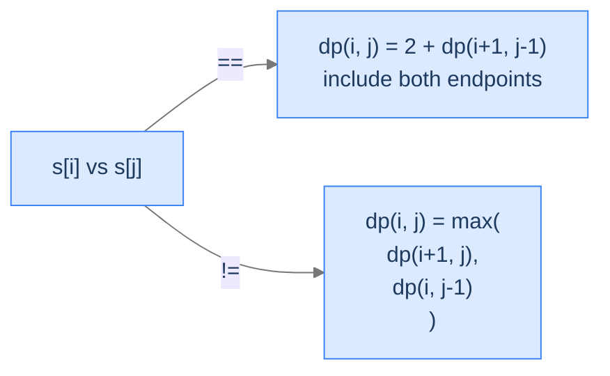

# 6. Longest Palindromic Subsequence

A palindrome reads the same forward and backward — `racecar`, `level`, `aibohphobia` (the fear of palindromes — yes, that's intentional). Given a string, what's the longest *subsequence* of it that's a palindrome? You don't need consecutive characters; you can pick any subset that preserves order, as long as the result reads the same both ways.

By the end of this lesson you'll know the **Longest Palindromic Subsequence** (LPS) recurrence — `dp(i, j) = dp(i+1, j-1) + 2` if endpoints match, else `max(dp(i+1, j), dp(i, j-1))` — the **interval-DP** filling order (by *length*, smallest to largest), and the connection to LCS (LPS of `s` equals LCS of `s` and reversed `s`).

## Table of contents

1. [The Palindromic-Subsequence Problem](#the-palindromic-subsequence-problem)
2. [Optimal Substructure — Walking Inward From the Endpoints](#optimal-substructure--walking-inward-from-the-endpoints)
3. [Interval DP — Filling the Table by Length](#interval-dp--filling-the-table-by-length)
4. [Longest Palindromic Subsequence](#longest-palindromic-subsequence)

***

# The Palindromic-Subsequence Problem

> **Course:** DSA › Algorithms › Dynamic Programming › LPS

Given a string `s`, find the length of its longest palindromic subsequence — the longest selection of characters (preserving order, gaps allowed) that reads the same forward and backward.

```d2
direction: right
ex: "Example: s = 'aacbbdaa'" {
  grid-rows: 2
  grid-columns: 8
  grid-gap: 0
  c0: "a" {style.fill: "#fde68a"; style.stroke: "#d97706"}
  c1: "a" {style.fill: "#fde68a"; style.stroke: "#d97706"}
  c2: "c"
  c3: "b" {style.fill: "#fde68a"; style.stroke: "#d97706"}
  c4: "b" {style.fill: "#fde68a"; style.stroke: "#d97706"}
  c5: "d"
  c6: "a" {style.fill: "#fde68a"; style.stroke: "#d97706"}
  c7: "a" {style.fill: "#fde68a"; style.stroke: "#d97706"}
  i0: "[0]"
  i1: "[1]"
  i2: "[2]"
  i3: "[3]"
  i4: "[4]"
  i5: "[5]"
  i6: "[6]"
  i7: "[7]"
}
```

<p align="center"><strong>The longest palindromic subsequence of <code>"aacbbdaa"</code> is <code>"aabbaa"</code> (length 6). Highlighted indices [0, 1, 3, 4, 6, 7] form a palindrome reading the same both directions.</strong></p>

The brute force is to enumerate all `2^n` subsequences and check each. DP brings it to `O(n²)`.

> *Predict before reading on — for <code>s = "abc"</code>, what's the LPS?</em>

Length 1. No two distinct characters in `"abc"` are equal, so the longest palindromic subsequence is any single character.

---

## Key Takeaway

LPS is "longest palindrome you can spell using a subset of the string's characters in order." Brute force exponential; DP `O(n²)`.

***

# Optimal Substructure — Walking Inward From the Endpoints

> **Course:** DSA › Algorithms › Dynamic Programming › LPS

Define `dp(i, j)` = length of the LPS of the substring `s[i..j]`. The recurrence comes from looking at the *endpoints*:

**Case 1 — `s[i] == s[j]`.** Both endpoints can be part of the palindrome. Include them, recurse into the interior:
```
dp(i, j) = dp(i + 1, j - 1) + 2
```

**Case 2 — `s[i] != s[j]`.** The endpoints can't both be in the same palindrome (a palindrome's endpoints must be equal). Drop one of them:
```
dp(i, j) = max( dp(i + 1, j),    — drop s[i]
                dp(i, j - 1) )   — drop s[j]
```

**Base cases.**
- `dp(i, i) = 1` — a single character is a palindrome of length 1.
- `dp(i, j) = 0` for `i > j` — empty range, length 0.



<p align="center"><strong>Endpoints match → take both, walk inward. Endpoints differ → drop one of them.</strong></p>

---

## Why the State Is `(i, j)`, Not `(i)` Like LIS

LIS used a 1D state because the subsequence had only one endpoint we cared about — where it ended. Here a palindrome has *two* endpoints, both shrinking inward. Two indices = 2D state.

---

## The LPS-LCS Connection

There's a beautiful equivalence: **LPS(s) = LCS(s, reverse(s))**. Why? A subsequence of `s` is palindromic iff it appears in both `s` (forward) and `reverse(s)` (backward) at corresponding positions. So the longest palindromic subsequence of `s` is the longest sequence appearing in both `s` and `reverse(s)`.

You could solve LPS by reversing `s` and applying LCS unchanged — same `O(n²)` complexity. The interval-DP recurrence we use here is more direct (no string copy), but mathematically they're the same problem.

---

## Key Takeaway

LPS is interval DP on `(i, j)`. Endpoints match → take both; mismatch → drop one. Equivalent to LCS of the string and its reverse.

***

# Interval DP — Filling the Table by Length

> **Course:** DSA › Algorithms › Dynamic Programming › LPS

Each cell `dp[i][j]` depends on smaller intervals — `dp[i+1][j-1]`, `dp[i+1][j]`, `dp[i][j-1]` — all with `j - i` smaller. To fill the table bottom-up, **iterate over interval lengths**, smallest to largest. This is **interval DP**: the dependency points inward; we work outward.

```d2
direction: right
table: "Filling order: by length" {
  grid-rows: 5
  grid-columns: 5
  grid-gap: 0
  l0: "i\\j"
  c0: "0"
  c1: "1"
  c2: "2"
  c3: "3"
  r0: "0"
  v00: "1<br/>(len 1)"
  v01: "?<br/>(len 2)"
  v02: "?<br/>(len 3)"
  v03: "?<br/>(len 4)"
  r1: "1"
  v10: "—"
  v11: "1<br/>(len 1)"
  v12: "?<br/>(len 2)"
  v13: "?<br/>(len 3)"
  r2: "2"
  v20: "—"
  v21: "—"
  v22: "1<br/>(len 1)"
  v23: "?<br/>(len 2)"
  r3: "3"
  v30: "—"
  v31: "—"
  v32: "—"
  v33: "1<br/>(len 1)"
}
```

<p align="center"><strong>The DP table for <code>n = 4</code>. The diagonal (length 1) is the base case. We fill outward to length 4 — only the upper triangle is meaningful (the lower triangle is empty since <code>i ≤ j</code>).</strong></p>

The outer loop is `length` (from 2 to `n`); the inner loop is the start index `i` (from 0 to `n - length`); `j = i + length - 1`. By the time we compute `dp[i][j]`, every smaller interval is already filled.

---

## Why Not Iterate `(i, j)` in the Usual Order?

If we iterated `i` from 0 to `n-1` and `j` from `i` to `n-1`, the cell `dp[i][j]` would depend on `dp[i+1][j-1]` — an entry we haven't computed yet (it's in row `i+1`, *below* row `i`). Whatever traversal order you pick must respect the dependency arrows. Length-first is the cleanest.

---

# Longest Palindromic Subsequence

> **Course:** DSA › Algorithms › Dynamic Programming › LPS

## The Problem

Given a string `s`, return the length of its longest palindromic subsequence.

```
Input:  s = "aacbbdaa"
Output: 6                LPS: "aabbaa"

Input:  s = "xyxzlxnx"
Output: 5                LPS: "xxzxx" (or similar)

Input:  s = "abc"
Output: 1                Just any single character
```

---

## Applying the Diagnostic Questions

| # | Question | Answer |
|---|---|---|
| **Q1** | Optimal substructure? | **Yes** — the LPS of `s[i..j]` decomposes by what we do at the endpoints. |
| **Q2** | Overlapping subproblems? | **Yes** — same `(i, j)` reached from many paths. |
| **Q3** | 2D state, filled by length? | **Yes** — interval DP. |

### Q1, Q2 — Same logic as previous DPs.

### Q3 — Why Length-First?

**Mental model.** Each cell depends only on cells *inside* its interval — i.e., shorter intervals. Fill shortest first; longer cells then have everything they need.

**Concrete numbers.** For `n = 4`: length-1 cells (4 of them) → length-2 (3 of them) → length-3 (2 of them) → length-4 (1 of them). Total 10 cells; each O(1) work.

**What breaks otherwise.** If you tried row-by-row, computing `dp[0][3]` would reach for `dp[1][2]` — which lives in row 1, not yet filled. Length-first avoids the dependency violation.

---

## The Solution


```pseudocode
# dp[i][j] = LPS length on the substring s[i..j].
# Fill by interval length to ensure (i+1, j−1) is computed before (i, j).
function longestPalindromicSubsequence(s):
    n ← length(s)
    if n = 0: return 0
    dp ← n × n grid of zeros
    for i from 0 to n − 1:
        dp[i][i] ← 1                             # length-1 palindromes (the diagonal)

    for length from 2 to n:
        for i from 0 to n − length:
            j ← i + length − 1
            if s[i] = s[j]:
                if length = 2:
                    dp[i][j] ← 2                 # empty interior contributes 0
                else:
                    dp[i][j] ← dp[i + 1][j − 1] + 2
            else:
                dp[i][j] ← max(dp[i + 1][j], dp[i][j − 1])
    return dp[0][n − 1]
```

```python run
from typing import List

class Solution:
    def longest_palindromic_subsequence(self, s: str) -> int:
        n = len(s)
        if n == 0:
            return 0
        # dp[i][j] = LPS of s[i..j]. Diagonal (length 1) initialised to 1.
        dp: List[List[int]] = [[0] * n for _ in range(n)]
        for i in range(n):
            dp[i][i] = 1
        # Fill by interval length, 2 through n.
        for length in range(2, n + 1):
            for i in range(n - length + 1):
                j = i + length - 1
                if s[i] == s[j]:
                    if length == 2:
                        dp[i][j] = 2                 # Special: empty interior contributes 0
                    else:
                        dp[i][j] = dp[i + 1][j - 1] + 2
                else:
                    dp[i][j] = max(dp[i + 1][j], dp[i][j - 1])
        return dp[0][n - 1]


if __name__ == "__main__":
    print(Solution().longest_palindromic_subsequence("aacbbdaa"))   # 6
```

```java run
public class Solution {
    public int longestPalindromicSubsequence(String s) {
        int n = s.length();
        if (n == 0) return 0;
        int[][] dp = new int[n][n];
        for (int i = 0; i < n; i++) dp[i][i] = 1;
        for (int len = 2; len <= n; len++) {
            for (int i = 0; i <= n - len; i++) {
                int j = i + len - 1;
                if (s.charAt(i) == s.charAt(j)) {
                    dp[i][j] = (len == 2) ? 2 : dp[i + 1][j - 1] + 2;
                } else {
                    dp[i][j] = Math.max(dp[i + 1][j], dp[i][j - 1]);
                }
            }
        }
        return dp[0][n - 1];
    }

    public static void main(String[] args) {
        System.out.println(new Solution().longestPalindromicSubsequence("aacbbdaa"));   // 6
    }
}
```

```c run
#include <stdio.h>
#include <string.h>

int dp[1001][1001];

int longest_palindromic_subsequence(const char *s) {
    int n = (int) strlen(s);
    if (n == 0) return 0;
    for (int i = 0; i < n; i++) for (int j = 0; j < n; j++) dp[i][j] = 0;
    for (int i = 0; i < n; i++) dp[i][i] = 1;
    for (int len = 2; len <= n; len++) {
        for (int i = 0; i <= n - len; i++) {
            int j = i + len - 1;
            if (s[i] == s[j]) {
                dp[i][j] = (len == 2) ? 2 : dp[i + 1][j - 1] + 2;
            } else {
                int a = dp[i + 1][j], b = dp[i][j - 1];
                dp[i][j] = a > b ? a : b;
            }
        }
    }
    return dp[0][n - 1];
}

int main(void) {
    printf("%d\n", longest_palindromic_subsequence("aacbbdaa"));   // 6
    return 0;
}
```

```scala run
class Solution {
  def longestPalindromicSubsequence(s: String): Int = {
    val n = s.length
    if (n == 0) return 0
    val dp = Array.fill(n, n)(0)
    for (i <- 0 until n) dp(i)(i) = 1
    for (len <- 2 to n) {
      for (i <- 0 to n - len) {
        val j = i + len - 1
        dp(i)(j) =
          if (s(i) == s(j)) {
            if (len == 2) 2 else dp(i + 1)(j - 1) + 2
          } else {
            math.max(dp(i + 1)(j), dp(i)(j - 1))
          }
      }
    }
    dp(0)(n - 1)
  }
}

object Main extends App {
  println(new Solution().longestPalindromicSubsequence("aacbbdaa"))   // 6
}
```


<details>
<summary><strong>Trace — s = "aacbbdaa"</strong></summary>

```
Diagonal (length 1): dp[i][i] = 1 for i = 0..7

Length 2:
  dp[0][1]: 'a'=='a' → 2
  dp[1][2]: 'a'!='c' → max(dp[2][2], dp[1][1]) = 1
  dp[2][3]: 'c'!='b' → 1
  dp[3][4]: 'b'=='b' → 2
  dp[4][5]: 'b'!='d' → 1
  dp[5][6]: 'd'!='a' → 1
  dp[6][7]: 'a'=='a' → 2

Length 3:
  dp[0][2]: 'a'!='c' → max(dp[1][2], dp[0][1]) = 2
  dp[1][3]: 'a'!='b' → max(dp[2][3], dp[1][2]) = 1
  ... etc

Skip ahead to:
  dp[0][7]: 'a'=='a' → dp[1][6] + 2

dp[1][6] computed similarly:
  s[1..6] = "acbbda", LPS = "abba" (length 4)
  → dp[1][6] = 4

dp[0][7] = dp[1][6] + 2 = 4 + 2 = 6 ✓
```

</details>

---

## Complexity Analysis

| Aspect | Cost | Why |
|---|---|---|
| Time | `O(n²)` | One cell per `(i, j)` pair with `i ≤ j`; `n × (n+1) / 2` cells, constant work each. |
| Space | `O(n²)` | DP table. Reducible to `O(n)` (rolling) but trickier than 1D rolling. |

---

## Edge Cases

| Case | Example | Expected | Reasoning |
|---|---|---|---|
| Empty | `""` | `0` | Guard returns 0. |
| Single char | `"a"` | `1` | Base case. |
| All same | `"aaaa"` | `4` | The whole string is already a palindrome. |
| All distinct | `"abc"` | `1` | No two characters match; max LPS is single character. |
| Already palindrome | `"racecar"` | `7` | Same reason — full string is the LPS. |

---

## Final Takeaway

LPS is the canonical interval DP. State is `(i, j)` describing a substring; recurrence walks inward from the endpoints; filling order is by length. Same shape recurs in matrix-chain multiplication and other "operate on a range" problems coming later.

> *Transfer challenge for the next lesson:* LPS allowed gaps. What if we required the palindrome to be a *substring* — contiguous, no gaps? Predict whether the recurrence stays the same or breaks.

<details>
<summary><strong>Answer</strong></summary>

It changes shape. For a *substring*, the inner cells must themselves be palindromic substrings — there's no "drop one side" option, since dropping breaks contiguity. The next lesson formalises this as **Longest Palindromic Substring** with a recurrence on a *boolean* "is it palindromic?" table.

</details>
