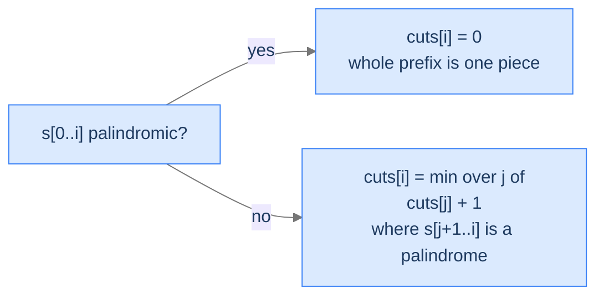
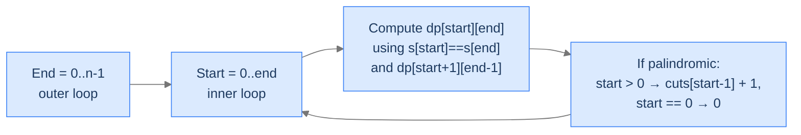

# 8. Palindrome Partitioning — Minimum Cuts

The previous two lessons hunted for *one* palindrome inside a string — the longest subsequence, then the longest contiguous substring. Now the demand flips: split the **whole** string so that every single piece is a palindrome, and use as few cuts as possible. `"abbbc"` looks unfriendly until you see it as `a | bbb | c` — three palindromic pieces, two cuts. The naive thing is to try every possible partition, but a string of length `n` has `2^(n-1)` ways to drop dividers; brute force collapses fast. Underneath, every cut decision depends on choices already made — classic optimal substructure with overlapping subproblems.

By the end of this lesson you'll know the **minimum-cut palindrome partitioning** recurrence (`cuts[i] = 0` when `s[0..i]` is itself palindromic, otherwise `min(cuts[j] + 1)` over every `j` where `s[j+1..i]` is palindromic), why the state collapses to *one* index instead of two, and how to interleave a precomputed palindromicity table with the cuts pass so each cell does only `O(n)` work — keeping the whole algorithm at `O(n²)`.

## Table of contents

1. [The Partitioning Problem](#the-partitioning-problem)
2. [Optimal Substructure — Fix the Last Piece](#optimal-substructure--fix-the-last-piece)
3. [Two Tables, One Pass](#two-tables-one-pass)
4. [Palindrome Partitioning — Minimum Cuts](#palindrome-partitioning--minimum-cuts)

***

# The Partitioning Problem

Given a string `s` of length `n`, find the **minimum number of cuts** so that every resulting piece reads the same forward and backward.

```d2
direction: right
ex: "Example: s = 'abbbc' → minimum cuts = 2" {
  grid-rows: 2
  grid-columns: 5
  grid-gap: 0
  c0: "a" {style.fill: "#fde68a"; style.stroke: "#d97706"}
  c1: "b"
  c2: "b"
  c3: "b"
  c4: "c" {style.fill: "#fde68a"; style.stroke: "#d97706"}
  i0: "[0]"
  i1: "[1]"
  i2: "[2]"
  i3: "[3]"
  i4: "[4]"
}
```

<p align="center"><strong>Two cuts split <code>"abbbc"</code> into <code>a | bbb | c</code> — three palindromic pieces. Highlighted cells mark where the cuts fall (after index 0 and after index 3). <em>k</em> cuts always produce <em>k + 1</em> pieces.</strong></p>

The brute force enumerates every way to drop dividers — `2^(n-1)` partitions — and checks each one. Optimal substructure plus overlapping subproblems shrink this to `O(n²)`.

> *Predict before reading on — for `s = "aab"`, what's the minimum number of cuts?*

`1`. The whole string `"aab"` isn't palindromic (it reads `"baa"` backward), so 0 cuts is impossible. The naive split `a | a | b` uses 2 cuts. But `aa | b` works with just 1 — the first piece `"aa"` is already palindromic.

The lesson: greedy "cut at the first non-match" misses better options. We need to compare all valid partitions and pick the cheapest.

## Where this shows up

Sequence segmentation appears all over the stack: tokenisation in NLP, RNA secondary-structure prediction in bioinformatics, run-length-style compression where each run must satisfy a structural property, and any "split a sequence into satisfying pieces" decision in a compiler or interpreter. The recurrence we'll derive here generalises far past palindromes.

---

## Key Takeaway

Palindrome partitioning counts **cuts**, not pieces. Brute force is `2^(n-1)`; DP is `O(n²)`. Greedy fails because the first valid split isn't always the best.

***

# Optimal Substructure — Fix the Last Piece

Define `cuts[i]` = minimum cuts needed to palindrome-partition the prefix `s[0..i]`. Two cases:

**Case 1 — `s[0..i]` is itself a palindrome.** The whole prefix is already one valid piece. No cut needed:
```
cuts[i] = 0
```

**Case 2 — `s[0..i]` is not a palindrome.** We must place at least one cut. Iterate the position `j` of the **last cut**, where `0 ≤ j < i`. The rightmost piece is `s[j+1..i]`; if it's palindromic, the partition is valid, and the leftover work is exactly `cuts[j]`:
```
cuts[i] = min over all valid j of (cuts[j] + 1)
       where "valid" means s[j+1..i] is a palindrome
```



<p align="center"><strong>Two cases of the recurrence. If the entire prefix is already a palindrome, no cut is needed. Otherwise, try every position for the last cut and pick the cheapest.</strong></p>

> *Pause. Why fix the **last** cut, not the **first**? Predict the consequence of either choice.*

It's a choice, not a constraint — both formulations enumerate exactly the same set of partitions, just indexed differently. Any valid partitioning of `s[0..i]` has a well-defined first cut and a well-defined last cut. Fixing the *first* cut and recursing on the right works; fixing the *last* cut and recursing on the left works. The convention is to fix the last cut because it lines up cleanly with prefix-indexed DP — `cuts[0], cuts[1], ..., cuts[n-1]` fills left-to-right, with each cell looking *backward* at smaller already-filled cells.

## Why the State Is 1D, Not 2D

LPSubstr last lesson used a 2D state `(i, j)` — a substring's two endpoints. Why does this problem get away with one index? Because we always partition a *prefix*, never an arbitrary middle slice. Once you fix the last piece, the leftover is `s[0..j]` — another prefix. The recursion shrinks only the right edge; the left edge stays pinned at `0`. One shrinking dimension means one index of state.

If the problem changed to "minimum cuts to partition any substring `s[i..j]`", the state would jump to 2D `(i, j)`. The 1D-vs-2D split is dictated by what stays fixed.

---

## Key Takeaway

Optimal substructure for partition problems: fix one piece (here, the last), recurse on the rest. State stays 1D when the recursion shrinks only one direction.

***

# Two Tables, One Pass

The recurrence asks `"is s[j+1..i] a palindrome?"` inside its inner loop. Naively that's an `O(n)` check, blowing the total cost to `O(n³)`. We need an `O(1)` palindromicity lookup.

The fix is a precomputed palindromicity table — the code calls it `dp[i][j]` — exactly the boolean table from the previous lesson:
```
dp[i][j] = (s[i] == s[j]) AND (j - i ≤ 2 OR dp[i+1][j-1])
```

Two ways to combine the two tables:

1. **Two passes** — first fill the entire `dp` table by length (length 1 → length `n`), then sweep `cuts`.
2. **One pass** — extend `dp[start][end]` *as `end` grows*. For each new `end`, scan `start` from `0` to `end`, computing `dp[start][end]` and updating `cuts[end]` in the same loop body. Each `dp` lookup is `O(1)` because the smaller interval `dp[start+1][end-1]` was filled when `end-1` was the outer loop's value.



<p align="center"><strong>The one-pass shape. Each iteration of the outer loop seals one column of the <code>dp</code> table and finalises one cell of <code>cuts</code>. Same <code>O(n²)</code> time as the two-pass version, fewer table writes overall.</strong></p>

Both versions are `O(n²)` time and `O(n²)` space — only the loop nesting differs. The one-pass version is what the original CodeIntuition implementation uses, and it's what we'll code below.

> *Predict before reading on — when the inner loop hits `start = 0` (cutting before the first character), how should the recurrence treat the leftover prefix?*

It's the "no cut at all" case — `s[0..end]` is itself a palindrome. The implementation special-cases it: when `start == 0` and the piece is palindromic it sets the running minimum to `0` directly, instead of reaching for a `cuts[start - 1]` that wouldn't exist. The alternative — padding the array with a sentinel `cuts[-1] = -1` so that `cuts[-1] + 1 = 0` — also works; the special-case branch just reads more clearly.

---

## Key Takeaway

Two-phase DPs ("predicate first, optimisation second") are common when the predicate has its own recurrence. Compute it upfront *or* interleave it with the main loop — same complexity, different code shape.

***

# Palindrome Partitioning — Minimum Cuts

## The Problem

Given a string `s`, return the minimum number of cuts to partition it so every piece is a palindrome.

```
Input:  s = "abbbc"
Output: 2                  Cuts: a | bbb | c

Input:  s = "abcdef"
Output: 5                  Cuts: a | b | c | d | e | f  (no two adjacent characters match)

Input:  s = "aaa"
Output: 0                  Already a palindrome — no cuts needed
```

---

<details>
<summary><h2>Applying the Diagnostic Questions</h2></summary>


| # | Question | Answer |
|---|---|---|
| **Q1** | Optimal substructure? | **Yes** — every valid partition of `s[0..i]` decomposes into a last palindromic piece plus an optimum partition of the prefix to its left. |
| **Q2** | Overlapping subproblems? | **Yes** — `cuts[j]` is reused by every later index `i > j` whose last palindromic piece starts at `j+1`. |
| **Q3** | 1D or 2D state? | **1D** — only the prefix's right endpoint varies; the left endpoint is pinned at `0`. |
| **Q4** | Answer's location? | **`cuts[n-1]`** — the optimum for the entire string. |

### Q1 — Why "Yes"?

**Mental model.** Imagine you've already made every cut. The *last* piece must end at index `n-1` and start at some index `j+1`. Whatever cuts came before turned `s[0..j]` into palindromic pieces optimally — otherwise we could re-do them and lower the total. So the optimum at `i` = (cost of one last cut) + (optimum at `j`).

**Concrete numbers.** For `s = "abbbc"`, the optimal partition `a | bbb | c` has its last piece `"c"` starting at index 4. `cuts[4] = cuts[3] + 1`. And `cuts[3]` solves the same problem for `"abbb"` — which is `a | bbb`, one cut. So `cuts[4] = 1 + 1 = 2`. ✓

**What breaks otherwise.** Suppose at `i = 4` we used a *suboptimal* `cuts[3]`. Then we could replace those choices with the real optimum for `s[0..3]` and lower the total — meaning our claimed minimum at `i = 4` wasn't actually minimum. Contradiction.

### Q2 — Why "Yes"?

**Mental model.** When you compute `cuts[i]`, you ask `cuts[j]` for many different `j`. Each of those `cuts[j]` was already asked for by *every* `i' > i` whose last cut might land at `j`. The same value gets queried over and over.

**Concrete numbers.** For `s = "abcabc"`: computing `cuts[5]` reads `cuts[0], cuts[1], ..., cuts[4]`. Computing `cuts[4]` reads `cuts[0], cuts[1], cuts[2], cuts[3]`. The values `cuts[0..3]` are reused at every later index. Without memoization (i.e. recursing instead of tabulating), each is recomputed every time it's asked for — exponential.

**What breaks otherwise.** Drop the table; recurse top-down with no cache. Time blows up to roughly `Θ(2^n)` because each `cuts(i)` re-derives every smaller subproblem from scratch.

### Q3 — Why 1D, not 2D?

**Mental model.** A partition always covers a *prefix* of `s`. The left edge stays pinned at index 0 — only the right edge `i` varies. One free index = 1D state.

**Concrete numbers.** A 2D state `cuts[i][j]` would have `n²` cells. We'd be answering "minimum cuts for every substring of `s`" — far more questions than needed. We only ever ask about prefixes, so we only need `n` cells.

**What breaks otherwise.** Using a 2D state still works, just wastes space. Using a 0D (single number) state breaks correctness because we lose the ability to compose subproblems.

### Q4 — Why `cuts[n-1]`?

**Mental model.** The whole problem is "minimum cuts for `s[0..n-1]`" — exactly the cell at index `n-1`.

**Concrete numbers.** For `s = "abbbc"`, `n = 5`, answer = `cuts[4] = 2`.

**What breaks otherwise.** Reading any earlier index would answer the question for a *strict prefix* of `s`, not the full string.

</details>
<details>
<summary><h2>The Solution</h2></summary>


The implementation interleaves the boolean `dp` palindromicity table with the `cuts` array — one outer loop on `end`, one inner loop on `start`. The running minimum, `minimum_partitionings`, starts at `sys.maxsize` (`Integer.MAX_VALUE` in Java) and is only ever written inside the palindrome branch — every prefix has at least its single-character last piece, so that branch always fires at least once and the sentinel never survives.


```python run viz=graph viz-root=dp
from typing import List
import sys

class Solution:
    def minimum_partitioning(self, s: str) -> int:
        n: int = len(s)

        # Create a 2D list to store the minimum cuts needed
        dp: List[List[bool]] = [[False] * n for _ in range(n)]

        # Create a list to store the minimum cuts from each index
        cuts: List[int] = [0] * n

        # Calculate the minimum cuts for all substrings
        for end in range(n):
            minimum_partitionings: int = sys.maxsize
            for start in range(end + 1):
                if s[start] == s[end] and (
                    end - start <= 2 or dp[start + 1][end - 1]
                ):
                    dp[start][end] = True

                    # If the current substring is a palindrome, update
                    # the minimum cuts
                    if start > 0:
                        minimum_partitionings = min(
                            minimum_partitionings,
                            cuts[start - 1] + 1,
                        )
                    else:

                        # No cuts needed if the whole string is a
                        # palindrome
                        minimum_partitionings = 0
            cuts[end] = minimum_partitionings

        # Return the minimum cuts needed for palindrome partitioning
        return cuts[n - 1]


# Examples from the problem statement
print(Solution().minimum_partitioning("abbbc"))   # 2
print(Solution().minimum_partitioning("abcdef"))  # 5
print(Solution().minimum_partitioning("aaa"))     # 0

# Edge cases
print(Solution().minimum_partitioning("a"))       # 0
print(Solution().minimum_partitioning("aa"))      # 0
print(Solution().minimum_partitioning("ab"))      # 1
print(Solution().minimum_partitioning("aba"))     # 0
print(Solution().minimum_partitioning("abba"))    # 0
print(Solution().minimum_partitioning("abcd"))    # 3
```

```java run viz=graph viz-root=dp
public class Main {
    static class Solution {
        public int minimumPartitioning(String s) {
            int n = s.length();

            // Create a 2D array to store the minimum cuts needed
            boolean[][] dp = new boolean[n][n];

            // Create an array to store the minimum cuts from each index
            int[] cuts = new int[n];

            // Calculate the minimum cuts for all substrings
            for (int end = 0; end < n; end++) {
                int minimumPartitionings = Integer.MAX_VALUE;
                for (int start = 0; start <= end; start++) {
                    if (
                        s.charAt(start) == s.charAt(end) &&
                        (end - start <= 2 || dp[start + 1][end - 1])
                    ) {
                        dp[start][end] = true;

                        // If the current substring is a palindrome, update
                        // the minimum cuts
                        if (start > 0) {
                            minimumPartitionings = Math.min(
                                minimumPartitionings,
                                cuts[start - 1] + 1
                            );
                        } else {

                            // No cuts needed if the whole string is a
                            // palindrome
                            minimumPartitionings = 0;
                        }
                    }
                }
                cuts[end] = minimumPartitionings;
            }

            // Return the minimum cuts needed for palindrome partitioning
            return cuts[n - 1];
        }
    }

    public static void main(String[] args) {
        // Examples from the problem statement
        System.out.println(new Solution().minimumPartitioning("abbbc"));   // 2
        System.out.println(new Solution().minimumPartitioning("abcdef"));  // 5
        System.out.println(new Solution().minimumPartitioning("aaa"));     // 0

        // Edge cases
        System.out.println(new Solution().minimumPartitioning("a"));       // 0
        System.out.println(new Solution().minimumPartitioning("aa"));      // 0
        System.out.println(new Solution().minimumPartitioning("ab"));      // 1
        System.out.println(new Solution().minimumPartitioning("aba"));     // 0
        System.out.println(new Solution().minimumPartitioning("abba"));    // 0
        System.out.println(new Solution().minimumPartitioning("abcd"));    // 3
    }
}
```

</details>
<details>
<summary><strong>Trace — s = "abbbc"</strong></summary>

```
Initial: cuts = [_, _, _, _, _]   dp all false

end = 0  (char 'a'):
  start = 0: s[0]='a'==s[0]='a' (length 1) → dp[0][0]=true
             start==0 → minimum_partitionings = 0
  cuts[0] = 0

end = 1  (char 'b'):
  start = 0: 'a' != 'b' → skip
  start = 1: 'b' == 'b' (length 1) → dp[1][1]=true
             cuts[0]+1 = 1 → minimum_partitionings = 1
  cuts[1] = 1

end = 2  (char 'b'):
  start = 0: 'a' != 'b' → skip
  start = 1: 'b' == 'b', length 2 → dp[1][2]=true
             cuts[0]+1 = 1 → minimum_partitionings = 1
  start = 2: 'b' == 'b' (length 1) → dp[2][2]=true
             cuts[1]+1 = 2 → minimum_partitionings stays 1
  cuts[2] = 1

end = 3  (char 'b'):
  start = 0: 'a' != 'b' → skip
  start = 1: 'b' == 'b', interior dp[2][2]=true → dp[1][3]=true
             cuts[0]+1 = 1 → minimum_partitionings = 1
  start = 2: 'b' == 'b', length 2 → dp[2][3]=true
             cuts[1]+1 = 2 → minimum_partitionings stays 1
  start = 3: 'b' == 'b' (length 1) → dp[3][3]=true
             cuts[2]+1 = 2 → minimum_partitionings stays 1
  cuts[3] = 1

end = 4  (char 'c'):
  start = 0: 'a' != 'c' → skip
  start = 1: 'b' != 'c' → skip
  start = 2: 'b' != 'c' → skip
  start = 3: 'b' != 'c' → skip
  start = 4: 'c' == 'c' (length 1) → dp[4][4]=true
             cuts[3]+1 = 2 → minimum_partitionings = 2
  cuts[4] = 2

Final cuts = [0, 1, 1, 1, 2]
Answer: cuts[4] = 2  ✓  (partition: a | bbb | c)
```

</details>
<details>
<summary><h2>Solution &amp; Analysis</h2></summary>

### Complexity Analysis

| Aspect | Cost | Why |
|---|---|---|
| Time | `O(n²)` | Outer loop is `n`; inner loop is up to `n`; each iteration is `O(1)` thanks to the `dp` table. |
| Space | `O(n²)` | The `dp` boolean table dominates; the `cuts` array is `O(n)`. |

There's a slicker `O(n)`-space variant that exploits the "expand around centre" trick from the previous lesson — for each centre, expand outward, and at each successful expansion update `cuts[end]` directly. Same `O(n²)` time, drops the `dp` table. Beyond this lesson, but worth mentioning.

### Edge Cases

| Case | Example | Expected | Reasoning |
|---|---|---|---|
| Empty string | `""` | `IndexError` | The code has no empty-input guard — `cuts = []` and `cuts[n - 1]` (i.e. `cuts[-1]`) throws. Defensive callers should short-circuit `if n == 0: return 0`. |
| Single char | `"a"` | `0` | `end = 0`, `start = 0`: the single char is palindromic, `start == 0` sets `minimum_partitionings = 0`. |
| Already a palindrome | `"racecar"` | `0` | At `end = n-1` the `start = 0` branch fires; whole string is one piece. |
| All distinct chars | `"abcdef"` | `n - 1` | Every piece is a single character; each `cuts[end]` extends `cuts[end-1]` by one. |
| All same chars | `"aaaa"` | `0` | Whole string palindromic; same as "already a palindrome". |
| Two chars matching | `"aa"` | `0` | Length-2 palindrome. |
| Two chars different | `"ab"` | `1` | One cut; both pieces single-char palindromes. |
| Embedded long palindrome | `"abbbc"` | `2` | Cuts surround the central palindrome `bbb`. |

</details>
<details>
<summary><h2>Final Takeaway</h2></summary>


Palindrome partitioning is the canonical "split into satisfying pieces" DP. State is 1D — minimum cuts for a prefix — because the left endpoint stays pinned at index 0 while only the right endpoint shrinks. The recurrence fixes the *last* piece (palindromic, by predicate lookup) and recurses on the leftover prefix. The boolean palindromicity table from the previous lesson plugs in directly, giving `O(1)` predicate checks and `O(n²)` total time. **You didn't just solve palindrome partitioning. You learned the shape of every "minimum / maximum / count of partitions where each piece satisfies P" problem — fix the last piece, recurse on the prefix, and combine the predicate's DP with the optimisation's DP.**

> *Transfer challenge for the next lesson:* Replace "is this piece a palindrome?" with "is this piece a word in a dictionary?" — and switch the goal from "minimum cuts" to "is *any* valid partition possible?". Predict how the recurrence changes shape.

</details>
<details>
<summary><strong>Answer</strong></summary>

The state stays 1D — `canBreak[i]` = whether `s[0..i]` is segmentable. The min-over-cuts becomes a logical OR: `canBreak[i] = OR over valid j of canBreak[j]`, where "valid" means `s[j+1..i]` is in the dictionary. The predicate is now a hash-set membership check (O(1) average) instead of palindrome lookup. Same shape; different predicate; aggregator changed from `min(... + 1)` to `OR`. The next lesson formalises this as the **Word Break** problem.

</details>

<!-- ============================================== -->
<!-- SWEEP 2 — missing sections (placeholders only) -->
<!-- ============================================== -->

<!-- TODO: The Hook — missing, needs to be written -->
<!--       Guidance: real-world story opening before any definition -->

<!-- TODO: Understanding the Problem — missing, needs to be written -->
<!--       Guidance: frame the gap the structure/algorithm fills -->

<!-- TODO: Supported Operations — missing, needs to be written -->
<!--       Guidance: table: operation / time / notes -->

<!-- TODO: Internal Mechanics — missing, needs to be written -->
<!--       Guidance: how it actually works under the hood -->

<!-- TODO: Working Example — missing, needs to be written -->
<!--       Guidance: one fully worked end-to-end example -->

<!-- TODO: Production Reality — missing, needs to be written -->
<!--       Guidance: 4–6 entries: System — uses X — because Y -->

<!-- TODO: Quiz — missing, needs to be written -->
<!--       Guidance: 3–5 questions, each labeled [Recall]/[Reasoning]/[Tradeoff] -->

<!-- TODO: Practice Ladder — missing, needs to be written -->
<!--       Guidance: table: 5 links into pattern problems + hints -->

<!-- TODO: Further Reading — missing, needs to be written -->
<!--       Guidance: annotated: ★ Essential / ◆ Advanced / → Reference -->

<!-- TODO: Cross-Links — missing, needs to be written -->
<!--       Guidance: Prerequisites | What comes next -->

<!-- TODO: Final Takeaway — missing, needs to be written -->
<!--       Guidance: exactly 3 typed bullets: Core mechanic / Dominant tradeoff / One thing to remember -->
