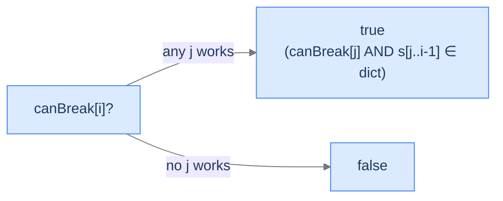

# 9. Word Break

You paste a stream of characters into a search box: `"codeintuition"`. The site needs to know — is this two words, or one, or three? With no spaces, every position is potentially a boundary, and you can't tell from the characters alone. The system needs a dictionary and a procedure: scan the string, try every possible split, and ask whether *any* arrangement turns the run-on into a sequence of valid words.

By the end of this lesson you'll know the **word break** recurrence (`canBreak[i] = OR over valid j of canBreak[j]`, where "valid" means `s[j..i-1]` is in the dictionary), why the state is one-index — same shape as palindrome partitioning — and why the aggregator changed from `min(... + 1)` to logical `OR`. You'll also see why this exact recurrence lives at the heart of natural-language tokenisation, search-query parsing, and domain-name decomposition.

## Table of contents

1. [The Word-Break Problem](#the-word-break-problem)
2. [Optimal Substructure — Same Shape, Different Aggregator](#optimal-substructure--same-shape-different-aggregator)
3. [Hash-Set Lookup — Why the Predicate Is `O(1)`](#hash-set-lookup--why-the-predicate-is-o1)
4. [Word Break — The Algorithm](#word-break--the-algorithm)

***

# The Word-Break Problem

Given a string `s` of length `n` and a dictionary `wordDict` of valid words, decide whether `s` can be split into a sequence of dictionary words concatenated in order.

```d2
direction: right
ex: "Example: s = 'codeintuition', dict = ['code', 'intuition']" {
  grid-rows: 2
  grid-columns: 13
  grid-gap: 0
  c0: "c" {style.fill: "#fde68a"; style.stroke: "#d97706"}
  c1: "o" {style.fill: "#fde68a"; style.stroke: "#d97706"}
  c2: "d" {style.fill: "#fde68a"; style.stroke: "#d97706"}
  c3: "e" {style.fill: "#fde68a"; style.stroke: "#d97706"}
  c4: "i"
  c5: "n"
  c6: "t"
  c7: "u"
  c8: "i"
  c9: "t"
  c10: "i"
  c11: "o"
  c12: "n"
  l0: "[0]"
  l1: "[1]"
  l2: "[2]"
  l3: "[3]"
  l4: "[4]"
  l5: "[5]"
  l6: "[6]"
  l7: "[7]"
  l8: "[8]"
  l9: "[9]"
  l10: "[10]"
  l11: "[11]"
  l12: "[12]"
}
```

<p align="center"><strong>The first four characters form <code>"code"</code>; the remaining nine form <code>"intuition"</code> — both in the dictionary. The string segments. The highlighted prefix is the boundary the algorithm must discover.</strong></p>

The brute force tries every way to insert dividers — `2^(n-1)` partitions — and checks each. DP brings it to `O(n²)` (or `O(n · L)` where `L` is the longest dictionary word, with a small optimisation).

> *Predict before reading on — for `s = "phoneisphone"`, `dict = ["phone", "and"]`, what's the answer?*

`false`. Even though `"phone"` is in the dictionary, the middle slice `"is"` isn't — and there's no way to span those two characters with the available words. Greedy "match the longest prefix" would succeed at `"phone"`, then fail; backtracking buys nothing because the gap is unfillable.

The lesson: success is non-local. A word that *could* match somewhere may force a failure later. We must try all arrangements and ask whether *any* works.

## Where this shows up

Tokenisation in NLP (Chinese and Japanese write without spaces; tokenisers run a word-break-style pass over every sentence). Spell-checking with concatenated words. Search-query parsing (was the user typing `"newyorkcity"` or `"new york city"`?). Domain-name decomposition (`"expertsexchange"` ↔ `"experts exchange"` vs. `"expert sex change"` — yes, that's a real example from the early 2000s). DNA reading-frame analysis. The recurrence we're about to derive is everywhere.

---

## Key Takeaway

Word break asks "does *any* partition work?" — a boolean, not a number. Brute force is exponential; DP is `O(n²)` average.

***

# Optimal Substructure — Same Shape, Different Aggregator

Define `canBreak[i]` = whether `s[0..i-1]` (the first `i` characters) can be segmented. Two parts to the recurrence:

**Base case — empty prefix.** Zero characters trivially segments (zero words concatenate to empty):
```
canBreak[0] = true
```

**Inductive case.** For `i ≥ 1`, try every position `j` of the **last word boundary**, where `0 ≤ j < i`. The last word is `s[j..i-1]`; if it's a dictionary word *and* the preceding prefix `s[0..j-1]` is itself segmentable, the whole thing segments:
```
canBreak[i] = OR over j ∈ [0, i) of (canBreak[j] AND s[j..i-1] ∈ wordDict)
```



<p align="center"><strong>The recurrence ORs over every possible last-word position. If <em>any</em> split works, the prefix segments.</strong></p>

> *Pause. Compare this to last lesson's palindrome-partitioning recurrence. What's the same, what's different? Predict before reading on.*

| | Palindrome Partitioning | Word Break |
|---|---|---|
| State | `cuts[i]` (number) | `canBreak[i]` (boolean) |
| Predicate on last piece | "Is `s[j+1..i]` palindromic?" | "Is `s[j..i-1]` in `wordDict`?" |
| Predicate cost | `O(1)` after `isPalin` table | `O(L)` for hash-set lookup (`L` = piece length) |
| Aggregator | `min(... + 1)` | logical `OR` |
| Goal | Optimisation (minimise) | Existence (does any work?) |

Same shape. Same 1D state. The two changes — boolean predicate via hash-set, OR instead of min — are the only differences. Once you've seen one, the other writes itself.

## Why the State Stays 1D

The same reason as last lesson: we always partition a *prefix* of `s`, never an arbitrary middle slice. Once we fix the last word, the leftover is `s[0..j-1]` — another prefix. One shrinking dimension means one index of state.

---

## Key Takeaway

Word break is the boolean-existence variant of palindrome partitioning. Swap the predicate, swap the aggregator, keep the state.

***

# Hash-Set Lookup — Why the Predicate Is `O(1)`

The recurrence asks `"is s[j..i-1] in wordDict?"` for every `(i, j)` pair. Without preprocessing, looking up a word in a list of `m` words costs `O(m · L)` per query — total `O(n² · m · L)`, awful.

The fix is one line: convert `wordDict` to a **hash set** before the loop. Now each membership check is `O(L)` average — `L` characters hashed to look up a bucket, plus a string compare on hit.

> *Predict before reading on — what's the *real* time complexity then?*

`O(n² · L)` on average. There are `n²/2` `(i, j)` pairs, each costing `O(L)` for the hash + compare. If you bound `L` by `n` (the longest possible word in `s`), it simplifies to `O(n³)` worst case — still polynomial, but a meaningful constant. In practice, dictionaries cap `L` at ~30 characters and the constant disappears.

A common further speed-up: instead of trying *every* `j` in `[0, i)`, only try `j ∈ [i - L_max, i)` where `L_max` is the longest dictionary word. No word longer than `L_max` will ever match, so checking longer slices is wasted. This shrinks the inner loop to `O(L_max)` and the algorithm to `O(n · L_max)`.

```d2
direction: right
flow: "From string to hash set" {
  grid-rows: 1
  grid-columns: 3
  grid-gap: 0
  list: |md
    `wordDict = ["code", "intuition", "is", "phone"]`
    list-of-strings, `O(m·L)` lookup
  |
  arrow: "convert once →"
  set: |md
    `dictSet = {"code", "intuition", "is", "phone"}`
    hash-set, `O(L)` average lookup
  |
}
```

<p align="center"><strong>One linear preprocess turns every membership query from `O(m · L)` into `O(L)`. Without this, the algorithm is `O(n² · m · L)`. With this, `O(n² · L)` average.</strong></p>

---

## Key Takeaway

The dictionary is a hash set, not a list. One preprocess step makes every predicate query `O(L)` average — and the whole algorithm efficient.

***

# Word Break — The Algorithm

## The Problem

Given a string `s` and a list `wordDict`, return `true` if `s` can be segmented into a sequence of one or more dictionary words.

```
Input:  s = "codeintuition", wordDict = ["code", "intuition"]
Output: true                                   "code" + "intuition"

Input:  s = "phoneisphone", wordDict = ["is", "phone"]
Output: true                                   "phone" + "is" + "phone"

Input:  s = "phoneisphone", wordDict = ["phone", "and"]
Output: false                                  "is" never matches
```

---

<details>
<summary><h2>Applying the Diagnostic Questions</h2></summary>


| # | Question | Answer |
|---|---|---|
| **Q1** | Optimal substructure? | **Yes** — `canBreak[i]` decomposes into "last word is `s[j..i-1]`" times "prefix `s[0..j-1]` segments". |
| **Q2** | Overlapping subproblems? | **Yes** — `canBreak[j]` is queried by every `i > j` whose last word ends at `i-1`. |
| **Q3** | 1D or 2D state? | **1D** — only the prefix's right endpoint varies. |
| **Q4** | Aggregator? | **OR** — existence, not optimisation. The first `true` wins; we can early-break. |

### Q1 — Why "Yes"?

**Mental model.** A valid segmentation has a well-defined last word. Whatever came before it must itself be a valid segmentation of a shorter prefix — otherwise we could replace it with one and the original wouldn't really be a segmentation either.

**Concrete numbers.** For `s = "codeintuition"`, the segmentation `"code" | "intuition"` has its last word starting at index 4. So `canBreak[13]` reduces to "`canBreak[4]` AND `s[4..12]` is in dict". That decomposition is the recurrence.

**What breaks otherwise.** If the prefix were *not* segmentable, we'd be claiming the whole thing is segmentable while one of its prefixes isn't — a contradiction.

### Q2 — Why "Yes"?

**Mental model.** Every later index that *could* end on a word boundary at `j` will ask `canBreak[j]`. Hundreds of `i`s reuse the same `j`.

**Concrete numbers.** For `s = "ababab"`, `dict = ["a", "b", "ab"]`: `canBreak[2]` is reused at `i = 3, 4, 5, 6`. Without memoization, each lookup re-derives `canBreak[2]` from scratch — exponential.

**What breaks otherwise.** Recursion without a cache is `O(2^n)`. Tabulation (`canBreak[i]` filled left to right) makes each cell `O(1)` to compute given its neighbours.

### Q3 — Why 1D?

Same logic as palindrome partitioning. The left edge of the partition is pinned at index 0; only the right edge varies. One free index = 1D state.

### Q4 — Why OR (existence)?

**Mental model.** We don't care *how many* arrangements work or *which one*. We just need to know whether at least one exists. OR is the boolean equivalent of "exists a valid choice".

**Concrete numbers.** For `canBreak[13]` in `"codeintuition"`: only one `j` works (`j = 4`, where `s[4..12] = "intuition"`). All other `j`s give `false`. OR collapses these to `true`.

**What breaks otherwise.** If we used AND, we'd require *every* split to be valid — vastly stricter, and almost always `false`.

</details>
<details>
<summary><h2>The Solution</h2></summary>


The implementation uses `dp[i]` for the first `i` characters. `dp[0] = true` is the empty-prefix base case. We hoist the dictionary into a hash set before the loop.


```python run viz=array viz-root=dp
from typing import List

class Solution:
    def word_break(self, s: str, word_dict: List[str]) -> bool:
        n = len(s)
        # Hash-set conversion: O(L) avg lookup vs O(m·L) for list scan.
        word_set = set(word_dict)
        # dp[i] = True iff s[0..i-1] can be segmented.
        dp: List[bool] = [False] * (n + 1)
        dp[0] = True                                 # Empty prefix segments trivially
        for i in range(1, n + 1):
            for j in range(i):
                # Skip if the prefix isn't itself segmentable — saves the substring + lookup.
                if dp[j] and s[j:i] in word_set:
                    dp[i] = True
                    break                            # First success wins; OR-aggregator early-exit
        return dp[n]


if __name__ == "__main__":
    sol = Solution()
    print(sol.word_break("codeintuition", ["code", "intuition"]))     # True
    print(sol.word_break("phoneisphone",  ["is", "phone"]))           # True
    print(sol.word_break("phoneisphone",  ["phone", "and"]))          # False
```

```java run
import java.util.*;

public class Main {
    static class Solution {
        public boolean wordBreak(String s, List<String> wordDict) {
            int n = s.length();
            Set<String> wordSet = new HashSet<>(wordDict);
            boolean[] dp = new boolean[n + 1];
            dp[0] = true;
            for (int i = 1; i <= n; i++) {
                for (int j = 0; j < i; j++) {
                    if (dp[j] && wordSet.contains(s.substring(j, i))) {
                        dp[i] = true;
                        break;
                    }
                }
            }
            return dp[n];
        }
    }

    public static void main(String[] args) {
        Solution sol = new Solution();
        System.out.println(sol.wordBreak("codeintuition", Arrays.asList("code", "intuition"))); // true
        System.out.println(sol.wordBreak("phoneisphone",  Arrays.asList("is", "phone")));       // true
        System.out.println(sol.wordBreak("phoneisphone",  Arrays.asList("phone", "and")));      // false
    }
}
```

</details>
<details>
<summary><strong>Trace — s = "codeintuition", dict = {"code", "intuition"}</strong></summary>

```
n = 13.  dp[0] = true.  All other dp entries start false.

i = 1:  s[0..0]="c"           j=0 dp[0]=T, "c" ∉ dict             →  dp[1]=false
i = 2:  s[0..1]="co"           j=0 "co" ∉                          →  dp[2]=false
i = 3:  s[0..2]="cod"          j=0 "cod" ∉                         →  dp[3]=false
i = 4:  s[0..3]="code"         j=0 "code" ∈ dict, dp[0]=T           →  dp[4]=true ✓
i = 5:  s[0..4]                j=0..4 — every slice ending at 4 ∉  →  dp[5]=false
i = 6:  similar                                                    →  dp[6]=false
i = 7..12:  similar — no slice ending in [4..12) ∈ dict             →  all false
i = 13: s[0..12]="codeintuition"
        j=0..3: dp[j] all false                                    skip
        j=4: dp[4]=T, s[4..12]="intuition" ∈ dict                  →  dp[13]=true ✓

Return dp[13] = true.
```

</details>
<details>
<summary><h2>Solution &amp; Analysis</h2></summary>

### Complexity Analysis

| Aspect | Cost | Why |
|---|---|---|
| Time | `O(n² · L)` average | `n²/2` `(i, j)` pairs; each substring + hash lookup is `O(L)` average. |
| Space | `O(n + Σℓ)` | `O(n)` for `dp`, `O(Σℓ)` for the hash set's contents. |

The optimised inner loop bounds `j ∈ [i - L_max, i)`, dropping the algorithm to `O(n · L_max² )` time.

### Edge Cases

| Case | Example | Expected | Reasoning |
|---|---|---|---|
| Empty string | `""`, any dict | `true` | `dp[0] = true`; nothing to break. |
| Empty dict, non-empty `s` | `"abc"`, `[]` | `false` | No word ever matches. |
| Whole string is one word | `"phone"`, `["phone"]` | `true` | `j = 0` matches at `i = 5`. |
| Repeated word | `"aaaa"`, `["a", "aa"]` | `true` | Many valid splits; first success short-circuits. |
| Adversarial unfillable gap | `"phoneisphone"`, `["phone","and"]` | `false` | Middle `"is"` never matches; OR over all `j` is `false`. |
| Word is a prefix of another | `"applepie"`, `["apple", "applepie"]` | `true` | Match `"applepie"` directly at `j = 0`. |
| Long input, no match | `"abcdef"`, `["x"]` | `false` | All `dp[i]` stay false. |

</details>
<details>
<summary><h2>Final Takeaway</h2></summary>


Word break is the **boolean** twin of palindrome partitioning. The state stays 1D (we partition a prefix); only the predicate (hash-set lookup vs. palindrome check) and the aggregator (OR vs. min) change. Once you internalise this template — *fix the last piece, predicate-check it, recurse on the prefix* — you have a stencil that solves dozens of "split into satisfying pieces" problems with a single shape. **You didn't just solve word break. You learned that the predicate and the aggregator are the *only* two parts that change between problems in this family — everything else is mechanical.**

> *Transfer challenge for the next lesson:* Drop the partition framing. Imagine you have a backpack with weight capacity `W` and a list of items, each with a weight and a value. You want the most valuable subset that fits. The shape of the recurrence flips: instead of "fix the last piece", you'll "consider one item at a time". Predict what the state looks like.

</details>
<details>
<summary><strong>Answer</strong></summary>

`dp[i][w]` = max value using the first `i` items, capacity `w`. Two choices per item: include (`dp[i-1][w - weight[i]] + value[i]`) or skip (`dp[i-1][w]`). 2D state, max-aggregator. The next lesson formalises this as the **0/1 Knapsack** problem — the most-cited DP archetype in interviews.

</details>

<!-- ============================================== -->
<!-- SWEEP 2 — missing sections (placeholders only) -->
<!-- ============================================== -->

<!-- TODO: The Hook — missing, needs to be written -->
<!--       Guidance: real-world story opening before any definition -->

<!-- TODO: Understanding the Problem — missing, needs to be written -->
<!--       Guidance: frame the gap the structure/algorithm fills -->

<!-- TODO: Supported Operations — missing, needs to be written -->
<!--       Guidance: table: operation / time / notes -->

<!-- TODO: Internal Mechanics — missing, needs to be written -->
<!--       Guidance: how it actually works under the hood -->

<!-- TODO: Working Example — missing, needs to be written -->
<!--       Guidance: one fully worked end-to-end example -->

<!-- TODO: Production Reality — missing, needs to be written -->
<!--       Guidance: 4–6 entries: System — uses X — because Y -->

<!-- TODO: Quiz — missing, needs to be written -->
<!--       Guidance: 3–5 questions, each labeled [Recall]/[Reasoning]/[Tradeoff] -->

<!-- TODO: Practice Ladder — missing, needs to be written -->
<!--       Guidance: table: 5 links into pattern problems + hints -->

<!-- TODO: Further Reading — missing, needs to be written -->
<!--       Guidance: annotated: ★ Essential / ◆ Advanced / → Reference -->

<!-- TODO: Cross-Links — missing, needs to be written -->
<!--       Guidance: Prerequisites | What comes next -->

<!-- TODO: Final Takeaway — missing, needs to be written -->
<!--       Guidance: exactly 3 typed bullets: Core mechanic / Dominant tradeoff / One thing to remember -->
