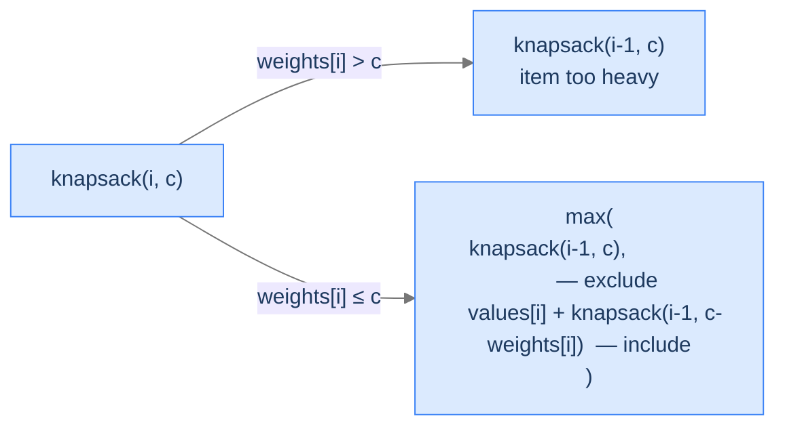
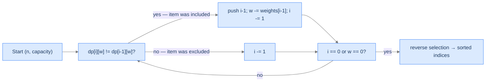

# 10. The Knapsack Family

A burglar slips into a vault. The shelves are stacked with treasures — gold bars, jewelled goblets, paintings — each with a weight and a market value. The burglar's bag holds only so much weight; pile too much in and the straps snap. Which subset maximises the haul without breaking the bag? You can take an item or leave it (no fractions). Greedy "highest value first" fails — a 9 kg gold bar worth $7 beats two 3 kg silver chalices worth $5 each, until the capacity is 6 kg. Then it's the chalices, by a wide margin.

By the end of this lesson you'll know the **0/1 knapsack** recurrence (`dp[i][w] = max(dp[i-1][w], dp[i-1][w - weight[i]] + value[i])`), how to reconstruct *which* items got picked (not just the total value), and how the recurrence morphs for two close cousins — **unbounded knapsack** (each item available infinitely) and **bounded knapsack** (each item has a count limit). These four problems are the most-cited DP archetypes in interviews and the foundation for currency-change, rod-cutting, partition, and resource-allocation problems.

## Table of contents

1. [The 0/1 Knapsack Problem](#the-01-knapsack-problem)
2. [Optimal Substructure — Include or Exclude](#optimal-substructure--include-or-exclude)
3. [Top-Down vs Bottom-Up](#top-down-vs-bottom-up)
4. [0/1 Knapsack — The Algorithm](#01-knapsack--the-algorithm)
5. [0/1 Knapsack II — Recovering Which Items](#01-knapsack-ii--recovering-which-items)
6. [Unbounded Knapsack — Items With Unlimited Copies](#unbounded-knapsack--items-with-unlimited-copies)
7. [Bounded Knapsack — Items With Count Limits](#bounded-knapsack--items-with-count-limits)
8. [Final Takeaway](#final-takeaway)

***

# The 0/1 Knapsack Problem

You are given `n` items where item `i` has weight `weights[i]` and value `values[i]`, and a knapsack with capacity `capacity`. Each item is either picked entirely or skipped — no fractions. Maximise total value subject to total weight `≤ capacity`.

```d2
direction: right
ex: "Example: weights = [6, 4, 5, 3], values = [7, 3, 2, 6], capacity = 10" {
  grid-rows: 3
  grid-columns: 4
  grid-gap: 0
  v0: "weight 6<br/>value 7" {style.fill: "#fde68a"; style.stroke: "#d97706"}
  v1: "weight 4<br/>value 3"
  v2: "weight 5<br/>value 2"
  v3: "weight 3<br/>value 6" {style.fill: "#fde68a"; style.stroke: "#d97706"}
  i0: "item 0"
  i1: "item 1"
  i2: "item 2"
  i3: "item 3"
  s0: "✓ pick"
  s1: "skip"
  s2: "skip"
  s3: "✓ pick"
}
```

<p align="center"><strong>Optimal selection: items 0 and 3 (total weight 6 + 3 = 9 ≤ 10, total value 7 + 6 = 13). Picking the heavier-but-poorer items 1 and 2 would total weight 9 with value only 5. Greedy "highest value first" picks item 0 (weight 6, value 7) and then has only 4 capacity left — too little for item 3, so it would settle for item 1 and miss item 3 entirely.</strong></p>

The brute force enumerates all `2^n` subsets and keeps the best legal one. DP brings it to `O(n × capacity)` — pseudo-polynomial in `capacity`.

> *Predict before reading on — for `weights = [4, 5, 1]`, `values = [1, 2, 3]`, `capacity = 4`, what's the answer?*

`3`. Item 0 alone gives 1; item 1 weighs 5 — too heavy; item 2 alone (weight 1, value 3) fits and is best. Items 0 + 2 (weight 5) overflow. Greedy by density (`value/weight`) would correctly pick item 2 first (density 3) over item 0 (density 0.25), then have 3 capacity left — but item 1 still doesn't fit. Final value 3.

## Where this shows up

Portfolio selection (each project has a cost and a return, total budget bounded), cargo loading (containers, weight limits), CPU scheduling under memory caps, knapsack-cryptosystem variants, the 1-D bin-packing decision problem, and the 0/1 reduction of integer linear programming. The recurrence we're about to build is the most-asked DP shape in tech interviews, by a long stretch.

---

## Key Takeaway

0/1 knapsack: pick a subset to maximise value subject to weight `≤ capacity`. Brute force `2^n`; DP `O(n × capacity)`. Greedy fails because items interact through the shared capacity budget.

***

# Optimal Substructure — Include or Exclude

Consider items `0..i` and remaining capacity `c`. Two scenarios for item `i`:

**Case 1 — `weights[i] > c`.** Item `i` doesn't fit. Skip it; the answer is whatever items `0..i-1` give with capacity `c`:
```
knapsack(i, c) = knapsack(i - 1, c)
```

**Case 2 — `weights[i] ≤ c`.** Two choices:
- **Exclude item `i`** — full capacity remains, items `0..i-1` available: `knapsack(i - 1, c)`.
- **Include item `i`** — gain `values[i]`, capacity drops to `c - weights[i]`, items `0..i-1` available: `values[i] + knapsack(i - 1, c - weights[i])`.

Take the max:
```
knapsack(i, c) = max(
    knapsack(i - 1, c),                                   — exclude
    values[i] + knapsack(i - 1, c - weights[i])           — include
)
```



<p align="center"><strong>The recurrence forks on whether item <em>i</em> fits. If yes, choose include vs. exclude by max value. Both choices recurse on items <em>0..i-1</em>.</strong></p>

> *Pause. Why do both branches recurse on `i - 1` rather than `i`? Predict the consequence of recursing on `i` instead.*

In **0/1** knapsack each item can be picked at most once. Once we've decided about item `i`, we move on permanently — `i - 1`. Recursing on `i` would let us pick item `i` again and again — that's the unbounded variant, coming later. The single index decrement is what enforces "0/1".

## Base Cases — When Does Recursion Stop?

Two terminating conditions:
- **`i < 0`** — no items left to consider. Return `0` (no value from no items).
- **`c == 0`** — no capacity left. Return `0` (can't add anything).

> *Why is the index base case `i < 0` and not `i == 0`?*

Index 0 is still a valid item — the *first* item, not the empty state. We exhaust items only when `i` drops *below* 0. Same logic as LCS, edit distance, and any prefix-indexed DP.

## Subproblem Identity

Each subproblem is uniquely identified by `(i, c)` — the index of the last item considered and the remaining capacity. So the memo table has dimensions `n × (capacity + 1)`. Total subproblem count: `O(n × capacity)`.

## Overlapping Subproblems

For inputs with similar weights, the same `(i, c)` pair gets reached from many parents. Example: items 3 and 4 both weigh 5, current capacity is 10. Including item 4 reaches `(3, 5)`; excluding item 4 then including item 3 reaches `(2, 5)`. Both paths bury into the same prefix subproblems. Naïve recursion blows up exponentially; memoization collapses it to `O(n × capacity)`.

---

## Key Takeaway

Two cases by fit; when fit allows, two choices by value. Always recurse on `i - 1` (single-use) and the appropriate capacity. State `(i, c)`; subproblems `O(n × capacity)`.

***

# Top-Down vs Bottom-Up

Two ways to compute the same recurrence:

**Top-down (memoization).** Recurse from `(n - 1, capacity)`; cache each `(i, c)` result on first compute, return the cache on later visits. Lazy: only the states actually reached get computed.

**Bottom-up (tabulation).** Build a `(n + 1) × (capacity + 1)` table. Row 0 is the empty-items base; column 0 is the empty-capacity base. Fill row by row, left to right. Eager: every `(i, c)` cell gets computed.

```d2
direction: right
flow: "Two faces of the same recurrence" {
  grid-rows: 1
  grid-columns: 2
  grid-gap: 20
  td: |md
    **Top-down**
    Recursion + memo table
    Lazy fill (only reached states)
    `O(n × cap)` time + recursion stack
  |
  bu: |md
    **Bottom-up**
    Two nested loops
    Eager fill (every cell)
    `O(n × cap)` time, no stack
  |
}
```

<p align="center"><strong>Both run in <code>O(n × capacity)</code>. Top-down skips unreachable cells but pays for recursion frames; bottom-up pays for every cell but skips the call overhead. Bottom-up is the canonical interview answer.</strong></p>

For the canonical algorithm we'll write the **bottom-up** version: easier to reason about, no stack-overflow risk, slightly tighter constants.

## The (n + 1) Shift

Bottom-up uses `(n + 1) × (capacity + 1)` instead of `n × (capacity + 1)`. The extra row is the empty-items base case: `dp[0][c] = 0` for all `c`. Then row `i` represents *the first `i` items considered* (so `dp[1][...]` corresponds to item index 0, `dp[2][...]` to items 0–1, etc.). The `(i - 1)` indices into `weights` and `values` follow naturally.

> *Predict before reading on — what does `dp[3][7]` mean for the running example?*

The maximum value achievable using the first 3 items (indices 0, 1, 2) within capacity 7. Note: not items 0–3, just 0–2.

---

## Key Takeaway

Bottom-up is the canonical knapsack form. The `(n + 1)` shift makes the empty-items base case sit at row 0; arithmetic on `weights[i - 1]` accommodates the shift.

***

# 0/1 Knapsack — The Algorithm

## The Problem

Given `weights`, `values`, and `capacity`, return the maximum value achievable.

```
Input:  weights = [6, 4, 5, 3], values = [7, 3, 2, 6], capacity = 10
Output: 13                           Pick items 0 (w=6, v=7) and 3 (w=3, v=6)

Input:  weights = [4, 5, 1], values = [1, 2, 3], capacity = 4
Output: 3                            Pick item 2 (w=1, v=3) only

Input:  weights = [4, 5, 6], values = [1, 2, 3], capacity = 3
Output: 0                            All items too heavy to fit
```

---

<details>
<summary><h2>Applying the Diagnostic Questions</h2></summary>


| # | Question | Answer |
|---|---|---|
| **Q1** | Optimal substructure? | **Yes** — every subset's value decomposes into "include item `i` or not" + the optimum on the prefix. |
| **Q2** | Overlapping subproblems? | **Yes** — `(i, c)` reached from up to two parents at every step. |
| **Q3** | 2D state? | **Yes** — `(i, c)` indexed by item count and remaining capacity. |
| **Q4** | Optimisation direction? | **Maximise** — value, not cost. |

### Q1 — Why "Yes"?

**Mental model.** Imagine the optimal subset is decided. For its rightmost-included item `i*`, the remaining items form an optimum subset for indices `0..i*-1` and capacity `c - weights[i*]`. If they didn't, we could swap them for a better prefix and improve the total — contradicting optimality.

**Concrete numbers.** For `weights = [6, 4, 5, 3], values = [7, 3, 2, 6], capacity = 10`: the optimum is `{0, 3}` with value 13. Drop item 3 — what remains is `{0}`, weight 6, value 7. That's the optimum for items `{0, 1, 2}` with capacity 7 (no other 3-or-fewer subset on items 0–2 gets above 7 in capacity 7).

**What breaks otherwise.** Suppose the optimum subset's `prefix` weren't optimal. Replace it with the actual prefix optimum — same `i*` decision, better total. Contradiction with the original being optimal.

### Q2 — Why "Yes"?

**Mental model.** When two items share the same weight, the include/exclude branches funnel many parents into the same `(i, c)` cell.

**Concrete numbers.** Items 1 and 2 both weigh 4. From `(3, 8)`: include item 3 → `(2, 5)`; exclude item 3, then include item 2 → `(1, 4)`; exclude both → `(1, 8)`. Different paths, same prefix subproblems.

**What breaks otherwise.** Without memoization, recursion is `O(2^n)` because each `(i, c)` is recomputed from scratch on every visit.

### Q3 — Why 2D?

**Mental model.** Two free variables: which prefix of items, and how much capacity is left. Both vary independently as we recurse, so both must be stored.

**Concrete numbers.** With `n = 4` and `capacity = 10`, the table has `5 × 11 = 55` cells. Each is `O(1)` to fill given its predecessors. Total work `O(n × capacity)`.

**What breaks otherwise.** A 1D state `dp[c]` can't represent "considered items 0..i" — without `i`, the recurrence has no notion of progress and would loop forever on the same item.

### Q4 — Why max?

The problem says "maximum value." We want as much value as possible inside the budget. (Edit distance and palindrome partitioning minimise; knapsack maximises. Same recurrence shape, opposite direction.)

</details>
<details>
<summary><h2>The Solution</h2></summary>


Bottom-up tabulation. `maxValue[i][c]` = max value using the first `i` items with capacity `c`. Two nested loops: outer on items, inner on capacity. Final answer: `maxValue[n][capacity]`.


```python run
from typing import List

class Solution:
    def knapsack(self, weights: List[int], values: List[int], capacity: int) -> int:

        n: int = len(weights)

        # If there are no items or no capacity, max value is 0
        if capacity == 0 or n == 0:
            return 0

        # maxValue[i][c] represents the maximum value achievable using:
        # the first i items (weights[0..i-1], values[0..i-1])
        # with a capacity of c
        maxValue: List[List[int]] = [[0] * (capacity + 1) for _ in range(n + 1)]

        # Build the DP table row by row
        for i in range(1, n + 1):
            for c in range(1, capacity + 1):

                # Exclude the current item
                maxValue[i][c] = maxValue[i - 1][c]

                # Include the current item if it fits
                if weights[i - 1] <= c:
                    maxValue[i][c] = max(
                        maxValue[i][c],
                        maxValue[i - 1][c - weights[i - 1]] + values[i - 1]
                    )

        # The final cell contains the max value for all n items and the full capacity
        return maxValue[n][capacity]


if __name__ == "__main__":
    sol = Solution()
    print(sol.knapsack([6, 4, 5, 3], [7, 3, 2, 6], 10))   # 13
    print(sol.knapsack([4, 5, 1],    [1, 2, 3],    4))    # 3
    print(sol.knapsack([4, 5, 6],    [1, 2, 3],    3))    # 0
```

```java run
public class Main {
    static class Solution {

        public int knapsack(int[] weights, int[] values, int capacity) {

            int n = weights.length;

            // If there are no items or no capacity, max value is 0
            if (capacity == 0 || n == 0) return 0;

            // maxValue[i][c] represents the maximum value achievable using:
            // the first i items (weights[0..i-1], values[0..i-1])
            // with a capacity of c
            int[][] maxValue = new int[n + 1][capacity + 1];

            // Build the DP table row by row
            for (int i = 1; i <= n; i++) {
                for (int c = 1; c <= capacity; c++) {

                    // Exclude the current item
                    maxValue[i][c] = maxValue[i - 1][c];

                    // Include the current item if it fits
                    if (weights[i - 1] <= c) {
                        maxValue[i][c] = Math.max(
                            maxValue[i][c],
                            maxValue[i - 1][c - weights[i - 1]] + values[i - 1]
                        );
                    }
                }
            }

            // The final cell contains the max value for all n items and the full capacity
            return maxValue[n][capacity];
        }
    }

    public static void main(String[] args) {
        Solution sol = new Solution();
        System.out.println(sol.knapsack(new int[]{6, 4, 5, 3}, new int[]{7, 3, 2, 6}, 10));  // 13
        System.out.println(sol.knapsack(new int[]{4, 5, 1},    new int[]{1, 2, 3},    4));   // 3
        System.out.println(sol.knapsack(new int[]{4, 5, 6},    new int[]{1, 2, 3},    3));   // 0
    }
}
```

</details>
<details>
<summary><strong>Trace — weights = [6, 4, 5, 3], values = [7, 3, 2, 6], capacity = 10</strong></summary>

```
maxValue dimensions: 5 rows (i = 0..4) × 11 columns (c = 0..10).
Row 0 (no items): all zeros.

i = 1  (item 0: w=6, v=7)
  Capacities 0..5: item too heavy → maxValue[1][0..5] = 0
  Capacities 6..10: include is legal → maxValue[1][6..10] = max(0, 7) = 7

i = 2  (item 1: w=4, v=3)
  c=4: max(maxValue[1][4]=0, 3 + maxValue[1][0]=0)  = 3
  c=5: max(maxValue[1][5]=0, 3 + maxValue[1][1]=0)  = 3
  c=6: max(maxValue[1][6]=7, 3 + maxValue[1][2]=0)  = 7
  c=7: max(maxValue[1][7]=7, 3 + maxValue[1][3]=0)  = 7
  c=8: max(maxValue[1][8]=7, 3 + maxValue[1][4]=0)  = 7
  c=9: max(maxValue[1][9]=7, 3 + maxValue[1][5]=0)  = 7
  c=10: max(maxValue[1][10]=7, 3 + maxValue[1][6]=7) = 10
  (lower c's: too heavy, copy from above)

i = 3  (item 2: w=5, v=2)  — values are mostly the same; only marginal changes
  Items 0+2 give w=11 (overflow); item 2 alone gives v=2 — strictly worse than v=3 from item 1.
  So row 3 mostly mirrors row 2 (item 2 isn't worth picking unless it leaves room for item 1).
  maxValue[3][10] = max(maxValue[2][10]=10, 2 + maxValue[2][5]=3) = 10

i = 4  (item 3: w=3, v=6)
  c=3: max(maxValue[3][3]=0, 6 + maxValue[3][0]=0)   = 6
  c=4: max(maxValue[3][4]=3, 6 + maxValue[3][1]=0)   = 6
  c=5: max(maxValue[3][5]=3, 6 + maxValue[3][2]=0)   = 6
  c=6: max(maxValue[3][6]=7, 6 + maxValue[3][3]=0)   = 7
  c=7: max(maxValue[3][7]=7, 6 + maxValue[3][4]=3)   = 9    (items 1+3)
  c=8: max(maxValue[3][8]=7, 6 + maxValue[3][5]=3)   = 9
  c=9: max(maxValue[3][9]=7, 6 + maxValue[3][6]=7)   = 13   (items 0+3) ✓
  c=10: max(maxValue[3][10]=10, 6 + maxValue[3][7]=7) = 13   (items 0+3) ✓

Final maxValue[4][10] = 13. ✓
```

</details>
<details>
<summary><h2>Complexity Analysis</h2></summary>


| Aspect | Cost | Why |
|---|---|---|
| Time | `O(n × capacity)` | Two nested loops; constant work per cell. Pseudo-polynomial: linear in `capacity`'s magnitude, *not* its bit length. |
| Space | `O(n × capacity)` | Full table. Reducible to `O(capacity)` with a 1D rolling array — see below. |

</details>
<details>
<summary><h2>Space Optimisation — Rolling 1D Array</h2></summary>


`dp[i][w]` only reads from `dp[i - 1][*]` — the previous row. So one 1D array suffices, *if* you iterate `w` from `capacity` down to `weights[i - 1]`. Iterating downward ensures `dp[w - weights[i - 1]]` still holds the *previous* row's value when we read it — going upward would let item `i` get picked twice.

```python run
def zero_one_knapsack_1d(weights, values, capacity):
    dp = [0] * (capacity + 1)
    for i in range(len(weights)):
        wi, vi = weights[i], values[i]
        # Iterate w DOWNWARD: prevents accidentally re-using item i in the same pass.
        for w in range(capacity, wi - 1, -1):
            dp[w] = max(dp[w], vi + dp[w - wi])
    return dp[capacity]
```

Same `O(n × capacity)` time; `O(capacity)` space. Beautiful and the standard interview answer once you've shown the 2D version.

</details>
<details>
<summary><h2>Edge Cases</h2></summary>


| Case | Example | Expected | Reasoning |
|---|---|---|---|
| Zero items | `weights=[]`, `capacity=10` | `0` | `n = 0`; `dp[0][10] = 0`. |
| Zero capacity | `weights=[1]`, `capacity=0` | `0` | Column 0 stays all zeros. |
| All items too heavy | `weights=[10, 11]`, `capacity=5` | `0` | Every `wi > w` branch → `dp[n][cap] = 0`. |
| Single fitting item | `weights=[5]`, `values=[100]`, `capacity=5` | `100` | One include reaches capacity exactly. |
| All items fit together | `weights=[1, 1]`, `values=[5, 5]`, `capacity=10` | `10` | Both included. |
| Equal weights | `weights=[3, 3]`, `values=[5, 6]`, `capacity=3` | `6` | Pick the higher-value one. |

</details>

***

# 0/1 Knapsack II — Recovering Which Items

The standard knapsack returns just the *value*. But often we want the actual *set of items* — the burglar wants to know *what* to grab, not just how much they're worth. We can recover the selection by *backtracking* through the DP table after it's filled.

<details>
<summary><h2>The Idea</h2></summary>


After the table is computed, walk from `dp[n][capacity]` backward toward `dp[0][0]`. At each step `(i, w)`:
- If `dp[i][w] != dp[i - 1][w]`, item `i - 1` *was* included (its inclusion improved the value). Add `i - 1` to the selection; drop `w` by `weights[i - 1]`.
- Otherwise, item `i - 1` was excluded. Move to row `i - 1` with the same `w`.

Continue until `i == 0` or `w == 0`. Reverse the selection to get sorted indices.



<p align="center"><strong>Backtracking walks the DP table from <code>(n, capacity)</code> toward the origin. A cell-value change between consecutive rows reveals an inclusion; equality reveals an exclusion. The walk costs <code>O(n)</code> — one row decrement per step.</strong></p>

> *Pause. Why does `dp[i][w] != dp[i-1][w]` prove inclusion? Predict the reasoning.*

`dp[i][w]` = `max(dp[i-1][w], vi + dp[i-1][w - wi])`. If the max came from the *exclude* branch, `dp[i][w] == dp[i-1][w]` — equal. If it came from the *include* branch, `dp[i][w]` strictly improved over `dp[i-1][w]` — different. So a value change is the signature of an include decision.

(Edge case: if both branches happen to tie, the algorithm picks "exclude" and skips the item. Either choice is valid; the *value* is the same, only one of possibly many optimal subsets is recovered.)

</details>
<details>
<summary><h2>The Solution</h2></summary>


```python run
from typing import List

class Solution:
    def zero_one_knapsack_ii(
        self, weights: List[int], profits: List[int], capacity: int
    ) -> List[int]:
        n: int = len(weights)

        # Create a 2D DP array to store the maximum profit at each
        # capacity for different items
        dp: List[List[int]] = [
            [0] * (capacity + 1) for _ in range(n + 1)
        ]

        # Iterate through each item
        for i in range(1, n + 1):

            # Iterate through each capacity from 1 to the total capacity
            for w in range(1, capacity + 1):

                # If the weight of the current item is less than or equal
                # to the current capacity
                if weights[i - 1] <= w:

                    # Include the current item and calculate the maximum
                    # profit by considering the remaining capacity and
                    # previous items' profits
                    dp[i][w] = max(
                        profits[i - 1] + dp[i - 1][w - weights[i - 1]],
                        dp[i - 1][w],
                    )
                else:

                    # If the weight of the current item is greater than
                    # the current capacity, skip including the item and
                    # carry forward the previous maximum profit
                    dp[i][w] = dp[i - 1][w]

        # Track the selected items that contribute to the maximum profit
        selected_items: List[int] = []
        i = n
        w = capacity

        # Starting from the last item and capacity, backtrack to find the
        # selected items
        while i > 0 and w > 0:

            # If the current item was included in the optimal solution,
            # add it to the selected items and reduce the remaining
            # capacity
            if dp[i][w] != dp[i - 1][w]:
                selected_items.append(i - 1)
                w -= weights[i - 1]

            # Move to the previous item
            i -= 1

        # Reverse the selected items to get them in the correct order
        selected_items.reverse()

        # Return the selected items
        return selected_items


# Examples from the problem statement
print(Solution().zero_one_knapsack_ii([6, 4, 5, 3], [7, 3, 2, 6], 10))  # [0, 3]
print(Solution().zero_one_knapsack_ii([4, 5, 1], [1, 2, 3], 4))         # [2]
print(Solution().zero_one_knapsack_ii([4, 5, 6], [1, 2, 3], 3))         # []

# Edge cases
print(Solution().zero_one_knapsack_ii([], [], 10))                       # []
print(Solution().zero_one_knapsack_ii([5], [10], 0))                     # []
print(Solution().zero_one_knapsack_ii([5], [10], 5))                     # [0]
print(Solution().zero_one_knapsack_ii([1, 2, 3], [6, 10, 12], 5))       # [0, 1, 2] or [1, 2]
print(Solution().zero_one_knapsack_ii([10], [100], 5))                   # []
```

```java run
import java.util.*;

public class Main {
    static class Solution {
        public int[] zeroOneKnapsackII(
            int[] weights,
            int[] profits,
            int capacity
        ) {
            int n = weights.length;

            // Create a 2D DP array to store the maximum profit at each
            // capacity for different items
            int[][] dp = new int[n + 1][capacity + 1];

            // Iterate through each item
            for (int i = 1; i <= n; i++) {

                // Iterate through each capacity from 1 to the total capacity
                for (int w = 1; w <= capacity; w++) {

                    // If the weight of the current item is less than or
                    // equal to the current capacity
                    if (weights[i - 1] <= w) {

                        // Include the current item and calculate the maximum
                        // profit by considering the remaining capacity and
                        // previous items' profits
                        dp[i][w] = Math.max(
                            profits[i - 1] + dp[i - 1][w - weights[i - 1]],
                            dp[i - 1][w]
                        );
                    } else {

                        // If the weight of the current item is greater than
                        // the current capacity, skip including the item and
                        // carry forward the previous maximum profit
                        dp[i][w] = dp[i - 1][w];
                    }
                }
            }

            // Track the selected items that contribute to the maximum profit
            List<Integer> selectedItems = new ArrayList<>();
            int i = n;
            int w = capacity;

            // Starting from the last item and capacity, backtrack to find
            // the selected items
            while (i > 0 && w > 0) {

                // If the current item was included in the optimal solution,
                // add it to the selected items and reduce the remaining
                // capacity
                if (dp[i][w] != dp[i - 1][w]) {
                    selectedItems.add(i - 1);
                    w -= weights[i - 1];
                }

                // Move to the previous item
                i--;
            }

            // Reverse the selected items to get them in the correct order
            Collections.reverse(selectedItems);

            // Convert the List to int[]
            int[] result = new int[selectedItems.size()];
            for (int j = 0; j < selectedItems.size(); j++) {
                result[j] = selectedItems.get(j);
            }

            // Return the selected items
            return result;
        }
    }

    public static void main(String[] args) {
        // Examples from the problem statement
        System.out.println(Arrays.toString(new Solution().zeroOneKnapsackII(new int[]{6, 4, 5, 3}, new int[]{7, 3, 2, 6}, 10)));  // [0, 3]
        System.out.println(Arrays.toString(new Solution().zeroOneKnapsackII(new int[]{4, 5, 1}, new int[]{1, 2, 3}, 4)));         // [2]
        System.out.println(Arrays.toString(new Solution().zeroOneKnapsackII(new int[]{4, 5, 6}, new int[]{1, 2, 3}, 3)));         // []

        // Edge cases
        System.out.println(Arrays.toString(new Solution().zeroOneKnapsackII(new int[]{}, new int[]{}, 10)));                       // []
        System.out.println(Arrays.toString(new Solution().zeroOneKnapsackII(new int[]{5}, new int[]{10}, 0)));                     // []
        System.out.println(Arrays.toString(new Solution().zeroOneKnapsackII(new int[]{5}, new int[]{10}, 5)));                     // [0]
        System.out.println(Arrays.toString(new Solution().zeroOneKnapsackII(new int[]{1, 2, 3}, new int[]{6, 10, 12}, 5)));       // [1, 2]
        System.out.println(Arrays.toString(new Solution().zeroOneKnapsackII(new int[]{10}, new int[]{100}, 5)));                   // []
    }
}
```

</details>
<details>
<summary><strong>Trace — backtracking from dp[4][10] for the running example</strong></summary>

```
Start: i = 4, w = 10. dp[4][10] = 13.

Step 1: dp[4][10] = 13, dp[3][10] = 10.  Differ → item 3 included.
        Push 3; w -= 3 → w = 7; i = 3.

Step 2: dp[3][7] = 7, dp[2][7] = 7.       Same → item 2 excluded.
        i = 2.

Step 3: dp[2][7] = 7, dp[1][7] = 7.       Same → item 1 excluded.
        i = 1.

Step 4: dp[1][7] = 7, dp[0][7] = 0.       Differ → item 0 included.
        Push 0; w -= 6 → w = 1; i = 0.

Loop ends (i == 0).

Collected: [3, 0].  Reverse → [0, 3].  ✓
```

</details>
<details>
<summary><h2>Solution &amp; Analysis</h2></summary>

### Complexity Analysis

| Aspect | Cost | Why |
|---|---|---|
| Time | `O(n × capacity)` | DP build dominates; backtrack is `O(n)`. |
| Space | `O(n × capacity)` | The full table is needed for backtracking. |

The 1D rolling-array trick from earlier *cannot* directly reconstruct the path — overwriting rows loses the trail. Reconstruction needs the full 2D history (or some clever bit-packing variants beyond this lesson).

### Edge Cases

| Case | Example | Expected | Reasoning |
|---|---|---|---|
| Nothing fits | `weights=[10]`, `capacity=5` | `[]` | Backtrack starts; `dp[1][5] == dp[0][5] == 0` → no inclusion ever recorded. |
| One item exactly fills | `weights=[5]`, `values=[10]`, `capacity=5` | `[0]` | `dp[1][5] = 10 != 0` → record 0. |
| Tie between two items, same weight | `weights=[3, 3]`, `values=[5, 5]`, `capacity=3` | `[0]` | Either index is correct; at row `i=2` the include/exclude tie makes `dp[2][3] == dp[1][3]`, so the equality check treats item 1 as *excluded* and the backtrack keeps walking up until item 0's row, where the value changes — so it recovers the earlier index. |
| Multiple equally-good subsets | various | one valid subset | Algorithm returns *one* maximum — the one the backtrack walks. |

</details>

***

# Unbounded Knapsack — Items With Unlimited Copies

In **unbounded** knapsack, each item type is available in unlimited supply — pick item `i` once, twice, or a hundred times. The recurrence shifts by *one index*: when including, you stay at item `i` (item is still available) instead of moving to `i - 1`.

```
unbounded(i, c) = max(
    unbounded(i - 1, c),                               — exclude (move on, item gone)
    values[i] + unbounded(i, c - weights[i])           — include AND keep item i available
)
```

Compare to 0/1:
```
zero_one(i, c)  = max(
    zero_one(i - 1, c),
    values[i] + zero_one(i - 1, c - weights[i])        — include, item gone
)
```

The single difference: include keeps `i` (unbounded) vs. moves to `i - 1` (0/1). That's it. One character.

> *Pause. The diff is one character (`i` vs `i - 1`). What does that change in the bottom-up table's read direction? Predict before reading on.*

In bottom-up form, the include term reads `dp[i][w - wi]` (same row, smaller column) instead of `dp[i - 1][w - wi]` (row above). Same row means we read a value *just computed in the same outer-loop iteration* — and that's intentional: we want the same item to be reusable. The 0/1 1D rolling-array version iterates `w` *downward* to avoid this accidental reuse; the unbounded version iterates `w` *upward* to deliberately enable it.

## Where this shows up

Coin change (currencies have unlimited supply per denomination), rod cutting (a length of any size can be reused), production scheduling (raw materials replenish), and the classic "minimum number of coins to make change" problem (a min-aggregator unbounded knapsack).

## Why More Overlap Than 0/1?

In 0/1, each `(i, c)` is reached from at most two parents — include-or-exclude. In unbounded, the include branch creates a chain `(i, c), (i, c - wi), (i, c - 2·wi), ...` all stuck on item `i`. The fan-in at every state is much higher, making memoization/tabulation even more impactful.

---

## The Algorithm

We use a `(n + 1) × (capacity + 1)` table, same shape as 0/1. The only difference: the include term reads from the *same* row.


```python run
from typing import List

class Solution:
    def knapsack(self, weights: List[int], values: List[int], capacity: int) -> int:

        n: int = len(weights)

        # If there are no items or no capacity, max value is 0
        if capacity == 0 or n == 0:
            return 0

        # maxValue[i][c] represents the maximum value achievable using:
        # the first i items (weights[0..i-1], values[0..i-1])
        # with a capacity of c, where each item can be used unlimited times
        maxValue: List[List[int]] = [[0] * (capacity + 1) for _ in range(n + 1)]

        # Build the DP table row by row
        for i in range(1, n + 1):
            for c in range(1, capacity + 1):

                # Exclude the current item
                maxValue[i][c] = maxValue[i - 1][c]

                # Include the current item if it fits
                # Note: we use maxValue[i][...] not maxValue[i - 1][...]
                # because the current item can be reused
                if weights[i - 1] <= c:
                    maxValue[i][c] = max(
                        maxValue[i][c],
                        maxValue[i][c - weights[i - 1]] + values[i - 1]
                    )

        # The final cell contains the max value for all n items and the full capacity
        return maxValue[n][capacity]


if __name__ == "__main__":
    sol = Solution()
    # 5 weight 1 value 1, weight 4 value 5, weight 3 value 4 — capacity 8.
    # Best: 2× item with w=4, v=5 → total weight 8, value 10.
    print(sol.knapsack([1, 4, 3], [1, 5, 4], 8))   # 10
    # Coin change in disguise: w=v=[1, 3, 4], capacity 6 → 6 (six 1-coins).
    print(sol.knapsack([1, 3, 4], [1, 3, 4], 6))   # 6
```

```java run
public class Main {
    static class Solution {

        public int knapsack(int[] weights, int[] values, int capacity) {

            int n = weights.length;

            // If there are no items or no capacity, max value is 0
            if (capacity == 0 || n == 0) return 0;

            // maxValue[i][c] represents the maximum value achievable using:
            // the first i items (weights[0..i-1], values[0..i-1])
            // with a capacity of c, where each item can be used unlimited times
            int[][] maxValue = new int[n + 1][capacity + 1];

            // Build the DP table row by row
            for (int i = 1; i <= n; i++) {
                for (int c = 1; c <= capacity; c++) {

                    // Exclude the current item
                    maxValue[i][c] = maxValue[i - 1][c];

                    // Include the current item if it fits
                    // Note: we use maxValue[i][...] not maxValue[i - 1][...]
                    // because the current item can be reused
                    if (weights[i - 1] <= c) {
                        maxValue[i][c] = Math.max(
                            maxValue[i][c],
                            maxValue[i][c - weights[i - 1]] + values[i - 1]
                        );
                    }
                }
            }

            // The final cell contains the max value for all n items and the full capacity
            return maxValue[n][capacity];
        }
    }

    public static void main(String[] args) {
        System.out.println(new Solution().knapsack(new int[]{1, 4, 3}, new int[]{1, 5, 4}, 8));  // 10
    }
}
```


## Space Optimisation — Truly 1D

Unbounded knapsack collapses to a clean 1D form because the include term reads *the same row*. We don't need history of previous items beyond what's already in `dp[w]`:

```python run
def unbounded_knapsack_1d(weights, values, capacity):
    dp = [0] * (capacity + 1)
    for i in range(len(weights)):
        wi, vi = weights[i], values[i]
        # Iterate w UPWARD: deliberately allows item i to be re-picked.
        for w in range(wi, capacity + 1):
            dp[w] = max(dp[w], vi + dp[w - wi])
    return dp[capacity]
```

The direction is the *opposite* of the 0/1 1D form. Direction = semantics, in this case.

---

## Complexity Analysis

| Aspect | Cost | Why |
|---|---|---|
| Time | `O(n × capacity)` | Same shape; one cell per `(i, w)`. |
| Space | `O(capacity)` | 1D form. 2D form is `O(n × capacity)`. |

***

# Bounded Knapsack — Items With Count Limits

In **bounded** knapsack, each item `i` comes with a count `counts[i]` — you can take it 0, 1, 2, ..., up to `counts[i]` times. This sits between 0/1 (`counts[i] = 1`) and unbounded (`counts[i] = ∞`).

The recurrence iterates over the choice `k` (number of copies of item `i` taken):

```
bounded(i, c) = max over k ∈ [0, min(counts[i], c / weights[i])] of
                  k × values[i] + bounded(i - 1, c - k × weights[i])
```

The `min(counts[i], c / weights[i])` bound captures both constraints: can't exceed the supply, can't exceed the capacity.

> *Predict before reading on — when `counts[i] = 1` for all `i`, what does this reduce to?*

Plain 0/1 knapsack. With `counts[i] = 1`, `k` can only be 0 or 1 — exactly the include/exclude branches.

When `counts[i] = ∞` (or `≥ capacity / weights[i]`), the `c / weights[i]` bound dominates, and the recurrence becomes the unbounded form. So bounded knapsack subsumes both extremes.

## Why More Parents?

In 0/1, each state `(i, c)` is reached from at most 2 parents (include/exclude on item `i + 1`). In unbounded, more — because including the same item with various counts feeds in. In **bounded**, up to `counts[i + 1] + 1` parents converge on `(i, c)` — one for each quantity choice. Memoization is even more valuable here.

## A Faster Algorithm — Binary Decomposition

The naïve bounded knapsack is `O(n × capacity × max(counts))` — for each `(i, c)`, iterate over `k`. There's a slick trick: **binary decomposition** breaks each item with count `m` into `O(log m)` virtual items with weights `wi, 2·wi, 4·wi, ...` (and matching values). Any subset of these reproduces any choice of `0..m` copies. Then run plain 0/1 knapsack on the virtual list — total time `O(n × log(max_count) × capacity)`. Beyond this lesson, but worth knowing the trick exists.

## What Breaks If We Forget the Quantity Bound?

If we drop `min(counts[i], ...)` from the recurrence and just iterate `k` from 0 to infinity, the algorithm runs forever (or hits an out-of-bounds error). The bound *is* the bounded part — without it, you've reverted to unbounded.

---

## The Algorithm


```python run
from typing import List

class Solution:
    def knapsack(self, weights: List[int], values: List[int], counts: List[int], capacity: int) -> int:

        n: int = len(weights)

        # If there are no items or no capacity, max value is 0
        if capacity == 0 or n == 0:
            return 0

        # maxValue[i][c] represents the maximum value achievable using:
        # the first i item types (weights[0..i-1], values[0..i-1], counts[0..i-1])
        # with a capacity of c, respecting the count limit of each item type
        maxValue: List[List[int]] = [[0] * (capacity + 1) for _ in range(n + 1)]

        # Build the DP table row by row
        for i in range(1, n + 1):
            for c in range(1, capacity + 1):

                # Start by taking 0 copies of the current item type
                maxValue[i][c] = maxValue[i - 1][c]

                # Try taking 1 to min(counts[i - 1], c // weights[i - 1]) copies
                max_copies = min(counts[i - 1], c // weights[i - 1])
                for k in range(1, max_copies + 1):
                    maxValue[i][c] = max(
                        maxValue[i][c],
                        maxValue[i - 1][c - k * weights[i - 1]] + k * values[i - 1]
                    )

        # The final cell contains the max value for all n item types and the full capacity
        return maxValue[n][capacity]


if __name__ == "__main__":
    sol = Solution()
    # 3 item types: (w=1,v=1, ≤2), (w=2,v=3, ≤2), (w=3,v=4, ≤1).  capacity=5.
    # Best: 2 of item 1 + 1 of item 0 → w=5, v=7.   Or 1 of item 1 + 1 of item 2 → w=5, v=7. Tie.
    print(sol.knapsack([1, 2, 3], [1, 3, 4], [2, 2, 1], 5))   # 7
```

```java run
public class Main {
    static class Solution {

        public int knapsack(int[] weights, int[] values, int[] counts, int capacity) {

            int n = weights.length;

            // If there are no items or no capacity, max value is 0
            if (capacity == 0 || n == 0) return 0;

            // maxValue[i][c] represents the maximum value achievable using:
            // the first i item types (weights[0..i-1], values[0..i-1], counts[0..i-1])
            // with a capacity of c, respecting the count limit of each item type
            int[][] maxValue = new int[n + 1][capacity + 1];

            // Build the DP table row by row
            for (int i = 1; i <= n; i++) {
                for (int c = 1; c <= capacity; c++) {

                    // Start by taking 0 copies of the current item type
                    maxValue[i][c] = maxValue[i - 1][c];

                    // Try taking 1 to min(counts[i - 1], c / weights[i - 1]) copies
                    int maxCopies = Math.min(counts[i - 1], c / weights[i - 1]);
                    for (int k = 1; k <= maxCopies; k++) {
                        maxValue[i][c] = Math.max(
                            maxValue[i][c],
                            maxValue[i - 1][c - k * weights[i - 1]] + k * values[i - 1]
                        );
                    }
                }
            }

            // The final cell contains the max value for all n item types and the full capacity
            return maxValue[n][capacity];
        }
    }

    public static void main(String[] args) {
        System.out.println(new Solution().knapsack(
            new int[]{1, 2, 3}, new int[]{1, 3, 4}, new int[]{2, 2, 1}, 5));  // 7
    }
}
```


---

## Complexity Analysis

| Aspect | Cost | Why |
|---|---|---|
| Time | `O(n × capacity × max(counts))` | Triple loop. Reducible to `O(n × capacity × log(max_count))` via binary decomposition. |
| Space | `O(n × capacity)` | DP table. |

---

## Edge Cases Across the Family

| Variant | Special Case | Behaviour |
|---|---|---|
| 0/1 | Item heavier than capacity | Excluded; `dp[i][cap] = dp[i-1][cap]`. |
| 0/1 | All items free (`weights[i] = 0`) | Always include; `dp[n][cap] = sum(values)`. |
| Unbounded | `weights[i] = 0`, `values[i] > 0` | Infinite loop unless guarded — every iteration re-includes the free-but-valuable item. |
| Bounded | `counts[i] = 0` | Item effectively absent; equivalent to dropping the item entirely. |
| Bounded | `counts[i] ≥ capacity/weights[i]` | Constraint never binds; behaves as unbounded for that item. |

***

# Final Takeaway

The knapsack family is the most-asked DP archetype because three small variations on the recurrence cover an enormous slice of resource-allocation problems:

- **0/1**: each item used 0 or 1 times → recurse on `(i - 1, c)` and `(i - 1, c - wi)`.
- **Unbounded**: each item used 0+ times → recurse on `(i - 1, c)` and `(i, c - wi)` (note: `i`, not `i - 1`).
- **Bounded**: each item used 0..counts[i] times → outer loop over quantity `k`, recurse on `(i - 1, c - k·wi)`.

Reconstructing the *actual selection* (knapsack II) is a 5-line backtrack on the filled table. The 1D space optimisation has a meaningful catch: 0/1 iterates capacity *down*, unbounded iterates capacity *up*. **You didn't just memorise four recurrences. You learned that the bound on item reuse — once, infinite, or counted — controls one specific edge of the recurrence (`i - 1` vs `i`, plus an optional `k`-loop). Everything else is the same `(i, c)` table.**

> *Transfer challenge for the next lesson:* Knapsack solves "max value within capacity". What if we changed the question to "is there *any* subset whose total weight is exactly `target`?" — boolean answer, no values, just feasibility. Predict the recurrence shape.

<details>
<summary><strong>Answer</strong></summary>

`subsetSum[i][s] = subsetSum[i - 1][s] OR subsetSum[i - 1][s - weights[i]]` — the include term contributes if `weights[i] ≤ s`. Base case `subsetSum[i][0] = true` (empty subset hits sum 0). The aggregator is `OR`, not `max`. This is the **subset-sum** problem and the next several lessons (partition, target sum, coin change variants) all riff on this exact recurrence.

</details>
