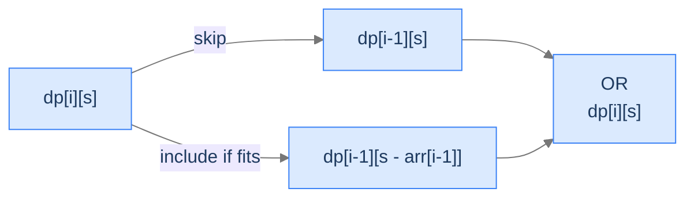
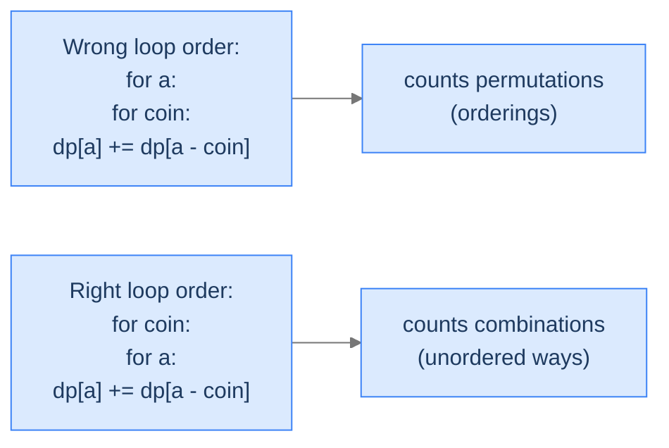

# 11. Knapsack Applications

The previous lesson built the knapsack family — three recurrence shapes that decide what to take from a list of items under a capacity budget. The astonishing thing isn't the family itself; it's how *many* ostensibly unrelated problems reduce to it. A vending machine making change with the fewest coins? Unbounded knapsack with a min-aggregator. Cutting a steel rod into pieces to maximise revenue? Unbounded knapsack where the "items" are cut lengths. Deciding whether a multiset of integers contains a subset summing to a target? 0/1 knapsack, boolean version. Counting how many distinct ways to make change with unlimited coins? Unbounded knapsack with a sum-aggregator.

By the end of this lesson you'll know how to recognise the knapsack shape in disguise, and you'll have written four canonical reductions: **subset sum** (boolean fits), **rod cutting** (max value with cut lengths), **coin change** (min count to hit an amount), and **coin change II** (count of distinct ways). Same DP table, four different aggregators — that pattern alone is the dirty secret behind half of medium-hard interview problems.

## Table of contents

1. [Subset Sum — The Boolean 0/1 Knapsack](#subset-sum--the-boolean-01-knapsack)
2. [Rod Cutting — Unbounded Knapsack in Disguise](#rod-cutting--unbounded-knapsack-in-disguise)
3. [Coin Change — Minimum Coins to Hit an Amount](#coin-change--minimum-coins-to-hit-an-amount)
4. [Coin Change II — Counting the Ways](#coin-change-ii--counting-the-ways)
5. [Final Takeaway](#final-takeaway)

***

# Subset Sum — The Boolean 0/1 Knapsack

Strip the *value* from 0/1 knapsack, drop the *capacity* in favour of an *exact* target, and ask "is it possible?" instead of "what's the maximum?". You're left with **subset sum**: given an array of integers and a target, does any subset sum exactly to the target?

## The Problem

Given an array `arr` of non-negative integers and a target `target`, return `true` if some subset of `arr` sums to `target`, else `false`.

```
Input:  arr = [1, 5, 3, 10], target = 15
Output: true                          [5, 10] sums to 15

Input:  arr = [1, 2, 3, 4, 5], target = 6
Output: true                          [2, 4] sums to 6, also [1, 5] and [1, 2, 3]

Input:  arr = [1, 2, 3, 4, 5], target = 40
Output: false                         Total of all is 15 < 40 — impossible
```

<details>
<summary><h2>The Recurrence</h2></summary>


`dp[i][s]` = whether some subset of the first `i` items sums to exactly `s`. Two cases:

- **Skip item `i - 1`**: `dp[i][s] = dp[i - 1][s]`.
- **Include item `i - 1` (if `arr[i - 1] ≤ s`)**: `dp[i][s] = dp[i - 1][s - arr[i - 1]]`.

OR them together:
```
dp[i][s] = dp[i - 1][s] OR (arr[i - 1] ≤ s AND dp[i - 1][s - arr[i - 1]])
```

**Base cases.**
- `dp[i][0] = true` for all `i` — the empty subset sums to 0.
- `dp[0][s] = false` for `s > 0` — no items can hit any positive sum.



<p align="center"><strong>Subset sum decomposes exactly like 0/1 knapsack — but the aggregator is OR instead of max, and we ask <em>existence</em> instead of <em>optimum</em>.</strong></p>

> *Pause. Compare this to the 0/1-knapsack recurrence — what changed?*

Two things only: **values disappeared** (we don't measure quality, only feasibility) and **aggregator flipped from max to OR** (we want any path, not the best one). Capacity becomes target; the structure is identical.

</details>
<details>
<summary><h2>Solution &amp; Analysis</h2></summary>

### The Solution

```python run
from typing import List

class Solution:
    def subset_sum(self, arr: List[int], target: int) -> bool:
        n: int = len(arr)
        dp: List[List[bool]] = [
            [False] * (target + 1) for _ in range(n + 1)
        ]

        # Initializing the base case: If the target is 0, then any subset
        # can form it.
        for i in range(n + 1):
            dp[i][0] = True

        # Building the bottom-up DP table
        for i in range(1, n + 1):
            for j in range(1, target + 1):

                # If the current element is less than or equal to the
                # current target
                if arr[i - 1] <= j:

                    # Two possibilities:
                    # 1. Include the current element and check if the
                    # remaining target can be formed
                    # 2. Exclude the current element and check if the
                    # target can be formed
                    dp[i][j] = dp[i - 1][j - arr[i - 1]] or dp[i - 1][j]
                else:

                    # If the current element is greater than the target,
                    # it cannot be included. So, the current target can
                    # be formed only if the target without the current
                    # element can be formed
                    dp[i][j] = dp[i - 1][j]

        # Return the result for the given target and all the elements
        return dp[n][target]


# Examples from the problem statement
print(Solution().subset_sum([1, 5, 3, 10], 15))       # True
print(Solution().subset_sum([1, 2, 3, 4, 5], 6))      # True
print(Solution().subset_sum([1, 2, 3, 4, 5], 40))     # False

# Edge cases
print(Solution().subset_sum([], 0))                   # True
print(Solution().subset_sum([5], 5))                  # True
print(Solution().subset_sum([5], 3))                  # False
print(Solution().subset_sum([1, 2, 3], 0))            # True
print(Solution().subset_sum([3, 34, 4, 12, 5, 2], 9)) # True
```

```java run
public class Main {
    static class Solution {
        public boolean subsetSum(int[] arr, int target) {
            int n = arr.length;
            boolean[][] dp = new boolean[n + 1][target + 1];

            // Initializing the base case: If the target is 0, then any
            // subset can form it.
            for (int i = 0; i <= n; i++) dp[i][0] = true;

            // Building the bottom-up DP table
            for (int i = 1; i <= n; i++) {
                for (int j = 1; j <= target; j++) {

                    // If the current element is less than or equal to the
                    // current target
                    if (arr[i - 1] <= j) {

                        // Two possibilities:
                        // 1. Include the current element and check if the
                        // remaining target can be formed
                        // 2. Exclude the current element and check if the
                        // target can be formed
                        dp[i][j] = dp[i - 1][j - arr[i - 1]] || dp[i - 1][j];
                    } else {

                        // If the current element is greater than the target,
                        // it cannot be included So, the current target can
                        // be formed only if the target without the current
                        // element can be formed
                        dp[i][j] = dp[i - 1][j];
                    }
                }
            }

            // Return the result for the given target and all the elements
            return dp[n][target];
        }
    }

    public static void main(String[] args) {
        // Examples from the problem statement
        System.out.println(new Solution().subsetSum(new int[]{1, 5, 3, 10}, 15));       // true
        System.out.println(new Solution().subsetSum(new int[]{1, 2, 3, 4, 5}, 6));      // true
        System.out.println(new Solution().subsetSum(new int[]{1, 2, 3, 4, 5}, 40));     // false

        // Edge cases
        System.out.println(new Solution().subsetSum(new int[]{}, 0));                   // true
        System.out.println(new Solution().subsetSum(new int[]{5}, 5));                  // true
        System.out.println(new Solution().subsetSum(new int[]{5}, 3));                  // false
        System.out.println(new Solution().subsetSum(new int[]{1, 2, 3}, 0));            // true
        System.out.println(new Solution().subsetSum(new int[]{3, 34, 4, 12, 5, 2}, 9)); // true
    }
}
```

### Complexity

| Aspect | Cost |
|---|---|
| Time | `O(n × target)` |
| Space | `O(n × target)` — reducible to `O(target)` with downward 1D iteration |

</details>

***

# Rod Cutting — Unbounded Knapsack in Disguise

You have a steel rod of length `length` and a price list `prices` where `prices[i]` is the selling price for a piece of length `i + 1`. Cut the rod into integer-length pieces (any number of pieces, including just one — no cuts) and sell each piece individually. Maximise total revenue.

This is **unbounded knapsack** with a twist: weight = piece length, capacity = total rod length, and the "items" are *every possible piece length from 1 to `length`*. You can cut multiple pieces of the same length, so reuse is unlimited — that's what makes it unbounded.

## The Problem

```
Input:  prices = [1, 5, 8, 9], length = 4
Output: 10                       Two pieces of length 2: 5 + 5 = 10

Input:  prices = [1, 4, 8, 5], length = 4
Output: 9                        Length 1 + length 3: 1 + 8 = 9 — beats no-cut value 5

Input:  prices = [1, 2, 3, 6], length = 4
Output: 6                        No cuts: sell whole rod for 6
```

> *Predict before reading on — for `prices = [1, 5, 8, 9, 10, 17]` and `length = 6`, what's the optimal revenue?*

`17`. Length-6 piece sells for 17 outright. Length-1 + length-5 = 1 + 10 = 11. Length-2 + length-4 = 5 + 9 = 14. Length-3 + length-3 = 8 + 8 = 16. Length-2 + length-2 + length-2 = 15. The full rod wins.

<details>
<summary><h2>The Recurrence</h2></summary>


Let `dp[i]` = max revenue from a rod of length `i`. Try every first cut at position `j` (1 to `i`); the cut piece sells for `prices[j - 1]` and the remainder of length `i - j` recursively gives `dp[i - j]`:
```
dp[i] = max over j ∈ [1, i] of (prices[j - 1] + dp[i - j])
```

This is a 1D unbounded knapsack: piece lengths are reusable, the "capacity" is the rod length.

```d2
direction: right
cuts: "Length 4 rod, prices = [1, 5, 8, 9]" {
  grid-rows: 1
  grid-columns: 4
  grid-gap: 0
  c0: "[1]<br/>\$1"
  c1: "[2]<br/>\$5"
  c2: "[3]<br/>\$8"
  c3: "[4]<br/>\$9"
}
```

<p align="center"><strong>Five candidate splits for a length-4 rod: keep whole (price 9), 1+3 (1+8=9), 2+2 (5+5=10), 3+1 (8+1=9), 1+1+2 (1+1+5=7), and so on. <code>dp[4]</code> picks the winner — 10.</strong></p>

</details>
<details>
<summary><h2>Solution &amp; Analysis</h2></summary>

### The Solution

```python run
from typing import List

class Solution:
    def rod_cutting(self, prices: List[int], length: int) -> int:

        # Create a list to store the maximum profit for each length
        dp: List[int] = [0] * (length + 1)

        # Iterate through all possible lengths
        for i in range(1, length + 1):

            # Initialize the maximum profit with the price of the current
            # length
            max_profit: int = prices[i - 1]

            # Iterate through all possible cuts within the current length
            for j in range(1, i):

                # Calculate the maximum profit by considering different
                # cut positions prices[j - 1] represents the price of the
                # cut at position j dp[i - j] represents the maximum
                # profit for the remaining length (i - j)
                max_profit = max(max_profit, prices[j - 1] + dp[i - j])

            # Store the maximum profit for the current length in the dp
            # list
            dp[i] = max_profit

        # Return the maximum profit for the given length
        return dp[length]


# Examples from the problem statement
print(Solution().rod_cutting([1, 5, 8, 9], 4))   # 10
print(Solution().rod_cutting([1, 4, 8, 5], 4))   # 9
print(Solution().rod_cutting([1, 2, 3, 6], 4))   # 6

# Edge cases
print(Solution().rod_cutting([1], 1))             # 1
print(Solution().rod_cutting([2], 1))             # 2
print(Solution().rod_cutting([3, 5], 2))          # 6
print(Solution().rod_cutting([1, 5, 8, 9, 10, 17, 17, 20], 8))  # 22
print(Solution().rod_cutting([3, 5, 8, 9], 3))   # 8
```

```java run
public class Main {
    static class Solution {
        public int rodCutting(int[] prices, int length) {

            // Create an array to store the maximum profit for each length
            int[] dp = new int[length + 1];

            // Iterate through all possible lengths
            for (int i = 1; i <= length; i++) {

                // Initialize the maximum profit with the price of the
                // current length
                int maxProfit = prices[i - 1];

                // Iterate through all possible cuts within the current
                // length
                for (int j = 1; j < i; j++) {

                    // Calculate the maximum profit by considering different
                    // cut positions prices[j - 1] represents the price of
                    // the cut at position j dp[i - j] represents the maximum
                    // profit for the remaining length (i - j)
                    maxProfit = Math.max(
                        maxProfit,
                        prices[j - 1] + dp[i - j]
                    );
                }

                // Store the maximum profit for the current length in the dp
                // array
                dp[i] = maxProfit;
            }

            // Return the maximum profit for the given length
            return dp[length];
        }
    }

    public static void main(String[] args) {
        // Examples from the problem statement
        System.out.println(new Solution().rodCutting(new int[]{1, 5, 8, 9}, 4));   // 10
        System.out.println(new Solution().rodCutting(new int[]{1, 4, 8, 5}, 4));   // 9
        System.out.println(new Solution().rodCutting(new int[]{1, 2, 3, 6}, 4));   // 6

        // Edge cases
        System.out.println(new Solution().rodCutting(new int[]{1}, 1));             // 1
        System.out.println(new Solution().rodCutting(new int[]{2}, 1));             // 2
        System.out.println(new Solution().rodCutting(new int[]{3, 5}, 2));          // 6
        System.out.println(new Solution().rodCutting(new int[]{1, 5, 8, 9, 10, 17, 17, 20}, 8));  // 22
        System.out.println(new Solution().rodCutting(new int[]{3, 5, 8, 9}, 3));   // 8
    }
}
```

### Complexity

| Aspect | Cost |
|---|---|
| Time | `O(length²)` — outer loop over rod length, inner loop over cut positions |
| Space | `O(length)` — single 1D array |

</details>

***

# Coin Change — Minimum Coins to Hit an Amount

You have unlimited supply of coins in denominations `coins[i]`. What's the minimum number of coins that sum to `amount`? If impossible, return `-1`.

This is **unbounded knapsack** with weight = denomination, value = 1 (one coin per unit), and the optimisation reversed from max to min.

## The Problem

```
Input:  coins = [1, 5, 8, 9], amount = 4
Output: 4                          Four 1-coins.  Other denominations don't fit.

Input:  coins = [1, 4, 8, 9], amount = 13
Output: 2                          One 4-coin + one 9-coin.

Input:  coins = [2, 3, 4, 9], amount = 1
Output: -1                         No way to hit 1 with these denominations.
```

> *Predict before reading on — what's the minimum-coin answer for `coins = [1, 5, 10, 25]`, `amount = 30`?*

`2`. One 5-coin + one 25-coin. Greedy "biggest first" happens to work here (US-coin-style denominations have that property), but it doesn't work in general — for `coins = [1, 3, 4]`, `amount = 6`, greedy picks 4 + 1 + 1 = 3 coins, but the optimum is 3 + 3 = 2 coins.

<details>
<summary><h2>The Recurrence</h2></summary>


`dp[i]` = minimum number of coins to make exactly amount `i`. For each denomination `c ≤ i`, the answer is `1 + dp[i - c]` (one coin of `c`, plus optimum for the remainder). Take the min:
```
dp[i] = min over c ∈ coins, c ≤ i of (1 + dp[i - c])
```
With `dp[0] = 0` (zero coins make zero amount) and `dp[i] = ∞` (or sentinel) for unreachable amounts.

The unreachable case is the key new wrinkle. Carry an "infinity" sentinel (`sys.maxsize` / `Integer.MAX_VALUE`); a final `dp[amount]` still equal to that sentinel becomes a `-1` return.

</details>
<details>
<summary><h2>Solution &amp; Analysis</h2></summary>

### The Solution

```python run
from typing import List
import sys

class Solution:
    def coin_change(self, coins: List[int], amount: int) -> int:

        # Create a list to store the minimum number of coins needed for
        # each amount from 0 to 'amount'
        dp: List[int] = [sys.maxsize] * (amount + 1)

        # For amount 0, no coins are needed, so the minimum number of
        # coins is 0
        dp[0] = 0

        # Iterate over each amount from 1 to 'amount'
        for i in range(1, amount + 1):

            # Iterate over each coin in the 'coins' list
            for coin in coins:

                # Check if the current coin is smaller than or equal to
                # the current amount
                if coin <= i:

                    # Calculate the remaining amount after using the
                    # current coin
                    subproblem: int = dp[i - coin]

                    # Check if the subproblem has a valid solution (i.e.,
                    # not sys.maxsize)
                    if subproblem != sys.maxsize:

                        # Update the minimum number of coins needed for
                        # the current amount
                        dp[i] = min(dp[i], subproblem + 1)

        # Check if a valid solution exists for the given amount
        # If so, return the minimum number of coins needed; otherwise,
        # return -1
        return dp[amount] if dp[amount] != sys.maxsize else -1


# Examples from the problem statement
print(Solution().coin_change([1, 5, 8, 9], 4))   # 4
print(Solution().coin_change([1, 4, 8, 9], 13))  # 2
print(Solution().coin_change([2, 3, 4, 9], 1))   # -1

# Edge cases
print(Solution().coin_change([1], 0))             # 0
print(Solution().coin_change([1], 1))             # 1
print(Solution().coin_change([2], 3))             # -1
print(Solution().coin_change([1, 2, 5], 11))      # 3
print(Solution().coin_change([2], 0))             # 0
```

```java run
import java.util.*;

public class Main {
    static class Solution {
        public int coinChange(int[] coins, int amount) {

            // Create an array to store the minimum number of coins needed
            // for each amount from 0 to 'amount'
            int[] dp = new int[amount + 1];
            Arrays.fill(dp, Integer.MAX_VALUE);

            // For amount 0, no coins are needed, so the minimum number of
            // coins is 0
            dp[0] = 0;

            // Iterate over each amount from 1 to 'amount'
            for (int i = 1; i <= amount; i++) {

                // Iterate over each coin in the 'coins' array
                for (int coin : coins) {

                    // Check if the current coin is smaller than or equal to
                    // the current amount
                    if (coin <= i) {

                        // Calculate the remaining amount after using the
                        // current coin
                        int subproblem = dp[i - coin];

                        // Check if the subproblem has a valid solution
                        // (i.e., not Integer.MAX_VALUE)
                        if (subproblem != Integer.MAX_VALUE) {

                            // Update the minimum number of coins needed for
                            // the current amount
                            dp[i] = Math.min(dp[i], subproblem + 1);
                        }
                    }
                }
            }

            // Check if a valid solution exists for the given amount
            // If so, return the minimum number of coins needed; otherwise,
            // return -1
            return dp[amount] != Integer.MAX_VALUE ? dp[amount] : -1;
        }
    }

    public static void main(String[] args) {
        // Examples from the problem statement
        System.out.println(new Solution().coinChange(new int[]{1, 5, 8, 9}, 4));   // 4
        System.out.println(new Solution().coinChange(new int[]{1, 4, 8, 9}, 13));  // 2
        System.out.println(new Solution().coinChange(new int[]{2, 3, 4, 9}, 1));   // -1

        // Edge cases
        System.out.println(new Solution().coinChange(new int[]{1}, 0));             // 0
        System.out.println(new Solution().coinChange(new int[]{1}, 1));             // 1
        System.out.println(new Solution().coinChange(new int[]{2}, 3));             // -1
        System.out.println(new Solution().coinChange(new int[]{1, 2, 5}, 11));      // 3
        System.out.println(new Solution().coinChange(new int[]{2}, 0));             // 0
    }
}
```

### Complexity

| Aspect | Cost |
|---|---|
| Time | `O(amount × n)` where `n` is the number of coin denominations |
| Space | `O(amount)` |

</details>

***

# Coin Change II — Counting the Ways

Same setup — unlimited coins of each denomination — but now we ask **how many distinct ways** can the amount be made? Order doesn't matter; `[1, 2]` and `[2, 1]` count as the same way.

## The Problem

```
Input:  coins = [1, 5, 8, 9], amount = 4
Output: 1                          Only [1, 1, 1, 1] works

Input:  coins = [3, 4, 8, 9], amount = 13
Output: 2                          [3, 3, 3, 4]  and  [4, 9]

Input:  coins = [3, 4, 5, 9], amount = 1
Output: 0                          No combination hits 1
```

<details>
<summary><h2>The Recurrence — Watch the Loop Order</h2></summary>


`dp[a]` = number of distinct ways to make amount `a`. Naïvely you might think to iterate `a` outer, `coins` inner — but that double-counts orderings. To count *combinations* (order doesn't matter), iterate **coins outer, amount inner**:

```
for each coin c:
    for a in c..amount:
        dp[a] += dp[a - c]
```

This forces every way to use coin `c` to be considered together, before moving to the next denomination — which is exactly what eliminates double-counting.



<p align="center"><strong>Loop order isn't a stylistic choice. Coins-outer counts combinations; amount-outer counts permutations. Same arithmetic, different answers.</strong></p>

> *Pause. Why does coins-outer work? Predict the reasoning.*

When `coin = c1` is the only one in the inner loop, every count we accumulate uses *only* `c1`. When we add `coin = c2`, we extend each existing count by all the ways to add zero or more `c2`'s. By the time `coin = c3` arrives, every combination has its denominations in a fixed order (`c1`s, then `c2`s, then `c3`s). That fixed order is what kills duplicates: `[1, 2]` and `[2, 1]` both end up encoded as "one 1-coin and one 2-coin", counted exactly once.

Base case: `dp[0] = 1` (the empty combination is one way to make 0).

</details>
<details>
<summary><h2>Solution &amp; Analysis</h2></summary>

### The Solution

```python run
from typing import List

class Solution:
    def coin_change_ii(self, coins: List[int], amount: int) -> int:

        # Create a dynamic programming array with size (amount + 1) and
        # initialize all elements to 0
        dp: List[int] = [0] * (amount + 1)

        # Set the base case: there is one way to make an amount of 0 (by
        # not selecting any coin)
        dp[0] = 1

        # Iterate over each coin in the coins list
        for coin in coins:

            # Iterate from the value of the current coin up to the target
            # amount and update the dp array with the number of ways to
            # make each amount
            for i in range(coin, amount + 1):

                # Add the number of ways to make the current amount (i)
                # using the current coin (coin) by adding the number of
                # ways to make the remaining amount (i - coin) using any
                # combination of coins
                dp[i] += dp[i - coin]

        # Return the number of ways to make the target amount
        return dp[amount]


# Examples from the problem statement
print(Solution().coin_change_ii([1, 5, 8, 9], 4))   # 1
print(Solution().coin_change_ii([3, 4, 8, 9], 13))  # 2
print(Solution().coin_change_ii([3, 4, 5, 9], 1))   # 0

# Edge cases
print(Solution().coin_change_ii([1], 0))             # 1  — amount 0, always one way
print(Solution().coin_change_ii([5], 5))             # 1  — single coin exact fit
print(Solution().coin_change_ii([5], 3))             # 0  — coin larger than amount
print(Solution().coin_change_ii([1, 2, 5], 5))       # 4  — multiple denominations
print(Solution().coin_change_ii([2], 3))             # 0  — only even denomination, odd amount
```

```java run
import java.util.*;

public class Main {
    static class Solution {
        public int coinChangeII(int[] coins, int amount) {

            // Create a dynamic programming array with size (amount + 1) and
            // initialize all elements to 0
            int[] dp = new int[amount + 1];

            // Set the base case: there is one way to make an amount of 0 (by
            // not selecting any coin)
            dp[0] = 1;

            // Iterate over each coin in the coins array
            for (int coin : coins) {

                // Iterate from the value of the current coin up to the
                // target amount and update the dp array with the number of
                // ways to make each amount
                for (int i = coin; i <= amount; i++) {

                    // Add the number of ways to make the current amount (i)
                    // using the current coin (coin) by adding the number of
                    // ways to make the remaining amount (i - coin) using any
                    // combination of coins
                    dp[i] += dp[i - coin];
                }
            }

            // Return the number of ways to make the target amount
            return dp[amount];
        }
    }

    public static void main(String[] args) {
        // Examples from the problem statement
        System.out.println(new Solution().coinChangeII(new int[]{1, 5, 8, 9}, 4));   // 1
        System.out.println(new Solution().coinChangeII(new int[]{3, 4, 8, 9}, 13));  // 2
        System.out.println(new Solution().coinChangeII(new int[]{3, 4, 5, 9}, 1));   // 0

        // Edge cases
        System.out.println(new Solution().coinChangeII(new int[]{1}, 0));             // 1  — amount 0
        System.out.println(new Solution().coinChangeII(new int[]{5}, 5));             // 1  — exact fit
        System.out.println(new Solution().coinChangeII(new int[]{5}, 3));             // 0  — coin > amount
        System.out.println(new Solution().coinChangeII(new int[]{1, 2, 5}, 5));       // 4
        System.out.println(new Solution().coinChangeII(new int[]{2}, 3));             // 0
    }
}
```

### Complexity

| Aspect | Cost |
|---|---|
| Time | `O(amount × n)` |
| Space | `O(amount)` |

</details>

***

# Final Takeaway

Four ostensibly different problems — boolean feasibility, max revenue cutting a rod, minimum coins, count of ways — all collapse to *one* recurrence shape with four different aggregators:

| Problem | State | Aggregator | Item Reuse |
|---|---|---|---|
| Subset sum | `dp[i][s]` | OR | once each (0/1) |
| Rod cutting | `dp[i]` | max | unlimited |
| Coin change | `dp[i]` | min | unlimited |
| Coin change II | `dp[a]` | sum | unlimited, count combinations |

The pattern: pick a state-space dimension that captures "how much budget remains" (`s`, length, amount), iterate over the items, and choose the aggregator that matches the question (boolean → OR, optimum → max/min, count → sum). Loop order matters when counting combinations: **coins outer, amount inner** to avoid double-counting permutations as distinct ways.

**You didn't just memorise four reductions. You learned that the entire knapsack family is a *template* — change the aggregator and you change the question; change the index decrement and you change the reuse policy. Every "fit a budget" DP problem you'll ever see will reduce to one of these four shapes.**

> *Transfer challenge for the next lesson:* Two players take turns picking from either end of a row of coins. Each plays optimally, trying to maximise their own total. What's the maximum the first player can *guarantee*? Predict the recurrence shape — and notice it's *not* knapsack-shaped at all.

<details>
<summary><strong>Answer</strong></summary>

`dp[i][j]` = max value the player to move can guarantee from the slice `arr[i..j]`. The recurrence flips between maximising your gain and minimising the opponent's freedom: `dp[i][j] = max(arr[i] - dp[i+1][j], arr[j] - dp[i][j-1])`. The "− dp(...)" is what makes it adversarial — the opponent's optimum eats into your future. The next lesson formalises this as the **Optimal Strategy** problem (game-theoretic DP).

</details>
