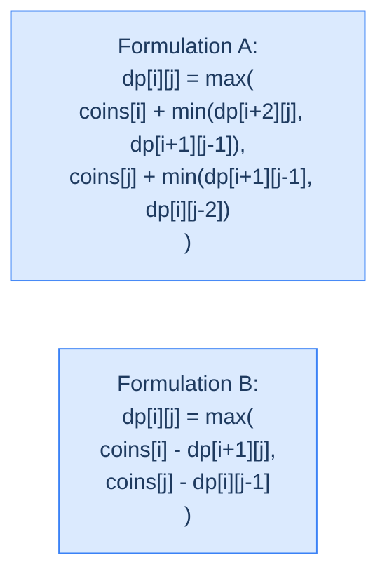

# 12. Optimal Game Strategy

A row of coins sits between you and an opponent. Each turn, the player to move picks a coin — but only from either *end* of the row. Whoever ends up with the higher total wins. Both of you play optimally — every move you make assumes the opponent will respond with their best counter. The question isn't "what's the maximum you could get if the opponent plays badly?" — it's "what's the maximum you can *guarantee*, no matter how cleverly the opponent plays?"

By the end of this lesson you'll know the **adversarial DP** template — `dp[i][j]` = the value the player-to-move can guarantee on slice `[i..j]`, using either a **min-of-opponent's-choices** formulation or a **subtractive** formulation. You'll see why this shape of recurrence — alternating max and min, or max with sign-flip — is the foundation of game-tree search, minimax algorithms, and turn-based strategy AI.

## Table of contents

1. [The Game and the Adversarial Twist](#the-game-and-the-adversarial-twist)
2. [Two Equivalent Recurrences](#two-equivalent-recurrences)
3. [Optimal Game Strategy — The Algorithm](#optimal-game-strategy--the-algorithm)
4. [Final Takeaway](#final-takeaway)

***

# The Game and the Adversarial Twist

You have an array `coins` of `n` (always even, in the canonical version) integers. Players alternate turns; on each turn the active player picks the leftmost or rightmost coin, removes it, and pockets its value. You move first, and both players play optimally.

```d2
direction: right
ex: "Example: coins = [10, 17, 5, 9]" {
  grid-rows: 1
  grid-columns: 4
  grid-gap: 0
  c0: "10" {style.fill: "#fde68a"; style.stroke: "#d97706"}
  c1: "17"
  c2: "5"
  c3: "9" {style.fill: "#fde68a"; style.stroke: "#d97706"}
}
```

<p align="center"><strong>Two endpoints in play. The current player picks one; the opponent then faces a row one shorter, with the opposite end now exposed. Optimal play means every move budgets for the opponent's best response.</strong></p>

> *Predict before reading on — for `coins = [10, 17, 5, 9]`, what's the answer?*

`26`. We pick 9 (right). Opponent's turn on `[10, 17, 5]` — they pick 10 (left, the larger end). We pick 17 (left of `[17, 5]`). Opponent picks 5. We total 9 + 17 = 26; opponent totals 10 + 5 = 15. Picking 10 first looks tempting (it's the bigger of the two starting ends), but it would expose the opponent to 17 — they'd grab it and we'd be stuck with the leftovers.

## Where this shows up

Two-player zero-sum game theory; minimax in chess/go engines (heavily pruned, but the DP shape is identical at each subgame); auction strategy; combinatorial-game theory (Nim-like impartial games); turn-based scheduling problems where each side makes adversarial moves on a shared resource.

## The Crucial Observation

The opponent isn't an obstacle to optimise over; they're *another optimiser*. Whatever move maximises *your* total in some metric, the opponent's response is the move that maximises *their* total — which, on a fixed-sum game like this, is the move that *minimises* your total. So the recurrence has to alternate sides at every level.

---

## Key Takeaway

Game DP is value-DP plus an adversary. Recurrences alternate max (your move) with the opponent's best counter (their max = your min).

***

# Two Equivalent Recurrences

Let `dp[i][j]` = the maximum value the player to move can guarantee on the subarray `coins[i..j]`. There are two clean ways to write the recurrence; both compute the same value.

## Formulation A — Min Over Opponent's Two Responses

You pick from end `i` or end `j`. After you pick:
- If you took `coins[i]`, the opponent faces `coins[i+1..j]`. They'll pick optimally — leaving you with `[i+2..j]` (if they took left) or `[i+1..j-1]` (if they took right). The opponent picks whichever is *worse* for you, so your future is `min(dp[i+2][j], dp[i+1][j-1])`.
- If you took `coins[j]`, by symmetry your future is `min(dp[i+1][j-1], dp[i][j-2])`.

Take the better of the two opening picks:
```
dp[i][j] = max(
    coins[i] + min(dp[i+2][j],   dp[i+1][j-1]),    — pick left, opponent picks adversarially
    coins[j] + min(dp[i+1][j-1], dp[i][j-2])       — pick right, opponent picks adversarially
)
```

## Formulation B — Subtract the Opponent's Take

A slicker form: define `dp[i][j]` = your *net* advantage on `[i..j]` (your total minus opponent's). Whatever you pick, the opponent's optimum on what's left is `dp[next subrange]` — but that value is *their* advantage, not yours. So you subtract:
```
dp[i][j] = max(
    coins[i] - dp[i+1][j],
    coins[j] - dp[i][j-1]
)
```

Recover your absolute total: `(sum(coins) + dp[0][n-1]) / 2`.



<p align="center"><strong>Two recurrences, same answer. A models the opponent's pick explicitly (one level of look-ahead). B encodes "your total − opponent's total" so the same DP applies recursively without the explicit min.</strong></p>

> *Pause. Why is the subtraction in Formulation B correct? Predict before reading on.*

Because `dp[next range]` represents the *opponent's* best advantage on what's left after your pick — and that's how much they'll out-pick you by. Your net advantage on the original range = (what you picked now) − (their net advantage on what's left). Subtraction encodes "future opponent's best is lost ground for you."

We'll implement Formulation A (the original CodeIntuition formulation) in the canonical solution because it directly returns your total in coins; B is mathematically slicker but needs a final post-process to recover the absolute total.

## Filling Order — Interval DP by Length

Both formulations read smaller intervals: `dp[i+2][j]`, `dp[i+1][j-1]`, `dp[i][j-2]` (Formulation A), or `dp[i+1][j]`, `dp[i][j-1]` (Formulation B). Same trick as LPS / palindrome-substring: fill by interval length, smallest first.

- Length 1: `dp[i][i] = coins[i]` — only one coin, you take it.
- Length 2: `dp[i][i+1] = max(coins[i], coins[i+1])` — you take the bigger end.
- Length 3+: use the recurrence.

---

## Key Takeaway

Adversarial DP needs to model the opponent's best response. Either explicit min over their choices, or sign-flipped recursion on net advantage — pick whichever you find clearer.

***

# Optimal Game Strategy — The Algorithm

## The Problem

Given an array `coins` (length `n`), return the maximum total you (the first player) can guarantee.

```
Input:  coins = [10, 17, 5, 9]
Output: 26                   You get 9 + 17 = 26; opponent gets 10 + 5 = 15

Input:  coins = [7, 5, 9, 12]
Output: 19                   You get 12 + 7 = 19; opponent gets 9 + 5 = 14

Input:  coins = [8, 5]
Output: 8                    You take the larger end
```

---

## Applying the Diagnostic Questions

| # | Question | Answer |
|---|---|---|
| **Q1** | Optimal substructure? | **Yes** — your guarantee on `[i..j]` decomposes into a pick + your guarantee on a strict sub-interval. |
| **Q2** | Overlapping subproblems? | **Yes** — `dp[i+1][j-1]` is reached from both endpoints of `[i..j]`. |
| **Q3** | 2D state, length-first fill? | **Yes** — interval DP. |
| **Q4** | Why min in the recurrence? | **Opponent's adversarial response.** Among their two choices, they pick whichever is worse for you. |

### Q1 — Why "Yes"?

**Mental model.** After your move, the game continues on a strictly smaller subarray. Whatever guarantee you had in mind requires that sub-game to be played optimally too. So your guarantee on `[i..j]` = (coin you took) + (your guarantee on what's left after the opponent's optimal reply).

**Concrete numbers.** For `[10, 17, 5, 9]`: pick 9. Opponent on `[10, 17, 5]` will pick 10 (the bigger end), leaving `[17, 5]` for us. Our guarantee on `[17, 5]` is `max(17, 5) = 17`. So picking 9 gives us 9 + 17 = 26.

**What breaks otherwise.** If we assumed the opponent plays *suboptimally* (e.g. always picks left), we'd overestimate our guarantee — the algorithm would return wrong answers when the opponent is actually clever.

### Q2 — Why "Yes"?

**Mental model.** The middle interval `[i+1..j-1]` is reached from `[i..j]` whether you start by picking left then opponent picks right, or you pick right then opponent picks left. Two paths converge on the same subinterval.

**Concrete numbers.** From `[10, 17, 5, 9]`: pick left (10), opponent picks right (9) → `[17, 5]`. Pick right (9), opponent picks left (10) → `[17, 5]`. Same subgame, two routes.

**What breaks otherwise.** Without memoization, every overlap recomputes from scratch — exponential.

### Q3 — Why length-first?

**Mental model.** `dp[i][j]` reads strictly smaller intervals. Filling by ascending length guarantees every dependency is already computed.

**Concrete numbers.** For `n = 4`: lengths 1, 2, 3, 4 get computed in that order — 4 + 3 + 2 + 1 = 10 cells, each O(1).

**What breaks otherwise.** Row-by-row would compute `dp[0][3]` before `dp[1][2]`, but the recurrence reads `dp[1][2]`. Dependency violation.

### Q4 — Why min?

**Mental model.** When the opponent picks, they pick the option that's *best for them*. On a zero-sum game, "best for them" = "worst for you". So among their choices, you take the worse value.

**Concrete numbers.** After you pick `coins[0] = 10` from `[10, 17, 5, 9]`, opponent faces `[17, 5, 9]`. They could leave you with `[5, 9]` (take 17) or `[17, 5]` (take 9). They'll take 17, leaving you `[5, 9]` — the *worse* of the two for you. `min(dp[2][3], dp[1][2]) = min(9, 17) = 9`. So picking 10 gives you 10 + 9 = 19.

**What breaks otherwise.** Using max here would simulate a *cooperative* opponent — they'd leave you the better option. Wrong model; wrong answer.

---

## The Solution

Bottom-up tabulation, length-first. We use Formulation A (explicit opponent min).


```pseudocode
# Two-player game: pick from either end. Both play optimally.
# dp[i][j] = max coins the to-move player can guarantee on coins[i..j].
# Opponent will play to MIN our next-turn payoff, hence the inner min().
function optimalGameStrategy(coins):
    n ← length(coins)
    dp ← n × n grid of zeros
    for i from 0 to n − 1:
        dp[i][i] ← coins[i]                     # length-1: take the only coin

    for length from 2 to n:
        for i from 0 to n − length:
            j ← i + length − 1

            # We pick coins[i]. Opponent then picks from [i+1..j], leaving us
            # with the worse of dp[i+2][j] (they took left) or dp[i+1][j−1] (they took right).
            leftInner  ← dp[i + 2][j]     if i + 2 ≤ j     else 0
            rightInner ← dp[i + 1][j − 1] if i + 1 ≤ j − 1 else 0
            pickLeft  ← coins[i] + min(leftInner, rightInner)

            # We pick coins[j]. Symmetric reasoning.
            leftInner2  ← dp[i + 1][j − 1] if i + 1 ≤ j − 1 else 0
            rightInner2 ← dp[i][j − 2]     if i ≤ j − 2     else 0
            pickRight ← coins[j] + min(leftInner2, rightInner2)

            dp[i][j] ← max(pickLeft, pickRight)
    return dp[0][n − 1]
```

```python run
from typing import List

class Solution:
    def optimal_game_strategy(self, coins: List[int]) -> int:
        n = len(coins)
        # dp[i][j] = max coins the to-move player can guarantee on coins[i..j].
        dp: List[List[int]] = [[0] * n for _ in range(n)]
        # Length 1: pick the only coin.
        for i in range(n):
            dp[i][i] = coins[i]
        # Lengths 2..n: build up from smaller intervals.
        for length in range(2, n + 1):
            for i in range(n - length + 1):
                j = i + length - 1
                # Pick left: opponent will leave us with the worse of dp[i+2][j] / dp[i+1][j-1].
                left_inner  = dp[i + 2][j] if i + 2 <= j else 0
                right_inner = dp[i + 1][j - 1] if i + 1 <= j - 1 else 0
                pick_left = coins[i] + min(left_inner, right_inner)
                # Pick right: opponent will leave us with the worse of dp[i+1][j-1] / dp[i][j-2].
                left_inner2  = dp[i + 1][j - 1] if i + 1 <= j - 1 else 0
                right_inner2 = dp[i][j - 2] if i <= j - 2 else 0
                pick_right = coins[j] + min(left_inner2, right_inner2)
                dp[i][j] = max(pick_left, pick_right)
        return dp[0][n - 1]


if __name__ == "__main__":
    sol = Solution()
    print(sol.optimal_game_strategy([10, 17, 5, 9]))    # 26
    print(sol.optimal_game_strategy([7, 5, 9, 12]))     # 19
    print(sol.optimal_game_strategy([8, 5]))            # 8
```

```java run
public class Solution {
    public int optimalGameStrategy(int[] coins) {
        int n = coins.length;
        int[][] dp = new int[n][n];
        for (int i = 0; i < n; i++) dp[i][i] = coins[i];
        for (int len = 2; len <= n; len++) {
            for (int i = 0; i <= n - len; i++) {
                int j = i + len - 1;
                int li1 = (i + 2 <= j)     ? dp[i + 2][j]     : 0;
                int ri1 = (i + 1 <= j - 1) ? dp[i + 1][j - 1] : 0;
                int li2 = (i + 1 <= j - 1) ? dp[i + 1][j - 1] : 0;
                int ri2 = (i <= j - 2)     ? dp[i][j - 2]     : 0;
                int pickLeft  = coins[i] + Math.min(li1, ri1);
                int pickRight = coins[j] + Math.min(li2, ri2);
                dp[i][j] = Math.max(pickLeft, pickRight);
            }
        }
        return dp[0][n - 1];
    }

    public static void main(String[] args) {
        System.out.println(new Solution().optimalGameStrategy(new int[]{10, 17, 5, 9}));   // 26
        System.out.println(new Solution().optimalGameStrategy(new int[]{7, 5, 9, 12}));    // 19
    }
}
```

```c run
#include <stdio.h>

int dp[1001][1001];

int max(int a, int b) { return a > b ? a : b; }
int min(int a, int b) { return a < b ? a : b; }

int optimal_game_strategy(const int *coins, int n) {
    for (int i = 0; i < n; i++) for (int j = 0; j < n; j++) dp[i][j] = 0;
    for (int i = 0; i < n; i++) dp[i][i] = coins[i];
    for (int len = 2; len <= n; len++) {
        for (int i = 0; i <= n - len; i++) {
            int j = i + len - 1;
            int li1 = (i + 2 <= j)     ? dp[i + 2][j]     : 0;
            int ri1 = (i + 1 <= j - 1) ? dp[i + 1][j - 1] : 0;
            int ri2 = (i <= j - 2)     ? dp[i][j - 2]     : 0;
            int pick_left  = coins[i] + min(li1, ri1);
            int pick_right = coins[j] + min(ri1, ri2);
            dp[i][j] = max(pick_left, pick_right);
        }
    }
    return dp[0][n - 1];
}

int main(void) {
    int c[] = {10, 17, 5, 9};
    printf("%d\n", optimal_game_strategy(c, 4));   /* 26 */
    return 0;
}
```

```scala run
class Solution {
  def optimalGameStrategy(coins: Array[Int]): Int = {
    val n = coins.length
    val dp = Array.fill(n, n)(0)
    for (i <- 0 until n) dp(i)(i) = coins(i)
    for (len <- 2 to n) {
      for (i <- 0 to n - len) {
        val j = i + len - 1
        val li1 = if (i + 2 <= j)     dp(i + 2)(j)     else 0
        val ri1 = if (i + 1 <= j - 1) dp(i + 1)(j - 1) else 0
        val ri2 = if (i <= j - 2)     dp(i)(j - 2)     else 0
        val pickLeft  = coins(i) + math.min(li1, ri1)
        val pickRight = coins(j) + math.min(ri1, ri2)
        dp(i)(j) = math.max(pickLeft, pickRight)
      }
    }
    dp(0)(n - 1)
  }
}

object Main extends App {
  println(new Solution().optimalGameStrategy(Array(10, 17, 5, 9)))  // 26
}
```


<details>
<summary><strong>Trace — coins = [10, 17, 5, 9]</strong></summary>

```
Length 1:
  dp[0][0] = 10, dp[1][1] = 17, dp[2][2] = 5, dp[3][3] = 9

Length 2:
  dp[0][1] = max(coins[0] + 0, coins[1] + 0) = max(10, 17) = 17
  dp[1][2] = max(17 + 0, 5 + 0)               = 17
  dp[2][3] = max(5 + 0, 9 + 0)                = 9

Length 3:
  dp[0][2]: i=0, j=2.  Pick 10 → opponent on [17,5] picks 17, leaving us [5] → 10 + 5 = 15.
                       Pick 5  → opponent on [10,17] picks 17, leaving us [10] → 5 + 10 = 15.
            dp[0][2] = 15.
  dp[1][3]: i=1, j=3.  Pick 17 → opponent on [5,9] picks 9, leaving us [5] → 17 + 5 = 22.
                       Pick 9  → opponent on [17,5] picks 17, leaving us [5] → 9 + 5 = 14.
            dp[1][3] = 22.

Length 4:
  dp[0][3]: i=0, j=3.
    Pick 10 → opponent on [17,5,9].  After our pick, opponent will see dp[2][3]=9 (pick left)
              vs dp[1][2]=17 (pick right).  Opponent maximises → leaves us with min(9, 17) = 9.
              Total = 10 + 9 = 19.
    Pick 9  → opponent on [10,17,5].  After our pick, dp[1][2]=17 vs dp[0][1]=17.
              min = 17.  Total = 9 + 17 = 26. ✓
    dp[0][3] = max(19, 26) = 26.
```

</details>

---

## Complexity Analysis

| Aspect | Cost | Why |
|---|---|---|
| Time | `O(n²)` | One cell per `(i, j)` with `i ≤ j`; constant work each. |
| Space | `O(n²)` | DP table. Reducible by space-optimisation of interval DP — possible but messy. |

---

## Edge Cases

| Case | Example | Expected | Reasoning |
|---|---|---|---|
| Single coin | `[7]` | `7` | Length-1 base case. |
| Two coins | `[8, 5]` | `8` | Pick the larger. |
| All equal | `[3, 3, 3, 3]` | `6` | Each player gets 2 coins. |
| Sorted ascending | `[1, 2, 3, 4]` | `6` | First player gets 4 + 2 = 6, second gets 3 + 1. |
| Sorted descending | `[4, 3, 2, 1]` | `6` | Symmetric to above. |
| Adversarial pattern | `[10, 17, 5, 9]` | `26` | The 17 is "shielded" — neither end can grab it directly first. |

***

# Final Takeaway

Adversarial DP differs from value DP in one critical way: the recurrence alternates max with min (or, equivalently, max with sign-flipped recursion on net advantage). Every move you consider must include the *opponent's* best counter-move — that's what min captures.

Optimal strategy is interval DP at heart — fill the `(i, j)` table by length, smallest first. The recurrence has four candidate sub-states per cell because you and the opponent each have two end-choices. Same shape recurs in board-game minimax, two-player Nim variants, and any sequential-decision problem with adversarial structure. **You didn't just solve a coin game. You learned that turn-based optimisation with an opponent is a *sign-flip* away from regular optimisation — write the recurrence as if the opponent's optimum subtracts from yours, and the rest is mechanical.**

> *Transfer challenge for the next lesson:* Drop the adversary. Now the question is *purely combinatorial*: given a boolean expression like `T and F or T xor F`, count the number of ways to parenthesise it so the result is `True`. The state will still be 2D `(i, j)` over operand ranges. Predict what's *new* in this recurrence compared to optimal strategy.

<details>
<summary><strong>Answer</strong></summary>

The decision dimension shifts from "left vs right end" to "split point inside the range" — for each operator position `k`, recurse on `[i..k-1]` and `[k+1..j]`. The aggregator is *sum* (count combinations across all split points) instead of max, and you carry both `T[i][j]` and `F[i][j]` because combining sub-results depends on whether each side is true or false. The next lesson formalises this as **Boolean Parenthesisation**.

</details>
