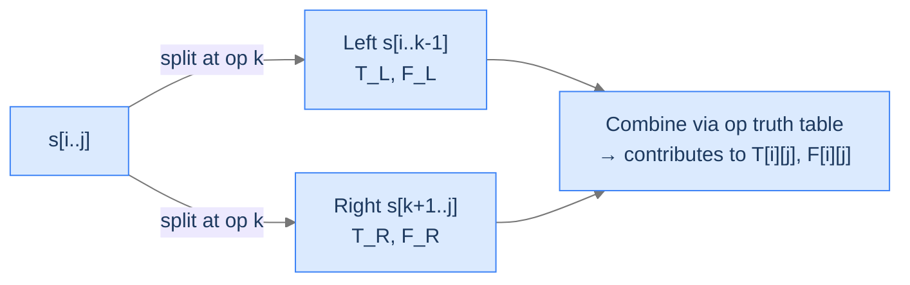

# 13. Boolean Parenthesisation

A boolean expression like `T ^ F & T` looks unambiguous until you ask "what's its value?" Without parentheses, the answer depends entirely on which operator binds first — `(T ^ F) & T = T & T = T`, but `T ^ (F & T) = T ^ F = T`. Both ways give `T`, so the count is 2. Switch to `T & F | T` and the parenthesisations diverge: `(T & F) | T = T`, `T & (F | T) = T` — again 2. But for some inputs, the two evaluations *disagree*, and the question becomes: how many parenthesisations make the expression evaluate to `True`? This is the kind of problem compilers and theorem provers stumble across when reasoning about ambiguous grammars or counting satisfying assignments — and it has a clean DP shape that recurs whenever a sequence has *internal* split points instead of just two endpoints.

By the end of this lesson you'll know the **boolean parenthesisation** recurrence — `(i, j)` over operand ranges, split point `k` inside the range, *two* DP tables (one for True-counts, one for False-counts) because combining results depends on what each side evaluates to. You'll also recognise this as a *split-point* interval DP — a structural cousin of matrix-chain multiplication and a common interview shape.

## Table of contents

1. [The Boolean Parenthesisation Problem](#the-boolean-parenthesisation-problem)
2. [Why Two Tables, T and F](#why-two-tables-t-and-f)
3. [The Three-Operator Truth Tables](#the-three-operator-truth-tables)
4. [Boolean Parenthesisation — The Algorithm](#boolean-parenthesisation--the-algorithm)
5. [Final Takeaway](#final-takeaway)

***

# The Boolean Parenthesisation Problem

You're given a string `s` of alternating *operands* (`T` for True, `F` for False) and *binary operators* (`&` for AND, `|` for OR, `^` for XOR). Find the number of distinct parenthesisations that evaluate the expression to `True`.

```d2
direction: right
ex: "Example: s = 'T ^ F & T' (length 5; operands at 0, 2, 4; operators at 1, 3)" {
  grid-rows: 2
  grid-columns: 5
  grid-gap: 0
  c0: "T" {style.fill: "#fde68a"; style.stroke: "#d97706"}
  c1: "^"
  c2: "F" {style.fill: "#fde68a"; style.stroke: "#d97706"}
  c3: "&"
  c4: "T" {style.fill: "#fde68a"; style.stroke: "#d97706"}
  l0: "[0]"
  l1: "[1]"
  l2: "[2]"
  l3: "[3]"
  l4: "[4]"
}
```

<p align="center"><strong>Operands sit at even indices, operators at odd indices. Highlighted cells are operands; gaps are operators. Two valid parenthesisations of <code>T ^ F &amp; T</code> evaluate to <code>True</code>: <code>(T ^ F) &amp; T</code> and <code>T ^ (F &amp; T)</code>.</strong></p>

> *Predict before reading on — for `s = "T | F"`, what's the count?*

`1`. There's only one operator and therefore only one way to parenthesise: `(T | F) = T`. The count of "ways" is the number of distinct binary trees you can build over the operands; for `n` operands, that's the `n - 1`th Catalan number — but only some of those trees evaluate to True.

## Where this shows up

Compiler theory (counting parses of an ambiguous grammar), satisfiability counting (#SAT), expression-evaluation testing (verifying an expression's behaviour under every legal grouping), and any problem where an internal *split* of a sequence into a left side and a right side combines through a binary operator with non-commutative aggregation.

## The Crucial Observation

You can't just track "how many parenthesisations exist" — you need to know how many evaluate True *and* how many evaluate False *for every subrange*, because the operator that combines two subranges cares about both. AND, OR, and XOR each combine sub-results differently. This forces a **two-table DP** — one counting True parenthesisations, one counting False — joined by the operator's truth table.

---

## Key Takeaway

Boolean parenthesisation counts True-evaluating parse trees over a string of operands and operators. The state is interval `(i, j)` over operand positions; the choice is a split-point operator `k` *inside* the range.

***

# Why Two Tables, T and F

Define `T[i][j]` = number of ways to parenthesise `s[i..j]` so it evaluates to True. By symmetry, `F[i][j]` = number of ways to evaluate to False. Both are over the same operand range; they sum to the total number of parenthesisations (the Catalan count for that operand-count).

For each operator position `k` strictly between `i` and `j` (i.e. `s[k]` is an operator with operands on both sides), split into:
- Left side: `s[i..k-1]` (its `T` count and its `F` count both matter).
- Right side: `s[k+1..j]` (same).

Combine via the operator's truth table:

```
op = '&':  T += T_L · T_R
           F += T_L · F_R + F_L · T_R + F_L · F_R

op = '|':  T += T_L · T_R + T_L · F_R + F_L · T_R
           F += F_L · F_R

op = '^':  T += T_L · F_R + F_L · T_R
           F += T_L · T_R + F_L · F_R
```



<p align="center"><strong>For each operator <code>k</code> inside the range, multiply the True/False counts of the two sides per the operator's truth table. Sum across all <code>k</code>.</strong></p>

> *Pause. Why must we carry both T and F counts? Why isn't a single table enough?*

Imagine we only carried `T[i][j]`. Then to compute `T[i][j]` for `op = '|'`, we'd need to count splits where at least one side is True. But "side is True" is `T_L`; "side is False" is `F_L`. We can't compute "at least one side True" from just `T_L` and `T_R` — the cross-terms `T_L · F_R + F_L · T_R` need `F_L` and `F_R` too. The only way to get them without recomputing is to carry both tables.

> *Pause. Why multiplication, not addition, when combining sides?*

For each parenthesisation of the left side and *each* parenthesisation of the right side, you get one parenthesisation of the whole. The total is the Cartesian product, which counts as a multiplication. Different split points contribute *different* whole-expression trees, so we sum across `k` — addition between `k`'s, multiplication between sides.

---

## Key Takeaway

Two tables (`T` and `F`) are mandatory because operator combinations care about both sides' values. Multiplication combines sides; summation combines split points; the operator's truth table picks the cells.

***

# The Three-Operator Truth Tables

Each binary operator's truth table tells us, for each of the four `(L, R)` cases, whether the result is True or False:

| L | R | & | \| | ^ |
|---|---|---|---|---|
| T | T | T | T | F |
| T | F | F | T | T |
| F | T | F | T | T |
| F | F | F | F | F |

Each combination gets weighted by `(count of left) × (count of right)`. So:

- **`&` is True** in only one case (T·T) → `T += T_L · T_R`. False in the other three.
- **`|` is False** in only one case (F·F) → `F += F_L · F_R`. True in the other three.
- **`^` is True** in two cases (T·F, F·T) → `T += T_L · F_R + F_L · T_R`. False in the other two.

This is the entire arithmetic. Memorise the truth tables, and the recurrence collapses to bookkeeping.

> *Predict before reading on — for `s = "T & T & T"` (all True, all AND), how many parenthesisations evaluate to True?*

`2`. The two parsings are `(T & T) & T` and `T & (T & T)`. Both evaluate to True (AND of all True is True). The count of True-parenthesisations is the same as the count of *all* parenthesisations (the second Catalan number), because every parsing yields True for this input.

## Filling Order

Same as every interval DP: fill by interval *length*, smallest first. The interval is over operand positions only — operators sit at fixed odd indices and aren't separately stored. So:
- Length 1 (single operand): `T[i][i] = 1` if `s[i] == 'T'`, else `0`. `F[i][i] = 1` if `s[i] == 'F'`, else `0`.
- Length 3, 5, 7, ... (odd lengths only — must include an even number of operators between operands): use the recurrence with `k` stepping by 2 from `i` to `j - 1`.

(Even lengths are skipped because operands sit at even indices and ranges always start and end on operands.)

---

## Key Takeaway

Three operators, three truth tables. The DP just sums products across split points, weighted by the operator's truth table at each split.

***

# Boolean Parenthesisation — The Algorithm

## The Problem

Given a boolean expression string `s` (alternating operands and operators), return the number of parenthesisations that evaluate to True.

```
Input:  s = "T^F&T"
Output: 2                    (T ^ F) & T  and  T ^ (F & T)

Input:  s = "T^F|F"
Output: 2                    (T ^ F) | F  and  T ^ (F | F)

Input:  s = "T|F"
Output: 1                    Only one parenthesisation; evaluates True
```

---

<details>
<summary><h2>Applying the Diagnostic Questions</h2></summary>


| # | Question | Answer |
|---|---|---|
| **Q1** | Optimal substructure? | **Yes** — every parenthesisation has a *root* operator splitting the expression into independent left/right subtrees. |
| **Q2** | Overlapping subproblems? | **Yes** — the same `(i, k-1)` range appears as the "left side" for many different `j`. |
| **Q3** | 2D state? | **Yes** — `(i, j)`, with two parallel tables (`T` and `F`). |
| **Q4** | Aggregator? | **Sum** of products. Different `k`s contribute different trees; sides combine multiplicatively per operator. |

### Q1 — Why "Yes"?

**Mental model.** Every parenthesisation corresponds to a binary parse tree. The tree has a root operator; that operator splits the operands into a left subtree and a right subtree. Each subtree is itself a parenthesisation of its operand range. So the count for `(i, j)` decomposes by the choice of root.

**Concrete numbers.** For `T ^ F & T`: root could be `^` (split as `T | F & T`) or `&` (split as `T ^ F | T`). Two roots → two contributions to the count.

**What breaks otherwise.** If we couldn't decompose by root, we'd be back to enumerating all `n - 1`th Catalan trees explicitly — that's exponential.

### Q2 — Why "Yes"?

**Mental model.** A subrange `(p, q)` appears as the "left side" for every choice of `k > q` and as the "right side" for every choice of `k < p`. For long expressions, each subrange is queried many times.

**Concrete numbers.** For `n = 7` operands, `(0, 1)` (a 2-operand range) is the left side for `k = 3, 5` and stands alone in the recurrence at multiple levels. Without memoization, the recursion is `Catalan(n)`-many tree builds.

**What breaks otherwise.** Without the table, `O(Catalan(n))` is roughly `O(4^n / n^{1.5})` — explosively bad past `n ≈ 20`.

### Q3 — Why two tables?

Already established — the operator's truth table needs both T and F counts on both sides. One table can't recover the other (unless you also store the total Catalan count, which is fragile and adds no expressiveness).

### Q4 — Why sum-of-products?

For each split-point `k`, the number of left-tree × right-tree combinations is `(count of left trees) × (count of right trees)` — multiplication, because every pairing forms one whole tree. Different `k`s yield disjoint sets of whole trees, so we sum across `k`.

</details>
<details>
<summary><h2>The Solution</h2></summary>


Bottom-up tabulation; two parallel tables. We treat operands as living at even string indices and operators at odd indices; the inner loop steps by 2.


```python run
from typing import List

class Solution:
    def boolean_parenthesisation(self, s: str) -> int:
        n = len(s)
        # T[i][j] = ways to parenthesise s[i..j] to evaluate True.
        # F[i][j] = ways to parenthesise s[i..j] to evaluate False.
        T: List[List[int]] = [[0] * n for _ in range(n)]
        F: List[List[int]] = [[0] * n for _ in range(n)]
        # Base case: single-operand ranges.
        for i in range(0, n, 2):
            T[i][i] = 1 if s[i] == 'T' else 0
            F[i][i] = 1 if s[i] == 'F' else 0
        # Iterate by interval length over operand positions; only odd lengths matter.
        for length in range(3, n + 1, 2):
            for i in range(0, n - length + 1, 2):
                j = i + length - 1
                # k steps over operator positions only (every other index).
                for k in range(i, j, 2):
                    op = s[k + 1]
                    tl, fl = T[i][k],     F[i][k]
                    tr, fr = T[k + 2][j], F[k + 2][j]
                    if op == '&':
                        T[i][j] += tl * tr
                        F[i][j] += tl * fr + fl * tr + fl * fr
                    elif op == '|':
                        T[i][j] += tl * tr + tl * fr + fl * tr
                        F[i][j] += fl * fr
                    else:  # '^'
                        T[i][j] += tl * fr + fl * tr
                        F[i][j] += tl * tr + fl * fr
        return T[0][n - 1]


if __name__ == "__main__":
    sol = Solution()
    print(sol.boolean_parenthesisation("T^F&T"))    # 2
    print(sol.boolean_parenthesisation("T^F|F"))    # 2
    print(sol.boolean_parenthesisation("T|F"))      # 1
```

```java run
public class Main {
    static class Solution {
        public int booleanParenthesisation(String s) {
            int n = s.length();
            int[][] T = new int[n][n];
            int[][] F = new int[n][n];
            for (int i = 0; i < n; i += 2) {
                T[i][i] = (s.charAt(i) == 'T') ? 1 : 0;
                F[i][i] = (s.charAt(i) == 'F') ? 1 : 0;
            }
            for (int len = 3; len <= n; len += 2) {
                for (int i = 0; i <= n - len; i += 2) {
                    int j = i + len - 1;
                    for (int k = i; k < j; k += 2) {
                        char op = s.charAt(k + 1);
                        int tl = T[i][k],     fl = F[i][k];
                        int tr = T[k + 2][j], fr = F[k + 2][j];
                        if (op == '&') {
                            T[i][j] += tl * tr;
                            F[i][j] += tl * fr + fl * tr + fl * fr;
                        } else if (op == '|') {
                            T[i][j] += tl * tr + tl * fr + fl * tr;
                            F[i][j] += fl * fr;
                        } else {
                            T[i][j] += tl * fr + fl * tr;
                            F[i][j] += tl * tr + fl * fr;
                        }
                    }
                }
            }
            return T[0][n - 1];
        }
    }

    public static void main(String[] args) {
        Solution sol = new Solution();
        System.out.println(sol.booleanParenthesisation("T^F&T"));   // 2
        System.out.println(sol.booleanParenthesisation("T^F|F"));   // 2
        System.out.println(sol.booleanParenthesisation("T|F"));     // 1
    }
}
```

</details>
<details>
<summary><strong>Trace — s = "T^F&T"</strong></summary>

```
n = 5.  Operand positions 0, 2, 4.  Operator positions 1 (^), 3 (&).

Length 1:
  T[0][0] = 1, F[0][0] = 0   (s[0]='T')
  T[2][2] = 0, F[2][2] = 1   (s[2]='F')
  T[4][4] = 1, F[4][4] = 0   (s[4]='T')

Length 3:
  (i=0, j=2): op = s[1] = '^'
    tl,fl = 1,0;  tr,fr = 0,1
    T[0][2] += tl·fr + fl·tr = 1·1 + 0·0 = 1
    F[0][2] += tl·tr + fl·fr = 1·0 + 0·1 = 0

  (i=2, j=4): op = s[3] = '&'
    tl,fl = 0,1;  tr,fr = 1,0
    T[2][4] += tl·tr = 0·1 = 0
    F[2][4] += tl·fr + fl·tr + fl·fr = 0·0 + 1·1 + 1·0 = 1

Length 5:
  (i=0, j=4): two split points
    k=0: op='^', left = (0,0), right = (2,4)
      tl,fl = 1,0;  tr,fr = 0,1
      T[0][4] += tl·fr + fl·tr = 1·1 + 0·0 = 1
      F[0][4] += tl·tr + fl·fr = 1·0 + 0·1 = 0

    k=2: op='&', left = (0,2), right = (4,4)
      tl,fl = 1,0;  tr,fr = 1,0
      T[0][4] += tl·tr = 1·1 = 1   → running total T[0][4] = 2
      F[0][4] += tl·fr + fl·tr + fl·fr = 1·0 + 0·1 + 0·0 = 0

Final: T[0][4] = 2.  ✓
```

</details>
<details>
<summary><h2>Solution &amp; Analysis</h2></summary>

### Complexity Analysis

| Aspect | Cost | Why |
|---|---|---|
| Time | `O(n³)` | Three nested loops: length, start, split point. Each iteration is `O(1)` arithmetic. |
| Space | `O(n²)` | Two `n × n` tables. |

For very long expressions, modular arithmetic is often required (counts grow as Catalan numbers — exponential). The standard variant on competitive-programming sites returns the answer modulo `1003` or `10^9 + 7`.

### Edge Cases

| Case | Example | Expected | Reasoning |
|---|---|---|---|
| Single operand | `"T"` | `1` | Length 1; one trivial parsing, evaluates True. |
| Single operand False | `"F"` | `0` | Trivial parsing evaluates False; no True parses. |
| All Trues with AND | `"T&T&T&T"` | `5` | All parsings evaluate True; count = Catalan(3) = 5. |
| All Falses with OR | `"F\|F\|F\|F"` | `0` | All evaluate False; no True parses. |
| Mixed XOR | `"T^F^T"` | `0` | Two parsings: `(T^F)^T = T^T = F` and `T^(F^T) = T^T = F`. Both evaluate False, so `T[0][n-1] = 0`. |

</details>
<details>
<summary><h2>Final Takeaway</h2></summary>


Boolean parenthesisation is the classic **split-point interval DP**. Unlike interval DPs that pick a left or right endpoint (palindrome-substring, optimal strategy), this one picks a *split inside* the range — that's the same shape used by matrix-chain multiplication, optimal BST construction, and any "combine adjacent ranges" problem.

The new structural lesson: when the combination operator's outcome depends on each side's value (T or F), you need parallel tables — one per outcome category. Multiplication combines sides; summation combines splits; the operator's truth table controls which products go into which table. **You didn't just count parenthesisations. You learned the split-point interval template — pick a `k` inside the range, recurse on both halves, combine via problem-specific multiplication. The next 10+ problems you'll encounter in this family are variations on the same shape.**

> *Transfer challenge for the next lesson:* Replace boolean operands and operators with *matrix* operands and matrix multiplication. Now the question is: in what order should you multiply a chain of matrices to minimise the total scalar-multiplication cost? Predict the recurrence shape — note that matrix multiplication is associative but not commutative, and the cost depends on the dimensions of the matrices being combined.

</details>
<details>
<summary><strong>Answer</strong></summary>

`dp[i][j]` = minimum scalar multiplications to compute the matrix product `A_i · A_{i+1} · ... · A_j`. For each split `k`, `dp[i][j] = min(dp[i][k] + dp[k+1][j] + cost(i, k, j))`, where `cost(i, k, j) = dims[i-1] · dims[k] · dims[j]` — the cost of multiplying the two sub-products. Same `(i, j)` interval shape, same split-point structure as boolean parenthesisation, but the aggregator is min instead of sum, and the per-split cost is non-trivial. The next lesson formalises this as **Matrix Chain Multiplication**.

</details>
