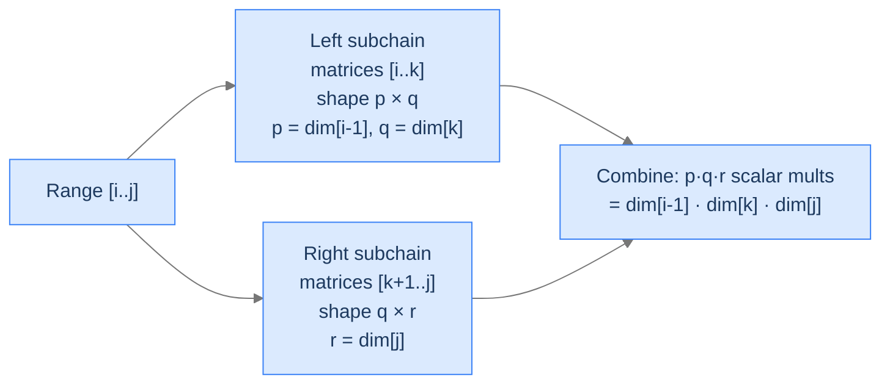
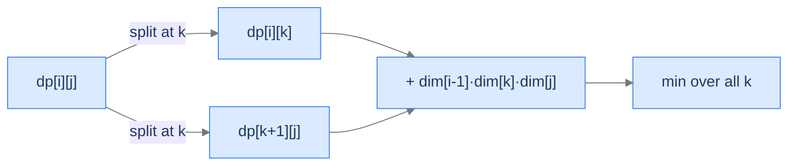

# 14. Matrix Chain Multiplication

You have to multiply four matrices: `A · B · C · D`, where `A` is 10×30, `B` is 30×5, `C` is 5×60, and `D` is 60×8. Matrix multiplication is *associative* — every parenthesisation gives the same final matrix — but the cost varies wildly. Multiplying as `((A·B)·C)·D` costs `10·30·5 + 10·5·60 + 10·60·8 = 1500 + 3000 + 4800 = 9300` scalar multiplications. Multiplying as `A·((B·C)·D)` costs `30·5·60 + 30·60·8 + 10·30·8 = 9000 + 14400 + 2400 = 25800`. Same answer, almost three times the work. For chains of 10+ matrices the gap can be 100× or worse — and it's why every numerical-linear-algebra library cares about parenthesisation order.

By the end of this lesson you'll know the **matrix chain multiplication** recurrence — a 2D interval DP keyed on `(i, j)` matrix indices, with a split point `k` between them, and a per-split cost based on the dimensions on either side. You'll see it as a clean cousin of boolean parenthesisation: same shape, different aggregator (min instead of sum), different per-split cost (dimension product instead of truth table).

## Table of contents

1. [The Matrix-Chain Problem](#the-matrix-chain-problem)
2. [Why Order Matters — The Cost Model](#why-order-matters--the-cost-model)
3. [The Recurrence — Split-Point Interval DP](#the-recurrence--split-point-interval-dp)
4. [Matrix Chain Multiplication — The Algorithm](#matrix-chain-multiplication--the-algorithm)
5. [Final Takeaway](#final-takeaway)

***

# The Matrix-Chain Problem

You're given a chain of matrices to multiply. The dimensions are encoded as a single array `dimensions` of length `n + 1`, where matrix `i` (1-indexed) has shape `dimensions[i-1] × dimensions[i]`. Find the minimum number of scalar multiplications needed to compute the entire product.

```d2
direction: right
ex: "Example: dimensions = [4, 5, 3, 2]" {
  grid-rows: 2
  grid-columns: 3
  grid-gap: 0
  m1: "A<br/>4 × 5"
  m2: "B<br/>5 × 3"
  m3: "C<br/>3 × 2"
  s1: "(B·C) first<br/>5·3·2 = 30"
  s2: "A · (BC)<br/>4·5·2 = 40"
  s3: "Total: 70"  {style.fill: "#fde68a"; style.stroke: "#d97706"}
}
```

<p align="center"><strong>Three matrices A(4×5), B(5×3), C(3×2). Multiplying as <code>A · (B · C)</code> costs 30 + 40 = 70 scalar multiplications. The alternative <code>(A · B) · C</code> costs <code>4·5·3 + 4·3·2 = 60 + 24 = 84</code> — 14 more. Highlighted total is the optimum.</strong></p>

The brute force enumerates every parenthesisation — there are `Catalan(n - 1)` of them, growing exponentially. DP brings it to `O(n³)`.

> *Predict before reading on — for `dimensions = [10, 30, 5, 60]`, which order wins? `(A·B)·C` or `A·(B·C)`?*

`(A·B)·C` wins, with cost `10·30·5 + 10·5·60 = 1500 + 3000 = 4500`. The alternative is `30·5·60 + 10·30·60 = 9000 + 18000 = 27000` — six times more. The asymmetry comes from the middle dimension `30` — multiplying `B·C` first keeps a 30-row matrix around for the second multiply, whereas multiplying `A·B` first reduces to a 5-row matrix that's much cheaper to feed into `C`.

## Where this shows up

Numerical computing (every linear-algebra library — BLAS, LAPACK, NumPy — internally orders chains of matrix products), tensor-contraction sequencing in deep learning, query optimisation in databases (joins are associative; the planner picks an order), and any problem where an associative but non-commutative operator's cost depends on the operands' "shapes."

---

## Key Takeaway

Matrix multiplication is associative; cost isn't. The order of parenthesisation can swing total work by 10× or more. Brute force is Catalan; DP is `O(n³)`.

***

# Why Order Matters — The Cost Model

A matrix multiplication `A (p × q) × B (q × r)` produces a `p × r` matrix and costs `p · q · r` scalar multiplications. The shared dimension `q` cancels in the result, but it shows up in the cost — so a chain like `A · B · C` has costs that depend on which two get combined first.

When we multiply two sub-products `A_i · ... · A_k` (a `p × q` matrix) and `A_{k+1} · ... · A_j` (a `q × r` matrix), the *combination* costs `p · q · r`. The dimensions are determined by the original dimension array:
- `p = dimensions[i - 1]`
- `q = dimensions[k]`  (this is the column count of the left side and the row count of the right side)
- `r = dimensions[j]`

So the per-combination cost for split `k` in range `[i, j]` is `dimensions[i - 1] · dimensions[k] · dimensions[j]`.



<p align="center"><strong>For each split <code>k</code> inside <code>[i..j]</code>, the left subchain's result is a <code>dim[i-1] × dim[k]</code> matrix and the right is <code>dim[k] × dim[j]</code>. Combining them costs the product of those three dimensions.</strong></p>

> *Pause. Why isn't there a `q²` term, given that we sum over `q` rows of inner products?*

There is, *implicitly*. Each output cell of the `p × r` result is an inner product of length `q`, requiring `q` scalar multiplications. The total is `p · r` cells × `q` mults each = `p · q · r`. The `q` shows up linearly because we count *individual* scalar multiplications, not vector dot-products. (Real BLAS implementations also exploit cache layouts, vectorisation, etc., but the abstract count remains `p · q · r`.)

---

## Key Takeaway

The cost of combining two sub-products is the product of three numbers from the dimensions array — `dim[i-1]`, `dim[k]`, `dim[j]`. That product is what changes from split to split.

***

# The Recurrence — Split-Point Interval DP

Define `dp[i][j]` = minimum scalar multiplications to compute the product `A_i · A_{i+1} · ... · A_j`. Two cases:

**Length 1 (`i == j`).** A single matrix has no multiplication. `dp[i][i] = 0`.

**Length ≥ 2.** Pick a split point `k` between `i` and `j - 1`. The left side is `A_i · ... · A_k`; the right is `A_{k+1} · ... · A_j`. Both subchains are recursively-optimised, then combined with `dimensions[i-1] · dimensions[k] · dimensions[j]` cost:
```
dp[i][j] = min over k ∈ [i, j-1] of (
    dp[i][k] + dp[k+1][j] + dimensions[i-1] · dimensions[k] · dimensions[j]
)
```

This is the *split-point* interval DP — same shape as boolean parenthesisation, but with min as the aggregator and a non-trivial per-split cost.



<p align="center"><strong>Same split-point template as boolean parenthesisation. Min over splits replaces sum-of-products; the per-split cost is a single dimension-product instead of an operator's truth table.</strong></p>

## Filling Order — Length First

`dp[i][j]` reads from `dp[i][k]` and `dp[k+1][j]`, both with strictly smaller intervals than `(i, j)`. So fill by interval length, smallest first — same trick as every interval DP.

> *Predict before reading on — what does `dp[1][1]` represent for `dimensions = [4, 5, 3, 2]`?*

The cost of multiplying just matrix `A_1` (which is the single matrix `A` of shape 4×5). There's no multiplication needed for a single matrix, so `dp[1][1] = 0`. Same for `dp[2][2]` and `dp[3][3]`.

---

## Key Takeaway

`dp[i][j]` minimises over split points; per-split cost is `dim[i-1] · dim[k] · dim[j]`. Length-first filling order, same as every interval DP.

***

# Matrix Chain Multiplication — The Algorithm

## The Problem

Given `dimensions` (length `n + 1`, encoding `n` matrices), return the minimum scalar multiplications.

```
Input:  dimensions = [4, 5, 3, 2]
Output: 70                       Order: A · (B · C)

Input:  dimensions = [10, 30, 5, 60]
Output: 4500                     Order: (A · B) · C

Input:  dimensions = [10, 30, 40]
Output: 12000                    Only one order possible: A · B
```

---

<details>
<summary><h2>Applying the Diagnostic Questions</h2></summary>


| # | Question | Answer |
|---|---|---|
| **Q1** | Optimal substructure? | **Yes** — the cheapest parenthesisation has a *root* split, and each side is independently the cheapest for its subchain. |
| **Q2** | Overlapping subproblems? | **Yes** — `dp[i][k]` is queried by every `j > k` whose split lands at `k`. |
| **Q3** | 2D state? | **Yes** — `(i, j)` with length-first fill. |
| **Q4** | Aggregator? | **Min** of split costs. (Boolean parenthesisation summed; this minimises.) |

### Q1 — Why "Yes"?

**Mental model.** Every parenthesisation is a binary tree over the matrix chain. The tree has a *root* — the last multiplication done — and that root partitions the chain into two contiguous subchains. The optimum cost = (cost of multiplying the two final sub-products) + (optimum cost of each subchain). If either subchain weren't computed optimally, we could swap in its real optimum and lower the total.

**Concrete numbers.** For `dimensions = [4, 5, 3, 2]`, the optimum's last multiplication is `A · (BC)`. The right side `BC` had cost 30 — and 30 *is* the optimum cost for the chain `[B, C]` (only one possible order anyway). The "+ 40" combines those into the final matrix.

**What breaks otherwise.** Suppose the inner subchain weren't optimal — e.g. you used some weirdly slow order for `BC`. The total would be more than 70. But by the recurrence, swapping in the actual cheapest order for `BC` lowers the total — meaning your claimed minimum wasn't actually a minimum.

### Q2 — Why "Yes"?

**Mental model.** Each subchain `[i, k]` can be the "left side" for multiple parents — every `j > k`. Recurse without memoization and you compute the same subchain optimum hundreds or millions of times.

**Concrete numbers.** For `n = 5`: the subchain `[1, 2]` is the left side for `j = 3, 4, 5` and is reached by various paths from each. With memoization, computed once; without, recomputed exponentially.

**What breaks otherwise.** Brute force is `O(Catalan(n - 1))` — roughly `O(4^n / n^{1.5})`.

### Q3 — Why 2D?

We need to remember *which* subchain we're solving — its left endpoint `i` and right endpoint `j`. Two indices, 2D table.

### Q4 — Why min?

The problem says "minimum cost." Each split point gives a candidate cost; the optimum is the smallest across splits. (If we summed instead, we'd be counting parenthesisations — that's boolean parenthesisation, not matrix chain.)

</details>
<details>
<summary><h2>The Solution</h2></summary>


Bottom-up tabulation, length-first. The dimensions array is 1-indexed in spirit (matrix `i` has shape `dimensions[i-1] × dimensions[i]`); we keep that convention so the recurrence reads cleanly.


```python run viz=graph viz-root=dp
from typing import List
import sys

class Solution:
    def matrix_chain_multiplication(self, dimensions: List[int]) -> int:
        n: int = len(dimensions) - 1

        # Create a 2D list dp to store the minimum costs of multiplying
        # matrices
        dp: List[List[int]] = [[0] * (n + 1) for _ in range(n + 1)]

        # Loop over the chain length l (number of matrices in the chain)
        for l in range(2, n + 1):

            # Loop over the starting index i of the chain
            for i in range(1, n - l + 2):

                # Calculate the ending index j of the chain
                j: int = i + l - 1

                # Set the initial value of dp[i][j] to infinity
                dp[i][j] = sys.maxsize

                # Loop over the possible partition positions k within the
                # chain
                for k in range(i, j):

                    # Calculate the cost of multiplying matrices from i
                    # to k and from k+1 to j, as well as the cost of
                    # multiplying the resulting matrices
                    cost = (
                        dp[i][k]
                        + dp[k + 1][j]
                        + dimensions[i - 1]
                        * dimensions[k]
                        * dimensions[j]
                    )

                    # Update the minimum cost if the calculated cost is
                    # smaller
                    if cost < dp[i][j]:
                        dp[i][j] = cost

        # Return the minimum cost of multiplying the matrices from the
        # first to the last
        return dp[1][n]


# Examples from the problem statement
print(Solution().matrix_chain_multiplication([4, 5, 3, 2]))      # 70
print(Solution().matrix_chain_multiplication([10, 30, 5, 60]))   # 4500
print(Solution().matrix_chain_multiplication([10, 30, 40]))      # 12000

# Edge cases
print(Solution().matrix_chain_multiplication([2, 3]))            # 0  — single matrix
print(Solution().matrix_chain_multiplication([1, 2, 3, 4]))      # 18 — small chain
print(Solution().matrix_chain_multiplication([5, 10, 3, 12, 5, 50, 6]))  # 2010
```

```java run
import java.util.*;

public class Main {
    static class Solution {
        public int matrixChainMultiplication(int[] dimensions) {
            int n = dimensions.length - 1;

            // Create a 2D array dp to store the minimum costs of multiplying
            // matrices
            int[][] dp = new int[n + 1][n + 1];

            // Loop over the chain length l (number of matrices in the chain)
            for (int l = 2; l <= n; ++l) {

                // Loop over the starting index i of the chain
                for (int i = 1; i <= n - l + 1; i++) {

                    // Calculate the ending index j of the chain
                    int j = i + l - 1;

                    // Set the initial value of dp[i][j] to infinity
                    dp[i][j] = Integer.MAX_VALUE;

                    // Loop over the possible partition positions k within
                    // the chain
                    for (int k = i; k <= j - 1; k++) {

                        // Calculate the cost of multiplying matrices from i
                        // to k and from k+1 to j, as well as the cost of
                        // multiplying the resulting matrices
                        int cost =
                            dp[i][k] +
                            dp[k + 1][j] +
                            dimensions[i - 1] *
                            dimensions[k] *
                            dimensions[j];

                        // Update the minimum cost if the calculated cost is
                        // smaller
                        if (cost < dp[i][j]) dp[i][j] = cost;
                    }
                }
            }

            // Return the minimum cost of multiplying the matrices from the
            // first to the last
            return dp[1][n];
        }
    }

    public static void main(String[] args) {
        // Examples from the problem statement
        System.out.println(new Solution().matrixChainMultiplication(new int[]{4, 5, 3, 2}));      // 70
        System.out.println(new Solution().matrixChainMultiplication(new int[]{10, 30, 5, 60}));   // 4500
        System.out.println(new Solution().matrixChainMultiplication(new int[]{10, 30, 40}));      // 12000

        // Edge cases
        System.out.println(new Solution().matrixChainMultiplication(new int[]{2, 3}));            // 0  — single matrix
        System.out.println(new Solution().matrixChainMultiplication(new int[]{1, 2, 3, 4}));      // 18
        System.out.println(new Solution().matrixChainMultiplication(new int[]{5, 10, 3, 12, 5, 50, 6}));  // 2010
    }
}
```

</details>
<details>
<summary><strong>Trace — dimensions = [4, 5, 3, 2]</strong></summary>

```
n = 3 matrices: A(4×5), B(5×3), C(3×2).

Length 1:
  dp[1][1] = dp[2][2] = dp[3][3] = 0

Length 2:
  dp[1][2] (A·B):  k=1 → 0 + 0 + 4·5·3 = 60.   dp[1][2] = 60.
  dp[2][3] (B·C):  k=2 → 0 + 0 + 5·3·2 = 30.   dp[2][3] = 30.

Length 3:
  dp[1][3] (A·B·C): two splits to consider.
    k=1: dp[1][1] + dp[2][3] + 4·5·2 = 0 + 30 + 40 = 70   ← order A · (BC)
    k=2: dp[1][2] + dp[3][3] + 4·3·2 = 60 + 0 + 24 = 84   ← order (AB) · C
    dp[1][3] = min(70, 84) = 70 ✓
```

</details>
<details>
<summary><h2>Solution &amp; Analysis</h2></summary>

### Complexity Analysis

| Aspect | Cost | Why |
|---|---|---|
| Time | `O(n³)` | Three nested loops: length, start `i`, split `k`. |
| Space | `O(n²)` | DP table. |

There exists an `O(n log n)` algorithm by Hu and Shing (1982) — beautiful but rarely needed in practice; `O(n³)` handles `n ≤ 1000` easily, well past where chains of matrices arise in real systems.

### Edge Cases

| Case | Example | Expected | Reasoning |
|---|---|---|---|
| Single matrix | `dimensions = [10, 20]` | `0` | One matrix, no multiplication. |
| Two matrices | `dimensions = [10, 30, 40]` | `12000` | Only one possible order. |
| Square matrices | `dimensions = [n, n, n, n, ...]` | depends on `n` | Cost grows quadratically with chain length even when shapes match. |
| Skewed dimensions | `dimensions = [1000, 2, 1000, 2, 1000]` | small total | Skinny middle dimensions make most products cheap; ordering matters. |

</details>
<details>
<summary><h2>Final Takeaway</h2></summary>


Matrix chain multiplication is the canonical **split-point interval DP for minimisation**. The pattern:

1. State `dp[i][j]` = optimum over a contiguous range `[i..j]`.
2. Choice = a split point `k` *inside* the range.
3. Combine: `dp[i][k] + dp[k+1][j] + per_split_cost(i, k, j)`.
4. Aggregator = min (this lesson) or sum (boolean parenthesisation).
5. Filling order = by length, smallest first.

**You didn't just learn how to schedule matrix multiplications. You internalised the entire interval-DP family — same template, swap aggregator and per-split cost, and dozens of seemingly-distinct problems collapse to identical code.** That recognition is what separates a generalist from someone who actually *understands* DP.

> *Transfer challenge for the next lesson:* Edit distance from earlier in this section was a 2D DP on prefixes — different state shape from interval DP. The next lesson is a *generalisation* of edit distance: the recurrence template behind multiple distance-style problems (longest common subsequence, longest common substring, edit distance itself) gets a name. Predict what general pattern those three problems share.

</details>
<details>
<summary><strong>Answer</strong></summary>

The pattern: 2D state `dp[i][j]` keyed on prefix lengths of two strings, with cases on whether the last characters match and three (or more) "operations" — match/skip/substitute — that reduce to smaller prefixes. Some variants maximise (LCS); some minimise (edit distance); some count contiguous matches (LCSubstr). The next lesson formalises this as the **edit-distance pattern** — a meta-template for sequence-comparison DPs.

</details>

<!-- ============================================== -->
<!-- SWEEP 2 — missing sections (placeholders only) -->
<!-- ============================================== -->

<!-- TODO: The Hook — missing, needs to be written -->
<!--       Guidance: real-world story opening before any definition -->

<!-- TODO: Understanding the Problem — missing, needs to be written -->
<!--       Guidance: frame the gap the structure/algorithm fills -->

<!-- TODO: Supported Operations — missing, needs to be written -->
<!--       Guidance: table: operation / time / notes -->

<!-- TODO: Internal Mechanics — missing, needs to be written -->
<!--       Guidance: how it actually works under the hood -->

<!-- TODO: Working Example — missing, needs to be written -->
<!--       Guidance: one fully worked end-to-end example -->

<!-- TODO: Production Reality — missing, needs to be written -->
<!--       Guidance: 4–6 entries: System — uses X — because Y -->

<!-- TODO: Quiz — missing, needs to be written -->
<!--       Guidance: 3–5 questions, each labeled [Recall]/[Reasoning]/[Tradeoff] -->

<!-- TODO: Practice Ladder — missing, needs to be written -->
<!--       Guidance: table: 5 links into pattern problems + hints -->

<!-- TODO: Further Reading — missing, needs to be written -->
<!--       Guidance: annotated: ★ Essential / ◆ Advanced / → Reference -->

<!-- TODO: Cross-Links — missing, needs to be written -->
<!--       Guidance: Prerequisites | What comes next -->

<!-- TODO: Final Takeaway — missing, needs to be written -->
<!--       Guidance: exactly 3 typed bullets: Core mechanic / Dominant tradeoff / One thing to remember -->
