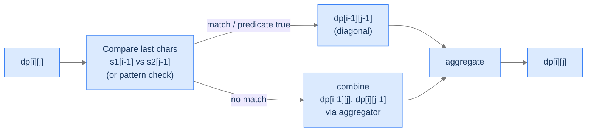

# 15. The Edit-Distance Pattern

Look closely at lessons 3, 4, and 5 — Longest Common Subsequence, Longest Common Substring, Edit Distance — and an architecture emerges. Each compares *two prefixes*, indexed by `(i, j)`. Each looks at the last characters and forks: do they match? Each combines smaller prefix results via min, max, or count. Different problems, identical bones. Two more problems share that exact skeleton: **wildcard pattern matching** (does a string match a pattern containing `?` and `*`?) and **interleaving check** (does a string `s3` interleave `s1` and `s2` while preserving order?). Both are 2D DPs over prefixes; both decompose by the last character; both add their own per-cell logic on top of the shared template.

By the end of this lesson you'll know the **edit-distance pattern** — the meta-template behind every "compare two sequences" DP — and you'll have written two problems that follow it: wildcard matching and interleaving check. You'll see why this single shape covers a vast slice of string-DP problems, and you'll start recognising it before the question even finishes.

## Table of contents

1. [The Edit-Distance Pattern](#the-edit-distance-pattern)
2. [Wildcard Pattern Matching](#wildcard-pattern-matching)
3. [Interleaving Check](#interleaving-check)
4. [Final Takeaway](#final-takeaway)

***

# The Edit-Distance Pattern

The pattern has four mandatory components:

1. **State.** `dp[i][j]` represents some answer to the question "considering the first `i` characters of one input and the first `j` characters of another (or the same) input."
2. **Base cases.** Live in row 0 (`i = 0`) and column 0 (`j = 0`). They encode "what's true when one side is empty."
3. **Case fork on the last characters.** The recurrence asks `s1[i-1] == s2[j-1]` (or some predicate on them). The two branches reduce to smaller prefixes — usually `(i-1, j)`, `(i, j-1)`, `(i-1, j-1)`.
4. **Aggregator.** Min, max, OR, sum, AND — whatever the question asks.



<p align="center"><strong>The edit-distance pattern in one diagram. Every "compare two sequences" DP — LCS, LCSubstr, edit distance, wildcard, interleaving — is some specialisation of this template.</strong></p>

> *Predict before reading on — for "longest common subsequence" of two strings, what's `dp[i][j]`?*

`dp[i][j]` = length of the LCS of the first `i` chars of `s1` and the first `j` chars of `s2`. Match → `dp[i-1][j-1] + 1`; mismatch → `max(dp[i-1][j], dp[i][j-1])`. State, base cases, fork, aggregator — all four pattern components fall out of the question.

## Why This Pattern Is Worth a Lesson of Its Own

The pattern itself is a *template* — once you can spot it, you don't have to derive a new recurrence for every problem. You just identify the four components and assemble. The problems we'll do here illustrate two non-trivial twists:

- **Wildcard matching** has *predicates* on characters (the pattern character can be `?` or `*`, with special semantics) — so the fork has more cases than a simple match/mismatch.
- **Interleaving check** indexes a *third string* `s3` whose position is `i + j - 1` — derived implicitly from the prefix counts, not stored as a third state.

Both problems show how the same skeleton stretches.

---

## Key Takeaway

The edit-distance pattern: 2D prefix DP, base cases on empty prefixes, fork on last-char predicate, aggregator chosen by the question. Spot it once, write it forever.

***

# Wildcard Pattern Matching

## The Problem

Given a string `s` and a `pattern` that may include wildcards:
- `?` matches any single character.
- `*` matches any sequence of characters (including empty).

Return `true` if the pattern matches the entire string `s`.

```
Input:  s = "abcdef", pattern = "abc??f"
Output: true                          ?? matches "de"; rest is literal

Input:  s = "abcdef", pattern = "ab*"
Output: true                          * matches "cdef"

Input:  s = "abcdef", pattern = "ab?"
Output: false                         Pattern length 3, but ? matches 1 char — too short
```

<details>
<summary><h2>The Recurrence</h2></summary>


`dp[i][j]` = whether `pattern[0..j-1]` matches `s[0..i-1]`.

**Base cases.**
- `dp[0][0] = true` — empty pattern matches empty string.
- `dp[0][j] = dp[0][j-1]` if `pattern[j-1] == '*'`; else `false`. (A `*` can match the empty string, so a leading streak of `*`s still matches.)
- `dp[i][0] = false` for `i ≥ 1` — empty pattern can't match a non-empty string.

**Inductive case.** Three sub-cases on `pattern[j-1]`:
- **Literal match (`pattern[j-1] == s[i-1]`)** or **single-char wildcard (`pattern[j-1] == '?'`)** — both consume one char on each side: `dp[i][j] = dp[i-1][j-1]`.
- **Multi-char wildcard (`pattern[j-1] == '*'`)** — two options:
  - `*` matches zero characters → `dp[i][j-1]` (pattern shrinks, string unchanged).
  - `*` matches at least one character → `dp[i-1][j]` (string shrinks, pattern unchanged — `*` keeps consuming).
  - Combine: `dp[i][j] = dp[i][j-1] OR dp[i-1][j]`.
- **Literal mismatch** (`pattern[j-1]` is a regular character but doesn't equal `s[i-1]`) → `dp[i][j] = false`.

> *Pause. Why does `*` matching "one or more" recurse on `dp[i-1][j]` (not `dp[i-1][j-1]`)?*

Because the same `*` can keep matching more characters. After consuming one `s[i-1]`, the `*` is still alive — same column `j`, with `i` decremented. If we recursed on `dp[i-1][j-1]`, we'd be saying `*` matched exactly one character, losing the "match many more" semantics.

</details>
<details>
<summary><h2>Solution &amp; Analysis</h2></summary>

### The Solution

```python run
from typing import List

class Solution:
    def wildcard_pattern_matching(self, s: str, pattern: str) -> bool:
        n: int = len(s)
        m: int = len(pattern)

        # Create a 2D list to store the dynamic programming results
        dp: List[List[bool]] = [[False] * (m + 1) for _ in range(n + 1)]

        # Initialize the base case
        dp[0][0] = True

        # Fill in the first row of dp
        for j in range(1, m + 1):

            # If the current character is '*', copy the result from the
            # previous column
            if pattern[j - 1] == "*":
                dp[0][j] = dp[0][j - 1]

        # Fill in the remaining cells of dp
        for i in range(1, n + 1):
            for j in range(1, m + 1):

                # If the characters at the current positions match or if
                # the pattern has a '?', copy the result from the
                # diagonal element (top-left)
                if pattern[j - 1] == "?" or pattern[j - 1] == s[i - 1]:
                    dp[i][j] = dp[i - 1][j - 1]

                # If the current character in the pattern is '*', we have
                # two options:
                # 1. Use '*' to match 0 characters, so copy the result
                # from the cell above (dp[i - 1][j]).
                # 2. Use '*' to match 1 or more characters, so copy the
                # result from the cell to the left (dp[i][j - 1]).
                elif pattern[j - 1] == "*":
                    dp[i][j] = dp[i - 1][j] or dp[i][j - 1]

        # Return the result stored in the bottom-right cell of dp
        return dp[n][m]


# Examples from the problem statement
print(Solution().wildcard_pattern_matching("abcdef", "abc??f"))   # True
print(Solution().wildcard_pattern_matching("abcdef", "ab*"))      # True
print(Solution().wildcard_pattern_matching("abcdef", "ab?"))      # False

# Edge cases
print(Solution().wildcard_pattern_matching("", ""))               # True  — empty matches empty
print(Solution().wildcard_pattern_matching("", "*"))              # True  — star matches empty
print(Solution().wildcard_pattern_matching("abc", ""))            # False — empty pattern, non-empty string
print(Solution().wildcard_pattern_matching("abc", "abc"))         # True  — exact match
print(Solution().wildcard_pattern_matching("abc", "???"))         # True  — all question marks
print(Solution().wildcard_pattern_matching("abc", "a*c"))         # True  — star in middle
print(Solution().wildcard_pattern_matching("abc", "a*d"))         # False — star can't fix tail mismatch
```

```java run
import java.util.*;

public class Main {
    static class Solution {
        public boolean wildcardPatternMatching(String s, String pattern) {
            int n = s.length();
            int m = pattern.length();

            // Create a 2D array to store the dynamic programming results
            boolean[][] dp = new boolean[n + 1][m + 1];

            // Initialize the base case
            dp[0][0] = true;

            // Fill in the first row of dp
            for (int j = 1; j <= m; j++) {

                // If the current character is '*', copy the result from the
                // previous column
                if (pattern.charAt(j - 1) == '*') {
                    dp[0][j] = dp[0][j - 1];
                }
            }

            // Fill in the remaining cells of dp
            for (int i = 1; i <= n; i++) {
                for (int j = 1; j <= m; j++) {

                    // If the characters at the current positions match or if
                    // the pattern has a '?', copy the result from the
                    // diagonal element (top-left)
                    if (
                        pattern.charAt(j - 1) == '?' ||
                        pattern.charAt(j - 1) == s.charAt(i - 1)
                    ) {
                        dp[i][j] = dp[i - 1][j - 1];
                    }

                    // If the current character in the pattern is '*', we
                    // have two options:
                    // 1. Use '*' to match 0 characters, so copy the result
                    // from the cell above (dp[i - 1][j]).
                    // 2. Use '*' to match 1 or more characters, so copy the
                    // result from the cell to the left (dp[i][j - 1]).
                    else if (pattern.charAt(j - 1) == '*') {
                        dp[i][j] = dp[i - 1][j] || dp[i][j - 1];
                    }
                }
            }

            // Return the result stored in the bottom-right cell of dp
            return dp[n][m];
        }
    }

    public static void main(String[] args) {
        // Examples from the problem statement
        System.out.println(new Solution().wildcardPatternMatching("abcdef", "abc??f"));   // true
        System.out.println(new Solution().wildcardPatternMatching("abcdef", "ab*"));      // true
        System.out.println(new Solution().wildcardPatternMatching("abcdef", "ab?"));      // false

        // Edge cases
        System.out.println(new Solution().wildcardPatternMatching("", ""));               // true
        System.out.println(new Solution().wildcardPatternMatching("", "*"));              // true
        System.out.println(new Solution().wildcardPatternMatching("abc", ""));            // false
        System.out.println(new Solution().wildcardPatternMatching("abc", "abc"));         // true
        System.out.println(new Solution().wildcardPatternMatching("abc", "???"));         // true
        System.out.println(new Solution().wildcardPatternMatching("abc", "a*c"));         // true
        System.out.println(new Solution().wildcardPatternMatching("abc", "a*d"));         // false
    }
}
```

### Complexity

| Aspect | Cost |
|---|---|
| Time | `O(n × m)` |
| Space | `O(n × m)` (reducible to `O(m)` with rolling rows) |

### Edge Cases

| Case | Example | Expected | Reasoning |
|---|---|---|---|
| Empty inputs | `s="", pattern=""` | `true` | `dp[0][0] = true`. |
| Pattern is just `*` | `s="abc", pattern="*"` | `true` | `*` matches anything, including empty. |
| Pattern empty, string non-empty | `s="abc", pattern=""` | `false` | Column 0 stays false past row 0. |
| Multiple `*`s | `s="abcd", pattern="*c*"` | `true` | Two `*`s coverage. |
| Adversarial mismatch | `s="abc", pattern="abd"` | `false` | Literal mismatch at position 2. |

</details>

***

# Interleaving Check

## The Problem

Given three strings `s1`, `s2`, `s3`, return `true` if `s3` is an interleaving of `s1` and `s2` — that is, `s3` is formed by merging the characters of `s1` and `s2` while preserving each one's internal order.

```
Input:  s1 = "code", s2 = "intuition", s3 = "cointuitionde"
Output: true
        Merge as: c-o-(intuition)-d-e ?  No — let's verify properly.
        s1 contributes: c, o, ..., d, e in order. s2 contributes: i, n, t, u, i, t, i, o, n in order.
        The merged sequence "co" + "intuition" + "de" alternates s1[c, o] then s2[intuition] then s1[d, e].

Input:  s1 = "abc", s2 = "def", s3 = "adbecf"
Output: true
        a (s1) d (s2) b (s1) e (s2) c (s1) f (s2) — strict alternation.

Input:  s1 = "abc", s2 = "def", s3 = "adcebf"
Output: false
        s3 has c before b — violates s1's internal order.
```

<details>
<summary><h2>The Recurrence</h2></summary>


`dp[i][j]` = whether `s3[0..i+j-1]` is an interleaving of `s1[0..i-1]` and `s2[0..j-1]`. Note: `s3`'s position is *implicit* — `i + j - 1`.

**Base case.** `dp[0][0] = true` — empty plus empty equals empty, trivially an interleaving.

**Inductive case.** Two ways `s3[i+j-1]` could have been produced:
- It matches the last character of `s1`: `s1[i-1] == s3[i+j-1]` AND `dp[i-1][j]` is true (the rest interleaves correctly).
- It matches the last character of `s2`: `s2[j-1] == s3[i+j-1]` AND `dp[i][j-1]` is true.

OR them:
```
dp[i][j] = (s1[i-1] == s3[i+j-1] AND dp[i-1][j])
        OR (s2[j-1] == s3[i+j-1] AND dp[i][j-1])
```

> *Pause. Why is there no diagonal `dp[i-1][j-1]` term? Predict the reasoning.*

Because each character of `s3` must come from *exactly one* of `s1` or `s2` — not both, not neither. The two terms above cover both options; a diagonal term would correspond to "consume one from each", which doesn't make sense for an interleaving (which consumes one character at a time, alternating arbitrarily between the two source strings).

**Fast fail.** If `len(s3) != len(s1) + len(s2)`, return `false` immediately. Lengths must add up by the pigeonhole-style accounting.

</details>
<details>
<summary><h2>Solution &amp; Analysis</h2></summary>

### The Solution

```python run
from typing import List

class Solution:
    def interleaving_check(self, s1: str, s2: str, s3: str) -> bool:
        n: int = len(s1)
        m: int = len(s2)

        # base case: length of given strings doesn't match
        if n + m != len(s3):
            return False

        # Create a 2D matrix to store the intermediate results
        # dp[i][j] will represent whether s3[0...i+j-1] can be formed by
        # interleaving s1[0...i-1] and s2[0...j-1]
        dp: List[List[bool]] = [[False] * (m + 1) for _ in range(n + 1)]

        # Base case: an empty s1 and s2 can form an empty s3
        dp[0][0] = True

        # Fill the matrix in a bottom-up manner
        for i in range(n + 1):
            for j in range(m + 1):

                # Check if s1's current character matches with s3's
                # current character and the previous characters of s1 and
                # s2 have already formed s3
                if i > 0 and s1[i - 1] == s3[i + j - 1]:
                    dp[i][j] = dp[i][j] or dp[i - 1][j]

                # Check if s2's current character matches with s3's
                # current character and the previous characters of s1 and
                # s2 have already formed s3
                if j > 0 and s2[j - 1] == s3[i + j - 1]:
                    dp[i][j] = dp[i][j] or dp[i][j - 1]

        # The bottom-right element of the matrix represents whether
        # s3 can be formed by interleaving s1 and s2
        return dp[n][m]


# Examples from the problem statement
print(Solution().interleaving_check("code", "intuition", "cointuitionde"))  # True
print(Solution().interleaving_check("abc", "def", "adbecf"))                # True
print(Solution().interleaving_check("abc", "def", "adcebf"))                # False

# Edge cases
print(Solution().interleaving_check("", "", ""))                            # True  — all empty
print(Solution().interleaving_check("a", "", "a"))                          # True  — s2 empty
print(Solution().interleaving_check("", "b", "b"))                          # True  — s1 empty
print(Solution().interleaving_check("ab", "cd", "abcd"))                    # True  — s1 then s2
print(Solution().interleaving_check("ab", "cd", "acbd"))                    # True  — interleaved
print(Solution().interleaving_check("ab", "cd", "abdc"))                    # False — wrong order
```

```java run
import java.util.*;

public class Main {
    static class Solution {
        public boolean interleavingCheck(String s1, String s2, String s3) {
            int n = s1.length();
            int m = s2.length();

            // base case: length of given strings doesn't match
            if (n + m != s3.length()) {
                return false;
            }

            // Create a 2D matrix to store the intermediate results
            // dp[i][j] will represent whether s3[0...i+j-1] can be formed by
            // interleaving s1[0...i-1] and s2[0...j-1]
            boolean[][] dp = new boolean[n + 1][m + 1];

            // Base case: an empty s1 and s2 can form an empty s3
            dp[0][0] = true;

            // Fill the matrix in a bottom-up manner
            for (int i = 0; i <= n; i++) {
                for (int j = 0; j <= m; j++) {

                    // Check if s1's current character matches with s3's
                    // current character and the previous characters of s1
                    // and s2 have already formed s3
                    if (
                        i > 0 && s1.charAt(i - 1) == s3.charAt(i + j - 1)
                    ) dp[i][j] = dp[i][j] || dp[i - 1][j];

                    // Check if s2's current character matches with s3's
                    // current character and the previous characters of s1
                    // and s2 have already formed s3
                    if (
                        j > 0 && s2.charAt(j - 1) == s3.charAt(i + j - 1)
                    ) dp[i][j] = dp[i][j] || dp[i][j - 1];
                }
            }

            // The bottom-right element of the matrix represents whether
            // s3 can be formed by interleaving s1 and s2
            return dp[n][m];
        }
    }

    public static void main(String[] args) {
        // Examples from the problem statement
        System.out.println(new Solution().interleavingCheck("code", "intuition", "cointuitionde"));  // true
        System.out.println(new Solution().interleavingCheck("abc", "def", "adbecf"));                // true
        System.out.println(new Solution().interleavingCheck("abc", "def", "adcebf"));                // false

        // Edge cases
        System.out.println(new Solution().interleavingCheck("", "", ""));                            // true
        System.out.println(new Solution().interleavingCheck("a", "", "a"));                          // true
        System.out.println(new Solution().interleavingCheck("", "b", "b"));                          // true
        System.out.println(new Solution().interleavingCheck("ab", "cd", "abcd"));                    // true
        System.out.println(new Solution().interleavingCheck("ab", "cd", "acbd"));                    // true
        System.out.println(new Solution().interleavingCheck("ab", "cd", "abdc"));                    // false
    }
}
```

### Complexity

| Aspect | Cost |
|---|---|
| Time | `O(n × m)` |
| Space | `O(n × m)` (reducible to `O(m)` with rolling rows) |

### Edge Cases

| Case | Example | Expected | Reasoning |
|---|---|---|---|
| Both empty, target empty | `("", "", "")` | `true` | `dp[0][0] = true`. |
| One source empty, target equals other | `("", "abc", "abc")` | `true` | Pure pass-through. |
| Length mismatch | `("a", "b", "abc")` | `false` | Quick reject. |
| Same character on both sides | `("aa", "ab", "aaba")` | `true` | Multiple valid interleavings; OR collects them. |

</details>

***

# Final Takeaway

The edit-distance pattern isn't just one problem — it's the *template* behind a family of two-sequence DPs:

| Problem | State | Fork on | Aggregator |
|---|---|---|---|
| LCS | `(i, j)` over both prefixes | char match | max |
| LCSubstr | `(i, j)` over both prefixes | char match | max with reset |
| Edit Distance | `(i, j)` over both prefixes | char match → 4 cases | min |
| Wildcard Match | `(i, j)` over string and pattern | char/`?`/`*` cases | OR |
| Interleaving Check | `(i, j)` over `s1`, `s2` (with `s3[i+j-1]` derived) | char match on each side | OR |

All five problems share the 2D prefix state, the case fork on the last characters, and the appropriate aggregator. **You didn't just learn two new problems. You internalised the meta-template behind half of every "compare two sequences" DP problem you'll see for the rest of your career — recognise the shape, identify the four components, and the recurrence writes itself.**

> *Transfer challenge for the next lesson:* Drop the second sequence entirely. Now you have *one* array of integers and a target sum. Can the array's elements be partitioned into two subsets with equal sum? This isn't a sequence-comparison problem; it's a *subset-sum* problem dressed up. Predict the recurrence shape — and notice it's not the edit-distance pattern at all.

<details>
<summary><strong>Answer</strong></summary>

State `dp[i][s]` = boolean — whether some subset of the first `i` elements sums to `s`. Same recurrence shape as subset sum from lesson 11; the partition-into-equal-subsets reduces to "is there a subset summing to `total / 2`?". The next lesson formalises the **subset-sum pattern** — a meta-template for partition, target-sum, and counting variants.

</details>
