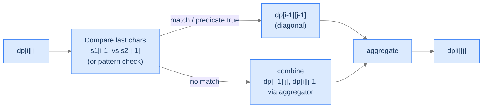

# The Edit-Distance Pattern

The pattern has four mandatory components:

1. **State.** `dp[i][j]` represents some answer to the question "considering the first `i` characters of one input and the first `j` characters of another (or the same) input."
2. **Base cases.** Live in row 0 (`i = 0`) and column 0 (`j = 0`). They encode "what's true when one side is empty."
3. **Case fork on the last characters.** The recurrence asks `s1[i-1] == s2[j-1]` (or some predicate on them). The two branches reduce to smaller prefixes — usually `(i-1, j)`, `(i, j-1)`, `(i-1, j-1)`.
4. **Aggregator.** Min, max, OR, sum, AND — whatever the question asks.

> 🖼 Diagram — The edit-distance pattern in one diagram. Every "compare two sequences" DP — LCS, LCSubstr, edit distance, wildcard, interleaving — is some specialisation of this template.

<strong>The edit-distance pattern in one diagram. Every "compare two sequences" DP — LCS, LCSubstr, edit distance, wildcard, interleaving — is some specialisation of this template.</strong>

> *Predict before reading on — for "longest common subsequence" of two strings, what's `dp[i][j]`?*

`dp[i][j]` = length of the LCS of the first `i` chars of `s1` and the first `j` chars of `s2`. Match → `dp[i-1][j-1] + 1`; mismatch → `max(dp[i-1][j], dp[i][j-1])`. State, base cases, fork, aggregator — all four pattern components fall out of the question.

## Why This Pattern Is Worth a Lesson of Its Own

The pattern itself is a *template* — once you can spot it, you don't have to derive a new recurrence for every problem. You just identify the four components and assemble. The problems we'll do here illustrate two non-trivial twists:

- **Wildcard matching** has *predicates* on characters (the pattern character can be `?` or `*`, with special semantics) — so the fork has more cases than a simple match/mismatch.
- **Interleaving check** indexes a *third string* `s3` whose position is `i + j - 1` — derived implicitly from the prefix counts, not stored as a third state.

Both problems show how the same skeleton stretches.

---

## Key Takeaway

The edit-distance pattern: 2D prefix DP, base cases on empty prefixes, fork on last-char predicate, aggregator chosen by the question. Spot it once, write it forever.

# Final Takeaway

The edit-distance pattern isn't just one problem — it's the *template* behind a family of two-sequence DPs:

| Problem | State | Fork on | Aggregator |
|---|---|---|---|
| LCS | `(i, j)` over both prefixes | char match | max |
| LCSubstr | `(i, j)` over both prefixes | char match | max with reset |
| Edit Distance | `(i, j)` over both prefixes | char match → 4 cases | min |
| Wildcard Match | `(i, j)` over string and pattern | char/`?`/`*` cases | OR |
| Interleaving Check | `(i, j)` over `s1`, `s2` (with `s3[i+j-1]` derived) | char match on each side | OR |

All five problems share the 2D prefix state, the case fork on the last characters, and the appropriate aggregator. **You didn't just learn two new problems. You internalised the meta-template behind half of every "compare two sequences" DP problem you'll see for the rest of your career — recognise the shape, identify the four components, and the recurrence writes itself.**

> *Transfer challenge for the next lesson:* Drop the second sequence entirely. Now you have *one* array of integers and a target sum. Can the array's elements be partitioned into two subsets with equal sum? This isn't a sequence-comparison problem; it's a *subset-sum* problem dressed up. Predict the recurrence shape — and notice it's not the edit-distance pattern at all.

<strong>Answer</strong>

State `dp[i][s]` = boolean — whether some subset of the first `i` elements sums to `s`. Same recurrence shape as subset sum from lesson 11; the partition-into-equal-subsets reduces to "is there a subset summing to `total / 2`?". The next lesson formalises the **subset-sum pattern** — a meta-template for partition, target-sum, and counting variants.

<!-- ============================================== -->
<!-- SWEEP 2 — missing sections (placeholders only) -->
<!-- ============================================== -->

<!-- TODO: Understanding the Pattern — missing, needs to be written -->
<!--       Guidance: umbrella H2 with the subsections below -->

<!-- TODO: Why Naive Isn't Enough — missing, needs to be written -->
<!--       Guidance: motivation for why the obvious approach fails -->

<!-- TODO: The Core Idea — missing, needs to be written -->
<!--       Guidance: one paragraph: the central trick -->

<!-- TODO: How the Pointers/Window Move — missing, needs to be written -->
<!--       Guidance: mechanics of the moving parts -->

<!-- TODO: The Generic Algorithm — missing, needs to be written -->
<!--       Guidance: numbered steps, no code -->

<!-- TODO: Generic Implementation — missing, needs to be written -->
<!--       Guidance: Python block + Java block of the skeleton -->

<!-- TODO: Complexity Analysis — missing, needs to be written -->
<!--       Guidance: table -->

<!-- TODO: Variants / Taxonomy — missing, needs to be written -->
<!--       Guidance: enumerate sub-shapes of this pattern -->

<!-- TODO: Identifying — missing, needs to be written -->
<!--       Guidance: per-variant: recognition checklist + canonical example -->

<!-- TODO: Recognition Checklist — missing, needs to be written -->
<!--       Guidance: 4-question diagnostic — the source of the Problem-section Diagnostic Questions -->

<!-- TODO: Canonical Example — missing, needs to be written -->
<!--       Guidance: fully worked example: brute force → optimised → template fit -->

<!-- TODO: Problems in This Category — missing, needs to be written -->
<!--       Guidance: table with links to the 02-problems/ files -->
