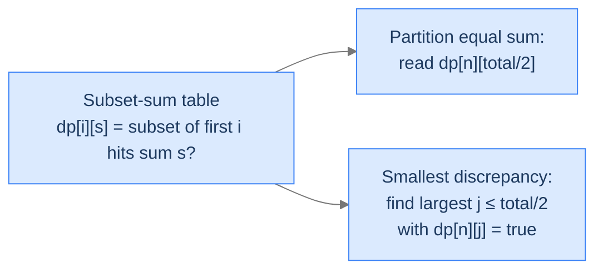
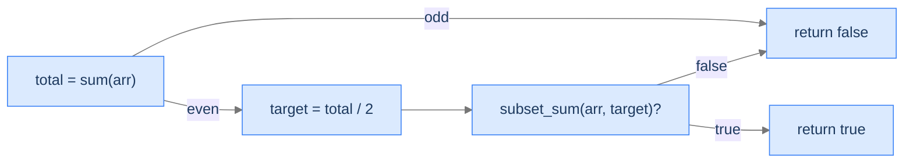

# 16. The Subset-Sum Pattern

You're balancing two trays on a scale, throwing items onto one tray or the other. Some items will land left, some right; the question is *whether* (and *how close*) the two trays can equalise. That's the subset-sum pattern in physical form. Algorithmically: given an array of integers, can a subset sum to exactly `target`? The answer is yes for some targets, no for others. Once you have that one boolean, two natural follow-ups become trivial: can the array be *partitioned* into two equal-sum subsets (target = total/2)? What's the *smallest* difference achievable between two subsets (find the largest reachable sum ≤ total/2)?

By the end of this lesson you'll know the **subset-sum pattern** — a single boolean DP that powers a family of partition, target-sum, and discrepancy problems. You'll have written two of those: **partition with equal sum** and **sets with smallest discrepancy**. Both problems reduce in two lines to the underlying boolean DP.

## Table of contents

1. [The Subset-Sum Pattern](#the-subset-sum-pattern)
2. [Partition with Equal Sum](#partition-with-equal-sum)
3. [Sets With Smallest Discrepancy](#sets-with-smallest-discrepancy)
4. [Final Takeaway](#final-takeaway)

***

# The Subset-Sum Pattern

> **Course:** DSA › Algorithms › Dynamic Programming › Subset-Sum Pattern

You saw subset sum in lesson 11 (knapsack applications) — a 2D boolean DP keyed on item count and remaining target. The pattern's structure:

```
dp[i][s] = dp[i - 1][s]                          — exclude arr[i - 1]
        OR (arr[i - 1] ≤ s AND dp[i - 1][s - arr[i - 1]])   — include arr[i - 1]
```

with base cases `dp[i][0] = true` (empty subset hits 0) and `dp[0][s > 0] = false` (no items can hit a positive sum).

Why give it a "pattern" lesson? Because two distinct downstream problems both reduce to "compute the subset-sum table, then read it differently."



<p align="center"><strong>One DP table, two readings. The table is the same; only the question changes — which cell to consult, or which range to scan.</strong></p>

> *Pause. Why do partition-equal-sum and smallest-discrepancy share a table? Predict the connection.*

Both ask "what subset sums are reachable from this array?" Equal-sum partition wants the specific cell `dp[n][total/2]`. Smallest discrepancy wants the *largest* reachable sum at or below `total/2` — once you have one subset's sum `s`, the other has sum `total - s`, and their difference is `total - 2s`. Minimising the difference means maximising `s` (subject to `s ≤ total/2`). Both reductions are mechanical once the table exists.

## Where this shows up

Beyond the two problems in this lesson: target-sum (assign +/- to each element to hit a target), count of subsets summing to `s` (replace OR with sum, getting an int DP), the partition number-theoretic problems that show up in scheduling, and the `0/1` integer-knapsack feasibility variant.

---

## Key Takeaway

The subset-sum pattern is one DP table answering "which sums are reachable using which prefix of items." Many partition/discrepancy problems reduce to a one-line read of the table.

***

# Partition with Equal Sum

> **Course:** DSA › Algorithms › Dynamic Programming › Subset-Sum Pattern

## The Problem

Given an array of non-negative integers, return `true` if it can be partitioned into two subsets with equal sums.

```
Input:  arr = [1, 5, 4, 10]
Output: true                       Subsets [1, 5, 4] (sum 10) and [10] (sum 10)

Input:  arr = [1, 2, 3, 4, 6]
Output: true                       Subsets [1, 3, 4] (sum 8) and [2, 6] (sum 8)

Input:  arr = [1, 2]
Output: false                      Total = 3 — odd; no equal split possible
```

## The Reduction

If the array can be partitioned into two equal-sum subsets, each subset sums to `total / 2`. So the problem reduces to: "is there a subset summing to exactly `total / 2`?" — pure subset sum.

Two quick filters before the DP:
- If `total` is odd, return `false` immediately. Two equal integer sums can't add to an odd number.
- If any single element exceeds `total / 2`, the partition is impossible (that element can't be balanced).



<p align="center"><strong>Reduction in three steps: parity check, then the subset-sum DP on <code>total / 2</code>. The boolean answer flows straight through.</strong></p>

> *Predict before reading on — for `arr = [3, 3, 3, 4, 5]`, `total = 18`, `target = 9`, is there a subset summing to 9?*

Yes — `{4, 5}` sums to 9, leaving `{3, 3, 3}` summing to 9. So partition is possible. (Also `{3, 3, 3} ∪ {4, 5}` are the two subsets.)

## The Solution


```pseudocode
# Equal-sum partition reduces to subset-sum with target = sum(arr) / 2.
function partitionEqualSum(arr):
    total ← sum(arr)
    if total mod 2 ≠ 0: return false              # odd totals can't split evenly
    target ← total ÷ 2
    n ← length(arr)
    dp ← (n + 1) × (target + 1) grid of false
    for i from 0 to n: dp[i][0] ← true            # empty subset hits sum 0
    for i from 1 to n:
        ai ← arr[i − 1]
        for s from 1 to target:
            dp[i][s] ← dp[i − 1][s]               # exclude arr[i−1]
            if ai ≤ s AND dp[i − 1][s − ai]:
                dp[i][s] ← true                   # include arr[i−1]
    return dp[n][target]
```

```python run
from typing import List

class Solution:
    def partition_equal_sum(self, arr: List[int]) -> bool:
        total = sum(arr)
        if total % 2 != 0:
            return False                            # Odd total can't split evenly
        target = total // 2
        n = len(arr)
        # dp[i][s] = True iff some subset of the first i elements sums to s.
        dp: List[List[bool]] = [[False] * (target + 1) for _ in range(n + 1)]
        for i in range(n + 1):
            dp[i][0] = True                         # Empty subset always sums to 0
        for i in range(1, n + 1):
            ai = arr[i - 1]
            for s in range(1, target + 1):
                dp[i][s] = dp[i - 1][s]             # Exclude arr[i-1]
                if ai <= s and dp[i - 1][s - ai]:
                    dp[i][s] = True                 # Include arr[i-1]
        return dp[n][target]


if __name__ == "__main__":
    sol = Solution()
    print(sol.partition_equal_sum([1, 5, 4, 10]))     # True
    print(sol.partition_equal_sum([1, 2, 3, 4, 6]))   # True
    print(sol.partition_equal_sum([1, 2]))            # False
```

```java run
public class Solution {
    public boolean partitionEqualSum(int[] arr) {
        int total = 0;
        for (int x : arr) total += x;
        if (total % 2 != 0) return false;
        int target = total / 2;
        int n = arr.length;
        boolean[][] dp = new boolean[n + 1][target + 1];
        for (int i = 0; i <= n; i++) dp[i][0] = true;
        for (int i = 1; i <= n; i++) {
            int ai = arr[i - 1];
            for (int s = 1; s <= target; s++) {
                dp[i][s] = dp[i - 1][s];
                if (ai <= s && dp[i - 1][s - ai]) dp[i][s] = true;
            }
        }
        return dp[n][target];
    }

    public static void main(String[] args) {
        Solution sol = new Solution();
        System.out.println(sol.partitionEqualSum(new int[]{1, 5, 4, 10}));     // true
        System.out.println(sol.partitionEqualSum(new int[]{1, 2}));            // false
    }
}
```

```c run
#include <stdio.h>
#include <stdbool.h>

bool dp[1001][50001];

bool partition_equal_sum(const int *arr, int n) {
    int total = 0;
    for (int i = 0; i < n; i++) total += arr[i];
    if (total % 2 != 0) return false;
    int target = total / 2;
    for (int i = 0; i <= n; i++) for (int s = 0; s <= target; s++) dp[i][s] = false;
    for (int i = 0; i <= n; i++) dp[i][0] = true;
    for (int i = 1; i <= n; i++) {
        int ai = arr[i - 1];
        for (int s = 1; s <= target; s++) {
            dp[i][s] = dp[i - 1][s];
            if (ai <= s && dp[i - 1][s - ai]) dp[i][s] = true;
        }
    }
    return dp[n][target];
}

int main(void) {
    int a[] = {1, 5, 4, 10};
    printf("%d\n", partition_equal_sum(a, 4));   /* 1 */
    return 0;
}
```

```scala run
class Solution {
  def partitionEqualSum(arr: Array[Int]): Boolean = {
    val total = arr.sum
    if (total % 2 != 0) return false
    val target = total / 2
    val n = arr.length
    val dp = Array.fill(n + 1, target + 1)(false)
    for (i <- 0 to n) dp(i)(0) = true
    for (i <- 1 to n) {
      val ai = arr(i - 1)
      for (s <- 1 to target) {
        dp(i)(s) = dp(i - 1)(s)
        if (ai <= s && dp(i - 1)(s - ai)) dp(i)(s) = true
      }
    }
    dp(n)(target)
  }
}

object Main extends App {
  println(new Solution().partitionEqualSum(Array(1, 5, 4, 10)))   // true
}
```


## Complexity

| Aspect | Cost |
|---|---|
| Time | `O(n × total)` |
| Space | `O(n × total)` (reducible to `O(total)` with downward 1D iteration) |

***

# Sets With Smallest Discrepancy

> **Course:** DSA › Algorithms › Dynamic Programming › Subset-Sum Pattern

## The Problem

Given an array of non-negative integers, partition it into two subsets `S1` and `S2` such that `|sum(S1) − sum(S2)|` is minimum. Return that minimum.

```
Input:  arr = [1, 5, 3, 10]
Output: 1                          [1, 5, 3] (sum 9) and [10] (sum 10) → diff 1

Input:  arr = [1, 2, 3, 4, 5]
Output: 1                          [5, 3] (sum 8) and [1, 2, 4] (sum 7) → diff 1

Input:  arr = [1, 1]
Output: 0                          Both [1] subsets → diff 0
```

## The Reduction

If one subset sums to `s`, the other sums to `total − s`. The difference is `total − 2s`. To minimise the difference (with `s ≤ total / 2` to keep it non-negative), maximise `s`.

So:
1. Build the same subset-sum table `dp[n][s]` for `s ∈ [0, total]` (but you only need up to `total / 2`).
2. Walk `s` downward from `total / 2` to `0`. The first `s` for which `dp[n][s] = true` is the largest reachable subset sum ≤ `total / 2`.
3. Answer = `total − 2s`.

```d2
direction: right
flow: "Discrepancy via subset sum" {
  grid-rows: 1
  grid-columns: 3
  grid-gap: 20
  step1: |md
    **1. Build dp**
    `dp[n][s]` for `s` up to `total / 2`
  |
  step2: |md
    **2. Scan downward**
    Find largest `s ≤ total / 2`
    with `dp[n][s] = true`
  |
  step3: |md
    **3. Answer**
    `total − 2 · s`
  |
}
```

<p align="center"><strong>Three-step reduction. The DP gives the achievable-sums oracle; the scan picks the best half-sum; arithmetic recovers the discrepancy.</strong></p>

> *Pause. Why scan downward from `total / 2`, not upward from 0?*

Because we want the *largest* feasible `s ≤ total / 2`. Scanning down hits it first; we break and return. Scanning up would force us to walk all the way to `total / 2` and remember the largest hit — same final answer, but uglier code.

## The Solution


```pseudocode
# Find the partition into two subsets that minimises |sum1 − sum2|.
# Reduce to: find largest reachable subset sum s ≤ total / 2, then answer is total − 2s.
function smallestDiscrepancy(arr):
    n ← length(arr)
    total ← sum(arr)
    dp ← (n + 1) × (total + 1) grid of false
    for i from 0 to n: dp[i][0] ← true
    for i from 1 to n:
        ai ← arr[i − 1]
        for s from 1 to total:
            dp[i][s] ← dp[i − 1][s]
            if ai ≤ s AND dp[i − 1][s − ai]:
                dp[i][s] ← true

    # Scan downward — first reachable s ≤ total/2 gives the smallest discrepancy.
    for s from (total ÷ 2) down to 0:
        if dp[n][s]:
            return total − 2 × s
    return total                                  # fallback (s = 0 always reachable)
```

```python run
from typing import List

class Solution:
    def smallest_discrepancy(self, arr: List[int]) -> int:
        n = len(arr)
        total = sum(arr)
        # dp[i][s] = True iff some subset of the first i elements sums to s.
        dp: List[List[bool]] = [[False] * (total + 1) for _ in range(n + 1)]
        for i in range(n + 1):
            dp[i][0] = True
        for i in range(1, n + 1):
            ai = arr[i - 1]
            for s in range(1, total + 1):
                dp[i][s] = dp[i - 1][s]
                if ai <= s and dp[i - 1][s - ai]:
                    dp[i][s] = True
        # Scan downward to find the largest reachable sum ≤ total / 2.
        for s in range(total // 2, -1, -1):
            if dp[n][s]:
                return total - 2 * s
        return total                                # Fallback (shouldn't trigger; s = 0 always works)


if __name__ == "__main__":
    sol = Solution()
    print(sol.smallest_discrepancy([1, 5, 3, 10]))     # 1
    print(sol.smallest_discrepancy([1, 2, 3, 4, 5]))   # 1
    print(sol.smallest_discrepancy([1, 1]))            # 0
```

```java run
public class Solution {
    public int smallestDiscrepancy(int[] arr) {
        int n = arr.length, total = 0;
        for (int x : arr) total += x;
        boolean[][] dp = new boolean[n + 1][total + 1];
        for (int i = 0; i <= n; i++) dp[i][0] = true;
        for (int i = 1; i <= n; i++) {
            int ai = arr[i - 1];
            for (int s = 1; s <= total; s++) {
                dp[i][s] = dp[i - 1][s];
                if (ai <= s && dp[i - 1][s - ai]) dp[i][s] = true;
            }
        }
        for (int s = total / 2; s >= 0; s--) {
            if (dp[n][s]) return total - 2 * s;
        }
        return total;
    }

    public static void main(String[] args) {
        Solution sol = new Solution();
        System.out.println(sol.smallestDiscrepancy(new int[]{1, 5, 3, 10}));    // 1
    }
}
```

```c run
#include <stdio.h>
#include <stdbool.h>

bool dp[1001][50001];

int smallest_discrepancy(const int *arr, int n) {
    int total = 0;
    for (int i = 0; i < n; i++) total += arr[i];
    for (int i = 0; i <= n; i++) for (int s = 0; s <= total; s++) dp[i][s] = false;
    for (int i = 0; i <= n; i++) dp[i][0] = true;
    for (int i = 1; i <= n; i++) {
        int ai = arr[i - 1];
        for (int s = 1; s <= total; s++) {
            dp[i][s] = dp[i - 1][s];
            if (ai <= s && dp[i - 1][s - ai]) dp[i][s] = true;
        }
    }
    for (int s = total / 2; s >= 0; s--) {
        if (dp[n][s]) return total - 2 * s;
    }
    return total;
}

int main(void) {
    int a[] = {1, 5, 3, 10};
    printf("%d\n", smallest_discrepancy(a, 4));    /* 1 */
    return 0;
}
```

```scala run
class Solution {
  def smallestDiscrepancy(arr: Array[Int]): Int = {
    val n = arr.length; val total = arr.sum
    val dp = Array.fill(n + 1, total + 1)(false)
    for (i <- 0 to n) dp(i)(0) = true
    for (i <- 1 to n) {
      val ai = arr(i - 1)
      for (s <- 1 to total) {
        dp(i)(s) = dp(i - 1)(s)
        if (ai <= s && dp(i - 1)(s - ai)) dp(i)(s) = true
      }
    }
    var s = total / 2
    while (s >= 0) {
      if (dp(n)(s)) return total - 2 * s
      s -= 1
    }
    total
  }
}

object Main extends App {
  println(new Solution().smallestDiscrepancy(Array(1, 5, 3, 10)))    // 1
}
```


## Complexity

| Aspect | Cost |
|---|---|
| Time | `O(n × total)` for the DP + `O(total)` for the scan |
| Space | `O(n × total)` |

## Edge Cases

| Case | Example | Expected | Reasoning |
|---|---|---|---|
| Single element | `[7]` | `7` | Only subset split: `{7}` and `{}` → diff 7. |
| All zeros | `[0, 0, 0]` | `0` | Any partition is balanced. |
| Two equal | `[5, 5]` | `0` | Each subset gets one. |
| Large outlier | `[1, 1, 1, 100]` | `97` | Best is `{1, 1, 1}` (sum 3) and `{100}` (sum 100) → diff 97. |
| Already balanced | `[1, 2, 3, 4, 5, 5, 4, 3, 2, 1]` | `0` | Total 30, half 15; reachable. |

***

# Final Takeaway

The subset-sum pattern is one boolean DP that powers an entire family:

| Problem | Reduction |
|---|---|
| Subset sum | Direct: `dp[n][target]` |
| Partition equal sum | `dp[n][total / 2]` (with parity check) |
| Smallest discrepancy | Largest `s ≤ total / 2` with `dp[n][s] = true`; answer `total − 2s` |
| Target sum (assign +/−) | Equivalent to subset sum on `(total + target) / 2` |
| Count of subsets summing to `s` | Replace OR with sum, getting an int DP |

**You didn't just learn two more problems. You learned that a *single* boolean DP table — "which sums are achievable with which prefix" — is the substrate for many competitive-programming partition problems. Build the table; reformulate the question as a read of it; collect your answer.**

> *Transfer challenge for the next lesson:* Drop arrays of integers entirely. Now you have a 2D grid (rows × cols), and you're walking from the top-left corner to the bottom-right corner, moving only right or down. Can you compute the path with the smallest sum of cell values? Predict the recurrence shape — note that the state is naturally 2D in the *grid coordinates*, not in some derived index.

<details>
<summary><strong>Answer</strong></summary>

`dp[r][c]` = minimum-sum path from `(0, 0)` to `(r, c)`. Recurrence: `dp[r][c] = grid[r][c] + min(dp[r-1][c], dp[r][c-1])`. Base cases: row 0 and column 0 are running prefix sums. Same shape covers max-path, count-of-paths (replace min with sum), unique-paths-with-obstacles, and many other "walk a 2D grid" problems. The next lesson formalises this as the **2D-grid DP pattern**.

</details>
