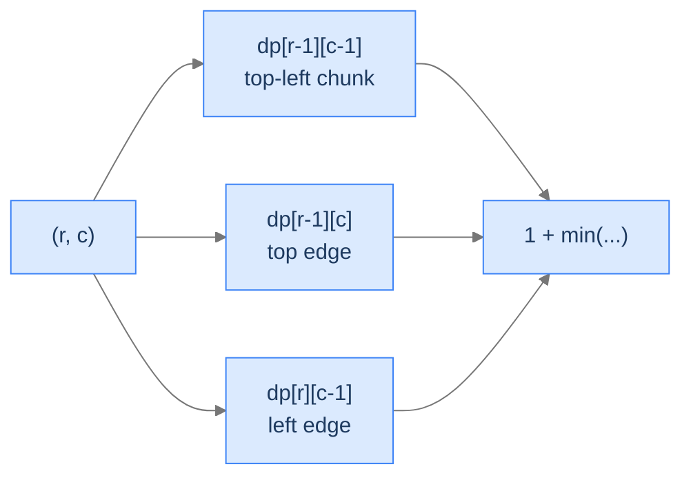
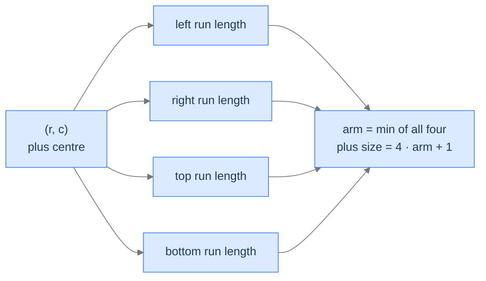

# 17. The 2D-Grid Pattern

When the data lives in a 2D grid — pixels in an image, cells in a board game, characters in a tile map — the DP shape changes. State naturally becomes `(r, c)` over the grid coordinates; transitions move between adjacent cells (up, down, left, right, sometimes diagonal); and the answer is either a single optimum read from one corner or an aggregate over the whole grid. This pattern shows up in image processing, robot pathfinding, terrain analysis, and any "walk a 2D world" problem.

By the end of this lesson you'll have written four canonical 2D-grid DPs: **longest ascending route** (the one with neighbours of higher value), **largest square area of 1s**, **destination path count** (under a cost constraint), and **largest plus of 1s**. Each illustrates a different transition structure — DFS-with-memo, neighbour-min-plus-1, count-aggregator with a budget, and four parallel direction-arrays — covering the breadth of what 2D-grid DP looks like.

## Table of contents

1. [The 2D-Grid Pattern](#the-2d-grid-pattern)
2. [Longest Ascending Route](#longest-ascending-route)
3. [Largest Square Area of 1s](#largest-square-area-of-1s)
4. [Destination Path Count](#destination-path-count)
5. [Largest Plus of 1s](#largest-plus-of-1s)
6. [Final Takeaway](#final-takeaway)

***

# The 2D-Grid Pattern

The pattern's three flavours:

1. **Origin-to-target** — `dp[r][c]` is the answer for cell `(r, c)`; transitions read from cells "earlier in the traversal." Examples: minimum-sum path, count of paths.
2. **Local optimum at every cell** — `dp[r][c]` measures something *ending at* or *centered at* `(r, c)`. Take the max across all cells. Examples: largest square of 1s, largest plus of 1s.
3. **DFS with memoization** — when transitions can move in *any* direction (not just down/right), iteration order is hard; recursion + memo is cleaner. Example: longest ascending route.

```d2
direction: right
flow: "Three flavours of 2D-grid DP" {
  grid-rows: 1
  grid-columns: 3
  grid-gap: 20
  f1: |md
    **Origin → target**
    Two nested loops
    Read up/left
    Answer at target cell
  |
  f2: |md
    **Local optimum**
    Two nested loops
    Track running max
    Answer is max-over-grid
  |
  f3: |md
    **Free-direction DFS**
    Recursion + cache
    Read in 4 directions
    Answer is max-over-grid
  |
}
```

<p align="center"><strong>Same 2D state, three traversal shapes. Pick the one that matches the transition rule of your problem.</strong></p>

> *Predict before reading on — for "minimum-sum path from top-left to bottom-right with right/down moves only", which flavour applies?*

Origin-to-target. `dp[r][c] = grid[r][c] + min(dp[r-1][c], dp[r][c-1])`. Two nested loops left-to-right, top-to-bottom. Answer is `dp[rows-1][cols-1]`.

---

## Key Takeaway

2D-grid DP states are `(r, c)`. Transition direction selects the traversal: directional → loops; free-direction → DFS+memo; "every cell as candidate" → loops + running max.

***

# Longest Ascending Route

## The Problem

Given an `n × m` grid of integers, find the length of the longest path along which strictly-increasing values appear. Moves are 4-connected (up/down/left/right). Diagonals don't count.

```
Input:  matrix = [[1, 2, 9],
                  [5, 3, 8],
                  [4, 6, 7]]
Output: 7                 Path: 1 → 2 → 3 → 6 → 7 → 8 → 9 (snakes through the grid)

Input:  matrix = [[1, 2, 3],
                  [4, 5, 6],
                  [7, 8, 9]]
Output: 5                 Multiple longest paths; e.g. 1 → 2 → 3 → 6 → 9
```

<details>
<summary><h2>The Recurrence — DFS with Memoization</h2></summary>


`dp[r][c]` = length of the longest strictly-ascending path *starting* at `(r, c)`. For each of the 4 neighbours `(r', c')` with `matrix[r'][c'] > matrix[r][c]`, recurse and take 1 plus that:
```
dp[r][c] = 1 + max over up-neighbour ascending of dp[r'][c']
```
If no neighbour is strictly greater, `dp[r][c] = 1` (just the cell itself).

The natural fill order is *anti-topological* — from peaks downward — but the simplest implementation is a DFS with memoization. The memo prevents re-exploring the same `(r, c)` once its value is settled.

> *Pause. Why does the strict-increase rule guarantee no cycles? Predict the consequence.*

Because every edge points to a strictly greater value, no path can revisit a cell — that would require returning to a smaller value somewhere, contradicting monotonicity. The recursion DAG is acyclic, so DFS terminates after each cell is visited at most once.

</details>
<details>
<summary><h2>Solution &amp; Analysis</h2></summary>

### The Solution

```python run
from typing import List

class Solution:
    def dfs(
        self,
        matrix: List[List[int]],
        row: int,
        col: int,
        dp: List[List[int]],
    ) -> int:
        rows = len(matrix)
        cols = len(matrix[0])

        if dp[row][col] != -1:
            return dp[row][col]

        max_length = 1

        # Array for row directions: up, right, down, left
        dx = [-1, 0, 1, 0]

        # Array for column directions: up, right, down, left
        dy = [0, 1, 0, -1]

        # Explore all four directions
        for i in range(4):

            # Get the new row index
            new_row = row + dx[i]

            # Get the new column index
            new_col = col + dy[i]

            # Check if the new position is within bounds and the value is
            # greater than the current position
            if (
                new_row >= 0
                and new_row < rows
                and new_col >= 0
                and new_col < cols
                and matrix[new_row][new_col] > matrix[row][col]
            ):

                # Recursively call dfs and update max_length
                max_length = max(
                    max_length,
                    1 + self.dfs(matrix, new_row, new_col, dp),
                )

        # Store the computed max_length for current position in the dp
        # matrix
        dp[row][col] = max_length
        return max_length

    def longest_ascending_route(self, matrix: List[List[int]]) -> int:
        rows = len(matrix)
        cols = len(matrix[0])

        # Initialize dp matrix with -1s
        dp = [[-1] * cols for _ in range(rows)]

        max_length = 0

        for row in range(rows):
            for col in range(cols):

                # Call dfs for each position and update max_length
                max_length = max(
                    max_length, self.dfs(matrix, row, col, dp)
                )

        # Return the final max_length
        return max_length


# Examples from the problem statement
print(Solution().longest_ascending_route([[1, 2, 9], [5, 3, 8], [4, 6, 7]]))  # 7
print(Solution().longest_ascending_route([[1, 2, 3], [4, 5, 6], [7, 8, 9]]))  # 5

# Edge cases
print(Solution().longest_ascending_route([[1]]))                               # 1  — 1x1
print(Solution().longest_ascending_route([[1, 2]]))                            # 2  — 1x2
print(Solution().longest_ascending_route([[9, 8, 7], [6, 5, 4], [3, 2, 1]])) # 9  — strictly decreasing grid
print(Solution().longest_ascending_route([[1, 1], [1, 1]]))                    # 1  — all same
print(Solution().longest_ascending_route([[3, 4, 5], [3, 2, 6], [2, 2, 1]])) # 4
```

```java run
import java.util.*;

public class Main {
    static class Solution {
        private int dfs(int[][] matrix, int row, int col, int[][] dp) {
            int rows = matrix.length;
            int cols = matrix[0].length;

            if (dp[row][col] != -1) {
                return dp[row][col];
            }

            int maxLength = 1;

            // Array for row directions: up, right, down, left
            int[] dx = { -1, 0, 1, 0 };

            // Array for column directions: up, right, down, left
            int[] dy = { 0, 1, 0, -1 };

            // Explore all four directions
            for (int i = 0; i < 4; i++) {

                // Get the new row index
                int newRow = row + dx[i];

                // Get the new column index
                int newCol = col + dy[i];

                // Check if the new position is within bounds and the value
                // is greater than the current position
                if (
                    newRow >= 0 &&
                    newRow < rows &&
                    newCol >= 0 &&
                    newCol < cols &&
                    matrix[newRow][newCol] > matrix[row][col]
                ) {

                    // Recursively call dfs and update maxLength
                    maxLength = Math.max(
                        maxLength,
                        1 + dfs(matrix, newRow, newCol, dp)
                    );
                }
            }

            // Store the computed maxLength for current position in the dp
            // matrix
            dp[row][col] = maxLength;
            return maxLength;
        }

        public int longestAscendingRoute(int[][] matrix) {
            int rows = matrix.length;
            int cols = matrix[0].length;

            // Initialize dp matrix with -1s
            int[][] dp = new int[rows][cols];
            for (int[] row : dp) Arrays.fill(row, -1);

            int maxLength = 0;

            for (int row = 0; row < rows; row++) {
                for (int col = 0; col < cols; col++) {

                    // Call dfs for each position and update maxLength
                    maxLength = Math.max(
                        maxLength,
                        dfs(matrix, row, col, dp)
                    );
                }
            }

            // Return the final maxLength
            return maxLength;
        }
    }

    public static void main(String[] args) {
        // Examples from the problem statement
        System.out.println(new Solution().longestAscendingRoute(new int[][]{{1,2,9},{5,3,8},{4,6,7}}));  // 7
        System.out.println(new Solution().longestAscendingRoute(new int[][]{{1,2,3},{4,5,6},{7,8,9}}));  // 5

        // Edge cases
        System.out.println(new Solution().longestAscendingRoute(new int[][]{{1}}));                      // 1
        System.out.println(new Solution().longestAscendingRoute(new int[][]{{1,2}}));                    // 2
        System.out.println(new Solution().longestAscendingRoute(new int[][]{{9,8,7},{6,5,4},{3,2,1}})); // 9
        System.out.println(new Solution().longestAscendingRoute(new int[][]{{1,1},{1,1}}));              // 1
        System.out.println(new Solution().longestAscendingRoute(new int[][]{{3,4,5},{3,2,6},{2,2,1}})); // 4
    }
}
```

### Complexity

| Aspect | Cost |
|---|---|
| Time | `O(rows × cols)` — each cell's DFS is O(1) thanks to memoization |
| Space | `O(rows × cols)` for the memo table + recursion stack |

</details>

***

# Largest Square Area of 1s

## The Problem

Given a binary matrix of 0s and 1s, find the area of the largest *axis-aligned square* of 1s.

```
Input:  grid = [[1, 1, 0, 0],
                [0, 0, 1, 1],
                [1, 0, 1, 1],
                [1, 0, 0, 0]]
Output: 4                       2 × 2 square at rows 1-2, cols 2-3

Input:  grid = [[1, 1, 0, 0],
                [0, 1, 1, 1],
                [1, 1, 1, 1],
                [1, 0, 0, 0]]
Output: 4                       Multiple 2 × 2 squares
```

<details>
<summary><h2>The Recurrence — Three-Neighbour Min Plus One</h2></summary>


`dp[r][c]` = side length of the largest square *whose bottom-right corner is* `(r, c)`. If `grid[r][c] = 0`, it can't be a corner: `dp[r][c] = 0`. If `grid[r][c] = 1`:
```
dp[r][c] = 1 + min(dp[r-1][c-1], dp[r-1][c], dp[r][c-1])
```

Why three neighbours? A `k × k` square at `(r, c)` requires:
- A `(k-1) × (k-1)` square at `(r-1, c-1)` (the top-left chunk).
- A `(k-1) × (k-1)` square at `(r-1, c)` (covering the top edge).
- A `(k-1) × (k-1)` square at `(r, c-1)` (covering the left edge).

The smallest of these three caps the size of the square that can grow from `(r, c)`. Plus one for the cell itself.



<p align="center"><strong>The square ending at <code>(r, c)</code> can only be as large as the smallest of three predecessor squares — the top-left, top, and left neighbours. Plus one for the current cell.</strong></p>

> *Pause. Why is min the right aggregator here? Predict the consequence of using max.*

Min ensures the square is *fully* filled with 1s. If any of the three neighbours has a smaller largest-square, that's the binding constraint — extending beyond would require 1s in cells that aren't 1. Using max would let one good corner override missing cells elsewhere — wrong.

</details>
<details>
<summary><h2>Solution &amp; Analysis</h2></summary>

### The Solution

```python run
from typing import List

class Solution:
    def largest_square_area(self, matrix: List[List[int]]) -> int:
        rows: int = len(matrix)
        cols: int = len(matrix[0])
        max_size: int = 0

        # Create a 2D dynamic programming table
        dp: List[List[int]] = [[0] * cols for _ in range(rows)]

        # Fill the first row and column of the dp table
        for row in range(rows):
            dp[row][0] = matrix[row][0]
            max_size = max(max_size, dp[row][0])

        for col in range(cols):
            dp[0][col] = matrix[0][col]
            max_size = max(max_size, dp[0][col])

        # Fill the remaining dp table using the recurrence relation
        for row in range(1, rows):
            for col in range(1, cols):
                if matrix[row][col] == 1:

                    # Calculate the size of the square submatrix ending
                    # at (row, col) based on the sizes of the submatrices
                    # ending at (row-1, col-1), (row-1, col), and (row,
                    # col-1)
                    dp[row][col] = (
                        min(
                            dp[row - 1][col - 1],
                            min(dp[row - 1][col], dp[row][col - 1]),
                        )
                        + 1
                    )
                    max_size = max(max_size, dp[row][col])

        return max_size * max_size


# Examples from the problem statement
print(Solution().largest_square_area([[1,1,0,0],[0,0,1,1],[1,0,1,1],[1,0,0,0]]))  # 4
print(Solution().largest_square_area([[1,1,0,0],[0,1,1,1],[1,1,1,1],[1,0,0,0]]))  # 4

# Edge cases
print(Solution().largest_square_area([[1]]))                                       # 1  — 1x1 with 1
print(Solution().largest_square_area([[0]]))                                       # 0  — 1x1 with 0
print(Solution().largest_square_area([[0, 0], [0, 0]]))                            # 0  — all zeros
print(Solution().largest_square_area([[1, 1], [1, 1]]))                            # 4  — all ones 2x2
print(Solution().largest_square_area([[1, 0, 1], [0, 1, 0], [1, 0, 1]]))          # 1  — checkerboard
```

```java run
import java.util.*;

public class Main {
    static class Solution {
        public int largestSquareArea(int[][] matrix) {
            int rows = matrix.length;
            int cols = matrix[0].length;
            int maxSize = 0;

            // Create a 2D dynamic programming table
            int[][] dp = new int[rows][cols];

            // Fill the first row and column of the dp table
            for (int row = 0; row < rows; row++) {
                dp[row][0] = matrix[row][0];
                maxSize = Math.max(maxSize, dp[row][0]);
            }

            for (int col = 0; col < cols; col++) {
                dp[0][col] = matrix[0][col];
                maxSize = Math.max(maxSize, dp[0][col]);
            }

            // Fill the remaining dp table using the recurrence relation
            for (int row = 1; row < rows; row++) {
                for (int col = 1; col < cols; col++) {
                    if (matrix[row][col] == 1) {

                        // Calculate the size of the square submatrix ending
                        // at (row, col) based on the sizes of the
                        // submatrices ending at (row-1, col-1), (row-1,
                        // col), and (row, col-1)
                        dp[row][col] =
                            Math.min(
                                dp[row - 1][col - 1],
                                Math.min(dp[row - 1][col], dp[row][col - 1])
                            ) +
                            1;
                        maxSize = Math.max(maxSize, dp[row][col]);
                    }
                }
            }

            return maxSize * maxSize;
        }
    }

    public static void main(String[] args) {
        // Examples from the problem statement
        System.out.println(new Solution().largestSquareArea(new int[][]{{1,1,0,0},{0,0,1,1},{1,0,1,1},{1,0,0,0}}));  // 4
        System.out.println(new Solution().largestSquareArea(new int[][]{{1,1,0,0},{0,1,1,1},{1,1,1,1},{1,0,0,0}}));  // 4

        // Edge cases
        System.out.println(new Solution().largestSquareArea(new int[][]{{1}}));                                      // 1
        System.out.println(new Solution().largestSquareArea(new int[][]{{0}}));                                      // 0
        System.out.println(new Solution().largestSquareArea(new int[][]{{0,0},{0,0}}));                              // 0
        System.out.println(new Solution().largestSquareArea(new int[][]{{1,1},{1,1}}));                              // 4
        System.out.println(new Solution().largestSquareArea(new int[][]{{1,0,1},{0,1,0},{1,0,1}}));                  // 1
    }
}
```

### Complexity

| Aspect | Cost |
|---|---|
| Time | `O(rows × cols)` |
| Space | `O(rows × cols)` (reducible to `O(cols)` with rolling rows) |

</details>

***

# Destination Path Count

## The Problem

Given an `n × m` matrix of non-negative cell costs and a target cost, count the number of paths from `(0, 0)` to `(n-1, m-1)` whose summed costs equal the target. Moves are right or down only.

```
Input:  matrix = [[1, 2, 9],
                  [5, 3, 8],
                  [4, 6, 7]],
        cost = 19
Output: 1                          One path summing to 19

Input:  matrix = [[1, 2, 3],
                  [1, 5, 6],
                  [2, 8, 9]],
        cost = 21
Output: 2                          Two paths sum to 21
```

<details>
<summary><h2>The Recurrence — 3D State</h2></summary>


Add a third dimension to the standard "count paths to `(r, c)`" DP: the remaining budget. `dp[r][c][k]` = number of paths from `(0, 0)` to `(r, c)` whose costs sum to exactly `k`.

```
dp[r][c][k] = dp[r-1][c][k - matrix[r][c]] + dp[r][c-1][k - matrix[r][c]]
              (with appropriate guards for r=0, c=0, k < matrix[r][c])
```

Base case: `dp[0][0][matrix[0][0]] = 1` (the only path of length 1 hits `matrix[0][0]`).

For implementation, recursion + memoization is cleaner than building a giant 3D array. We memoize on the tuple `(r, c, k)`.

> *Pause. Why is the state 3D, not 2D? Predict the answer.*

Because the answer at `(r, c)` depends on the *budget* still available — two different remaining budgets give two different answers, and the budget changes as we walk. 2D `(r, c)` doesn't have enough information.

</details>
<details>
<summary><h2>Solution &amp; Analysis</h2></summary>

### The Solution

```python run
from typing import List, Dict

class Solution:
    def destination_path_count_helper(
        self,
        matrix: List[List[int]],
        row: int,
        col: int,
        cost: int,
        dp: Dict[str, int],
    ) -> int:

        # base case
        if cost < 0:
            return 0

        # if we are at the first cell (0, 0)
        if row == 0 and col == 0:
            if matrix[0][0] - cost == 0:
                return 1
            else:
                return 0

        # construct a unique map key from dynamic elements of the input
        key = f"{row}|{col}|{cost}"

        # if the subproblem is seen for the first time, solve it and
        # store its result in a map
        if key not in dp:

            # if we are at the first row, we can only go left
            if row == 0:
                dp[key] = self.destination_path_count_helper(
                    matrix, 0, col - 1, cost - matrix[row][col], dp
                )

            # if we are at the first column, we can only go up
            elif col == 0:
                dp[key] = self.destination_path_count_helper(
                    matrix, row - 1, 0, cost - matrix[row][col], dp
                )

            # recur to count total paths by going both left and top
            else:
                dp[key] = self.destination_path_count_helper(
                    matrix, row - 1, col, cost - matrix[row][col], dp
                ) + self.destination_path_count_helper(
                    matrix, row, col - 1, cost - matrix[row][col], dp
                )

        # return the total number of paths to reach cell (row, col)
        return dp[key]

    def destination_path_count(
        self, matrix: List[List[int]], cost: int
    ) -> int:

        # base case
        if len(matrix) == 0:
            return 0

        row: int = len(matrix)
        col: int = len(matrix[0])

        # create a dictionary to store solutions to subproblems
        dp: Dict[str, int] = {}

        return self.destination_path_count_helper(
            matrix, row - 1, col - 1, cost, dp
        )


# Examples from the problem statement
print(Solution().destination_path_count([[1,2,9],[5,3,8],[4,6,7]], 19))   # 1
print(Solution().destination_path_count([[1,2,3],[1,5,6],[2,8,9]], 21))   # 2

# Edge cases
print(Solution().destination_path_count([[5]], 5))                         # 1  — 1x1 exact
print(Solution().destination_path_count([[5]], 3))                         # 0  — 1x1 wrong cost
print(Solution().destination_path_count([[1,2],[3,4]], 7))                 # 1  — [1,3,4]
print(Solution().destination_path_count([[1,2],[3,4]], 8))                 # 0  — no path sums to 8 (paths are 1+2+4=7 or 1+3+4=8)
print(Solution().destination_path_count([[1,1],[1,1]], 3))                 # 2  — both paths cost 3
```

```java run
import java.util.*;

public class Main {
    static class Solution {
        private int destinationPathCountHelper(
            int[][] matrix,
            int row,
            int col,
            int cost,
            Map<String, Integer> dp
        ) {

            // base case
            if (cost < 0) {
                return 0;
            }

            // if we are at the first cell (0, 0)
            if (row == 0 && col == 0) {
                if (matrix[0][0] - cost == 0) {
                    return 1;
                } else {
                    return 0;
                }
            }

            // construct a unique map key from dynamic elements of the input
            String key = row + "|" + col + "|" + cost;

            // if the subproblem is seen for the first time, solve it and
            // store its result in a map
            if (!dp.containsKey(key)) {

                // if we are at the first row, we can only go left
                if (row == 0) {
                    dp.put(
                        key,
                        destinationPathCountHelper(
                            matrix,
                            0,
                            col - 1,
                            cost - matrix[row][col],
                            dp
                        )
                    );
                }

                // if we are at the first column, we can only go up
                else if (col == 0) {
                    dp.put(
                        key,
                        destinationPathCountHelper(
                            matrix,
                            row - 1,
                            0,
                            cost - matrix[row][col],
                            dp
                        )
                    );
                }

                // recur to count total paths by going both left and top
                else {
                    dp.put(
                        key,
                        destinationPathCountHelper(
                            matrix,
                            row - 1,
                            col,
                            cost - matrix[row][col],
                            dp
                        ) +
                        destinationPathCountHelper(
                            matrix,
                            row,
                            col - 1,
                            cost - matrix[row][col],
                            dp
                        )
                    );
                }
            }

            // return the total number of paths to reach cell (m, n)
            return dp.get(key);
        }

        public int destinationPathCount(int[][] matrix, int cost) {

            // base case
            if (matrix.length == 0) {
                return 0;
            }

            int row = matrix.length;
            int col = matrix[0].length;

            // create a map to store solutions to subproblems
            Map<String, Integer> dp = new HashMap<>();

            return destinationPathCountHelper(
                matrix,
                row - 1,
                col - 1,
                cost,
                dp
            );
        }
    }

    public static void main(String[] args) {
        // Examples from the problem statement
        System.out.println(new Solution().destinationPathCount(new int[][]{{1,2,9},{5,3,8},{4,6,7}}, 19));   // 1
        System.out.println(new Solution().destinationPathCount(new int[][]{{1,2,3},{1,5,6},{2,8,9}}, 21));   // 2

        // Edge cases
        System.out.println(new Solution().destinationPathCount(new int[][]{{5}}, 5));                         // 1
        System.out.println(new Solution().destinationPathCount(new int[][]{{5}}, 3));                         // 0
        System.out.println(new Solution().destinationPathCount(new int[][]{{1,2},{3,4}}, 7));                 // 1
        System.out.println(new Solution().destinationPathCount(new int[][]{{1,2},{3,4}}, 8));                 // 0
        System.out.println(new Solution().destinationPathCount(new int[][]{{1,1},{1,1}}, 3));                 // 2
    }
}
```

### Complexity

| Aspect | Cost |
|---|---|
| Time | `O(rows × cols × cost)` — three-dimensional state, each cell `O(1)` work |
| Space | `O(rows × cols × cost)` for the memo |

</details>

***

# Largest Plus of 1s

## The Problem

Given a binary matrix, find the size (number of cells) of the largest plus-shape made entirely of 1s. A plus has a centre and four arms of equal length extending up/down/left/right.

```
Input:  grid = [[1, 1, 1, 0],
                [0, 1, 1, 1],
                [1, 1, 1, 1],
                [1, 0, 1, 0]]
Output: 5                       Plus of arm length 1: centre + 4 arm cells

Input:  grid = [[1, 1, 1, 1, 1],
                [1, 1, 1, 1, 1],
                [1, 1, 1, 1, 1],
                [1, 1, 1, 1, 1],
                [1, 1, 1, 1, 1]]
Output: 9                       Plus of arm length 2: centre + 8 arm cells
```

<details>
<summary><h2>The Recurrence — Four Direction Arrays</h2></summary>


Build four 2D arrays, one per direction, each measuring how long a contiguous run of 1s reaches `(r, c)` from that direction *excluding* `(r, c)` itself — the run that ends at the neighbouring cell:
- `left[r][c]` = consecutive 1s immediately to the left of `(r, c)`.
- `right[r][c]` = consecutive 1s immediately to the right of `(r, c)`.
- `top[r][c]` = consecutive 1s immediately above `(r, c)`.
- `bottom[r][c]` = consecutive 1s immediately below `(r, c)`.

For a plus centred at `(r, c)`, each arm needs a contiguous run of 1s on that side. The arm length (not counting the centre) is `min(left, right, top, bottom)`. The plus has the centre plus four arms of that length: `4 × arm + 1` cells total.



<p align="center"><strong>Four direction arrays, each computed in one pass over the grid. The plus centred at any cell is bounded by the shortest arm.</strong></p>

> *Pause. Why is `4 × arm + 1` the cell count?*

Here `arm` counts only the run on each side, *not* the centre cell. Four arms contribute `4 × arm` cells, and the centre adds one more: `4 × arm + 1`. (If you used arm length *including* the centre, the formula would be `4 × arm − 3` — same answer, different convention. The code uses the excluding-centre convention.)

</details>
<details>
<summary><h2>Solution &amp; Analysis</h2></summary>

### The Solution

```python run
from typing import List

class Solution:
    def largest_plus_of1s(self, grid: List[List[int]]) -> int:
        rows: int = len(grid)
        if rows == 0:
            return 0
        cols: int = len(grid[0])
        if cols == 0:
            return 0

        # Create matrices to store the lengths of continuous 1's in each
        # direction
        left: List[List[int]] = [[0] * cols for _ in range(rows)]
        right: List[List[int]] = [[0] * cols for _ in range(rows)]
        top: List[List[int]] = [[0] * cols for _ in range(rows)]
        bottom: List[List[int]] = [[0] * cols for _ in range(rows)]

        # Calculate the lengths of continuous 1's in the left and right
        # directions for each row
        for row in range(rows):
            top[row][0] = grid[row][0]
            bottom[row][cols - 1] = grid[row][cols - 1]
            for col in range(1, cols):
                if grid[row][col] == 1:

                    # Increment the length of continuous 1's from the
                    # left
                    left[row][col] = left[row][col - 1] + 1
                if grid[row][cols - 1 - col] == 1:

                    # Increment the length of continuous 1's from the
                    # right
                    right[row][cols - 1 - col] = right[row][cols - col] + 1

        # Calculate the lengths of continuous 1's in the top and bottom
        # directions for each column
        for col in range(cols):
            left[0][col] = grid[0][col]
            right[rows - 1][col] = grid[rows - 1][col]
            for row in range(1, rows):
                if grid[row][col] == 1:

                    # Increment the length of continuous 1's from the top
                    top[row][col] = top[row - 1][col] + 1
                if grid[rows - 1 - row][col] == 1:

                    # Increment the length of continuous 1's from the
                    # bottom
                    bottom[rows - 1 - row][col] = bottom[rows - row][col] + 1

        max_size: int = 0

        # Find the maximum size of the plus-shaped region
        for row in range(rows):
            for col in range(cols):

                # Calculate the size of the plus-shaped region at each
                # position as the minimum length of continuous 1's in all
                # directions
                size = min(
                    min(left[row][col], right[row][col]),
                    min(top[row][col], bottom[row][col]),
                )

                # Update the maximum size if a larger size is found
                max_size = max(max_size, size)

        # Return the area of the largest plus-shaped region
        return max_size * 4 + 1


# Examples from the problem statement
print(Solution().largest_plus_of1s([[1,1,1,0],[0,1,1,1],[1,1,1,1],[1,0,1,0]]))           # 5
print(Solution().largest_plus_of1s([[1,1,1,1,1],[1,1,1,1,1],[1,1,1,1,1],[1,1,1,1,1],[1,1,1,1,1]]))  # 9
print(Solution().largest_plus_of1s([[1,1,1,0],[0,1,0,1],[1,1,1,1],[1,0,1,0]]))           # 5

# Edge cases
print(Solution().largest_plus_of1s([[1]]))                                                # 1  — 1x1
print(Solution().largest_plus_of1s([[0]]))                                                # 1  — 0x0 plus (0*4+1=1 is output for size=0)
print(Solution().largest_plus_of1s([[0,0],[0,0]]))                                        # 1
print(Solution().largest_plus_of1s([[0,1,0],[1,1,1],[0,1,0]]))                            # 5  — classic plus
```

```java run
import java.util.*;

public class Main {
    static class Solution {
        public int largestPlusOf1s(int[][] matrix) {
            int rows = matrix.length;
            if (rows == 0) {
                return 0;
            }
            int cols = matrix[0].length;
            if (cols == 0) {
                return 0;
            }

            // Create matrices to store the lengths of continuous 1's in each
            // direction
            int[][] left = new int[rows][cols];
            int[][] right = new int[rows][cols];
            int[][] top = new int[rows][cols];
            int[][] bottom = new int[rows][cols];

            // Calculate the lengths of continuous 1's in the left and right
            // directions for each row
            for (int row = 0; row < rows; row++) {
                top[row][0] = matrix[row][0];
                bottom[row][cols - 1] = matrix[row][cols - 1];
                for (int col = 1; col < cols; col++) {
                    if (matrix[row][col] == 1) {

                        // Increment the length of continuous 1's from the
                        // left
                        left[row][col] = left[row][col - 1] + 1;
                    }
                    if (matrix[row][cols - 1 - col] == 1) {

                        // Increment the length of continuous 1's from the
                        // right
                        right[row][cols - 1 - col] = right[row][cols - col] + 1;
                    }
                }
            }

            // Calculate the lengths of continuous 1's in the top and bottom
            // directions for each column
            for (int col = 0; col < cols; col++) {
                left[0][col] = matrix[0][col];
                right[rows - 1][col] = matrix[rows - 1][col];
                for (int row = 1; row < rows; row++) {
                    if (matrix[row][col] == 1) {

                        // Increment the length of continuous 1's from the
                        // top
                        top[row][col] = top[row - 1][col] + 1;
                    }
                    if (matrix[rows - 1 - row][col] == 1) {

                        // Increment the length of continuous 1's from the
                        // bottom
                        bottom[rows - 1 - row][col] = bottom[rows - row][col] + 1;
                    }
                }
            }

            int maxSize = 0;

            // Find the maximum size of the plus-shaped region
            for (int row = 0; row < rows; row++) {
                for (int col = 0; col < cols; col++) {

                    // Calculate the size of the plus-shaped region at each
                    // position as the minimum length of continuous 1's in
                    // all directions
                    int size = Math.min(
                        Math.min(left[row][col], right[row][col]),
                        Math.min(top[row][col], bottom[row][col])
                    );

                    // Update the maximum size if a larger size is found
                    maxSize = Math.max(maxSize, size);
                }
            }

            // Return the area of the largest plus-shaped region
            return maxSize * 4 + 1;
        }
    }

    public static void main(String[] args) {
        // Examples from the problem statement
        System.out.println(new Solution().largestPlusOf1s(new int[][]{{1,1,1,0},{0,1,1,1},{1,1,1,1},{1,0,1,0}}));           // 5
        System.out.println(new Solution().largestPlusOf1s(new int[][]{{1,1,1,1,1},{1,1,1,1,1},{1,1,1,1,1},{1,1,1,1,1},{1,1,1,1,1}}));  // 9
        System.out.println(new Solution().largestPlusOf1s(new int[][]{{1,1,1,0},{0,1,0,1},{1,1,1,1},{1,0,1,0}}));           // 5

        // Edge cases
        System.out.println(new Solution().largestPlusOf1s(new int[][]{{1}}));                                                // 1
        System.out.println(new Solution().largestPlusOf1s(new int[][]{{0}}));                                                // 1
        System.out.println(new Solution().largestPlusOf1s(new int[][]{{0,0},{0,0}}));                                        // 1
        System.out.println(new Solution().largestPlusOf1s(new int[][]{{0,1,0},{1,1,1},{0,1,0}}));                            // 5
    }
}
```

### Complexity

| Aspect | Cost |
|---|---|
| Time | `O(rows × cols)` — two passes for the four direction arrays plus one for the answer |
| Space | `O(rows × cols)` for the four arrays |

</details>

***

# Final Takeaway

The 2D-grid pattern collapses a wide variety of "walk a 2D world" problems into one shape:

| Problem | Flavour | Aggregator |
|---|---|---|
| Longest ascending route | DFS + memo (free directions) | max |
| Largest square of 1s | Origin-to-target / local optimum | min + 1 |
| Destination path count | Origin-to-target with budget | sum |
| Largest plus of 1s | Local optimum (4 direction arrays) | min |

Each problem differs only in the transition rule and the aggregator. The state is always `(r, c)` (sometimes plus an extra dimension like a budget). Iteration order is dictated by the dependency direction — top-left-to-bottom-right when transitions read up/left, DFS+memo when transitions go in any direction. **You didn't just learn four grid problems. You internalised the *family* of 2D-grid DPs — recognise the transition rule, pick the iteration shape, choose the aggregator, and the recurrence writes itself.**

> *Transfer challenge for the next lesson:* Drop the grid; flatten back to 1D arrays. Now the question is "given an array of integers, what's the maximum sum of a contiguous subarray?" — Kadane's territory. But there's a **prefix-sum** angle: precompute cumulative sums and many subarray-statistics problems become O(1) lookups. Predict the recurrence's shape, and notice it's *not* DP in the table-fill sense.

<details>
<summary><strong>Answer</strong></summary>

`prefix[i]` = sum of `arr[0..i-1]`. Then `sum(arr[l..r]) = prefix[r + 1] - prefix[l]` is `O(1)` after a single linear-time precomputation. Many "find subarray with property X" problems reduce to "find indices `l, r` with `prefix[r] - prefix[l] = target`" — which is a hash-map lookup, not a DP. The next lesson formalises this as the **prefix-sum pattern** — one-pass precompute, then constant-time queries on any subarray.

</details>
