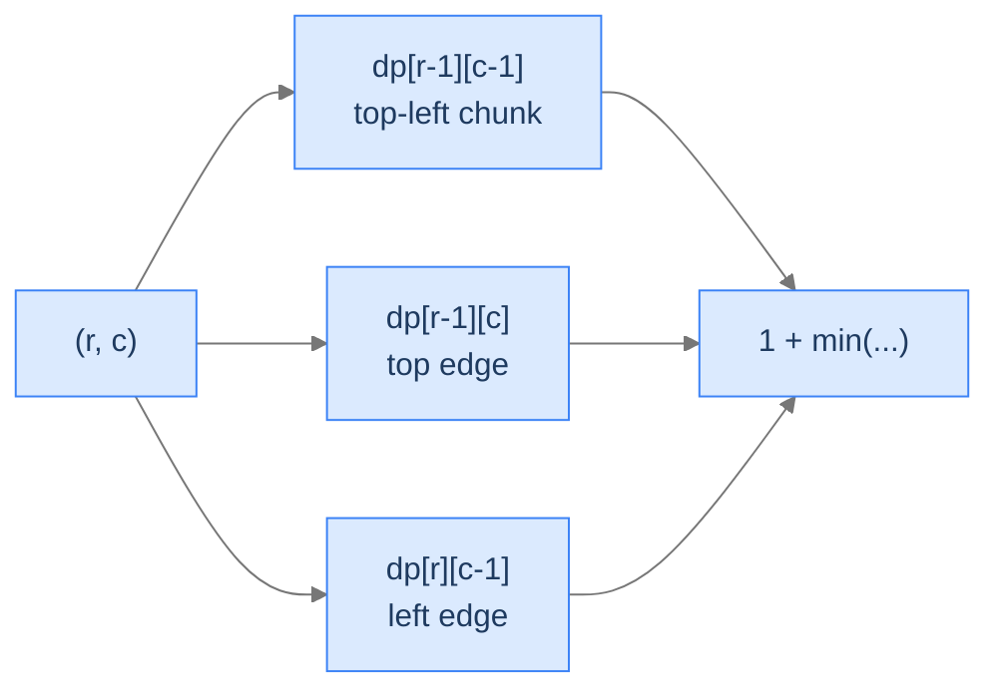
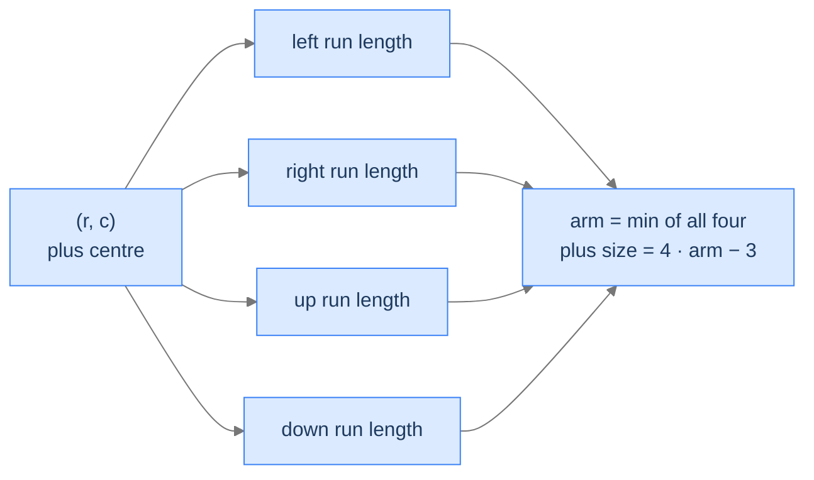

# 17. The 2D-Grid Pattern

When the data lives in a 2D grid — pixels in an image, cells in a board game, characters in a tile map — the DP shape changes. State naturally becomes `(r, c)` over the grid coordinates; transitions move between adjacent cells (up, down, left, right, sometimes diagonal); and the answer is either a single optimum read from one corner or an aggregate over the whole grid. This pattern shows up in image processing, robot pathfinding, terrain analysis, and any "walk a 2D world" problem.

By the end of this lesson you'll have written four canonical 2D-grid DPs: **longest ascending route** (the one with neighbours of higher value), **largest square area of 1s**, **destination path count** (under a cost constraint), and **largest plus of 1s**. Each illustrates a different transition structure — DFS-with-memo, neighbour-min-plus-1, count-aggregator with a budget, and four parallel direction-arrays — covering the breadth of what 2D-grid DP looks like.

## Table of contents

1. [The 2D-Grid Pattern](#the-2d-grid-pattern)
2. [Longest Ascending Route](#longest-ascending-route)
3. [Largest Square Area of 1s](#largest-square-area-of-1s)
4. [Destination Path Count](#destination-path-count)
5. [Largest Plus of 1s](#largest-plus-of-1s)
6. [Final Takeaway](#final-takeaway)

***

# The 2D-Grid Pattern

The pattern's three flavours:

1. **Origin-to-target** — `dp[r][c]` is the answer for cell `(r, c)`; transitions read from cells "earlier in the traversal." Examples: minimum-sum path, count of paths.
2. **Local optimum at every cell** — `dp[r][c]` measures something *ending at* or *centered at* `(r, c)`. Take the max across all cells. Examples: largest square of 1s, largest plus of 1s.
3. **DFS with memoization** — when transitions can move in *any* direction (not just down/right), iteration order is hard; recursion + memo is cleaner. Example: longest ascending route.

```d2
direction: right
flow: "Three flavours of 2D-grid DP" {
  grid-rows: 1
  grid-columns: 3
  grid-gap: 20
  f1: |md
    **Origin → target**
    Two nested loops
    Read up/left
    Answer at target cell
  |
  f2: |md
    **Local optimum**
    Two nested loops
    Track running max
    Answer is max-over-grid
  |
  f3: |md
    **Free-direction DFS**
    Recursion + cache
    Read in 4 directions
    Answer is max-over-grid
  |
}
```

<p align="center"><strong>Same 2D state, three traversal shapes. Pick the one that matches the transition rule of your problem.</strong></p>

> *Predict before reading on — for "minimum-sum path from top-left to bottom-right with right/down moves only", which flavour applies?*

Origin-to-target. `dp[r][c] = grid[r][c] + min(dp[r-1][c], dp[r][c-1])`. Two nested loops left-to-right, top-to-bottom. Answer is `dp[rows-1][cols-1]`.

---

## Key Takeaway

2D-grid DP states are `(r, c)`. Transition direction selects the traversal: directional → loops; free-direction → DFS+memo; "every cell as candidate" → loops + running max.

***

# Longest Ascending Route

## The Problem

Given an `n × m` grid of integers, find the length of the longest path along which strictly-increasing values appear. Moves are 4-connected (up/down/left/right). Diagonals don't count.

```
Input:  matrix = [[1, 2, 9],
                  [5, 3, 8],
                  [4, 6, 7]]
Output: 7                 Path: 1 → 2 → 3 → 6 → 7 → 8 → 9 (snakes through the grid)

Input:  matrix = [[1, 2, 3],
                  [4, 5, 6],
                  [7, 8, 9]]
Output: 5                 Multiple longest paths; e.g. 1 → 2 → 3 → 6 → 9
```

## The Recurrence — DFS with Memoization

`dp[r][c]` = length of the longest strictly-ascending path *starting* at `(r, c)`. For each of the 4 neighbours `(r', c')` with `matrix[r'][c'] > matrix[r][c]`, recurse and take 1 plus that:
```
dp[r][c] = 1 + max over up-neighbour ascending of dp[r'][c']
```
If no neighbour is strictly greater, `dp[r][c] = 1` (just the cell itself).

The natural fill order is *anti-topological* — from peaks downward — but the simplest implementation is a DFS with memoization. The memo prevents re-exploring the same `(r, c)` once its value is settled.

> *Pause. Why does the strict-increase rule guarantee no cycles? Predict the consequence.*

Because every edge points to a strictly greater value, no path can revisit a cell — that would require returning to a smaller value somewhere, contradicting monotonicity. The recursion DAG is acyclic, so DFS terminates after each cell is visited at most once.

## The Solution


```pseudocode
# Longest strictly increasing path on a grid. dp[r][c] memoizes the answer starting at (r, c).
DIRS ← [(−1, 0), (1, 0), (0, −1), (0, 1)]

function longestAscendingRoute(matrix):
    if matrix is empty OR matrix[0] is empty: return 0
    rows ← length(matrix); cols ← length(matrix[0])
    dp ← rows × cols grid filled with −1
    best ← 0
    for r from 0 to rows − 1:
        for c from 0 to cols − 1:
            best ← max(best, dfs(matrix, r, c, dp, rows, cols))
    return best

function dfs(matrix, r, c, dp, rows, cols):
    if dp[r][c] ≠ −1:
        return dp[r][c]
    best ← 1                                       # the cell itself counts as length 1
    for each (dr, dc) in DIRS:
        nr ← r + dr; nc ← c + dc
        if 0 ≤ nr < rows AND 0 ≤ nc < cols AND matrix[nr][nc] > matrix[r][c]:
            best ← max(best, 1 + dfs(matrix, nr, nc, dp, rows, cols))
    dp[r][c] ← best
    return best
```

```python run
from typing import List

class Solution:
    def longest_ascending_route(self, matrix: List[List[int]]) -> int:
        if not matrix or not matrix[0]:
            return 0
        rows, cols = len(matrix), len(matrix[0])
        # dp[r][c] = longest ascending path starting at (r, c).
        dp: List[List[int]] = [[-1] * cols for _ in range(rows)]
        directions = ((-1, 0), (1, 0), (0, -1), (0, 1))

        def dfs(r: int, c: int) -> int:
            if dp[r][c] != -1:
                return dp[r][c]
            best = 1                                 # The cell itself counts as length 1
            for dr, dc in directions:
                nr, nc = r + dr, c + dc
                if 0 <= nr < rows and 0 <= nc < cols and matrix[nr][nc] > matrix[r][c]:
                    best = max(best, 1 + dfs(nr, nc))
            dp[r][c] = best
            return best

        return max(dfs(r, c) for r in range(rows) for c in range(cols))


if __name__ == "__main__":
    sol = Solution()
    print(sol.longest_ascending_route([[1, 2, 9], [5, 3, 8], [4, 6, 7]]))   # 7
    print(sol.longest_ascending_route([[1, 2, 3], [4, 5, 6], [7, 8, 9]]))   # 5
```

```java run
public class Main {
    static class Solution {
        private int[][] dp;
        private int[][] mat;
        private int rows, cols;
        private final int[][] DIR = {{-1,0},{1,0},{0,-1},{0,1}};

        private int dfs(int r, int c) {
            if (dp[r][c] != -1) return dp[r][c];
            int best = 1;
            for (int[] d : DIR) {
                int nr = r + d[0], nc = c + d[1];
                if (nr >= 0 && nr < rows && nc >= 0 && nc < cols && mat[nr][nc] > mat[r][c]) {
                    best = Math.max(best, 1 + dfs(nr, nc));
                }
            }
            dp[r][c] = best;
            return best;
        }

        public int longestAscendingRoute(int[][] matrix) {
            if (matrix.length == 0 || matrix[0].length == 0) return 0;
            rows = matrix.length; cols = matrix[0].length; mat = matrix;
            dp = new int[rows][cols];
            for (int[] row : dp) java.util.Arrays.fill(row, -1);
            int ans = 0;
            for (int r = 0; r < rows; r++) for (int c = 0; c < cols; c++) ans = Math.max(ans, dfs(r, c));
            return ans;
        }
    }

    public static void main(String[] args) {
        System.out.println(new Solution().longestAscendingRoute(new int[][]{{1,2,9},{5,3,8},{4,6,7}}));   // 7
    }
}
```

```c run
#include <stdio.h>

int dp[101][101];
int rows_g, cols_g;
int (*mat_g)[101];
int dx_g[] = {-1, 1, 0, 0};
int dy_g[] = {0, 0, -1, 1};

int dfs(int r, int c) {
    if (dp[r][c] != -1) return dp[r][c];
    int best = 1;
    for (int i = 0; i < 4; i++) {
        int nr = r + dx_g[i], nc = c + dy_g[i];
        if (nr >= 0 && nr < rows_g && nc >= 0 && nc < cols_g && mat_g[nr][nc] > mat_g[r][c]) {
            int cand = 1 + dfs(nr, nc);
            if (cand > best) best = cand;
        }
    }
    dp[r][c] = best;
    return best;
}

int longest_ascending_route(int matrix[][101], int rows, int cols) {
    if (rows == 0 || cols == 0) return 0;
    rows_g = rows; cols_g = cols; mat_g = matrix;
    for (int r = 0; r < rows; r++) for (int c = 0; c < cols; c++) dp[r][c] = -1;
    int ans = 0;
    for (int r = 0; r < rows; r++) for (int c = 0; c < cols; c++) {
        int v = dfs(r, c);
        if (v > ans) ans = v;
    }
    return ans;
}

int main(void) {
    int m[101][101] = {{1,2,9},{5,3,8},{4,6,7}};
    printf("%d\n", longest_ascending_route(m, 3, 3));   /* 7 */
    return 0;
}
```

```scala run
object Main extends App {
  class Solution {
    private var dp: Array[Array[Int]] = _
    private var mat: Array[Array[Int]] = _
    private var rows = 0; private var cols = 0
    private val DR = Array(-1, 1, 0, 0); private val DC = Array(0, 0, -1, 1)

    private def dfs(r: Int, c: Int): Int = {
      if (dp(r)(c) != -1) return dp(r)(c)
      var best = 1
      for (i <- 0 until 4) {
        val nr = r + DR(i); val nc = c + DC(i)
        if (nr >= 0 && nr < rows && nc >= 0 && nc < cols && mat(nr)(nc) > mat(r)(c)) {
          best = math.max(best, 1 + dfs(nr, nc))
        }
      }
      dp(r)(c) = best; best
    }

    def longestAscendingRoute(matrix: Array[Array[Int]]): Int = {
      if (matrix.isEmpty || matrix(0).isEmpty) return 0
      rows = matrix.length; cols = matrix(0).length; mat = matrix
      dp = Array.fill(rows, cols)(-1)
      var ans = 0
      for (r <- 0 until rows; c <- 0 until cols) ans = math.max(ans, dfs(r, c))
      ans
    }
  }

  println(new Solution().longestAscendingRoute(Array(Array(1,2,9), Array(5,3,8), Array(4,6,7))))   // 7
}
```


## Complexity

| Aspect | Cost |
|---|---|
| Time | `O(rows × cols)` — each cell's DFS is O(1) thanks to memoization |
| Space | `O(rows × cols)` for the memo table + recursion stack |

***

# Largest Square Area of 1s

## The Problem

Given a binary matrix of 0s and 1s, find the area of the largest *axis-aligned square* of 1s.

```
Input:  grid = [[1, 1, 0, 0],
                [0, 0, 1, 1],
                [1, 0, 1, 1],
                [1, 0, 0, 0]]
Output: 4                       2 × 2 square at rows 1-2, cols 2-3

Input:  grid = [[1, 1, 0, 0],
                [0, 1, 1, 1],
                [1, 1, 1, 1],
                [1, 0, 0, 0]]
Output: 4                       Multiple 2 × 2 squares
```

## The Recurrence — Three-Neighbour Min Plus One

`dp[r][c]` = side length of the largest square *whose bottom-right corner is* `(r, c)`. If `grid[r][c] = 0`, it can't be a corner: `dp[r][c] = 0`. If `grid[r][c] = 1`:
```
dp[r][c] = 1 + min(dp[r-1][c-1], dp[r-1][c], dp[r][c-1])
```

Why three neighbours? A `k × k` square at `(r, c)` requires:
- A `(k-1) × (k-1)` square at `(r-1, c-1)` (the top-left chunk).
- A `(k-1) × (k-1)` square at `(r-1, c)` (covering the top edge).
- A `(k-1) × (k-1)` square at `(r, c-1)` (covering the left edge).

The smallest of these three caps the size of the square that can grow from `(r, c)`. Plus one for the cell itself.



<p align="center"><strong>The square ending at <code>(r, c)</code> can only be as large as the smallest of three predecessor squares — the top-left, top, and left neighbours. Plus one for the current cell.</strong></p>

> *Pause. Why is min the right aggregator here? Predict the consequence of using max.*

Min ensures the square is *fully* filled with 1s. If any of the three neighbours has a smaller largest-square, that's the binding constraint — extending beyond would require 1s in cells that aren't 1. Using max would let one good corner override missing cells elsewhere — wrong.

## The Solution


```pseudocode
# dp[r][c] = side length of the largest all-1 square whose bottom-right is (r, c).
function largestSquareArea(matrix):
    if matrix is empty OR matrix[0] is empty: return 0
    rows ← length(matrix); cols ← length(matrix[0])
    dp ← rows × cols grid of zeros
    maxSide ← 0
    for r from 0 to rows − 1:
        for c from 0 to cols − 1:
            if matrix[r][c] = 1:
                if r = 0 OR c = 0:
                    dp[r][c] ← 1                  # edge cells: largest square is 1×1
                else:
                    dp[r][c] ← 1 + min(dp[r − 1][c − 1], dp[r − 1][c], dp[r][c − 1])
                maxSide ← max(maxSide, dp[r][c])
    return maxSide × maxSide
```

```python run
from typing import List

class Solution:
    def largest_square_area(self, matrix: List[List[int]]) -> int:
        if not matrix or not matrix[0]:
            return 0
        rows, cols = len(matrix), len(matrix[0])
        dp: List[List[int]] = [[0] * cols for _ in range(rows)]
        max_side = 0
        for r in range(rows):
            for c in range(cols):
                if matrix[r][c] == 1:
                    if r == 0 or c == 0:
                        dp[r][c] = 1                        # Edge cells: max square is 1 × 1
                    else:
                        dp[r][c] = 1 + min(dp[r - 1][c - 1], dp[r - 1][c], dp[r][c - 1])
                    if dp[r][c] > max_side:
                        max_side = dp[r][c]
        return max_side * max_side


if __name__ == "__main__":
    sol = Solution()
    print(sol.largest_square_area([[1, 1, 0, 0], [0, 0, 1, 1], [1, 0, 1, 1], [1, 0, 0, 0]]))   # 4
```

```java run
public class Main {
    static class Solution {
        public int largestSquareArea(int[][] matrix) {
            if (matrix.length == 0 || matrix[0].length == 0) return 0;
            int rows = matrix.length, cols = matrix[0].length;
            int[][] dp = new int[rows][cols];
            int maxSide = 0;
            for (int r = 0; r < rows; r++) {
                for (int c = 0; c < cols; c++) {
                    if (matrix[r][c] == 1) {
                        dp[r][c] = (r == 0 || c == 0) ? 1
                                 : 1 + Math.min(dp[r-1][c-1], Math.min(dp[r-1][c], dp[r][c-1]));
                        if (dp[r][c] > maxSide) maxSide = dp[r][c];
                    }
                }
            }
            return maxSide * maxSide;
        }
    }

    public static void main(String[] args) {
        int[][] g = {{1,1,0,0},{0,0,1,1},{1,0,1,1},{1,0,0,0}};
        System.out.println(new Solution().largestSquareArea(g));   // 4
    }
}
```

```c run
#include <stdio.h>

int dp[1001][1001];

int largest_square_area(int matrix[][1001], int rows, int cols) {
    if (rows == 0 || cols == 0) return 0;
    int max_side = 0;
    for (int r = 0; r < rows; r++) for (int c = 0; c < cols; c++) dp[r][c] = 0;
    for (int r = 0; r < rows; r++) {
        for (int c = 0; c < cols; c++) {
            if (matrix[r][c] == 1) {
                if (r == 0 || c == 0) dp[r][c] = 1;
                else {
                    int m = dp[r-1][c-1];
                    if (dp[r-1][c] < m) m = dp[r-1][c];
                    if (dp[r][c-1] < m) m = dp[r][c-1];
                    dp[r][c] = 1 + m;
                }
                if (dp[r][c] > max_side) max_side = dp[r][c];
            }
        }
    }
    return max_side * max_side;
}

int main(void) {
    int g[4][1001] = {{1,1,0,0},{0,0,1,1},{1,0,1,1},{1,0,0,0}};
    printf("%d\n", largest_square_area(g, 4, 4));   /* 4 */
    return 0;
}
```

```scala run
object Main extends App {
  class Solution {
    def largestSquareArea(matrix: Array[Array[Int]]): Int = {
      if (matrix.isEmpty || matrix(0).isEmpty) return 0
      val rows = matrix.length; val cols = matrix(0).length
      val dp = Array.fill(rows, cols)(0)
      var maxSide = 0
      for (r <- 0 until rows; c <- 0 until cols) {
        if (matrix(r)(c) == 1) {
          dp(r)(c) = if (r == 0 || c == 0) 1
                     else 1 + math.min(dp(r-1)(c-1), math.min(dp(r-1)(c), dp(r)(c-1)))
          if (dp(r)(c) > maxSide) maxSide = dp(r)(c)
        }
      }
      maxSide * maxSide
    }
  }

  println(new Solution().largestSquareArea(Array(Array(1,1,0,0), Array(0,0,1,1), Array(1,0,1,1), Array(1,0,0,0))))   // 4
}
```


## Complexity

| Aspect | Cost |
|---|---|
| Time | `O(rows × cols)` |
| Space | `O(rows × cols)` (reducible to `O(cols)` with rolling rows) |

***

# Destination Path Count

## The Problem

Given an `n × m` matrix of non-negative cell costs and a target cost, count the number of paths from `(0, 0)` to `(n-1, m-1)` whose summed costs equal the target. Moves are right or down only.

```
Input:  matrix = [[1, 2, 9],
                  [5, 3, 8],
                  [4, 6, 7]],
        cost = 19
Output: 1                          One path summing to 19

Input:  matrix = [[1, 2, 3],
                  [1, 5, 6],
                  [2, 8, 9]],
        cost = 21
Output: 2                          Two paths sum to 21
```

## The Recurrence — 3D State

Add a third dimension to the standard "count paths to `(r, c)`" DP: the remaining budget. `dp[r][c][k]` = number of paths from `(0, 0)` to `(r, c)` whose costs sum to exactly `k`.

```
dp[r][c][k] = dp[r-1][c][k - matrix[r][c]] + dp[r][c-1][k - matrix[r][c]]
              (with appropriate guards for r=0, c=0, k < matrix[r][c])
```

Base case: `dp[0][0][matrix[0][0]] = 1` (the only path of length 1 hits `matrix[0][0]`).

For implementation, recursion + memoization is cleaner than building a giant 3D array. We memoize on the tuple `(r, c, k)`.

> *Pause. Why is the state 3D, not 2D? Predict the answer.*

Because the answer at `(r, c)` depends on the *budget* still available — two different remaining budgets give two different answers, and the budget changes as we walk. 2D `(r, c)` doesn't have enough information.

## The Solution


```pseudocode
# Count grid paths from (0, 0) to (rows−1, cols−1) (right/down only) whose cell sums equal `cost`.
# State = (r, c, remaining). Cache it.
function destinationPathCount(matrix, cost):
    if matrix is empty OR matrix[0] is empty: return 0
    rows ← length(matrix); cols ← length(matrix[0])
    memo ← empty Map: (Integer, Integer, Integer) → Integer
    return helper(matrix, rows − 1, cols − 1, cost, memo)

function helper(matrix, r, c, remaining, memo):
    if remaining < 0: return 0                    # overshot the budget
    if r = 0 AND c = 0:
        return 1 if matrix[0][0] = remaining else 0
    if (r, c, remaining) is in memo:
        return memo[(r, c, remaining)]
    fromTop  ← helper(matrix, r − 1, c, remaining − matrix[r][c], memo) if r > 0 else 0
    fromLeft ← helper(matrix, r, c − 1, remaining − matrix[r][c], memo) if c > 0 else 0
    memo[(r, c, remaining)] ← fromTop + fromLeft
    return memo[(r, c, remaining)]
```

```python run
from typing import List, Dict, Tuple
from functools import lru_cache

class Solution:
    def destination_path_count(self, matrix: List[List[int]], cost: int) -> int:
        if not matrix or not matrix[0]:
            return 0
        rows, cols = len(matrix), len(matrix[0])

        @lru_cache(maxsize=None)
        def helper(r: int, c: int, remaining: int) -> int:
            if remaining < 0:
                return 0                                     # Overshot the budget
            if r == 0 and c == 0:
                return 1 if matrix[0][0] == remaining else 0
            from_top = helper(r - 1, c, remaining - matrix[r][c]) if r > 0 else 0
            from_left = helper(r, c - 1, remaining - matrix[r][c]) if c > 0 else 0
            return from_top + from_left

        return helper(rows - 1, cols - 1, cost)


if __name__ == "__main__":
    sol = Solution()
    print(sol.destination_path_count([[1, 2, 9], [5, 3, 8], [4, 6, 7]], 19))   # 1
    print(sol.destination_path_count([[1, 2, 3], [1, 5, 6], [2, 8, 9]], 21))   # 2
```

```java run
import java.util.*;

public class Main {
    static class Solution {
        public int destinationPathCount(int[][] matrix, int cost) {
            if (matrix.length == 0 || matrix[0].length == 0) return 0;
            Map<Long, Integer> memo = new HashMap<>();
            return helper(matrix, matrix.length - 1, matrix[0].length - 1, cost, memo);
        }

        private int helper(int[][] m, int r, int c, int rem, Map<Long, Integer> memo) {
            if (rem < 0) return 0;
            if (r == 0 && c == 0) return m[0][0] == rem ? 1 : 0;
            long key = ((long) r * 10001 + c) * 100001L + rem;
            Integer cached = memo.get(key);
            if (cached != null) return cached;
            int top = (r > 0) ? helper(m, r - 1, c, rem - m[r][c], memo) : 0;
            int left = (c > 0) ? helper(m, r, c - 1, rem - m[r][c], memo) : 0;
            int ans = top + left;
            memo.put(key, ans);
            return ans;
        }
    }

    public static void main(String[] args) {
        int[][] m = {{1,2,9},{5,3,8},{4,6,7}};
        System.out.println(new Solution().destinationPathCount(m, 19));   // 1
    }
}
```

```c run
#include <stdio.h>
#include <string.h>

#define MAX_R 21
#define MAX_C 21
#define MAX_K 1001

int memo[MAX_R][MAX_C][MAX_K];
int mat_g[MAX_R][MAX_C];

int helper(int r, int c, int rem) {
    if (rem < 0) return 0;
    if (r == 0 && c == 0) return mat_g[0][0] == rem ? 1 : 0;
    if (memo[r][c][rem] != -1) return memo[r][c][rem];
    int top  = (r > 0) ? helper(r - 1, c, rem - mat_g[r][c]) : 0;
    int left = (c > 0) ? helper(r, c - 1, rem - mat_g[r][c]) : 0;
    return memo[r][c][rem] = top + left;
}

int destination_path_count(int rows, int cols, int target) {
    memset(memo, -1, sizeof memo);
    return helper(rows - 1, cols - 1, target);
}

int main(void) {
    int m[3][3] = {{1,2,9},{5,3,8},{4,6,7}};
    for (int r = 0; r < 3; r++) for (int c = 0; c < 3; c++) mat_g[r][c] = m[r][c];
    printf("%d\n", destination_path_count(3, 3, 19));   /* 1 */
    return 0;
}
```

```scala run
object Main extends App {
  class Solution {
    def destinationPathCount(matrix: Array[Array[Int]], cost: Int): Int = {
      if (matrix.isEmpty || matrix(0).isEmpty) return 0
      val memo = scala.collection.mutable.Map.empty[(Int, Int, Int), Int]
      def helper(r: Int, c: Int, rem: Int): Int = {
        if (rem < 0) return 0
        if (r == 0 && c == 0) return if (matrix(0)(0) == rem) 1 else 0
        memo.getOrElseUpdate((r, c, rem), {
          val top  = if (r > 0) helper(r - 1, c, rem - matrix(r)(c)) else 0
          val left = if (c > 0) helper(r, c - 1, rem - matrix(r)(c)) else 0
          top + left
        })
      }
      helper(matrix.length - 1, matrix(0).length - 1, cost)
    }
  }

  println(new Solution().destinationPathCount(Array(Array(1,2,9), Array(5,3,8), Array(4,6,7)), 19))   // 1
}
```


## Complexity

| Aspect | Cost |
|---|---|
| Time | `O(rows × cols × cost)` — three-dimensional state, each cell `O(1)` work |
| Space | `O(rows × cols × cost)` for the memo |

***

# Largest Plus of 1s

## The Problem

Given a binary matrix, find the size (number of cells) of the largest plus-shape made entirely of 1s. A plus has a centre and four arms of equal length extending up/down/left/right.

```
Input:  grid = [[1, 1, 1, 0],
                [0, 1, 1, 1],
                [1, 1, 1, 1],
                [1, 0, 1, 0]]
Output: 5                       Plus of arm length 1: centre + 4 arm cells

Input:  grid = [[1, 1, 1, 1, 1],
                [1, 1, 1, 1, 1],
                [1, 1, 1, 1, 1],
                [1, 1, 1, 1, 1],
                [1, 1, 1, 1, 1]]
Output: 9                       Plus of arm length 2: centre + 8 arm cells
```

## The Recurrence — Four Direction Arrays

Build four 2D arrays, one per direction, each measuring how far a contiguous run of 1s extends *to* `(r, c)` from that direction (inclusive of `(r, c)`):
- `left[r][c]` = consecutive 1s ending at `(r, c)` going leftward.
- `right[r][c]` = consecutive 1s ending at `(r, c)` going rightward.
- `up[r][c]` = consecutive 1s ending at `(r, c)` going upward.
- `down[r][c]` = consecutive 1s ending at `(r, c)` going downward.

For a plus centred at `(r, c)`, each arm needs a contiguous run of 1s on that side. The maximum arm length (including the centre) is `min(left, right, up, down)`. The plus has `1 + 4 × (arm − 1)` cells = `4 × arm − 3` total.



<p align="center"><strong>Four direction arrays, each computed in one pass over the grid. The plus centred at any cell is bounded by the shortest arm.</strong></p>

> *Pause. Why is `4 × arm − 3` the cell count, not `4 × arm + 1`?*

Each arm of length `arm` *includes the centre*. If you sum four arms, you count the centre four times — once per arm. To correct, subtract the three over-counted centres: `4 × arm − 3`. (If you used arm length *excluding* the centre, the formula would be `4 × arm + 1` — same answer, different convention.)

## The Solution


```pseudocode
# Compute four DP tables — left/right/up/down run lengths of 1s through each cell.
# The plus centred at (r, c) has arm length min of all four; size = 4·arm − 3.
function largestPlusOfOnes(matrix):
    if matrix is empty OR matrix[0] is empty: return 0
    rows ← length(matrix); cols ← length(matrix[0])
    left  ← rows × cols grid of zeros
    right ← rows × cols grid of zeros
    up    ← rows × cols grid of zeros
    down  ← rows × cols grid of zeros

    # Forward pass — left and up run lengths (cell included).
    for r from 0 to rows − 1:
        for c from 0 to cols − 1:
            if matrix[r][c] = 1:
                left[r][c] ← 1 + (left[r][c − 1] if c > 0 else 0)
                up[r][c]   ← 1 + (up[r − 1][c]   if r > 0 else 0)

    # Backward pass — right and down run lengths.
    for r from rows − 1 down to 0:
        for c from cols − 1 down to 0:
            if matrix[r][c] = 1:
                right[r][c] ← 1 + (right[r][c + 1] if c < cols − 1 else 0)
                down[r][c]  ← 1 + (down[r + 1][c]  if r < rows − 1 else 0)

    maxSize ← 0
    for r from 0 to rows − 1:
        for c from 0 to cols − 1:
            if matrix[r][c] = 1:
                arm ← min(left[r][c], right[r][c], up[r][c], down[r][c])
                size ← 4 × arm − 3                # plus has 1 + 4·(arm − 1) cells
                if size > maxSize:
                    maxSize ← size
    return maxSize
```

```python run
from typing import List

class Solution:
    def largest_plus_of_ones(self, matrix: List[List[int]]) -> int:
        if not matrix or not matrix[0]:
            return 0
        rows, cols = len(matrix), len(matrix[0])
        left = [[0] * cols for _ in range(rows)]
        right = [[0] * cols for _ in range(rows)]
        up = [[0] * cols for _ in range(rows)]
        down = [[0] * cols for _ in range(rows)]
        # Forward pass: left and up run lengths (including the cell).
        for r in range(rows):
            for c in range(cols):
                if matrix[r][c] == 1:
                    left[r][c] = 1 + (left[r][c - 1] if c > 0 else 0)
                    up[r][c]   = 1 + (up[r - 1][c]   if r > 0 else 0)
        # Backward pass: right and down run lengths.
        for r in range(rows - 1, -1, -1):
            for c in range(cols - 1, -1, -1):
                if matrix[r][c] == 1:
                    right[r][c] = 1 + (right[r][c + 1] if c < cols - 1 else 0)
                    down[r][c]  = 1 + (down[r + 1][c]  if r < rows - 1 else 0)
        max_size = 0
        for r in range(rows):
            for c in range(cols):
                if matrix[r][c] == 1:
                    arm = min(left[r][c], right[r][c], up[r][c], down[r][c])
                    size = 4 * arm - 3                    # Plus has 1 + 4·(arm-1) cells
                    if size > max_size:
                        max_size = size
        return max_size


if __name__ == "__main__":
    sol = Solution()
    print(sol.largest_plus_of_ones(
        [[1, 1, 1, 0], [0, 1, 1, 1], [1, 1, 1, 1], [1, 0, 1, 0]]))   # 5
    print(sol.largest_plus_of_ones(
        [[1]*5, [1]*5, [1]*5, [1]*5, [1]*5]))                        # 9
```

```java run
public class Main {
    static class Solution {
        public int largestPlusOfOnes(int[][] matrix) {
            if (matrix.length == 0 || matrix[0].length == 0) return 0;
            int rows = matrix.length, cols = matrix[0].length;
            int[][] left  = new int[rows][cols];
            int[][] right = new int[rows][cols];
            int[][] up    = new int[rows][cols];
            int[][] down  = new int[rows][cols];
            for (int r = 0; r < rows; r++) for (int c = 0; c < cols; c++) {
                if (matrix[r][c] == 1) {
                    left[r][c] = 1 + (c > 0 ? left[r][c - 1] : 0);
                    up[r][c]   = 1 + (r > 0 ? up[r - 1][c]   : 0);
                }
            }
            for (int r = rows - 1; r >= 0; r--) for (int c = cols - 1; c >= 0; c--) {
                if (matrix[r][c] == 1) {
                    right[r][c] = 1 + (c < cols - 1 ? right[r][c + 1] : 0);
                    down[r][c]  = 1 + (r < rows - 1 ? down[r + 1][c]  : 0);
                }
            }
            int maxSize = 0;
            for (int r = 0; r < rows; r++) for (int c = 0; c < cols; c++) {
                if (matrix[r][c] == 1) {
                    int arm = Math.min(Math.min(left[r][c], right[r][c]), Math.min(up[r][c], down[r][c]));
                    int size = 4 * arm - 3;
                    if (size > maxSize) maxSize = size;
                }
            }
            return maxSize;
        }
    }

    public static void main(String[] args) {
        int[][] g = {{1,1,1,0},{0,1,1,1},{1,1,1,1},{1,0,1,0}};
        System.out.println(new Solution().largestPlusOfOnes(g));   // 5
    }
}
```

```c run
#include <stdio.h>

int left_a[101][101], right_a[101][101], up_a[101][101], down_a[101][101];

int min4(int a, int b, int c, int d) {
    int m = a; if (b < m) m = b; if (c < m) m = c; if (d < m) m = d; return m;
}

int largest_plus_of_ones(int matrix[][101], int rows, int cols) {
    if (rows == 0 || cols == 0) return 0;
    for (int r = 0; r < rows; r++) for (int c = 0; c < cols; c++) {
        left_a[r][c] = 0; right_a[r][c] = 0; up_a[r][c] = 0; down_a[r][c] = 0;
    }
    for (int r = 0; r < rows; r++) for (int c = 0; c < cols; c++) {
        if (matrix[r][c] == 1) {
            left_a[r][c] = 1 + (c > 0 ? left_a[r][c - 1] : 0);
            up_a[r][c]   = 1 + (r > 0 ? up_a[r - 1][c]   : 0);
        }
    }
    for (int r = rows - 1; r >= 0; r--) for (int c = cols - 1; c >= 0; c--) {
        if (matrix[r][c] == 1) {
            right_a[r][c] = 1 + (c < cols - 1 ? right_a[r][c + 1] : 0);
            down_a[r][c]  = 1 + (r < rows - 1 ? down_a[r + 1][c]  : 0);
        }
    }
    int max_size = 0;
    for (int r = 0; r < rows; r++) for (int c = 0; c < cols; c++) {
        if (matrix[r][c] == 1) {
            int arm = min4(left_a[r][c], right_a[r][c], up_a[r][c], down_a[r][c]);
            int size = 4 * arm - 3;
            if (size > max_size) max_size = size;
        }
    }
    return max_size;
}

int main(void) {
    int g[4][101] = {{1,1,1,0},{0,1,1,1},{1,1,1,1},{1,0,1,0}};
    printf("%d\n", largest_plus_of_ones(g, 4, 4));   /* 5 */
    return 0;
}
```

```scala run
object Main extends App {
  class Solution {
    def largestPlusOfOnes(matrix: Array[Array[Int]]): Int = {
      if (matrix.isEmpty || matrix(0).isEmpty) return 0
      val rows = matrix.length; val cols = matrix(0).length
      val left = Array.fill(rows, cols)(0); val right = Array.fill(rows, cols)(0)
      val up = Array.fill(rows, cols)(0); val down = Array.fill(rows, cols)(0)
      for (r <- 0 until rows; c <- 0 until cols) {
        if (matrix(r)(c) == 1) {
          left(r)(c) = 1 + (if (c > 0) left(r)(c - 1) else 0)
          up(r)(c)   = 1 + (if (r > 0) up(r - 1)(c)   else 0)
        }
      }
      for (r <- rows - 1 to 0 by -1; c <- cols - 1 to 0 by -1) {
        if (matrix(r)(c) == 1) {
          right(r)(c) = 1 + (if (c < cols - 1) right(r)(c + 1) else 0)
          down(r)(c)  = 1 + (if (r < rows - 1) down(r + 1)(c)  else 0)
        }
      }
      var maxSize = 0
      for (r <- 0 until rows; c <- 0 until cols) {
        if (matrix(r)(c) == 1) {
          val arm = math.min(math.min(left(r)(c), right(r)(c)), math.min(up(r)(c), down(r)(c)))
          val size = 4 * arm - 3
          if (size > maxSize) maxSize = size
        }
      }
      maxSize
    }
  }

  println(new Solution().largestPlusOfOnes(Array(Array(1,1,1,0), Array(0,1,1,1), Array(1,1,1,1), Array(1,0,1,0))))   // 5
}
```


## Complexity

| Aspect | Cost |
|---|---|
| Time | `O(rows × cols)` — two passes for the four direction arrays plus one for the answer |
| Space | `O(rows × cols)` for the four arrays |

***

# Final Takeaway

The 2D-grid pattern collapses a wide variety of "walk a 2D world" problems into one shape:

| Problem | Flavour | Aggregator |
|---|---|---|
| Longest ascending route | DFS + memo (free directions) | max |
| Largest square of 1s | Origin-to-target / local optimum | min + 1 |
| Destination path count | Origin-to-target with budget | sum |
| Largest plus of 1s | Local optimum (4 direction arrays) | min |

Each problem differs only in the transition rule and the aggregator. The state is always `(r, c)` (sometimes plus an extra dimension like a budget). Iteration order is dictated by the dependency direction — top-left-to-bottom-right when transitions read up/left, DFS+memo when transitions go in any direction. **You didn't just learn four grid problems. You internalised the *family* of 2D-grid DPs — recognise the transition rule, pick the iteration shape, choose the aggregator, and the recurrence writes itself.**

> *Transfer challenge for the next lesson:* Drop the grid; flatten back to 1D arrays. Now the question is "given an array of integers, what's the maximum sum of a contiguous subarray?" — Kadane's territory. But there's a **prefix-sum** angle: precompute cumulative sums and many subarray-statistics problems become O(1) lookups. Predict the recurrence's shape, and notice it's *not* DP in the table-fill sense.

<details>
<summary><strong>Answer</strong></summary>

`prefix[i]` = sum of `arr[0..i-1]`. Then `sum(arr[l..r]) = prefix[r + 1] - prefix[l]` is `O(1)` after a single linear-time precomputation. Many "find subarray with property X" problems reduce to "find indices `l, r` with `prefix[r] - prefix[l] = target`" — which is a hash-map lookup, not a DP. The next lesson formalises this as the **prefix-sum pattern** — one-pass precompute, then constant-time queries on any subarray.

</details>
