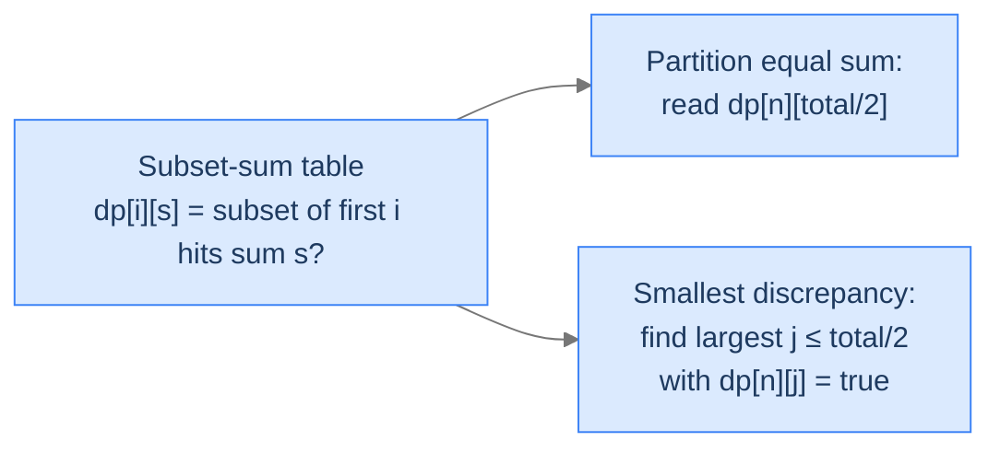

# The Subset-Sum Pattern

You saw subset sum in lesson 11 (knapsack applications) — a 2D boolean DP keyed on item count and remaining target. The pattern's structure:

```
dp[i][s] = dp[i - 1][s]                          — exclude arr[i - 1]
        OR (arr[i - 1] ≤ s AND dp[i - 1][s - arr[i - 1]])   — include arr[i - 1]
```

with base cases `dp[i][0] = true` (empty subset hits 0) and `dp[0][s > 0] = false` (no items can hit a positive sum).

Why give it a "pattern" lesson? Because two distinct downstream problems both reduce to "compute the subset-sum table, then read it differently."

> 🖼 Diagram — One DP table, two readings. The table is the same; only the question changes — which cell to consult, or which range to scan.


<p align="center"><strong>One DP table, two readings. The table is the same; only the question changes — which cell to consult, or which range to scan.</strong></p>

> *Pause. Why do partition-equal-sum and smallest-discrepancy share a table? Predict the connection.*

Both ask "what subset sums are reachable from this array?" Equal-sum partition wants the specific cell `dp[n][total/2]`. Smallest discrepancy wants the *largest* reachable sum at or below `total/2` — once you have one subset's sum `s`, the other has sum `total - s`, and their difference is `total - 2s`. Minimising the difference means maximising `s` (subject to `s ≤ total/2`). Both reductions are mechanical once the table exists.

## Where this shows up

Beyond the two problems in this lesson: target-sum (assign +/- to each element to hit a target), count of subsets summing to `s` (replace OR with sum, getting an int DP), the partition number-theoretic problems that show up in scheduling, and the `0/1` integer-knapsack feasibility variant.

---

## Key Takeaway

The subset-sum pattern is one DP table answering "which sums are reachable using which prefix of items." Many partition/discrepancy problems reduce to a one-line read of the table.

# Final Takeaway

The subset-sum pattern is one boolean DP that powers an entire family:

| Problem | Reduction |
|---|---|
| Subset sum | Direct: `dp[n][target]` |
| Partition equal sum | `dp[n][total / 2]` (with parity check) |
| Smallest discrepancy | Largest `s ≤ total / 2` with `dp[n][s] = true`; answer `total − 2s` |
| Target sum (assign +/−) | Equivalent to subset sum on `(total + target) / 2` |
| Count of subsets summing to `s` | Replace OR with sum, getting an int DP |

**You didn't just learn two more problems. You learned that a *single* boolean DP table — "which sums are achievable with which prefix" — is the substrate for many competitive-programming partition problems. Build the table; reformulate the question as a read of it; collect your answer.**

> *Transfer challenge for the next lesson:* Drop arrays of integers entirely. Now you have a 2D grid (rows × cols), and you're walking from the top-left corner to the bottom-right corner, moving only right or down. Can you compute the path with the smallest sum of cell values? Predict the recurrence shape — note that the state is naturally 2D in the *grid coordinates*, not in some derived index.

<details>
<summary><strong>Answer</strong></summary>

`dp[r][c]` = minimum-sum path from `(0, 0)` to `(r, c)`. Recurrence: `dp[r][c] = grid[r][c] + min(dp[r-1][c], dp[r][c-1])`. Base cases: row 0 and column 0 are running prefix sums. Same shape covers max-path, count-of-paths (replace min with sum), unique-paths-with-obstacles, and many other "walk a 2D grid" problems. The next lesson formalises this as the **2D-grid DP pattern**.

</details>

<!-- ============================================== -->
<!-- SWEEP 2 — missing sections (placeholders only) -->
<!-- ============================================== -->

<!-- TODO: Understanding the Pattern — missing, needs to be written -->
<!--       Guidance: umbrella H2 with the subsections below -->

<!-- TODO: Why Naive Isn't Enough — missing, needs to be written -->
<!--       Guidance: motivation for why the obvious approach fails -->

<!-- TODO: The Core Idea — missing, needs to be written -->
<!--       Guidance: one paragraph: the central trick -->

<!-- TODO: How the Pointers/Window Move — missing, needs to be written -->
<!--       Guidance: mechanics of the moving parts -->

<!-- TODO: The Generic Algorithm — missing, needs to be written -->
<!--       Guidance: numbered steps, no code -->

<!-- TODO: Generic Implementation — missing, needs to be written -->
<!--       Guidance: Python block + Java block of the skeleton -->

<!-- TODO: Complexity Analysis — missing, needs to be written -->
<!--       Guidance: table -->

<!-- TODO: Variants / Taxonomy — missing, needs to be written -->
<!--       Guidance: enumerate sub-shapes of this pattern -->

<!-- TODO: Identifying — missing, needs to be written -->
<!--       Guidance: per-variant: recognition checklist + canonical example -->

<!-- TODO: Recognition Checklist — missing, needs to be written -->
<!--       Guidance: 4-question diagnostic — the source of the Problem-section Diagnostic Questions -->

<!-- TODO: Canonical Example — missing, needs to be written -->
<!--       Guidance: fully worked example: brute force → optimised → template fit -->

<!-- TODO: Problems in This Category — missing, needs to be written -->
<!--       Guidance: table with links to the 02-problems/ files -->
