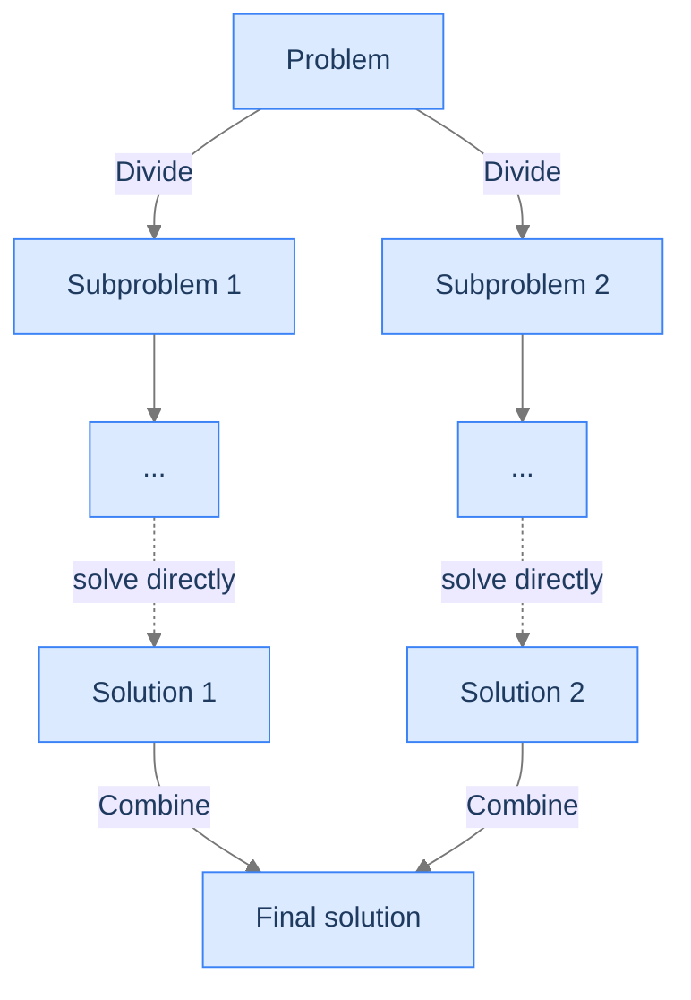

# 6. Quicksort

The four sorts before this one — bubble, selection, insertion, counting — work on the whole array at once. Each pass touches every element. The work scales as `O(n²)` (or `O(n + k)` for counting sort, but that one needs a small value range).

Quicksort takes a fundamentally different approach: **divide the work in half, recurse on both halves, combine.** The trick is the divide step: pick one element (the *pivot*) and partition the array so everything smaller ends up on the left and everything larger on the right. The pivot lands in its final sorted position. Now recurse on the two halves — each one a smaller sorting problem of the same shape.

The result: `O(n log n)` average time. Doubling the array size adds *one* more level of recursion. For a million elements, quicksort does ~20 million operations; bubble sort does ~10¹². That's the difference between a millisecond and a week.

By the end of this lesson you'll know the divide-and-conquer paradigm that powers quicksort (and merge sort, the Merge Sort lesson), the partition algorithm, why pivot selection matters, the `O(n²)` worst-case trap, and the trade-offs that make quicksort the most-used sort in production despite its non-existent stability.

## Table of contents

1. [Divide and conquer](#divide-and-conquer)
2. [Understanding quicksort](#understanding-quicksort)
3. [The partition step — Lomuto's scheme](#the-partition-step--lomutos-scheme)
4. [Implementation](#implementation)
5. [Complexity analysis](#complexity-analysis)
6. [Quicksort problem](#quicksort-problem)

***

# Divide and Conquer

Divide-and-conquer is an algorithmic paradigm that solves a problem by:

1. **Divide** — split the problem into smaller subproblems of the same kind.
2. **Conquer** — solve the subproblems (recursively, until they're trivial).
3. **Combine** — merge the subproblem solutions into a solution for the whole.



<p align="center"><strong>The divide-and-conquer pattern. Break the problem in half (or into a few pieces); solve each piece recursively; combine. Both quicksort (this lesson) and merge sort (the Merge Sort lesson) use this pattern.</strong></p>

The everyday example: studying for an exam by breaking the syllabus into chapters, mastering each chapter independently, then connecting the ideas at the end. The whole becomes manageable because each piece is small.

For sorting:
- **Quicksort** divides the array around a pivot, sorts each half recursively, *combines* by doing nothing — the array is already sorted because of how the partition step worked.
- **Merge sort** (the Merge Sort lesson) divides the array in half by index, sorts each half recursively, *combines* by merging the two sorted halves.

The two algorithms have different *divide* and *combine* strategies but the same overall shape. Both achieve `O(n log n)` average time.

---

## Why Divide and Conquer Beats `O(n²)`

A quadratic algorithm does `n` passes of `n` work each. Divide-and-conquer does `log n` levels of `n` work each — exponentially fewer levels.

```d2
direction: down

quad: "Quadratic — O(n²)\nn passes × n work = n²" {style.fill: "#fecaca"; style.stroke: "#dc2626"}
dac: "Divide and conquer — O(n log n)\nlog n levels × n work per level = n log n" {style.fill: "#bbf7d0"; style.stroke: "#16a34a"}

quad -> dac: each level halves the per-call problem size
```

<p align="center"><strong>The leverage. Halving the problem each step caps the recursion depth at <code>log n</code>; each level still does <code>O(n)</code> total work, so the total is <code>O(n log n)</code>.</strong></p>

For `n = 1,000,000`: `n² = 10¹²` operations vs `n log n ≈ 2 × 10⁷` operations — about 50,000× faster. The gap widens as `n` grows.

---

## Strengths and Limitations of D&C

| Strength | Detail |
|---|---|
| **Efficiency** | `O(n log n)` average for sorting; faster for many other problems too. |
| **Parallelism** | Subproblems are independent — easy to parallelise across cores. |
| **Scalability** | The same algorithm handles 100 elements or 100 billion. |

| Limitation | Detail |
|---|---|
| **Stack depth** | Recursive depth `O(log n)` average, `O(n)` worst case. |
| **Constant factor** | The recursion overhead can make D&C slower than `O(n²)` algorithms for small inputs (which is why hybrid sorts use insertion sort for tiny subarrays). |
| **Worst case can be bad** | Quicksort degrades to `O(n²)` if the partition is consistently unbalanced. |

---

## Key Takeaway

Divide-and-conquer trades depth for breadth. Instead of `n` passes of `n` work, you do `log n` passes of `n` work. The savings are exponential. Now we'll see how quicksort applies the pattern.

***

# Understanding Quicksort

Quicksort's core operation is the **partition**. Pick any element as the pivot. Rearrange the array so that:
- Elements smaller than the pivot are on its left.
- Elements larger than the pivot are on its right.
- The pivot is in its **final sorted position** (it doesn't move again).

Now the array is split into two regions — `left` and `right` of the pivot — and each can be sorted independently with the same algorithm. Recurse on both. When the recursion bottoms out (each region has 0 or 1 elements), the array is fully sorted.

```d2
direction: down

before: "Before partition (pivot = 4)" {
  grid-rows: 1
  grid-columns: 6
  grid-gap: 0
  a0: "7"
  a1: "2"
  a2: "5"
  a3: "1"
  a4: "8"
  a5: "4 (pivot)" {style.fill: "#fde68a"; style.stroke: "#d97706"}
}

after: "After partition" {
  grid-rows: 1
  grid-columns: 6
  grid-gap: 0
  a0: "2"
  a1: "1"
  a2: "4 (pivot, in place)" {style.fill: "#bbf7d0"; style.stroke: "#16a34a"}
  a3: "7"
  a4: "5"
  a5: "8"
}

before -> after: partition
```

<p align="center"><strong>One partition step. The pivot ends up in its final sorted position; smaller elements left, larger right. The two halves can now be sorted independently.</strong></p>

---

## The Library Walkthrough

Imagine sorting books alphabetically. Pick a random book — say *Dracula*. Place all books with titles before *Dracula* on its left; all books after *Dracula* on its right. Now *Dracula* is in its correct alphabetical position. Recurse on each half. After recursion, the whole shelf is sorted.

```d2
direction: down

step0: "All books unsorted, pick pivot 'Dracula'"
step1: "Partition — pre-D books left, post-D books right\nLeft: ['Brave New World', 'Catch-22', 'Animal Farm']\nDracula\nRight: ['Frankenstein', 'War and Peace', 'Pride and Prejudice', 'Hobbit']"
step2: "Recurse on left → sorted ['Animal Farm', 'Brave New World', 'Catch-22']"
step3: "Recurse on right → sorted ['Frankenstein', 'Hobbit', 'Pride and Prejudice', 'War and Peace']"
step4: "Combine → fully sorted shelf" {style.fill: "#bbf7d0"; style.stroke: "#16a34a"}

step0 -> step1 -> step2 -> step3 -> step4
```

<p align="center"><strong>Quicksort on books. Each recursion deals with a smaller shelf; combining is automatic because the partition already placed the pivot correctly.</strong></p>

---

## Why It's Called "Partition-Exchange Sort"

Quicksort's other name. The partition step *exchanges* elements (swaps them) to put smaller-than-pivot elements on the left and larger ones on the right. The whole algorithm is partition + recursion; partition + recursion. No merge step, no auxiliary array — the work is done in place via swaps.

> *Pause and predict — for an array of 8 elements, how deep does the recursion go in the best case (perfectly balanced partitions)? In the worst case (the smallest or largest element is always picked as the pivot)?*

Best case: depth `log₂(8) = 3` — each partition splits the work in half, so the recursion tree has 3 levels. Worst case: depth `7` — each partition only places one element correctly, leaving `n - 1` to sort recursively. The depth determines both the time complexity (`O(n log n)` vs `O(n²)`) and the stack depth.

---

## Strengths and Limitations

| Strength | Detail |
|---|---|
| **Fast on average** | `O(n log n)` with low constant factor — typically the fastest comparison sort on random data. |
| **In-place** | `O(1)` extra memory beyond the recursion stack. |
| **Cache-friendly** | Sequential access during partition; good locality. |
| **Parallelisable** | Each partition's two halves are independent. |

| Limitation | Detail |
|---|---|
| **`O(n²)` worst case** | Bad pivot choices on adversarial input (sorted, reverse-sorted) hit this. Mitigated by random pivots. |
| **Not stable** | Long-distance swaps during partition can flip equal elements' relative order. |
| **Recursive** | Stack depth `O(log n)` average, `O(n)` worst case. |

In practice, quicksort is the workhorse of every standard library:
- **C** — `qsort()`.
- **C++** — `std::sort()` (IntroSort: quicksort + heapsort + insertion sort).
- **Java** — `Arrays.sort(int[])` (Dual-Pivot Quicksort).
- **Rust** — `slice::sort_unstable()` (PDQsort, a quicksort variant).

---

## Key Takeaway

Quicksort: pick a pivot, partition around it, recurse on both halves. `O(n log n)` average, `O(n²)` worst case. The fastest comparison sort on random data and the default in most production environments. Now we'll look at the partition step in detail.

***

# The Partition Step — Lomuto's Scheme

The partition step is the heart of quicksort. There are two classic schemes:
- **Lomuto's scheme** — simpler, slightly slower, the version we'll use.
- **Hoare's scheme** — faster but trickier to get right (notably, the pivot doesn't necessarily end up at the partition index).

We'll use Lomuto's. The intuition: scan the array left-to-right with two indices, `i` (the read pointer) and `nextSmallerIndex` (the boundary of "elements smaller than pivot, already partitioned"). Whenever `arr[i]` is smaller than the pivot, swap it into the smaller-than-pivot region by exchanging with `arr[nextSmallerIndex]` and incrementing `nextSmallerIndex`.

After scanning, swap the pivot (sitting at the end) into its final position at `nextSmallerIndex`. Done.

---

## Step-by-Step

Setup: pick a random pivot, swap it to the rightmost position so it doesn't get swapped during scanning.

```
Initial:    [7, 2, 5, 1, 8, 4]      # arbitrary pivot positions
            pivot = 4 (suppose arr[5] is chosen)

After swap pivot to right:  already there in this case
nextSmallerIndex = 0
```

Scan from left to right (excluding the pivot at the end):

```
i = 0: arr[0] = 7. 7 < 4? no. Skip.
i = 1: arr[1] = 2. 2 < 4? yes. Swap arr[0] ↔ arr[1] → [2, 7, 5, 1, 8, 4]. nextSmallerIndex = 1.
i = 2: arr[2] = 5. 5 < 4? no. Skip.
i = 3: arr[3] = 1. 1 < 4? yes. Swap arr[1] ↔ arr[3] → [2, 1, 5, 7, 8, 4]. nextSmallerIndex = 2.
i = 4: arr[4] = 8. 8 < 4? no. Skip.
```

Final swap: place the pivot at `nextSmallerIndex`.

```
Swap arr[nextSmallerIndex=2] ↔ arr[5]:  [2, 1, 4, 7, 8, 5]
                                              ^
                                              pivot in correct position
```

Return `nextSmallerIndex = 2`. The recursive calls will sort `[2, 1]` (positions 0–1) and `[7, 8, 5]` (positions 3–5).

```d2
direction: down

s1: "i=0, arr[0]=7, 7<4? no, skip"
s2: "i=1, arr[1]=2, 2<4? yes, swap arr[0]↔arr[1]"
s3: "i=2, arr[2]=5, 5<4? no, skip"
s4: "i=3, arr[3]=1, 1<4? yes, swap arr[1]↔arr[3]"
s5: "i=4, arr[4]=8, 8<4? no, skip"
final: "Final swap: arr[nextSmallerIndex=2] ↔ arr[right]\npivot 4 is now in position 2 (final sorted position)" {style.fill: "#bbf7d0"; style.stroke: "#16a34a"}

s1 -> s2 -> s3 -> s4 -> s5 -> final
```

<p align="center"><strong>The partition algorithm in motion. Two indices: <code>i</code> reads, <code>nextSmallerIndex</code> tracks the boundary. Swap whenever a smaller element is found.</strong></p>

---

## Why Random Pivot Selection?

A naive partition picks `arr[right]` (or `arr[left]`) as the pivot every time. This works fine on random data but is a disaster on already-sorted input: the pivot is always the largest (or smallest) element, and the partition is maximally unbalanced (`n - 1` elements on one side, `0` on the other). The recursion depth becomes `n`, and the time complexity collapses to `O(n²)`.

**Random pivot selection** fixes this. With a randomly chosen pivot, the expected partition is balanced (around 50/50), and the average time complexity stays `O(n log n)` regardless of input order. The worst case is theoretically still `O(n²)`, but it requires an adversary who can predict the random number generator — vanishingly unlikely in practice.

```d2
direction: right

bad: "Naive: pivot = arr[right]\non sorted input → always picks largest\n→ O(n²)" {style.fill: "#fecaca"; style.stroke: "#dc2626"}
good: "Random pivot\non any input → expected balanced split\n→ O(n log n) expected" {style.fill: "#bbf7d0"; style.stroke: "#16a34a"}

bad -> good: randomise pivot selection
```

<p align="center"><strong>Random pivot selection turns a potentially adversarial worst case into expected-case behaviour. The implementations below all use random pivots.</strong></p>

---

## Key Takeaway

Lomuto's partition: scan with two pointers, swap smaller-than-pivot elements left of the boundary, finally swap the pivot into its position. Random pivot selection is essential for `O(n log n)` average performance. Now the implementation.

***

# Implementation

Two functions: `partition` (the rearrangement step) and `quicksort` (the recursive driver). We'll use Lomuto's partition with a random pivot.


```pseudocode
function quickSort(arr):
    sort(arr, 0, length(arr) − 1)

function sort(arr, left, right):
    if left < right:
        p ← partition(arr, left, right)
        sort(arr, left, p − 1)                # sort the left region
        sort(arr, p + 1, right)               # sort the right region

function partition(arr, left, right):
    pivotIdx ← random integer in [left, right]   # random pivot defeats adversarial inputs
    pivotVal ← arr[pivotIdx]
    swap arr[pivotIdx] and arr[right]            # park pivot at the right end

    boundary ← left                              # everything < boundary is in the "small" region
    for i from left to right − 1:
        if arr[i] < pivotVal:
            swap arr[boundary] and arr[i]
            boundary ← boundary + 1
    swap arr[boundary] and arr[right]            # drop pivot into its final slot
    return boundary
```

```python run
import random
from typing import List

class Solution:
    def quick_sort(self, arr: List[int]) -> None:
        self._sort(arr, 0, len(arr) - 1)

    def _sort(self, arr: List[int], left: int, right: int) -> None:
        if left < right:
            p = self._partition(arr, left, right)
            self._sort(arr, left, p - 1)
            self._sort(arr, p + 1, right)

    def _partition(self, arr: List[int], left: int, right: int) -> int:
        pivot_idx = random.randint(left, right)         # pick random pivot
        pivot_val = arr[pivot_idx]
        arr[pivot_idx], arr[right] = arr[right], arr[pivot_idx]   # park pivot at right
        boundary = left
        for i in range(left, right):
            if arr[i] < pivot_val:
                arr[boundary], arr[i] = arr[i], arr[boundary]     # move into left region
                boundary += 1
        arr[boundary], arr[right] = arr[right], arr[boundary]     # park pivot at boundary
        return boundary


if __name__ == "__main__":
    arr = [7, 2, 5, 1, 8, 4]
    Solution().quick_sort(arr)
    print(arr)   # [1, 2, 4, 5, 7, 8]
```

```java run
import java.util.Random;

public class Solution {
    private final Random rand = new Random();

    public void quickSort(int[] arr) {
        sort(arr, 0, arr.length - 1);
    }

    private void sort(int[] arr, int left, int right) {
        if (left < right) {
            int p = partition(arr, left, right);
            sort(arr, left, p - 1);
            sort(arr, p + 1, right);
        }
    }

    private int partition(int[] arr, int left, int right) {
        int pivotIdx = left + rand.nextInt(right - left + 1);
        int pivotVal = arr[pivotIdx];
        swap(arr, pivotIdx, right);
        int boundary = left;
        for (int i = left; i < right; i++) {
            if (arr[i] < pivotVal) {
                swap(arr, boundary, i);
                boundary++;
            }
        }
        swap(arr, boundary, right);
        return boundary;
    }

    private void swap(int[] arr, int i, int j) {
        int tmp = arr[i]; arr[i] = arr[j]; arr[j] = tmp;
    }

    public static void main(String[] args) {
        int[] arr = {7, 2, 5, 1, 8, 4};
        new Solution().quickSort(arr);
        for (int x : arr) System.out.print(x + " ");
        System.out.println();
    }
}
```

```c run
#include <stdio.h>
#include <stdlib.h>

void swap(int *a, int *b) { int t = *a; *a = *b; *b = t; }

int partition(int *arr, int left, int right) {
    int pivot_idx = left + rand() % (right - left + 1);
    int pivot_val = arr[pivot_idx];
    swap(&arr[pivot_idx], &arr[right]);
    int boundary = left;
    for (int i = left; i < right; i++) {
        if (arr[i] < pivot_val) {
            swap(&arr[boundary], &arr[i]);
            boundary++;
        }
    }
    swap(&arr[boundary], &arr[right]);
    return boundary;
}

void quick_sort_helper(int *arr, int left, int right) {
    if (left < right) {
        int p = partition(arr, left, right);
        quick_sort_helper(arr, left, p - 1);
        quick_sort_helper(arr, p + 1, right);
    }
}

void quick_sort(int *arr, int n) {
    quick_sort_helper(arr, 0, n - 1);
}

int main(void) {
    int arr[] = {7, 2, 5, 1, 8, 4};
    int n = 6;
    quick_sort(arr, n);
    for (int i = 0; i < n; i++) printf("%d ", arr[i]);
    printf("\n");
    return 0;
}
```

```scala run
import scala.util.Random

class Solution {
  def quickSort(arr: Array[Int]): Unit = {
    sort(arr, 0, arr.length - 1)
  }

  private def sort(arr: Array[Int], left: Int, right: Int): Unit = {
    if (left < right) {
      val p = partition(arr, left, right)
      sort(arr, left, p - 1)
      sort(arr, p + 1, right)
    }
  }

  private def partition(arr: Array[Int], left: Int, right: Int): Int = {
    val pivotIdx = left + Random.nextInt(right - left + 1)
    val pivotVal = arr(pivotIdx)
    swap(arr, pivotIdx, right)
    var boundary = left
    for (i <- left until right) {
      if (arr(i) < pivotVal) {
        swap(arr, boundary, i)
        boundary += 1
      }
    }
    swap(arr, boundary, right)
    boundary
  }

  private def swap(arr: Array[Int], i: Int, j: Int): Unit = {
    val t = arr(i); arr(i) = arr(j); arr(j) = t
  }
}

object Main {
  def main(args: Array[String]): Unit = {
    val arr = Array(7, 2, 5, 1, 8, 4)
    new Solution().quickSort(arr)
    println(arr.mkString(" "))
  }
}
```


<details>
<summary><strong>Trace — arr = [7, 2, 5, 1, 8, 4], pivot is 4 (last element)</strong></summary>

```
Initial: [7, 2, 5, 1, 8, 4], left=0, right=5
Suppose random pivot picks index 5 (value 4). After swap: [7, 2, 5, 1, 8, 4] (no-op).

Partition (Lomuto):
  boundary=0
  i=0: arr[0]=7, 7<4? no
  i=1: arr[1]=2, 2<4? yes, swap arr[0]↔arr[1] → [2, 7, 5, 1, 8, 4], boundary=1
  i=2: arr[2]=5, 5<4? no
  i=3: arr[3]=1, 1<4? yes, swap arr[1]↔arr[3] → [2, 1, 5, 7, 8, 4], boundary=2
  i=4: arr[4]=8, 8<4? no

Final swap: arr[2]↔arr[5] → [2, 1, 4, 7, 8, 5]
Return boundary=2. Pivot 4 is now in position 2 (final sorted position).

Recurse left: sort [2, 1] (positions 0–1) → [1, 2]
Recurse right: sort [7, 8, 5] (positions 3–5) → eventually [5, 7, 8]

Result: [1, 2, 4, 5, 7, 8] ✓
```

</details>

***

# Complexity Analysis

| Resource | Best | Average | Worst |
|---|---|---|---|
| **Time** | `O(n log n)` | `O(n log n)` | `O(n²)` |
| **Space (stack)** | `O(log n)` | `O(log n)` | `O(n)` |
| **Stability** | ✗ | ✗ | ✗ |
| **In-place** | ✓ | ✓ | ✓ |

---

## When Each Case Hits

**Best case (`O(n log n)`)** — Each partition splits the array into two equal halves. Recursion depth `log n`; each level does `O(n)` work; total `O(n log n)`. Achieved when the pivot is always the median.

**Average case (`O(n log n)`)** — Random pivot on random data. Even unbalanced splits (say 25/75) still give `O(n log n)` — the recursion depth grows from `log₂ n` to `log_{4/3} n`, but it's still logarithmic.

**Worst case (`O(n²)`)** — Pivot is always the smallest or largest element (e.g., naive `arr[right]` pivot on already-sorted input). Each partition only places one element correctly, so `n` levels of recursion are needed. Random pivot selection makes this case astronomically unlikely.

---

## Why Stack Depth Matters

In the average case, recursion depth is `O(log n)` ≈ 20 for `n = 1,000,000` — totally fine. In the worst case, depth is `O(n)` = 1,000,000 — guaranteed stack overflow on most systems.

Modern quicksort implementations defend against this in two ways:
1. **Random pivots** (already discussed) — make the worst case unreachable in practice.
2. **Tail-call elimination** — recurse on the smaller partition, *iterate* on the larger one. This bounds the maximum stack depth to `O(log n)` even in the worst case.

The Rust standard library's `slice::sort_unstable` does both, plus a fallback to heapsort if quicksort exceeds a depth threshold. Result: `O(n log n)` worst-case time *and* `O(log n)` worst-case space — the best of both worlds.

---

## Why Quicksort Is Not Stable

The partition step uses long-distance swaps. Two equal elements that started near each other can end up on opposite sides of the pivot, and their relative order is lost. Selection sort had the same problem (the Selection Sort lesson); merge sort (the Merge Sort lesson) avoids it.

If stability matters, use merge sort. If not, quicksort is faster in practice.

---

## Key Takeaway

Quicksort: `O(n log n)` average, `O(n²)` worst, in-place, unstable. The fastest comparison sort on random data; standard-library default; degrades gracefully with random pivots and tail-call elimination. Now the canonical exercise.

***

# Quicksort Problem

---

## The Problem

Given an integer array `arr`, sort it in non-decreasing order **in place** using quicksort.

```
Input:  arr = [2, 3, 2, 1, 5, 6]
Output: [1, 2, 2, 3, 5, 6]

Input:  arr = [6, 5, 4, 4, 4, 3, 2, 1]
Output: [1, 2, 3, 4, 4, 4, 5, 6]

Input:  arr = [1, 2, 3, 4, 5, 6]
Output: [1, 2, 3, 4, 5, 6]   (already sorted; random pivot prevents worst case)
```

---

## The Solution

The implementation is identical to the version above. Reproduced in compact form for completeness.

```python run
import random
from typing import List

class Solution:
    def quick_sort(self, arr: List[int]) -> None:
        def sort(left, right):
            if left < right:
                p = partition(left, right)
                sort(left, p - 1)
                sort(p + 1, right)

        def partition(left, right):
            pivot_idx = random.randint(left, right)
            pivot_val = arr[pivot_idx]
            arr[pivot_idx], arr[right] = arr[right], arr[pivot_idx]
            boundary = left
            for i in range(left, right):
                if arr[i] < pivot_val:
                    arr[boundary], arr[i] = arr[i], arr[boundary]
                    boundary += 1
            arr[boundary], arr[right] = arr[right], arr[boundary]
            return boundary

        sort(0, len(arr) - 1)


if __name__ == "__main__":
    arr = [2, 3, 2, 1, 5, 6]
    Solution().quick_sort(arr)
    print(arr)
```

For implementations in the other 9 languages, see the full [Implementation](#implementation) section above.

---

## Edge Cases

| Case | Example | Expected |
|---|---|---|
| Empty | `[]` | `[]` (recursion doesn't enter). |
| Single element | `[7]` | `[7]`. |
| Already sorted | `[1, 2, 3, 4, 5]` | `[1, 2, 3, 4, 5]` (random pivot keeps it `O(n log n)`). |
| Reverse sorted | `[5, 4, 3, 2, 1]` | `[1, 2, 3, 4, 5]` (random pivot prevents worst case). |
| All equal | `[3, 3, 3, 3]` | `[3, 3, 3, 3]` — but Lomuto partition does `O(n²)` on this input! See the Dutch National Flag Sort lesson/08 for the Dutch flag fix. |
| Duplicates | `[3, 1, 3, 2, 3]` | `[1, 2, 3, 3, 3]` (correctness OK; performance degrades on many duplicates). |

> *Predict before reading on — for an array of all equal elements (<code>[3, 3, 3, ...]</code>), why does Lomuto's partition collapse to <code>O(n²)</code>? What would fix it?*

When all elements equal the pivot, the `<` comparison is never true (the duplicates aren't strictly less than the pivot). The partition produces a maximally unbalanced split — `0` elements on the left, `n - 1` on the right. Recursion depth becomes `n`. **The fix is the Dutch National Flag partition (the Dutch National Flag Sort lesson) and three-way quicksort (the Three-Way Quicksort lesson), which handle equal elements as their own group.**

---

## Final Takeaway

Quicksort is the production workhorse: `O(n log n)` average, in-place, fast constant factor. It's the algorithm `std::sort` uses by default in most languages. Random pivots and tail-call elimination defang the worst case in practice.

But quicksort has a duplicate-element problem: when many elements equal the pivot, Lomuto's partition wastes time. The next two lessons solve this. **Dutch National Flag sort** (the Dutch National Flag Sort lesson) shows the three-way partition trick on its own, then **three-way quicksort** (the Three-Way Quicksort lesson) bolts that trick onto quicksort to handle duplicates in linear time.

After that, **merge sort** (the Merge Sort lesson) gives us a stable `O(n log n)` alternative, **heapsort** (the Heapsort lesson) gives us a worst-case `O(n log n)` alternative, **quickselect** (the Quickselect lesson) reuses the partition step to find top-K elements in `O(n)`, and **custom compare** (the Custom Compare lesson) generalises sorting to arbitrary keys.

**Transfer challenge — try before the Dutch National Flag Sort lesson:** What happens if you run quicksort on an array of 100,000 identical elements `[5, 5, 5, ..., 5]`? Sketch the recursion tree. Why is this `O(n²)`?

<details>
<summary><strong>Answer — open after you've sketched it</strong></summary>

With Lomuto's partition and the comparison `arr[i] < pivot_val`, equal elements never satisfy the condition. So no elements ever swap into the "less-than-pivot" region; `boundary` stays at `left`. The final swap places the pivot at position `left`, and the recursion calls:
- `sort(left, left - 1)` — empty, returns immediately.
- `sort(left + 1, right)` — `n - 1` elements.

So each partition only "pays off" with one element placed; recursion depth becomes `n`. Each level does `O(n)` work. Total: `O(n²)` — exactly the worst case we tried to avoid.

```
sort([5,5,5,5,5,5])
└─ pivot = 5, partition → [5 | 5,5,5,5,5], one element placed
   └─ sort([5,5,5,5,5])
      └─ pivot = 5, partition → [5 | 5,5,5,5], one element placed
         └─ ... (n levels deep)
```

The fix: a **three-way partition** that puts equal elements in the *middle* (not the left or right). After partitioning, you have three regions: `< pivot`, `== pivot`, `> pivot`. The middle region is already in its final sorted position (all duplicates collapsed into it). Recurse only on the outer two regions. **You just rediscovered the Dutch National Flag algorithm.**

</details>
