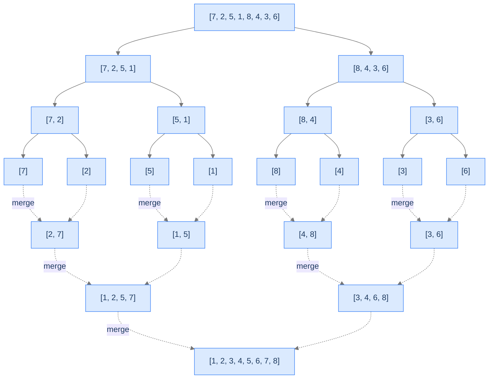

# 9. Merge Sort

Quicksort splits the array around a *value* (the pivot). Merge sort splits the array by *index* — straight down the middle. Recurse on each half. Then merge the two sorted halves into one sorted whole.

That's it. The split is trivially balanced (always `n/2` and `n/2`); the recursion depth is exactly `log n`; the merge step does `O(n)` work. Total: `O(n log n)`. **Worst case `O(n log n)`** — quicksort can degrade to `O(n²)` on unlucky pivots, but merge sort can't, because there's no pivot to be unlucky about.

The price for the predictability is `O(n)` extra memory — merge sort isn't in-place. The merge step writes the combined result into a temporary buffer before copying back. For most modern systems with abundant RAM, this is a fair trade for the worst-case guarantee.

By the end of this lesson you'll know the divide-merge structure, why merge sort is *stable* (the lone stable `O(n log n)` sort in this section), why it's the algorithm of choice for **external sorting** (data too big to fit in memory), and how the merge step alone solves the classic "count inversions" interview problem.

## Table of contents

1. [Understanding merge sort](#understanding-merge-sort)
2. [The merge step](#the-merge-step)
3. [Implementation](#implementation)
4. [Complexity analysis](#complexity-analysis)
5. [Merge sort problem](#merge-sort-problem)
6. [Count inversions](#count-inversions)

***

# Understanding Merge Sort

Merge sort follows the divide-and-conquer paradigm exactly:

1. **Divide** — split the array into two halves at the midpoint.
2. **Conquer** — recursively sort each half.
3. **Combine** — merge the two sorted halves into one sorted array.

Quicksort's interesting work happens in *divide* (the partition); merge sort's interesting work happens in *combine* (the merge). The split is trivial; the merge does all the heavy lifting.



<p align="center"><strong>Merge sort's recursion tree. Splits go down (solid arrows); merges come back up (dashed arrows). Each merge combines two sorted runs into one sorted run.</strong></p>

The recursion has `log n` levels. Each level does `O(n)` total work (the merges at that level collectively touch each element once). Total: `O(n log n)`.

---

## Why the Worst Case Is `O(n log n)`

Quicksort's worst case is `O(n²)` because a bad pivot can produce maximally unbalanced splits. Merge sort always splits at the midpoint — the split is guaranteed balanced. The recursion depth is *exactly* `log₂(n)`, no matter the input. There's no input that makes merge sort run in `O(n²)`.

This guarantee is why merge sort is preferred when worst-case time matters more than constant-factor speed: real-time systems, financial trading, anything with strict latency requirements.

---

## The Merge — Where the Magic Happens

Merging two sorted arrays into one sorted array can be done in `O(n + m)` time with a simple two-pointer scan:

1. Have two pointers, one for each input array.
2. Compare the elements they point to.
3. Take the smaller one, write it to the output, advance that pointer.
4. Repeat until one input is exhausted; copy the rest of the other.

```d2
direction: right

L: "Left = [1, 5, 7]" {style.fill: "#dbeafe"; style.stroke: "#3b82f6"}
R: "Right = [3, 4, 8]" {style.fill: "#fde68a"; style.stroke: "#d97706"}
M: "Merged = [1, 3, 4, 5, 7, 8]" {style.fill: "#bbf7d0"; style.stroke: "#16a34a"}

L -> M: pointer-walk
R -> M: pointer-walk
```

<p align="center"><strong>Merging two sorted arrays. One linear scan with two pointers; the smaller element wins each step.</strong></p>

This linear merge is what gives merge sort its `O(n)` per level and ultimately its `O(n log n)` total. It's also the part that requires `O(n)` auxiliary memory — we can't merge in place efficiently.

---

## Strengths and Limitations

| Strength | Detail |
|---|---|
| **`O(n log n)` worst case** | Guaranteed — no degenerate inputs. |
| **Stable** | Equal elements preserve their relative order (when the merge uses `<=` not `<`). |
| **Predictable performance** | Same time on every input shape. |
| **Parallelisable** | Each recursive call is independent — easy to split across cores. |
| **External sorting** | Works on data too big to fit in RAM (we'll discuss). |

| Limitation | Detail |
|---|---|
| **`O(n)` extra space** | Not in-place. Allocates an auxiliary array of size `n`. |
| **Larger constant factor than quicksort** | Slower in practice on random data despite the same `O(n log n)`. |
| **Recursive** | Stack depth `O(log n)`. |

In practice, merge sort is used:
1. When stability is required and `O(n log n)` is needed.
2. For **external sorting** — sorting datasets larger than memory by streaming through disk or cloud storage in chunks.
3. As the inner loop of **TimSort** (used in Python, Java, Rust) — TimSort is essentially merge sort with optimisations for partially-sorted data.
4. For sorting **linked lists** — quicksort's swap-heavy approach is awkward on linked lists; merge sort's pointer-rewiring works naturally.

---

## Key Takeaway

Merge sort: split in half, recurse, merge. `O(n log n)` worst case, stable, but `O(n)` extra space. The slow-but-steady `O(n log n)` sort. Now we'll formalise the merge step.

***

# The Merge Step

Merging two sorted arrays into one sorted array is a classic two-pointer algorithm.

## Algorithm

Given two sorted arrays `L` and `R`:

```
function merge(L, R):
    result = empty array of size |L| + |R|
    i = 0, j = 0, k = 0

    while i < |L| and j < |R|:
        if L[i] <= R[j]:           # ← `<=` makes the merge stable
            result[k++] = L[i++]
        else:
            result[k++] = R[j++]

    # Copy any remaining elements
    while i < |L|: result[k++] = L[i++]
    while j < |R|: result[k++] = R[j++]

    return result
```

The `<=` (not strict `<`) is what makes merge sort stable. When two equal elements appear (one in `L`, one in `R`), the one from `L` is written first — preserving the original relative order.

---

## A Walkthrough

`L = [1, 5, 7]`, `R = [3, 4, 8]`. Trace:

```
result = [], i=0, j=0
  L[0]=1 <= R[0]=3 → take 1, i++. result=[1]
  L[1]=5 vs R[0]=3 → take 3, j++. result=[1, 3]
  L[1]=5 vs R[1]=4 → take 4, j++. result=[1, 3, 4]
  L[1]=5 <= R[2]=8 → take 5, i++. result=[1, 3, 4, 5]
  L[2]=7 <= R[2]=8 → take 7, i++. result=[1, 3, 4, 5, 7]
  i exhausted, copy rest of R: result=[1, 3, 4, 5, 7, 8]
```

Six elements, six steps. `O(n + m)` time, `O(n + m)` space (for `result`).

---

## Why the Merge Is `O(n)` per Recursion Level

The key observation: at each level of the recursion tree, the merges collectively process every element exactly once. There are `log n` levels. Total work: `O(n) × log n = O(n log n)`.

```d2
direction: down

l0: "Level 0 — 1 merge of n/2 + n/2 elements = n work" {style.fill: "#dbeafe"; style.stroke: "#3b82f6"}
l1: "Level 1 — 2 merges of n/4 + n/4 elements each = n total work" {style.fill: "#fde68a"; style.stroke: "#d97706"}
l2: "Level 2 — 4 merges of n/8 + n/8 elements each = n total work" {style.fill: "#bbf7d0"; style.stroke: "#16a34a"}
ld: "..."
last: "Level log(n) — n merges of single elements = n total work"

l0 -> l1 -> l2 -> ld -> last
total: "Total: n × log(n) = O(n log n)"
last -> total
```

<p align="center"><strong>The recursion tree's per-level work. Each level processes <code>n</code> total elements across all its merges; there are <code>log n</code> levels; total <code>O(n log n)</code>.</strong></p>

---

## Key Takeaway

The merge step combines two sorted arrays in `O(n + m)` time with a two-pointer scan. Stable when `<=` is used. This is the algorithm's core operation; the recursion just sets up the merges. Now the implementation.

***

# Implementation

Two functions: `merge` (combines two sorted arrays) and `merge_sort` (the recursive driver).


```python run viz=array viz-root=arr
from typing import List

class Solution:
    def merge(
        self, left_arr: List[int], right_arr: List[int]
    ) -> List[int]:

        # Create an empty list to store the merged array
        merged_arr: List[int] = []

        # Initialize two pointers, i for left arr and j for right arr
        i, j = 0, 0

        # Compare elements from both arrays and add the smaller one to
        # the merged_arr
        while i < len(left_arr) and j < len(right_arr):

            # If the element in leftArr is smaller or equal to the
            # element in rightArr add the element from leftArr to
            # mergedArr
            if left_arr[i] <= right_arr[j]:

                # Add element from left arr to merged arr
                merged_arr.append(left_arr[i])

                # Move the pointer for left arr to the next element
                i += 1

            # Else if the element in rightArr is smaller than the
            # element in leftArr add the element from rightArr to
            # mergedArr
            else:

                # Add element from right arr to merged arr
                merged_arr.append(right_arr[j])

                # Move the pointer for right arr to the next element
                j += 1

        # Add any remaining elements from left arr (if any) to the merged
        # arr
        while i < len(left_arr):
            merged_arr.append(left_arr[i])
            i += 1

        # Add any remaining elements from right arr (if any) to the
        # merged arr
        while j < len(right_arr):
            merged_arr.append(right_arr[j])
            j += 1

        # Return the sorted and merged list
        return merged_arr

    def merge_sort(self, arr: List[int]) -> List[int]:

        # Base case: if the list has 1 or fewer elements, it is
        # already sorted
        if len(arr) <= 1:
            return arr

        # Find the middle index of the list
        mid: int = len(arr) // 2

        # Split the list into two halves
        left_arr = arr[:mid]
        right_arr = arr[mid:]

        # Recursively sort the left half
        left_arr = self.merge_sort(left_arr)

        # Recursively sort the right half
        right_arr = self.merge_sort(right_arr)

        # Merge the sorted halves and return the result
        return self.merge(left_arr, right_arr)


print(Solution().merge_sort([2, 3, 2, 1, 5, 6]))        # [1, 2, 2, 3, 5, 6]
print(Solution().merge_sort([6, 5, 4, 4, 4, 3, 2, 1]))  # [1, 2, 3, 4, 4, 4, 5, 6]
print(Solution().merge_sort([1, 2, 3, 4, 5, 6]))         # [1, 2, 3, 4, 5, 6]
print(Solution().merge_sort([]))                          # []
print(Solution().merge_sort([42]))                        # [42]
print(Solution().merge_sort([2, 1]))                      # [1, 2]
print(Solution().merge_sort([3, 3, 3]))                   # [3, 3, 3]
print(Solution().merge_sort([5, 2, 8, 1, 9]))             # [1, 2, 5, 8, 9]
```

```java run viz=array viz-root=arr
import java.util.*;

public class Main {
    static class Solution {
        private int[] merge(int[] leftArr, int[] rightArr) {

            // Create an empty array to store the merged array
            int[] mergedArr = new int[leftArr.length + rightArr.length];

            // Initialize two pointers, i for leftArr and j for rightArr
            int i = 0, j = 0, k = 0;

            // Compare elements from both arrays and add the smaller one to
            // the mergedArr
            while (i < leftArr.length && j < rightArr.length) {

                // If the element in leftArr is smaller or equal to the
                // element in rightArr add the element from leftArr to
                // mergedArr
                if (leftArr[i] <= rightArr[j]) {

                    // Add element from leftArr to mergedArr
                    mergedArr[k] = leftArr[i];

                    // Move the pointer for leftArr to the next element
                    i++;
                }

                // Else if the element in rightArr is smaller than the
                // element in leftArr add the element from rightArr to
                // mergedArr
                else {

                    // Add element from rightArr to mergedArr
                    mergedArr[k] = rightArr[j];

                    // Move the pointer for rightArr to the next element
                    j++;
                }
                k++;
            }

            // Add any remaining elements from leftArr (if any) to the
            // mergedArr
            while (i < leftArr.length) {
                mergedArr[k] = leftArr[i];
                i++;
                k++;
            }

            // Add any remaining elements from rightArr (if any) to the
            // mergedArr
            while (j < rightArr.length) {
                mergedArr[k] = rightArr[j];
                j++;
                k++;
            }

            // Return the sorted and merged array
            return mergedArr;
        }

        public int[] mergeSort(int[] arr) {

            // Base case: if the array has 1 or fewer elements, it is
            // already sorted
            if (arr.length <= 1) {
                return arr;
            }

            // Find the middle index of the array
            int mid = arr.length / 2;

            // Split the array into two halves
            int[] leftArr = Arrays.copyOfRange(arr, 0, mid);
            int[] rightArr = Arrays.copyOfRange(arr, mid, arr.length);

            // Recursively sort the left half
            leftArr = mergeSort(leftArr);

            // Recursively sort the right half
            rightArr = mergeSort(rightArr);

            // Merge the sorted halves and return the result
            return merge(leftArr, rightArr);
        }
    }

    public static void main(String[] args) {
        System.out.println(Arrays.toString(new Solution().mergeSort(new int[]{2, 3, 2, 1, 5, 6})));       // [1, 2, 2, 3, 5, 6]
        System.out.println(Arrays.toString(new Solution().mergeSort(new int[]{6, 5, 4, 4, 4, 3, 2, 1}))); // [1, 2, 3, 4, 4, 4, 5, 6]
        System.out.println(Arrays.toString(new Solution().mergeSort(new int[]{1, 2, 3, 4, 5, 6})));       // [1, 2, 3, 4, 5, 6]
        System.out.println(Arrays.toString(new Solution().mergeSort(new int[]{})));                        // []
        System.out.println(Arrays.toString(new Solution().mergeSort(new int[]{42})));                      // [42]
        System.out.println(Arrays.toString(new Solution().mergeSort(new int[]{2, 1})));                    // [1, 2]
        System.out.println(Arrays.toString(new Solution().mergeSort(new int[]{3, 3, 3})));                 // [3, 3, 3]
        System.out.println(Arrays.toString(new Solution().mergeSort(new int[]{5, 2, 8, 1, 9})));           // [1, 2, 5, 8, 9]
    }
}
```


***

# Complexity Analysis

| Resource | Best | Average | Worst |
|---|---|---|---|
| **Time** | `O(n log n)` | `O(n log n)` | `O(n log n)` |
| **Space (auxiliary)** | `O(n)` | `O(n)` | `O(n)` |
| **Space (stack)** | `O(log n)` | `O(log n)` | `O(log n)` |
| **Stability** | ✓ | ✓ | ✓ |
| **In-place** | ✗ | ✗ | ✗ |

The time complexity is `O(n log n)` *unconditionally*. Best, average, and worst cases all have the same shape — the recursion tree always has `log n` levels and each level does `O(n)` work. No input can degrade merge sort.

The space complexity is `O(n)` for the auxiliary buffers used in merging plus `O(log n)` for the recursion stack — total `O(n)`.

---

## When to Choose Merge Sort

| Scenario | Why merge sort wins |
|---|---|
| Worst-case `O(n log n)` is required | Quicksort can degrade; merge sort can't. |
| Stability matters | One of the few `O(n log n)` stable sorts. |
| Sorting linked lists | No need for random-access pointer arithmetic; merge step works naturally on linked lists. |
| External sorting (data > RAM) | Read chunks, sort, write to disk, merge sorted chunks. The classic disk-friendly sort. |
| Parallel sorting | Recursive halves are independent; trivially parallelisable across cores or machines. |

| Scenario | Why merge sort loses |
|---|---|
| Memory is constrained | `O(n)` extra memory may be unavailable. |
| Random-access in-place is preferred | Quicksort wins on memory and cache. |
| Constant factor matters | Quicksort has a smaller constant on random data. |

---

## External Sorting — Sorting Bigger Than RAM

Imagine you have a 100 GB log file to sort and only 16 GB of RAM. You can't load the file into memory and call `sort()`. The classic solution is **external merge sort**:

1. Read the file in chunks of, say, 8 GB.
2. Sort each chunk in memory and write it back to disk as a sorted "run."
3. After processing the whole file, you have ~13 sorted runs on disk.
4. Use a multi-way merge (k-way generalisation of the two-way merge) to combine the runs into one sorted output, streaming through disk.

This is how databases like PostgreSQL handle `ORDER BY` on tables larger than memory. It's also how MapReduce and Spark's shuffle phase work. The fundamental algorithm hasn't changed since the 1960s.

---

## Key Takeaway

Merge sort: `O(n log n)` worst case, stable, `O(n)` extra space. The slow-but-steady choice; the engine of external sorting; the foundation of TimSort. Now the canonical exercise.

***

# Merge Sort Problem

---

## The Problem

Given an integer array `arr`, return a new array sorted in non-decreasing order using merge sort. (Returns a new array; does not modify the input — merge sort is naturally out-of-place.)

```
Input:  arr = [2, 3, 2, 1, 5, 6]
Output: [1, 2, 2, 3, 5, 6]

Input:  arr = [6, 5, 4, 4, 4, 3, 2, 1]
Output: [1, 2, 3, 4, 4, 4, 5, 6]   (the four 4s preserve their relative input order — stable)

Input:  arr = [1, 2, 3, 4, 5, 6]
Output: [1, 2, 3, 4, 5, 6]
```

---

<details>
<summary><h2>Solution &amp; Analysis</h2></summary>

### The Solution

The implementation is identical to the version above. See [Implementation](#implementation).

### Edge Cases

| Case | Example | Expected |
|---|---|---|
| Empty | `[]` | `[]` (base case fires immediately). |
| Single element | `[7]` | `[7]`. |
| All equal | `[3, 3, 3, 3]` | `[3, 3, 3, 3]` — `<=` keeps stable. |
| Already sorted | `[1, 2, 3]` | `[1, 2, 3]` (still does full `O(n log n)` work). |
| Reverse sorted | `[5, 4, 3, 2, 1]` | `[1, 2, 3, 4, 5]`. |

</details>

---

# Count Inversions

A classic problem that uses merge sort's *merge* step alone — and shows why merge sort's structure is more useful than just sorting.

---

## The Problem

Given an integer array `arr`, count the number of **inversions**. An inversion is a pair `(i, j)` with `i < j` and `arr[i] > arr[j]`. Solve it in `O(n log n)` time.

```
Input:  arr = [1, 10, 5, 3, 4]
Output: 5
Explanation: pairs are (10,5), (10,3), (10,4), (5,3), (5,4) — five inversions

Input:  arr = [1, 3, 2, 4, 5]
Output: 1   (just (3, 2))

Input:  arr = [1, 2, 3, 4, 5]
Output: 0   (sorted, no inversions)
```

---

<details>
<summary><h2>Why Merge Sort Solves This</h2></summary>


The naive `O(n²)` algorithm: nested loops, count pairs where `arr[i] > arr[j]` for `i < j`. Works but slow.

Merge sort does it in `O(n log n)` because the merge step *naturally* counts inversions. When merging `left` and `right`:
- If `left[i] <= right[j]`, no inversions to count for this pair (left element comes before right element in sorted order, which matches their original order — left half is to the left of right half).
- If `left[i] > right[j]`, then `right[j]` is smaller than every remaining element in `left` (because `left` is sorted). All those elements are inversions with `right[j]`. Count = `len(left) - i`.

Add up the inversions counted across all merges; that's the total.

```d2
direction: down

input: "Input: [3, 1, 4, 2]" {style.fill: "#dbeafe"; style.stroke: "#3b82f6"}
split: "Split: [3, 1] and [4, 2]"
sub1: "Sort [3, 1] → [1, 3] (1 inversion)"
sub2: "Sort [4, 2] → [2, 4] (1 inversion)"
final_merge: "Merge [1, 3] with [2, 4]:\n1<=2 → take 1\n3>2 → take 2, +1 inversion (3 still in left)\n3<=4 → take 3\n→ take 4\nMerged: [1, 2, 3, 4]\nLocal inversions: 1"
total: "Total inversions: 1 + 1 + 1 = 3" {style.fill: "#bbf7d0"; style.stroke: "#16a34a"}

input -> split -> sub1
split -> sub2
sub1 -> final_merge
sub2 -> final_merge
final_merge -> total
```

<p align="center"><strong>Counting inversions during merge sort. Each merge counts the inversions <em>between</em> its two halves; recursion handles inversions within each half.</strong></p>

</details>
<details>
<summary><h2>The Algorithm</h2></summary>


```
function merge_count(arr, temp, left, right):
    inversions = 0
    if left < right:
        mid = (left + right) / 2
        inversions += merge_count(arr, temp, left, mid)
        inversions += merge_count(arr, temp, mid + 1, right)
        inversions += merge_and_count(arr, temp, left, mid, right)
    return inversions

function merge_and_count(arr, temp, left, mid, right):
    i = left, j = mid + 1, k = left, count = 0
    while i <= mid and j <= right:
        if arr[i] <= arr[j]:
            temp[k++] = arr[i++]
        else:
            temp[k++] = arr[j++]
            count += mid - i + 1     # all remaining in left are > arr[j]
    while i <= mid: temp[k++] = arr[i++]
    while j <= right: temp[k++] = arr[j++]
    copy temp[left..right] back to arr[left..right]
    return count
```

</details>
<details>
<summary><h2>Solution &amp; Analysis</h2></summary>

### The Solution

```python run viz=array viz-root=arr
from typing import List

class Solution:
    def merge_and_count_inversions(
        self,
        arr: List[int],
        temp: List[int],
        left: int,
        mid: int,
        right: int,
    ) -> int:

        # Index for left subarray
        index1: int = left

        # Index for right subarray
        index2: int = mid + 1

        # Index for merged subarray
        index3: int = left

        # Count of inversions
        inversions: int = 0

        while index1 <= mid and index2 <= right:
            if arr[index1] <= arr[index2]:
                temp[index3] = arr[index1]
                index1 += 1
            else:
                temp[index3] = arr[index2]
                index2 += 1

                # Count inversions
                inversions += mid - index1 + 1
            index3 += 1

        # Copy the remaining elements of the left subarray
        while index1 <= mid:
            temp[index3] = arr[index1]
            index1 += 1
            index3 += 1

        # Copy the remaining elements of the right subarray
        while index2 <= right:
            temp[index3] = arr[index2]
            index2 += 1
            index3 += 1

        # Copy back the merged elements to the original array
        for i in range(left, right + 1):
            arr[i] = temp[i]

        return inversions

    def merge_sort_and_count_inversions(
        self, arr: List[int], temp: List[int], left: int, right: int
    ) -> int:

        # Count of inversions
        inversions: int = 0

        if left < right:
            mid = left + (right - left) // 2

            # Recursive calls to divide the array into subarrays
            inversions += self.merge_sort_and_count_inversions(
                arr, temp, left, mid
            )
            inversions += self.merge_sort_and_count_inversions(
                arr, temp, mid + 1, right
            )

            # Merge the sorted subarrays and count inversions
            inversions += self.merge_and_count_inversions(
                arr, temp, left, mid, right
            )

        return inversions

    def count_inversions(self, arr: List[int]) -> int:
        n: int = len(arr)

        # Temporary array to store merged subarrays
        temp: List[int] = [0] * n

        return self.merge_sort_and_count_inversions(arr, temp, 0, n - 1)


print(Solution().count_inversions([1, 10, 5, 3, 4]))   # 5
print(Solution().count_inversions([1, 3, 2, 4, 5]))    # 1
print(Solution().count_inversions([1, 2, 3, 4, 5]))    # 0
print(Solution().count_inversions([]))                  # 0
print(Solution().count_inversions([42]))                # 0
print(Solution().count_inversions([2, 1]))              # 1
print(Solution().count_inversions([5, 4, 3, 2, 1]))    # 10
print(Solution().count_inversions([1, 1, 1]))           # 0
```

```java run viz=array viz-root=arr
import java.util.*;

public class Main {
    static class Solution {
        private int mergeAndCountInversions(
            int[] arr,
            int[] temp,
            int left,
            int mid,
            int right
        ) {

            // Index for left subarray
            int index1 = left;

            // Index for right subarray
            int index2 = mid + 1;

            // Index for merged subarray
            int index3 = left;

            // Count of inversions
            int inversions = 0;

            while (index1 <= mid && index2 <= right) {
                if (arr[index1] <= arr[index2]) {
                    temp[index3++] = arr[index1++];
                } else {
                    temp[index3++] = arr[index2++];

                    // Count inversions
                    inversions += mid - index1 + 1;
                }
            }

            // Copy the remaining elements of the left subarray
            while (index1 <= mid) {
                temp[index3++] = arr[index1++];
            }

            // Copy the remaining elements of the right subarray
            while (index2 <= right) {
                temp[index3++] = arr[index2++];
            }

            // Copy back the merged elements to the original array
            for (int i = left; i <= right; i++) {
                arr[i] = temp[i];
            }

            return inversions;
        }

        private int mergeSortAndCountInversions(
            int[] arr,
            int[] temp,
            int left,
            int right
        ) {

            // Count of inversions
            int inversions = 0;

            if (left < right) {
                int mid = left + (right - left) / 2;

                // Recursive calls to divide the array into subarrays
                inversions += mergeSortAndCountInversions(
                    arr,
                    temp,
                    left,
                    mid
                );
                inversions += mergeSortAndCountInversions(
                    arr,
                    temp,
                    mid + 1,
                    right
                );

                // Merge the sorted subarrays and count inversions
                inversions += mergeAndCountInversions(
                    arr,
                    temp,
                    left,
                    mid,
                    right
                );
            }

            return inversions;
        }

        public int countInversions(int[] arr) {
            int n = arr.length;

            // Temporary array to store merged subarrays
            int[] temp = new int[n];

            return mergeSortAndCountInversions(arr, temp, 0, n - 1);
        }
    }

    public static void main(String[] args) {
        System.out.println(new Solution().countInversions(new int[]{1, 10, 5, 3, 4}));  // 5
        System.out.println(new Solution().countInversions(new int[]{1, 3, 2, 4, 5}));   // 1
        System.out.println(new Solution().countInversions(new int[]{1, 2, 3, 4, 5}));   // 0
        System.out.println(new Solution().countInversions(new int[]{}));                 // 0
        System.out.println(new Solution().countInversions(new int[]{42}));               // 0
        System.out.println(new Solution().countInversions(new int[]{2, 1}));             // 1
        System.out.println(new Solution().countInversions(new int[]{5, 4, 3, 2, 1}));   // 10
        System.out.println(new Solution().countInversions(new int[]{1, 1, 1}));          // 0
    }
}
```

### Complexity

`O(n log n)` time, `O(n)` space — the same as merge sort itself, since this *is* merge sort with a counter.

The naive `O(n²)` algorithm is to count pairs with nested loops. Merge sort beats it by using the structure of the recursion to count inversions during the merge.

</details>
<details>
<summary><h2>Why This Pattern Generalises</h2></summary>


The merge step alone is a primitive that solves several problems related to "count something between two halves." Variations include:
- **Reverse pairs** (count `(i, j)` where `i < j` and `arr[i] > 2 * arr[j]`).
- **Range count** (count elements in a range across the merge).
- **Closest pair** (the classic divide-and-conquer geometry problem uses a merge-style scan).

Anytime you have a "count something across the divide" problem, ask whether merge sort's structure can help. Often it can — and the resulting algorithm is `O(n log n)` instead of `O(n²)`.

</details>
<details>
<summary><h2>Final Takeaway</h2></summary>


Merge sort is the predictable `O(n log n)` sort: stable, worst-case guaranteed, foundation of TimSort and external sorting. The `O(n)` extra space is the trade-off. Beyond sorting, the merge step is a primitive that solves a whole family of "across the divide" problems — count inversions is the classic example, but the technique generalises.

The next algorithm — **heapsort** — is the third major `O(n log n)` comparison sort. It's in-place (unlike merge sort) and worst-case `O(n log n)` (unlike quicksort) — the best of both worlds in those specific dimensions. The trade-off is that it's not stable and has worse cache behaviour. We'll see why and when each `O(n log n)` sort wins.

**Transfer challenge — try before the Heapsort lesson:** Write a merge sort that *reverses* the comparison: descending order. (Hint: change one operator.) Then think: does the count-inversions algorithm still work? Why or why not?

<details>
<summary><strong>Answer — open after you've thought about it</strong></summary>

For descending order, change `if left[i] <= right[j]` to `if left[i] >= right[j]`. The algorithm structure is unchanged.

But the inversions counter doesn't directly translate — for descending sort, "inversion" would mean `arr[i] < arr[j]` for `i < j`. The same algorithm with the flipped comparison counts those instead. **The general pattern**: merge sort with comparison `f(left, right)` counts pairs that would violate the sort order `f` provides.

This generalisation is why merge sort is the building block for many "count something across pairs" problems. Pick the right comparison; the merge step gives you the count. **You just unlocked half a dozen interview problems that are merge-sort variants in disguise.**

</details>

</details>

<!-- ============================================== -->
<!-- SWEEP 2 — missing sections (placeholders only) -->
<!-- ============================================== -->

<!-- TODO: The Hook — missing, needs to be written -->
<!--       Guidance: real-world story opening before any definition -->

<!-- TODO: Understanding the Problem — missing, needs to be written -->
<!--       Guidance: frame the gap the structure/algorithm fills -->

<!-- TODO: Supported Operations — missing, needs to be written -->
<!--       Guidance: table: operation / time / notes -->

<!-- TODO: Internal Mechanics — missing, needs to be written -->
<!--       Guidance: how it actually works under the hood -->

<!-- TODO: Working Example — missing, needs to be written -->
<!--       Guidance: one fully worked end-to-end example -->

<!-- TODO: Production Reality — missing, needs to be written -->
<!--       Guidance: 4–6 entries: System — uses X — because Y -->

<!-- TODO: Quiz — missing, needs to be written -->
<!--       Guidance: 3–5 questions, each labeled [Recall]/[Reasoning]/[Tradeoff] -->

<!-- TODO: Practice Ladder — missing, needs to be written -->
<!--       Guidance: table: 5 links into pattern problems + hints -->

<!-- TODO: Further Reading — missing, needs to be written -->
<!--       Guidance: annotated: ★ Essential / ◆ Advanced / → Reference -->

<!-- TODO: Cross-Links — missing, needs to be written -->
<!--       Guidance: Prerequisites | What comes next -->

<!-- TODO: Final Takeaway — missing, needs to be written -->
<!--       Guidance: exactly 3 typed bullets: Core mechanic / Dominant tradeoff / One thing to remember -->
