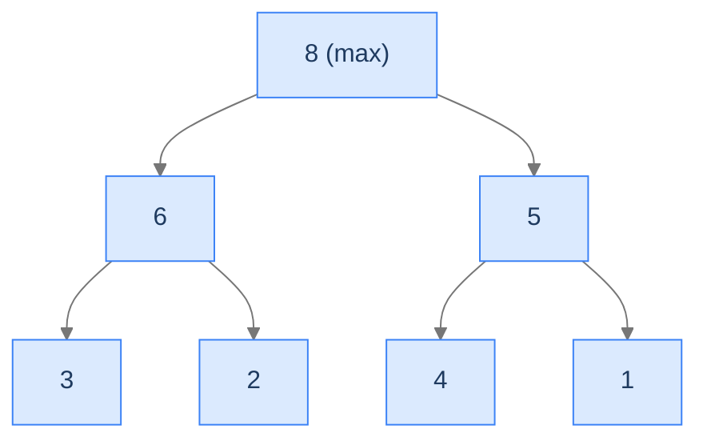

# 10. Heapsort

Quicksort is fast on average but degrades to `O(n²)` on adversarial inputs. Merge sort guarantees `O(n log n)` worst case but uses `O(n)` extra memory. **Is there a sort that's worst-case `O(n log n)` AND in-place?**

Yes — heapsort. It exploits the **heap data structure** (a complete binary tree where every parent is greater than its children, stored as an array) to repeatedly extract the maximum and place it at the end of the array. Each extraction is `O(log n)`; we do `n` of them; total `O(n log n)`. The heap is maintained in-place inside the array. No auxiliary memory.

The trade-off: heapsort is *not* stable, has *worse cache behaviour* than quicksort (the heap-based traversal jumps around the array), and is *not adaptive* — same `O(n log n)` regardless of input order. So it doesn't dominate quicksort or merge sort on its own; it's the best choice only when worst-case `O(n log n)` and in-place are *both* required (real-time systems, embedded software, IntroSort's fallback when quicksort recurses too deep).

By the end of this lesson you'll know the heap data structure and its array representation, the `heapify` operation, the two-phase algorithm (build heap, then extract), and the precise conditions under which heapsort is the right tool.

## Table of contents

1. [Understanding heaps](#understanding-heaps)
2. [The heapify operation](#the-heapify-operation)
3. [Heapsort in two phases](#heapsort-in-two-phases)
4. [Implementation](#implementation)
5. [Complexity analysis](#complexity-analysis)
6. [Heapsort problem](#heapsort-problem)

***

# Understanding Heaps

A **heap** is a complete binary tree (filled top-to-bottom, left-to-right) with the **heap property**:

- **Max heap**: every parent ≥ its children.
- **Min heap**: every parent ≤ its children.

The root of a max heap is the maximum element. The root of a min heap is the minimum. We'll use max heaps for ascending sort.



<p align="center"><strong>A max heap with 7 elements. Each parent is greater than its children. The root holds the maximum.</strong></p>

---

## Heap as Array

The clever part: a complete binary tree maps perfectly onto an array — **no pointers needed**. For a node at index `i`:

- Parent: `(i - 1) / 2`
- Left child: `2*i + 1`
- Right child: `2*i + 2`

The tree above stored as an array: `[8, 6, 5, 3, 2, 4, 1]`. Index 0 is the root; indices 1, 2 are its children; indices 3, 4 are children of index 1; and so on.

```d2
direction: down

tree: "Tree (max heap)" {
  grid-rows: 1
  grid-columns: 7
  grid-gap: 0
  i0: "8 (root)"
  i1: "6"
  i2: "5"
  i3: "3"
  i4: "2"
  i5: "4"
  i6: "1"
}

array: "Same heap as array" {
  grid-rows: 1
  grid-columns: 7
  grid-gap: 0
  a0: "8"
  a1: "6"
  a2: "5"
  a3: "3"
  a4: "2"
  a5: "4"
  a6: "1"
}

label: "Indices: 0=root, 1-2=row 2, 3-6=row 3.\nFor index i: parent at (i-1)/2, children at 2i+1 and 2i+2."
```

<p align="center"><strong>A heap stored as an array. Index arithmetic replaces pointers; the heap takes <code>O(n)</code> space with no overhead beyond the elements themselves.</strong></p>

This array representation is what makes heapsort *in-place* — the heap doesn't allocate auxiliary memory; it uses the input array itself.

---

## Why a Max Heap Helps Sort

The root of a max heap is the maximum. To sort:

1. Build a max heap from the input array. Now `arr[0]` is the largest.
2. Swap `arr[0]` with `arr[n-1]`. The largest is now in its final sorted position.
3. The first `n-1` elements no longer form a max heap (the new root might be small). Run `heapify` on the root to restore the heap property in the remaining `n-1` elements.
4. Repeat: swap `arr[0]` with `arr[n-2]`, heapify the first `n-2`, etc.

After `n - 1` iterations, the array is sorted in ascending order.

> *Pause and predict — for an array of 8 elements, how many <code>heapify</code> calls happen during the build phase? During the extraction phase?*

Build phase: `n/2 = 4` heapify calls (only internal nodes need heapifying; leaves are already valid heaps). Extraction phase: `n - 1 = 7` heapify calls. Total: `O(n)` calls in build, `O(n log n)` total work in build + extraction. Both phases combined are `O(n log n)`.

---

## Strengths and Limitations

| Strength | Detail |
|---|---|
| **`O(n log n)` worst case** | Guaranteed — no adversarial inputs degrade it. |
| **In-place** | `O(1)` extra memory beyond a few index variables. |
| **No deep recursion** | Iterative implementations exist; `O(1)` stack possible. |

| Limitation | Detail |
|---|---|
| **Not stable** | Heap operations can flip equal elements' relative order. |
| **Worse cache behaviour than quicksort** | The heap's parent/child jumps (`2*i+1`) cause non-sequential memory access. |
| **Not adaptive** | Same `O(n log n)` on already-sorted vs random vs reverse-sorted input. |
| **Higher constant factor than quicksort** | Slower in practice on random data. |

In practice, heapsort is used:
1. As IntroSort's fallback (used by C++ `std::sort`) when quicksort's recursion gets too deep.
2. In real-time / embedded systems where `O(n log n)` worst case is required and memory is constrained.
3. As a building block for **priority queues** (the heap data structure itself, not the sort).

---

## Key Takeaway

Heap = complete binary tree with the parent-child ordering property; stored as an array via index arithmetic. Heapsort exploits this for in-place `O(n log n)` worst-case sorting. Now we'll examine the core `heapify` operation.

***

# The Heapify Operation

`heapify(arr, n, i)` ensures the subtree rooted at index `i` satisfies the max-heap property, *assuming* the subtrees rooted at `2*i+1` and `2*i+2` already do. It's recursive: if a swap is needed, the call propagates downward to fix any new violation.

---

## Algorithm

```
function heapify(arr, n, i):
    largest = i
    left = 2*i + 1
    right = 2*i + 2
    if left < n and arr[left] > arr[largest]:
        largest = left
    if right < n and arr[right] > arr[largest]:
        largest = right
    if largest != i:
        swap(arr[i], arr[largest])
        heapify(arr, n, largest)         # may need to fix the affected subtree
```

If neither child is larger than the parent, we're done — the heap property holds locally. If one is, swap with the larger child. The swap may have created a violation in the child's subtree, so recurse to fix it.

---

## A Walkthrough

`arr = [3, 6, 5, 8, 2]`, `n = 5`, `i = 0` (heapify the root).

```
largest = 0 (arr[0] = 3)
left = 1 (arr[1] = 6), right = 2 (arr[2] = 5)
arr[1] > arr[0]? 6 > 3 → largest = 1
arr[2] > arr[1]? 5 > 6 → no change
largest (1) != i (0), swap arr[0] ↔ arr[1] → [6, 3, 5, 8, 2]
recurse: heapify(arr, 5, 1)
  largest = 1 (arr[1] = 3)
  left = 3 (arr[3] = 8), right = 4 (arr[4] = 2)
  arr[3] > arr[1]? 8 > 3 → largest = 3
  arr[4] > arr[3]? 2 > 8 → no change
  largest (3) != i (1), swap arr[1] ↔ arr[3] → [6, 8, 5, 3, 2]
  recurse: heapify(arr, 5, 3)
    largest = 3 (arr[3] = 3)
    left = 7 (out of bounds), right = 8 (out of bounds)
    no swap needed, return
```

Final: `[6, 8, 5, 3, 2]`. Hmm — that's not a valid max heap (8 > 6 at the root). The issue: the input `[3, 6, 5, 8, 2]` wasn't a valid heap to start with, and a single `heapify` call from the root can't fix it. We need to heapify *all* internal nodes in bottom-up order to build a heap from scratch — that's the build phase.

---

## Complexity of Heapify

The recursion descends the tree, at most one level per call. The tree has height `log n`. So `heapify` is `O(log n)` per call.

---

## Key Takeaway

`heapify` fixes a single subtree assuming its children's subtrees are already valid heaps. `O(log n)` per call. The build phase calls heapify on every internal node bottom-up to construct a heap from scratch. Now we'll see how heapsort uses this.

***

# Heapsort in Two Phases

The algorithm:

```
function heap_sort(arr):
    n = len(arr)
    # Phase 1: build max heap (in place)
    for i from n/2 - 1 down to 0:
        heapify(arr, n, i)
    # Phase 2: extract max one at a time
    for i from n-1 down to 1:
        swap(arr[0], arr[i])
        heapify(arr, i, 0)
```

---

## Phase 1 — Build the Heap

Iterate `i` from `n/2 - 1` down to `0`, calling `heapify(arr, n, i)` at each step. This bottom-up traversal ensures that when we heapify a node, its children's subtrees are already valid heaps.

**Why start at `n/2 - 1`?** All elements from `n/2` to `n - 1` are leaves (their children would have indices `≥ n`, which don't exist). Leaves are trivially valid heaps. The first internal node — and the deepest one — is at index `n/2 - 1`.

**Why not start at `n - 1` and go up?** Same result, but more work — calling heapify on a leaf is wasted work, and we can't combine leaves into a heap unless their parents have been heapified first (we'd be going *upward* through unheapified levels, which is correct but inefficient).

```d2
direction: down

input: "Input: [3, 1, 6, 5, 2, 4]" {style.fill: "#dbeafe"; style.stroke: "#3b82f6"}
i2: "i=2 (last internal node), heapify → [3, 1, 6, 5, 2, 4]"
i1: "i=1, heapify → [3, 5, 6, 1, 2, 4]"
i0: "i=0, heapify → [6, 5, 4, 1, 2, 3]" {style.fill: "#bbf7d0"; style.stroke: "#16a34a"}

input -> i2 -> i1 -> i0
```

<p align="center"><strong>Build phase. Heapify each internal node bottom-up. After processing index 0, the entire array satisfies the max-heap property.</strong></p>

The build phase runs `n/2` heapify calls. A naive analysis says `O(n log n)`, but a tighter analysis based on the heights of internal nodes shows it's actually `O(n)` — the deeper nodes (more numerous) have shorter heapify calls.

---

## Phase 2 — Extract the Maximum Repeatedly

Once the heap is built, the maximum is at `arr[0]`. Swap it with `arr[n-1]`; the max is now in its final sorted position. The first `n-1` elements may no longer be a heap (the new root could be small), so call `heapify(arr, n-1, 0)` to restore the heap property in the remaining `n-1` elements.

Repeat: swap `arr[0]` with `arr[n-2]`, heapify the first `n-2`, etc.

```d2
direction: down

p1: "Phase 2 start — heap = [6, 5, 4, 1, 2, 3]"
s1: "Swap arr[0]↔arr[5] → [3, 5, 4, 1, 2, 6]\nHeapify first 5 → [5, 3, 4, 1, 2, 6]"
s2: "Swap arr[0]↔arr[4] → [2, 3, 4, 1, 5, 6]\nHeapify first 4 → [4, 3, 2, 1, 5, 6]"
s3: "Swap arr[0]↔arr[3] → [1, 3, 2, 4, 5, 6]\nHeapify first 3 → [3, 1, 2, 4, 5, 6]"
final: "...continue → [1, 2, 3, 4, 5, 6]" {style.fill: "#bbf7d0"; style.stroke: "#16a34a"}

p1 -> s1 -> s2 -> s3 -> final
```

<p align="center"><strong>Extract phase. Each iteration moves the largest remaining element to the end, then re-heapifies the front. After <code>n-1</code> iterations, the array is sorted.</strong></p>

The extract phase runs `n - 1` heapify calls, each `O(log n)`. Total: `O(n log n)`.

---

## Total Complexity

- Phase 1 (build): `O(n)`.
- Phase 2 (extract): `O(n log n)`.
- Total: `O(n log n)`.

The dominant term is the extract phase. The build phase, somewhat surprisingly, is *linear*, not `n log n` — but it doesn't matter for the total.

---

## Key Takeaway

Heapsort: build heap in `O(n)`, extract one element at a time in `O(n log n)`. Total `O(n log n)`, in-place, worst-case guaranteed. Now the implementation.

***

# Implementation

Two functions: `heapify` and `heap_sort` (the two-phase driver).


```python run
from typing import List

class Solution:
    def heapify(self, arr: List[int], n: int, index: int) -> None:

        # Initialize largest as root
        largest: int = index
        left: int = 2 * index + 1
        right: int = 2 * index + 2

        # If left child is larger than root
        if left < n and arr[left] > arr[largest]:
            largest = left

        # If right child is larger than largest so far
        if right < n and arr[right] > arr[largest]:
            largest = right

        # If largest is not root
        if largest != index:
            arr[index], arr[largest] = arr[largest], arr[index]

            # Recursively heapify the affected sub-tree
            self.heapify(arr, n, largest)

    def heap_sort(self, arr: List[int]) -> None:
        n: int = len(arr)

        # Build heap (rearrange array)
        for i in range(n // 2 - 1, -1, -1):
            self.heapify(arr, n, i)

        # Extract elements from heap one by one
        for i in range(n - 1, 0, -1):
            arr[0], arr[i] = arr[i], arr[0]

            # Heapify the reduced heap
            self.heapify(arr, i, 0)


if __name__ == "__main__":
    arr = [3, 1, 6, 5, 2, 4]
    Solution().heap_sort(arr)
    print(arr)   # [1, 2, 3, 4, 5, 6]
```

```java run
public class Main {
    static class Solution {
        private void heapify(int[] arr, int n, int index) {

            // Initialize largest as root
            int largest = index;
            int left = 2 * index + 1;
            int right = 2 * index + 2;

            // If left child is larger than root
            if (left < n && arr[left] > arr[largest]) {
                largest = left;
            }

            // If right child is larger than largest so far
            if (right < n && arr[right] > arr[largest]) {
                largest = right;
            }

            // If largest is not root
            if (largest != index) {
                swap(arr, index, largest);

                // Recursively heapify the affected sub-tree
                heapify(arr, n, largest);
            }
        }

        private void swap(int[] arr, int i, int j) {
            int temp = arr[i];
            arr[i] = arr[j];
            arr[j] = temp;
        }

        public void heapSort(int[] arr) {
            int n = arr.length;

            // Build heap (rearrange array)
            for (int i = n / 2 - 1; i >= 0; i--) {
                heapify(arr, n, i);
            }

            // Extract elements from heap one by one
            for (int i = n - 1; i > 0; i--) {
                swap(arr, 0, i);

                // Heapify the reduced heap
                heapify(arr, i, 0);
            }
        }
    }

    public static void main(String[] args) {
        int[] arr = {3, 1, 6, 5, 2, 4};
        new Solution().heapSort(arr);
        for (int x : arr) System.out.print(x + " ");
        System.out.println();
    }
}
```


***

# Complexity Analysis

| Resource | Best | Average | Worst |
|---|---|---|---|
| **Time** | `O(n log n)` | `O(n log n)` | `O(n log n)` |
| **Space (auxiliary)** | `O(1)` | `O(1)` | `O(1)` |
| **Space (stack)** | `O(log n)` | `O(log n)` | `O(log n)` |
| **Stability** | ✗ | ✗ | ✗ |
| **In-place** | ✓ | ✓ | ✓ |

The recursion can be replaced with iteration, giving `O(1)` total stack — but most implementations stick with the recursive `heapify` for clarity.

---

## Comparison with Other `O(n log n)` Sorts

| Property | Quicksort | Merge sort | Heapsort |
|---|---|---|---|
| Best | `O(n log n)` | `O(n log n)` | `O(n log n)` |
| Average | `O(n log n)` | `O(n log n)` | `O(n log n)` |
| Worst | `O(n²)` | `O(n log n)` | `O(n log n)` |
| Space | `O(log n)` stack | `O(n)` aux | `O(1)` aux |
| Stable | ✗ | ✓ | ✗ |
| Adaptive | ✗ | ✗ | ✗ |
| Cache | ✓✓ best | ✓ ok | ✗ jumpy |
| Practical speed | fastest | medium | slowest |

The takeaways:
- **Quicksort wins on practical speed** (best constant factor, best cache behaviour) but has the worst worst-case.
- **Merge sort wins on stability** but uses extra memory.
- **Heapsort wins on memory + worst-case guarantee** but has the worst constant factor.

This is why production sorts hybridise — IntroSort (C++ `std::sort`) uses quicksort for speed, switches to heapsort if recursion gets too deep (worst-case guard), and falls back to insertion sort for tiny subarrays (small-input speed). All three algorithms appear in one library function.

---

## Key Takeaway

Heapsort: `O(n log n)` worst case, in-place, no allocation. The choice for memory-constrained systems requiring worst-case guarantees. Now the canonical exercise.

***

# Heapsort Problem

---

## The Problem

Given an integer array `arr`, sort it in non-decreasing order **in place** using heapsort.

```
Input:  arr = [2, 3, 2, 1, 5, 6]
Output: [1, 2, 2, 3, 5, 6]

Input:  arr = [6, 5, 4, 4, 4, 3, 2, 1]
Output: [1, 2, 3, 4, 4, 4, 5, 6]

Input:  arr = [1, 2, 3, 4, 5, 6]
Output: [1, 2, 3, 4, 5, 6]
```

---

<details>
<summary><h2>Solution &amp; Analysis</h2></summary>

### The Solution

The implementation matches the version above. See [Implementation](#implementation).

### Edge Cases

| Case | Example | Expected |
|---|---|---|
| Empty | `[]` | `[]` (loops don't execute). |
| Single element | `[7]` | `[7]`. |
| All equal | `[3, 3, 3]` | `[3, 3, 3]`. |
| Already sorted | `[1, 2, 3]` | `[1, 2, 3]` — still does full `O(n log n)` work; not adaptive. |
| Reverse sorted | `[5, 4, 3, 2, 1]` | `[1, 2, 3, 4, 5]`. |
| Two elements | `[2, 1]` | `[1, 2]`. |

</details>
<details>
<summary><h2>Final Takeaway</h2></summary>


Heapsort is the third major `O(n log n)` comparison sort. In-place and worst-case guaranteed; not stable, not adaptive, with worse cache behaviour than quicksort. Used in IntroSort as the recursion-depth fallback, and as the canonical sort for embedded / real-time systems where worst-case time and `O(1)` extra memory are both required.

The next lesson shifts gears entirely. We've spent ten lessons learning algorithms that produce *fully sorted* output. But many real-world problems only need a *partial* result — the top-K largest, the median, the k-th smallest. Sorting the whole array is overkill. **Quickselect** uses quicksort's partition step *without the recursion on both halves* to find any specific position in `O(n)` average time. The Quickselect pattern lesson covers four canonical problems: kth-smallest, median, k-closest, and k-most-frequent.

**Transfer challenge — try before the Quickselect lesson:** Implement a function that returns the *largest* element of an array using only the heapsort *build* phase (no extract). What's the complexity? How does this compare with using a full sort?

</details>
<details>
<summary><strong>Answer — open after you've thought about it</strong></summary>

```python run
class Solution:
    def find_max(self, arr):
        n = len(arr)
        if n == 0: return None
        # Build max heap in O(n) — root holds the maximum
        for i in range(n // 2 - 1, -1, -1):
            self._heapify(arr, n, i)
        return arr[0]

    def _heapify(self, arr, n, i):
        largest = i
        l, r = 2*i + 1, 2*i + 2
        if l < n and arr[l] > arr[largest]: largest = l
        if r < n and arr[r] > arr[largest]: largest = r
        if largest != i:
            arr[i], arr[largest] = arr[largest], arr[i]
            self._heapify(arr, n, largest)


print(Solution().find_max([3, 1, 6, 5, 2, 4]))   # 6
```

Time: `O(n)` to build the heap; the root is then the max in `O(1)`. Total `O(n)`.

A linear scan finds the max in `O(n)` too — no advantage here. **But** the heap also gives you the *next k* largest elements at `O(k log n)` extra cost (extract them one by one). For finding top-K, a partial heapsort is `O(n + k log n)` — better than full sort's `O(n log n)`. **You just rediscovered the partial-sorting building block that powers quickselect (the Quickselect lesson).**

</details>
