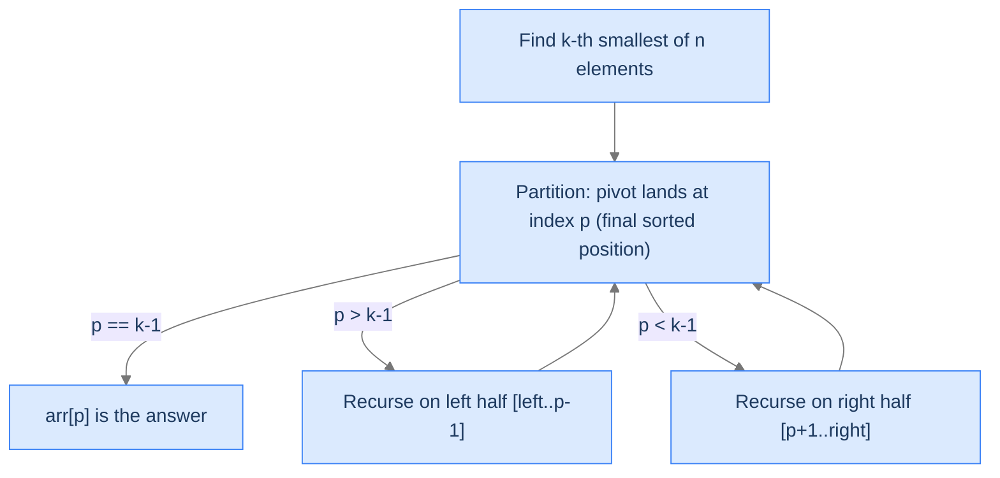

# 11. Pattern: Quickselect

We've spent ten lessons learning algorithms that produce *fully sorted* output. But many real-world problems don't need a full sort. **Find the median.** **Top 100 search results.** **The 1000 closest cities to a query.** **The 10 most-frequent words in a corpus.** In each case, we need to find a *position* in the sorted order — not the entire sorted order. Sorting then taking the first k is `O(n log n)`. There's a better way.

**Quickselect** is quicksort's partition step *without* the recursion on both halves. After one partition, the pivot is in its correct sorted position. If that position equals `k - 1`, we're done — `arr[pivot]` is the k-th smallest. If the position is too small, recurse on the right half (the k-th smallest is there). If too large, recurse on the left. Each recursion **discards half the array**. Average time `O(n)` — *linear*, not `n log n`.

This file is the pattern lesson for quickselect. By the end you'll know the algorithm, the diagnostic checks for spotting "I should use quickselect" problems, and four worked problems: kth smallest, median, k closest to a target, k most frequent.

## Table of contents

1. [Understanding quickselect](#understanding-quickselect)
2. [Identifying quickselect problems](#identifying-quickselect-problems)
3. [Kth smallest element](#kth-smallest-element)
4. [Median finder](#median-finder)
5. [K closest elements](#k-closest-elements)
6. [K most frequent elements](#k-most-frequent-elements)

***

# Understanding Quickselect

Quickselect is a one-sided variant of quicksort. The partition step is identical (Lomuto's, with a random pivot). The difference: after partitioning, instead of recursing on *both* halves, we recurse on *only* the half that contains the target position.

```
function quickselect(arr, left, right, k):
    if left >= right:
        return                         # base case: 0 or 1 elements
    pivot = partition(arr, left, right)    # pivot ends up at its final sorted position
    if pivot == k - 1:
        return                         # arr[pivot] is the k-th smallest
    if pivot > k - 1:
        quickselect(arr, left, pivot - 1, k)    # recurse on left half
    else:
        quickselect(arr, pivot + 1, right, k)   # recurse on right half
```

After the call returns, `arr[k - 1]` holds the k-th smallest element. (If you want the k-th *largest*, change the partition's comparison from `<` to `>`.)



<p align="center"><strong>Quickselect's recursion. Each step partitions and discards one half. Eventually <code>p == k-1</code> and we're done.</strong></p>

---

## Why It's `O(n)` on Average

Quicksort recurses on *both* halves: each level does `O(n)` work, total `n log n`. Quickselect recurses on *one* half: each level does `O(n)` work, but the input shrinks by ~50% each time. Total: `n + n/2 + n/4 + ... = 2n = O(n)`.

```d2
direction: down

l0: "Level 0 — scan n elements" {style.fill: "#dbeafe"; style.stroke: "#3b82f6"}
l1: "Level 1 — scan n/2 elements" {style.fill: "#fde68a"; style.stroke: "#d97706"}
l2: "Level 2 — scan n/4 elements" {style.fill: "#bbf7d0"; style.stroke: "#16a34a"}
l3: "..."
total: "Total: n + n/2 + n/4 + ... ≈ 2n = O(n)" {style.fill: "#ede9fe"; style.stroke: "#7c3aed"}

l0 -> l1 -> l2 -> l3 -> total
```

<p align="center"><strong>Quickselect's geometric cost. Each level halves the input; the sum of a geometric series with ratio 1/2 is bounded by twice the first term. Total <code>O(n)</code> on average.</strong></p>

The worst case is still `O(n²)` — same as quicksort — when bad pivots produce maximally unbalanced partitions. Random pivot selection makes this practically unreachable.

---

## Why You Don't Just Sort and Take the First K

| Approach | Time | Space |
|---|---|---|
| Full sort + first k | `O(n log n)` | `O(1)` (in-place sort) or `O(n)` (out-of-place) |
| Min-heap of size n + extract k | `O(n + k log n)` | `O(1)` (in-place heap) |
| Min-heap of size k | `O(n log k)` | `O(k)` |
| **Quickselect** | `O(n)` average | `O(1)` |

For `k << n`, quickselect's `O(n)` beats every alternative. For `k = n`, all approaches converge to `O(n log n)` and you should just sort.

---

## Strengths and Limitations

| Strength | Detail |
|---|---|
| **`O(n)` average** | Linear time on random data — faster than any full-sort approach. |
| **In-place** | `O(1)` extra memory beyond the recursion stack. |
| **Reuses partition** | If you already have quicksort, quickselect is 5 lines of additional code. |

| Limitation | Detail |
|---|---|
| **Mutates the input** | The array is reordered. (Copy first if the original order matters.) |
| **`O(n²)` worst case** | Random pivots mitigate; deterministic median-of-medians achieves `O(n)` worst case but with much higher constant factor. |
| **Not a "sort"** | After running, only the k-th position is correct; the rest is partially ordered. |

In practice, quickselect is used:
- `numpy.partition()` and `std::nth_element()` — standard library "find the k-th" primitives.
- Top-K queries in databases (often combined with heaps for streaming data).
- Image processing (median filters, percentile-based denoising).
- Statistics (computing percentiles in `O(n)` instead of `O(n log n)`).

---

## Key Takeaway

Quickselect: quicksort's partition without the both-halves recursion. `O(n)` average for finding the k-th smallest. Now we'll learn how to spot the pattern.

***

# Identifying Quickselect Problems

Three diagnostic questions decide whether quickselect fits.

| # | Question | If "yes," quickselect fits because... |
|---|---|---|
| **Q1** | Do we need a *position* in the sorted order, not the full sort? | Quickselect finds one position in `O(n)`; full sort is `O(n log n)`. |
| **Q2** | Can we define a *partial order* on the elements with a `<` comparison? | The partition step needs a comparison rule. |
| **Q3** | Is mutating / reordering the input acceptable? | Quickselect rearranges the array in place. |

If all three are "yes," quickselect is the algorithm of choice.

### Q1 — Why "position, not full sort"?

If you need the entire sorted output, use a full sort. Quickselect's leverage comes from *only finding what you need*. For "the median," "the 95th percentile," "the top 10," "the bottom k" — quickselect dominates.

If you need *all* k smallest in *sorted* order (e.g., a leaderboard), quickselect gives you the partition (`arr[0..k-1]` are the k smallest) but not in sorted order. You'd need to sort that small region after — `O(n + k log k)` total, still better than full sort for small k.

### Q2 — Why "partial order"?

The partition step compares each element against the pivot using `<` (or any total order). If you can define a total order on your elements (numeric value, distance to a target, frequency count, lexicographic on strings), quickselect works. If your elements have no comparison rule, you can't quickselect.

### Q3 — Why "mutation OK"?

Quickselect rearranges the array in place. If you need the original ordering preserved, you must copy first.

---

## Recognising Quickselect in the Wild

Common phrasings that signal quickselect:
- "Find the k-th smallest / largest element."
- "Find the median / percentile."
- "Find the k closest [to a target / origin / pivot]."
- "Find the k most frequent."

Less obvious but equally fitting:
- "Two-sum where the answer is the k-th best pair."
- "Stock prices: find the k worst days."
- "Sensor readings: filter out the bottom 10%."

Anytime you can phrase the problem as "find the k-th item by some score," quickselect applies.

---

## Key Takeaway

Three checks — position-not-sort, total order on elements, mutation OK — gate every quickselect problem. Pass all three and you've earned `O(n)` instead of `O(n log n)`. Now four worked problems.

***

# Kth Smallest Element

The canonical top-K problem. Find the k-th smallest element of an array. The **bounded-size max-heap** is one classical answer; **quickselect** is the other, and it's what we'll implement here — one partition step puts the pivot at its final sorted position, then we recurse on only the half that contains index `k - 1` until the pivot lands there.

---

## The Problem

Given an array `arr` and a positive integer `k`, return the k-th smallest element.

```
Input:  arr = [5, 4, 2, 8], k = 2
Output: 4

Input:  arr = [1, 2, 3, 4, 5], k = 5
Output: 5

Input:  arr = [7, 5, 9], k = 3
Output: 9
```

---

<details>
<summary><h2>Solution &amp; Analysis</h2></summary>

### The Solution

Run quickselect with `k` interpreted as a 1-based rank, so the target sorted position is index `k - 1`. The `partition` helper picks a random pivot, swaps it to the end, scans `[left, right)` routing every value smaller than the pivot to a sliding `next_smaller_index`, then drops the pivot at that index — its final sorted position. The `quickselect` driver compares the returned pivot index against `k - 1`: equal means we're done, larger means recurse on the left half, smaller means recurse on the right half. Once it returns, `arr[k - 1]` holds the k-th smallest element.

```python run
import random
from typing import List

class Solution:

    # Function to partition the array based on comparison to pivot
    def partition(self, arr: List[int], left: int, right: int) -> int:

        # Randomly select a pivot index between left and right
        pivot: int = left + random.randint(0, right - left)

        # 1. Get the pivot value
        pivot_value: int = arr[pivot]

        # Move the pivot to the end
        arr[pivot], arr[right] = arr[right], arr[pivot]

        # 2. Move elements around the pivot such that smaller elements
        # come to the left
        next_smaller_index: int = left
        for i in range(left, right):

            # Elements smaller than pivot come to left
            if arr[i] < pivot_value:
                arr[next_smaller_index], arr[i] = (
                    arr[i],
                    arr[next_smaller_index],
                )
                next_smaller_index += 1

        # 3. Move pivot to its final position
        arr[next_smaller_index], arr[right] = (
            arr[right],
            arr[next_smaller_index],
        )

        # next_smaller_index is now the final index of the pivot_value
        return next_smaller_index

    # Quickselect to find the Kth smallest element
    def quickselect(
        self, arr: List[int], left: int, right: int, k: int
    ) -> None:
        if left >= right:
            return

        # Partition the array and get the pivot index
        pivot: int = self.partition(arr, left, right)

        # If the pivot is at the k-1th position (in 0-indexed from the
        # right)
        if pivot == k - 1:
            return

        # If pivot is greater than k - 1, search in the left half
        elif pivot > k - 1:
            self.quickselect(arr, left, pivot - 1, k)

        # If k is greater than the pivot index, search in the right half
        else:
            self.quickselect(arr, pivot + 1, right, k)

    def kth_smallest_elements(self, arr: List[int], k: int) -> int:
        n: int = len(arr)

        # Step 1: Perform Quickselect to position smallest k elements
        self.quickselect(arr, 0, n - 1, k)

        # Step 2: Return the k-th smallest element
        return arr[k - 1]


print(Solution().kth_smallest_elements([5, 4, 2, 8], 2))      # 4
print(Solution().kth_smallest_elements([1, 2, 3, 4, 5], 5))   # 5
print(Solution().kth_smallest_elements([7, 5, 9], 3))          # 9
print(Solution().kth_smallest_elements([1], 1))                # 1
print(Solution().kth_smallest_elements([3, 1], 1))             # 1
print(Solution().kth_smallest_elements([3, 1], 2))             # 3
print(Solution().kth_smallest_elements([4, 4, 4], 2))          # 4
print(Solution().kth_smallest_elements([10, 5, 3, 8, 1], 3))   # 5
```

```java run
import java.util.*;

public class Main {
    static class Solution {
        private Random rand = new Random();

        // Helper method to swap elements in the array
        private void swap(int[] arr, int i, int j) {
            int temp = arr[i];
            arr[i] = arr[j];
            arr[j] = temp;
        }

        // Function to partition the array based on comparison to pivot
        private int partition(int[] arr, int left, int right) {

            // Randomly select a pivot index between left and right
            int pivot = left + rand.nextInt(right - left + 1);

            // 1. Get the pivot value
            int pivotValue = arr[pivot];

            // Move the pivot to the end
            swap(arr, pivot, right);

            // 2. Move elements around the pivot such that smaller elements
            // come to the left
            int nextSmallerIndex = left;
            for (int i = left; i < right; i++) {

                // Elements smaller than pivot come to left
                if (arr[i] < pivotValue) {
                    swap(arr, nextSmallerIndex, i);
                    nextSmallerIndex++;
                }
            }

            // 3. Move pivot to its final position
            swap(arr, nextSmallerIndex, right);

            // nextSmallerIndex is now the final index of the pivotValue
            return nextSmallerIndex;
        }

        // Quickselect to find the Kth smallest element
        private void quickselect(int[] arr, int left, int right, int k) {
            if (left >= right) {
                return;
            }

            // Partition the array and get the pivot index
            int pivot = partition(arr, left, right);

            // If the pivot is at the k-1th position (in 0-indexed from the
            // right)
            if (pivot == k - 1) {
                return;
            }

            // If pivot is greater than k - 1, search in the left half
            else if (pivot > k - 1) {
                quickselect(arr, left, pivot - 1, k);
            }

            // If k is greater than the pivot index, search in the right half
            else {
                quickselect(arr, pivot + 1, right, k);
            }
        }

        public int kthSmallestElement(int[] arr, int k) {
            int n = arr.length;

            // Step 1: Perform Quickselect to position smallest k elements
            quickselect(arr, 0, n - 1, k);

            // Step 2: Return the k-th smallest element
            return arr[k - 1];
        }
    }

    public static void main(String[] args) {
        System.out.println(new Solution().kthSmallestElement(new int[]{5, 4, 2, 8}, 2));      // 4
        System.out.println(new Solution().kthSmallestElement(new int[]{1, 2, 3, 4, 5}, 5));   // 5
        System.out.println(new Solution().kthSmallestElement(new int[]{7, 5, 9}, 3));          // 9
        System.out.println(new Solution().kthSmallestElement(new int[]{1}, 1));                // 1
        System.out.println(new Solution().kthSmallestElement(new int[]{3, 1}, 1));             // 1
        System.out.println(new Solution().kthSmallestElement(new int[]{3, 1}, 2));             // 3
        System.out.println(new Solution().kthSmallestElement(new int[]{4, 4, 4}, 2));          // 4
        System.out.println(new Solution().kthSmallestElement(new int[]{10, 5, 3, 8, 1}, 3));   // 5
    }
}
```

### Complexity

| Resource | Cost |
|---|---|
| **Time** | `O(n)` average — each partition is `O(n)` and the search space halves each recursion, summing to `2n`. `O(n²)` worst case on maximally unbalanced pivots. |
| **Space** | `O(1)` for the in-place partition, plus `O(log n)` average for the recursion stack. |

For `k << n`, quickselect's `O(n)` average beats a full `O(n log n)` sort and the `O(n log k)` bounded-heap alternative; the random pivot makes the `O(n²)` worst case practically unreachable. The remaining problems below — Median Finder and K Closest Elements — reuse this same partition-based algorithm with the comparison rule adjusted.

</details>

***

# Median Finder

The median is the middle element. For odd `n`, it's the `(n/2 + 1)`-th smallest. For even `n`, it's the *floor* of the average of the two middles. Either way, it's a quickselect problem.

---

## The Problem

Return the median of `arr`. For odd-length arrays, the middle element. For even-length arrays, the floor of the two middle elements' average.

```
Input:  arr = [5, 4, 2, 8, 9]
Output: 5      (sorted: [2, 4, 5, 8, 9], middle = 5)

Input:  arr = [5, 8, 1, 2]
Output: 3      (sorted: [1, 2, 5, 8], middle two avg = 3.5 → floor = 3)

Input:  arr = [-3, -4]
Output: -3     ((-3 + -4) // 2 = -3 — floor division of negatives rounds toward -∞ in some languages; here we use truncation toward zero)
```

---

<details>
<summary><h2>Solution &amp; Analysis</h2></summary>

### The Solution

The trick: for odd `n`, one quickselect call. For even `n`, two calls — one for `n/2 - 1`, one for `n/2`. Take the floor of their average.

```python run
import random
from typing import List

class Solution:

    # Function to partition the array based on comparison to pivot
    def partition(self, arr: List[int], left: int, right: int) -> int:

        # Randomly select a pivot index between left and right
        pivot = left + random.randint(0, right - left)

        # 1. Get the pivot value
        pivot_value = arr[pivot]

        # Move the pivot to the end
        arr[pivot], arr[right] = arr[right], arr[pivot]

        # 2. Move elements around the pivot such that smaller elements
        # come to the left
        next_smaller_index = left
        for i in range(left, right):

            # Elements smaller than pivot come to left
            if arr[i] < pivot_value:
                arr[next_smaller_index], arr[i] = (
                    arr[i],
                    arr[next_smaller_index],
                )
                next_smaller_index += 1

        # 3. Move pivot to its final position
        arr[next_smaller_index], arr[right] = (
            arr[right],
            arr[next_smaller_index],
        )

        # next_smaller_index is now the final index of the pivot_value
        return next_smaller_index

    # Quickselect to find the Kth smallest element
    def quickselect(
        self, arr: List[int], left: int, right: int, k: int
    ) -> int:
        if left >= right:
            return arr[left]

        # Partition the array and get the pivot index
        pivot = self.partition(arr, left, right)

        # If the pivot is at the k-th position (0-indexed),
        # we've found the k-th smallest element and can return it.
        # Note: We are **not using k-1** here because k is already treated
        # as a 0-based index in this implementation.
        # In other words, k = 0 corresponds to the smallest element,
        # k = 1 to the second smallest, and so on.
        if pivot == k:
            return arr[pivot]

        # If the pivot's index is greater than k,
        # the k-th smallest element must be in the left partition
        elif pivot > k:
            return self.quickselect(arr, left, pivot - 1, k)

        # If k is greater than the pivot index, search in the right half
        else:
            return self.quickselect(arr, pivot + 1, right, k)

    def find_median(self, arr: List[int]) -> int:
        n = len(arr)

        # If odd, return the middle element
        if n % 2 == 1:
            return self.quickselect(arr, 0, n - 1, n // 2)

        # If even, take the average of the two middle elements and round
        # up
        left_mid = self.quickselect(arr, 0, n - 1, n // 2 - 1)
        right_mid = self.quickselect(arr, 0, n - 1, n // 2)

        # Round down the average of the two middle elements
        return int((left_mid + right_mid) / 2)


print(Solution().find_median([5, 4, 2, 8, 9]))    # 5
print(Solution().find_median([5, 8, 1, 2]))        # 3
print(Solution().find_median([-3, -4]))            # -3
print(Solution().find_median([1]))                 # 1
print(Solution().find_median([1, 2]))              # 1
print(Solution().find_median([3, 1, 4, 1, 5]))    # 3
print(Solution().find_median([10, 20, 30, 40]))   # 25 -> truncated to 25
print(Solution().find_median([7, 7, 7, 7, 7]))    # 7
```

```java run
import java.util.*;

public class Main {
    static class Solution {
        private Random rand = new Random();

        private void swap(int[] arr, int i, int j) {
            int tmp = arr[i];
            arr[i] = arr[j];
            arr[j] = tmp;
        }

        // Function to partition the array based on comparison to pivot
        private int partition(int[] arr, int left, int right) {

            // Randomly select a pivot index between left and right
            int pivot = left + rand.nextInt(right - left + 1);

            // 1. Get the pivot value
            int pivotValue = arr[pivot];

            // Move the pivot to the end
            swap(arr, pivot, right);

            // 2. Move elements around the pivot such that smaller elements
            // come to the left
            int nextSmallerIndex = left;
            for (int i = left; i < right; i++) {

                // Elements smaller than pivot come to left
                if (arr[i] < pivotValue) {
                    swap(arr, nextSmallerIndex, i);
                    nextSmallerIndex++;
                }
            }

            // 3. Move pivot to its final position
            swap(arr, nextSmallerIndex, right);

            // nextSmallerIndex is now the final index of the pivotValue
            return nextSmallerIndex;
        }

        // Quickselect to find the Kth smallest element
        private int quickselect(int[] arr, int left, int right, int k) {
            if (left >= right) {
                return arr[left];
            }

            // Partition the array and get the pivot index
            int pivot = partition(arr, left, right);

            // If the pivot is at the k-th position (0-indexed),
            // we've found the k-th smallest element and can return it.
            // Note: We are **not using k-1** here because k is already
            // treated as a 0-based index in this implementation. In other
            // words, k = 0 corresponds to the smallest element, k = 1 to the
            // second smallest, and so on.
            if (pivot == k) {
                return arr[pivot];
            }

            // If the pivot's index is greater than k,
            // the k-th smallest element must be in the left partition
            else if (pivot > k) {
                return quickselect(arr, left, pivot - 1, k);
            }

            // If k is greater than the pivot index, search in the right half
            else {
                return quickselect(arr, pivot + 1, right, k);
            }
        }

        public int findMedian(int[] arr) {
            int n = arr.length;

            // If odd, return the middle element
            if (n % 2 == 1) {
                return quickselect(arr, 0, n - 1, n / 2);
            }

            // If even, take the average of the two middle elements and round
            // up
            int leftMid = quickselect(arr, 0, n - 1, n / 2 - 1);
            int rightMid = quickselect(arr, 0, n - 1, n / 2);

            // Round down the average of the two middle elements
            return (leftMid + rightMid) / 2;
        }
    }

    public static void main(String[] args) {
        System.out.println(new Solution().findMedian(new int[]{5, 4, 2, 8, 9}));    // 5
        System.out.println(new Solution().findMedian(new int[]{5, 8, 1, 2}));        // 3
        System.out.println(new Solution().findMedian(new int[]{-3, -4}));            // -3
        System.out.println(new Solution().findMedian(new int[]{1}));                 // 1
        System.out.println(new Solution().findMedian(new int[]{1, 2}));              // 1
        System.out.println(new Solution().findMedian(new int[]{3, 1, 4, 1, 5}));    // 3
        System.out.println(new Solution().findMedian(new int[]{10, 20, 30, 40}));   // 25
        System.out.println(new Solution().findMedian(new int[]{7, 7, 7, 7, 7}));    // 7
    }
}
```

The implementation has three pieces: a Lomuto-style `partition` that picks a random pivot, scans `[left, right)` and routes values smaller than the pivot to a sliding `next_smaller_index`, then drops the pivot at its final position; a `quickselect` driver that recurses on whichever side of the pivot contains the target index; and the `find_median` wrapper that chooses how many calls to make based on parity. The recursion treats `k` as a 0-based index throughout — that's why the base case checks `pivot == k` instead of `pivot == k - 1`. For even-length arrays the floor-of-average is computed as `int((left_mid + right_mid) / 2)`, which truncates toward zero (matching the `Input: [-3, -4] → -3` example above).

### Complexity

| Resource | Cost |
|---|---|
| **Time** | `O(n)` average for both odd-n (one call) and even-n (two calls). |
| **Space (stack)** | `O(log n)` average. |

</details>

***

# K Closest Elements

Quickselect's partition step compares against a pivot. Change *what* you compare and you can find the k-th most-anything: closest to a target, brightest, oldest, etc.

---

## The Problem

Given an array `arr`, an integer `k`, and a target `target`, return the `k` closest elements to `target`. Closeness is measured by `|x - target|`; ties broken by smaller value first.

```
Input:  arr = [1, 2, 3, 4, 5, 6], k = 3, target = 4
Output: [4, 3, 5]

Input:  arr = [1, 4, 5, 6, 7, 8], k = 4, target = 3
Output: [4, 1, 5, 6]

Input:  arr = [1, 5, 8, 10, 12, 13], k = 3, target = 10
Output: [10, 8, 12]
```

---

<details>
<summary><h2>Solution &amp; Analysis</h2></summary>

### The Solution

Replace the partition's "compare elements directly" with "compare distance-to-target." Everything else is identical.

```python run
import random
from typing import List

class Solution:

    # Function to partition the array based on the absolute difference
    # to the target
    def partition(
        self, arr: List[int], left: int, right: int, target: int
    ) -> int:

        # Randomly select a pivot index between left and right
        pivot = left + random.randint(0, right - left)

        # 1. Get the pivot value and its absolute difference to the
        # target
        pivot_val = arr[pivot]
        pivot_diff = abs(pivot_val - target)

        # Move the pivot to the end and update the index
        arr[pivot], arr[right] = arr[right], arr[pivot]

        # 2. Move elements around the pivot such that closer elements
        # come to the left
        next_closest_index = left
        for i in range(left, right):

            # If the current element is closer to the target than the
            # pivot element, swap it with the element at
            # next_closest_index
            if abs(arr[i] - target) < pivot_diff or (
                abs(arr[i] - target) == pivot_diff and arr[i] < pivot_val
            ):
                arr[next_closest_index], arr[i] = (
                    arr[i],
                    arr[next_closest_index],
                )
                next_closest_index += 1

        # 3. Move pivot to its final position
        arr[next_closest_index], arr[right] = (
            arr[right],
            arr[next_closest_index],
        )
        return next_closest_index

    # Quickselect to find the k closest elements
    def quickselect(
        self, arr: List[int], left: int, right: int, k: int, target: int
    ) -> None:
        if left == right:
            return

        # Partition the array and get the pivot index
        pivot = self.partition(arr, left, right, target)

        # If the pivot is at the k-th position (in 0-indexed)
        if k - 1 == pivot:
            return

        # If pivot is greater than k - 1, search in the left half
        elif pivot > k - 1:
            self.quickselect(arr, left, pivot - 1, k, target)

        # If k is greater than the pivot index, search in the right half
        else:
            self.quickselect(arr, pivot + 1, right, k, target)

    def k_closest_elements(
        self, arr: List[int], k: int, target: int
    ) -> List[int]:

        # Step 1: Perform Quickselect to find the k closest elements
        self.quickselect(arr, 0, len(arr) - 1, k, target)

        # Step 2: The first k elements will be the closest elements
        return arr[:k]


print(sorted(Solution().k_closest_elements([1, 2, 3, 4, 5, 6], 3, 4)))     # [3, 4, 5]
print(sorted(Solution().k_closest_elements([1, 4, 5, 6, 7, 8], 4, 3)))     # [1, 4, 5, 6]
print(sorted(Solution().k_closest_elements([1, 5, 8, 10, 12, 13], 3, 10))) # [8, 10, 12]
print(sorted(Solution().k_closest_elements([1], 1, 5)))                    # [1]
print(sorted(Solution().k_closest_elements([1, 2], 1, 2)))                 # [2]
print(sorted(Solution().k_closest_elements([1, 10, 20], 2, 15)))           # [10, 20]
```

```java run
import java.util.*;

public class Main {
    static class Solution {

        // Helper method to swap elements in the array
        private void swap(int[] arr, int i, int j) {
            int temp = arr[i];
            arr[i] = arr[j];
            arr[j] = temp;
        }

        // Function to partition the array based on the absolute difference
        // to the target
        private int partition(int[] arr, int left, int right, int target) {

            // Randomly select a pivot index between left and right
            Random rand = new Random();
            int pivot = left + rand.nextInt(right - left + 1);

            // 1. Get the pivot value and its absolute difference to the
            // target
            int pivotVal = arr[pivot];
            int pivotDiff = Math.abs(pivotVal - target);

            // Move the pivot to the end and update the index
            swap(arr, pivot, right);

            // 2. Move elements around the pivot such that closer elements
            // come to the left
            int nextClosestIndex = left;
            for (int i = left; i < right; i++) {

                // If the current element is closer to the target than the
                // pivot element, swap it with the element at
                // nextClosestIndex
                if (
                    Math.abs(arr[i] - target) < pivotDiff ||
                    (Math.abs(arr[i] - target) == pivotDiff &&
                        arr[i] < pivotVal)
                ) {
                    swap(arr, nextClosestIndex, i);
                    nextClosestIndex++;
                }
            }

            // 3. Move pivot to its final position
            swap(arr, nextClosestIndex, right);
            return nextClosestIndex;
        }

        // Quickselect to find the k closest elements
        private void quickselect(
            int[] arr,
            int left,
            int right,
            int k,
            int target
        ) {
            if (left == right) {
                return;
            }

            // Partition the array and get the pivot index
            int pivot = partition(arr, left, right, target);

            // If the pivot is at the k-th position (in 0-indexed)
            if (k - 1 == pivot) {
                return;
            }

            // If pivot is greater than k - 1, search in the left half
            else if (pivot > k - 1) {
                quickselect(arr, left, pivot - 1, k, target);
            }

            // If k is greater than the pivot index, search in the right half
            else {
                quickselect(arr, pivot + 1, right, k, target);
            }
        }

        // Function to return the k closest elements as an array
        public int[] kClosestElements(int[] arr, int k, int target) {

            // Step 1: Perform Quickselect to find the k closest elements
            quickselect(arr, 0, arr.length - 1, k, target);

            // Step 2: Create a new array to store the closest elements
            return Arrays.copyOfRange(arr, 0, k);
        }
    }

    public static void main(String[] args) {
        int[] r1 = new Solution().kClosestElements(new int[]{1, 2, 3, 4, 5, 6}, 3, 4);
        Arrays.sort(r1); System.out.println(Arrays.toString(r1));    // [3, 4, 5]

        int[] r2 = new Solution().kClosestElements(new int[]{1, 4, 5, 6, 7, 8}, 4, 3);
        Arrays.sort(r2); System.out.println(Arrays.toString(r2));    // [1, 4, 5, 6]

        int[] r3 = new Solution().kClosestElements(new int[]{1, 5, 8, 10, 12, 13}, 3, 10);
        Arrays.sort(r3); System.out.println(Arrays.toString(r3));    // [8, 10, 12]

        int[] r4 = new Solution().kClosestElements(new int[]{1}, 1, 5);
        Arrays.sort(r4); System.out.println(Arrays.toString(r4));    // [1]

        int[] r5 = new Solution().kClosestElements(new int[]{1, 2}, 1, 2);
        Arrays.sort(r5); System.out.println(Arrays.toString(r5));    // [2]

        int[] r6 = new Solution().kClosestElements(new int[]{1, 10, 20}, 2, 15);
        Arrays.sort(r6); System.out.println(Arrays.toString(r6));    // [10, 20]
    }
}
```

The partition compares with the score-tuple `(|x - target|, x)` instead of the raw value `x`: an element wins the swap if its distance to the target is strictly less than the pivot's, or — on a tie — its value is strictly less than the pivot's. The structure of `quickselect` and the recursive driver is unchanged from the basic version; once `pivot == k - 1`, the first `k` slots of `arr` hold the k closest elements (in arbitrary order).

### Complexity

`O(n)` average — same as basic quickselect. Computing `abs(arr[i] - target)` is `O(1)`, so the partition is still linear.

</details>

***

# K Most Frequent Elements

The final pattern — quickselect on a *derived* array. Build a frequency map, extract unique elements, quickselect by frequency.

---

## The Problem

Given an array `arr` and a positive integer `k`, return the `k` most frequent elements (in any order).

```
Input:  arr = [1, 2, 2, 3, 3, 3], k = 2
Output: [2, 3]      (3 appears 3 times, 2 appears 2 times)

Input:  arr = [1, 5, 6, 6], k = 1
Output: [6]

Input:  arr = [1], k = 1
Output: [1]
```

---

<details>
<summary><h2>Solution &amp; Analysis</h2></summary>

### The Solution

Two phases:
1. **Build a frequency map** in `O(n)`, then collect the *unique* values into a `unique` list.
2. **Quickselect over `unique`** — but the comparison is no longer on the raw value. The partition reads each element's frequency through the map and routes *more frequent* elements to the left. Once the pivot lands at index `k - 1`, the first `k` slots of `unique` hold the k most frequent values.

This is quickselect on a *derived* array: the elements being partitioned are the unique values, but the score driving every comparison is `frequency[value]`. The partition's `>` comparison (more frequent goes left) means the recursion converges on the k highest-frequency values rather than the k smallest.

```python run
import random
from typing import List, Dict

class Solution:

    # Partition function to rearrange the elements based on their
    # frequency
    def partition(
        self,
        unique: List[int],
        left: int,
        right: int,
        frequency: Dict[int, int],
    ) -> int:

        # Random pivot index
        pivot = left + random.randint(0, right - left)

        # 1. Ge the frequency of the pivot element
        pivot_freq = frequency[unique[pivot]]

        # Move pivot to the end
        unique[pivot], unique[right] = unique[right], unique[pivot]

        # 2. Move all more frequent elements to the left
        next_higher_frequency_index = left
        for i in range(left, right):

            # If the frequency of the current element is greater than
            # the frequency of the pivot element, swap them
            if frequency[unique[i]] > pivot_freq:
                unique[next_higher_frequency_index], unique[i] = (
                    unique[i],
                    unique[next_higher_frequency_index],
                )
                next_higher_frequency_index += 1

        # 3. Move pivot to its final position
        unique[right], unique[next_higher_frequency_index] = (
            unique[next_higher_frequency_index],
            unique[right],
        )
        return next_higher_frequency_index

    # Quickselect to find the k-th most frequent element
    def quickselect(
        self,
        unique: List[int],
        left: int,
        right: int,
        k: int,
        frequency: Dict[int, int],
    ) -> None:

        # Only one element left in the range
        if left == right:
            return

        # Partition the array and get the pivot index
        pivot = self.partition(unique, left, right, frequency)

        # If the pivot is at the k-th position (in 0-indexed)
        if k - 1 == pivot:
            return

        # If pivot is greater than k - 1, search in the left half
        elif pivot > k - 1:
            self.quickselect(unique, left, pivot - 1, k, frequency)

        # If k is greater than the pivot index, search in the right half
        else:
            self.quickselect(unique, pivot + 1, right, k, frequency)

    def k_most_frequent_elements(
        self, arr: List[int], k: int
    ) -> List[int]:

        # Hash map to store frequency of each element
        frequency = {}

        # Step 1: Count frequency of each element
        for n in arr:
            frequency[n] = frequency.get(n, 0) + 1

        # List to keep track of unique elements
        unique = list(frequency.keys())

        # Step 3: Find the k-th most frequent element
        # We want the k-th largest element by frequency
        self.quickselect(unique, 0, len(unique) - 1, k, frequency)

        # Step 4: Return the top k frequent elements
        return unique[:k]


print(sorted(Solution().k_most_frequent_elements([1, 2, 2, 3, 3, 3], 2)))  # [2, 3]
print(sorted(Solution().k_most_frequent_elements([1, 5, 6, 6], 1)))        # [6]
print(sorted(Solution().k_most_frequent_elements([1], 1)))                  # [1]
print(sorted(Solution().k_most_frequent_elements([4, 4, 4, 4], 1)))        # [4]
print(sorted(Solution().k_most_frequent_elements([1, 2, 3], 3)))            # [1, 2, 3]
print(sorted(Solution().k_most_frequent_elements([5, 5, 3, 3, 1], 2)))     # [3, 5]
```

```java run
import java.util.*;

public class Main {
    static class Solution {

        // Helper method to swap elements in the array
        private void swap(int[] arr, int i, int j) {
            int temp = arr[i];
            arr[i] = arr[j];
            arr[j] = temp;
        }

        // Partition function to rearrange the elements based on their
        // frequency
        private int partition(
            int[] unique,
            int left,
            int right,
            Map<Integer, Integer> frequency
        ) {

            // Random pivot index
            Random rand = new Random();
            int pivot = left + rand.nextInt(right - left + 1);

            // 1. Get the frequency of the pivot element
            int pivotFreq = frequency.get(unique[pivot]);

            // Move pivot to the end
            swap(unique, pivot, right);

            // 2. Move all more frequent elements to the left
            int nextHigherFrequencyIndex = left;
            for (int i = left; i < right; i++) {

                // If the frequency of the current element is greater than
                // the frequency of the pivot element, swap them
                if (frequency.get(unique[i]) > pivotFreq) {
                    swap(unique, nextHigherFrequencyIndex, i);
                    nextHigherFrequencyIndex += 1;
                }
            }

            // 3. Move pivot to its final position
            swap(unique, nextHigherFrequencyIndex, right);
            return nextHigherFrequencyIndex;
        }

        // Quickselect to find the k-th most frequent element
        private void quickselect(
            int[] unique,
            int left,
            int right,
            int k,
            Map<Integer, Integer> frequency
        ) {

            // Only one element left in the range
            if (left == right) {
                return;
            }

            // Partition the array and get the pivot index
            int pivot = partition(unique, left, right, frequency);

            // If the pivot is at the k-th position (in 0-indexed)
            if (k - 1 == pivot) {
                return;
            }

            // If pivot is greater than k - 1, search in the left half
            else if (pivot > k - 1) {
                quickselect(unique, left, pivot - 1, k, frequency);
            }

            // If k is greater than the pivot index, search in the right half
            else {
                quickselect(unique, pivot + 1, right, k, frequency);
            }
        }

        public int[] kMostFrequentElements(int[] arr, int k) {

            // Hash map to store frequency of each element
            Map<Integer, Integer> frequency = new HashMap<>();

            // Step 1: Count frequency of each element
            for (int n : arr) {
                frequency.put(n, frequency.getOrDefault(n, 0) + 1);
            }

            // List to keep track of unique elements
            int[] unique = new int[frequency.size()];
            int idx = 0;

            // Step 2: Store the unique elements in the array
            for (var element : frequency.entrySet()) {
                unique[idx++] = element.getKey();
            }

            // Step 3: Find the k-th most frequent element
            // We want the k-th largest element by frequency
            quickselect(unique, 0, unique.length - 1, k, frequency);

            // Step 4: Return the top k frequent elements
            return Arrays.copyOfRange(unique, 0, k);
        }
    }

    public static void main(String[] args) {
        int[] r1 = new Solution().kMostFrequentElements(new int[]{1, 2, 2, 3, 3, 3}, 2);
        Arrays.sort(r1); System.out.println(Arrays.toString(r1));   // [2, 3]

        int[] r2 = new Solution().kMostFrequentElements(new int[]{1, 5, 6, 6}, 1);
        Arrays.sort(r2); System.out.println(Arrays.toString(r2));   // [6]

        int[] r3 = new Solution().kMostFrequentElements(new int[]{1}, 1);
        Arrays.sort(r3); System.out.println(Arrays.toString(r3));   // [1]

        int[] r4 = new Solution().kMostFrequentElements(new int[]{4, 4, 4, 4}, 1);
        Arrays.sort(r4); System.out.println(Arrays.toString(r4));   // [4]

        int[] r5 = new Solution().kMostFrequentElements(new int[]{1, 2, 3}, 3);
        Arrays.sort(r5); System.out.println(Arrays.toString(r5));   // [1, 2, 3]

        int[] r6 = new Solution().kMostFrequentElements(new int[]{5, 5, 3, 3, 1}, 2);
        Arrays.sort(r6); System.out.println(Arrays.toString(r6));   // [3, 5]
    }
}
```

The structure mirrors basic quickselect, with one change: the partition no longer compares `arr[i] < pivot_value` — it compares `frequency[unique[i]] > pivot_freq`, reading each element's score out of the frequency map. Routing *more frequent* values left (a `>` test) makes the k-th *most* frequent — rather than k-th smallest — land at index `k - 1`, so `unique[:k]` is the answer.

### Complexity

| Resource | Cost |
|---|---|
| **Time (frequency build)** | `O(n)` — one pass over `arr`. |
| **Time (quickselect)** | `O(u)` average — each partition is `O(u)` and the search space halves each recursion; `O(u²)` worst case, where `u = number of unique elements ≤ n`. |
| **Total time** | `O(n + u)` average. |
| **Space** | `O(u)` for the frequency map and the `unique` list; `O(log u)` average for the recursion stack. |

For inputs with many unique elements (`u ≈ n`), this is `O(n)` average — the random pivot makes the `O(u²)` worst case practically unreachable. The map lookup inside the partition is `O(1)`, so reading frequencies adds no asymptotic cost.

</details>
<details>
<summary><h2>Final Takeaway</h2></summary>


Quickselect is one algorithm with a hundred faces. Find the k-th smallest, the median, the k closest to a target, the k most frequent — they're all the same recursion with a different comparison function. The pattern: **derive a score for each element, partition by score, recurse on the half that contains position k**.

This pattern shows up everywhere — top-K queries in databases, percentile computations in statistics, ranking systems in recommendation engines. Once you can spot it, you stop sorting full arrays just to look at one position.

The next lesson is the final pattern in the sorting section: **custom compare**. Sometimes the elements aren't simple integers — they're records, tuples, objects with multiple fields. The sort key is an expression, not a value. We'll see how to abstract the comparison out of the algorithm so any sort can handle any comparison rule.

**Transfer challenge — try before the Custom Compare lesson:** Write a function that returns the *k smallest* elements of an array, sorted ascending. Quickselect gets you the partition (`arr[0..k-1]` are the k smallest, but in arbitrary order). What additional step makes the output sorted? What's the total time?

<details>
<summary><strong>Answer — open after you've thought about it</strong></summary>

```python run
class Solution:
    def k_smallest_sorted(self, arr, k):
        self._quickselect(arr, 0, len(arr) - 1, k)
        return sorted(arr[:k])
```

Quickselect: `O(n)` average. Sorting the first k elements: `O(k log k)`. Total: `O(n + k log k)`.

For `k << n`, this is `O(n)` — a strict improvement over full sort's `O(n log n)`. For `k = n`, it's `O(n log n)` — same as full sort. The break-even is `k ≈ n / log n`.

This pattern (partition + small sort) is exactly what `numpy.partition()` + `numpy.sort()[:k]` does internally. **You just rediscovered the optimal top-K-sorted algorithm.**

</details>

</details>