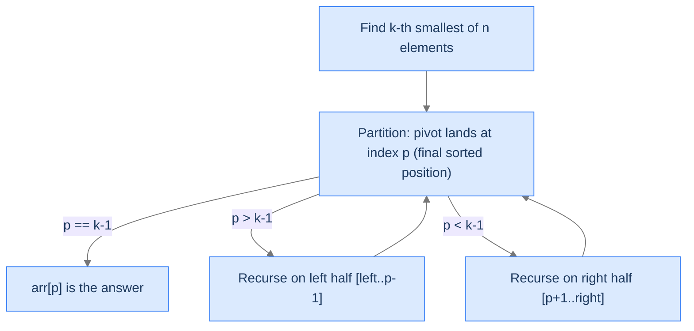

# 11. Pattern: Quickselect

We've spent ten lessons learning algorithms that produce *fully sorted* output. But many real-world problems don't need a full sort. **Find the median.** **Top 100 search results.** **The 1000 closest cities to a query.** **The 10 most-frequent words in a corpus.** In each case, we need to find a *position* in the sorted order — not the entire sorted order. Sorting then taking the first k is `O(n log n)`. There's a better way.

**Quickselect** is quicksort's partition step *without* the recursion on both halves. After one partition, the pivot is in its correct sorted position. If that position equals `k - 1`, we're done — `arr[pivot]` is the k-th smallest. If the position is too small, recurse on the right half (the k-th smallest is there). If too large, recurse on the left. Each recursion **discards half the array**. Average time `O(n)` — *linear*, not `n log n`.

This file is the pattern lesson for quickselect. By the end you'll know the algorithm, the diagnostic checks for spotting "I should use quickselect" problems, and four worked problems: kth smallest, median, k closest to a target, k most frequent.

## Table of contents

1. [Understanding quickselect](#understanding-quickselect)
2. [Identifying quickselect problems](#identifying-quickselect-problems)
3. [Kth smallest element](#kth-smallest-element)
4. [Median finder](#median-finder)
5. [K closest elements](#k-closest-elements)
6. [K most frequent elements](#k-most-frequent-elements)

***

# Understanding Quickselect

Quickselect is a one-sided variant of quicksort. The partition step is identical (Lomuto's, with a random pivot). The difference: after partitioning, instead of recursing on *both* halves, we recurse on *only* the half that contains the target position.

```
function quickselect(arr, left, right, k):
    if left >= right:
        return                         # base case: 0 or 1 elements
    pivot = partition(arr, left, right)    # pivot ends up at its final sorted position
    if pivot == k - 1:
        return                         # arr[pivot] is the k-th smallest
    if pivot > k - 1:
        quickselect(arr, left, pivot - 1, k)    # recurse on left half
    else:
        quickselect(arr, pivot + 1, right, k)   # recurse on right half
```

After the call returns, `arr[k - 1]` holds the k-th smallest element. (If you want the k-th *largest*, change the partition's comparison from `<` to `>`.)



<p align="center"><strong>Quickselect's recursion. Each step partitions and discards one half. Eventually <code>p == k-1</code> and we're done.</strong></p>

---

## Why It's `O(n)` on Average

Quicksort recurses on *both* halves: each level does `O(n)` work, total `n log n`. Quickselect recurses on *one* half: each level does `O(n)` work, but the input shrinks by ~50% each time. Total: `n + n/2 + n/4 + ... = 2n = O(n)`.

```d2
direction: down

l0: "Level 0 — scan n elements" {style.fill: "#dbeafe"; style.stroke: "#3b82f6"}
l1: "Level 1 — scan n/2 elements" {style.fill: "#fde68a"; style.stroke: "#d97706"}
l2: "Level 2 — scan n/4 elements" {style.fill: "#bbf7d0"; style.stroke: "#16a34a"}
l3: "..."
total: "Total: n + n/2 + n/4 + ... ≈ 2n = O(n)" {style.fill: "#ede9fe"; style.stroke: "#7c3aed"}

l0 -> l1 -> l2 -> l3 -> total
```

<p align="center"><strong>Quickselect's geometric cost. Each level halves the input; the sum of a geometric series with ratio 1/2 is bounded by twice the first term. Total <code>O(n)</code> on average.</strong></p>

The worst case is still `O(n²)` — same as quicksort — when bad pivots produce maximally unbalanced partitions. Random pivot selection makes this practically unreachable.

---

## Why You Don't Just Sort and Take the First K

| Approach | Time | Space |
|---|---|---|
| Full sort + first k | `O(n log n)` | `O(1)` (in-place sort) or `O(n)` (out-of-place) |
| Min-heap of size n + extract k | `O(n + k log n)` | `O(1)` (in-place heap) |
| Min-heap of size k | `O(n log k)` | `O(k)` |
| **Quickselect** | `O(n)` average | `O(1)` |

For `k << n`, quickselect's `O(n)` beats every alternative. For `k = n`, all approaches converge to `O(n log n)` and you should just sort.

---

## Strengths and Limitations

| Strength | Detail |
|---|---|
| **`O(n)` average** | Linear time on random data — faster than any full-sort approach. |
| **In-place** | `O(1)` extra memory beyond the recursion stack. |
| **Reuses partition** | If you already have quicksort, quickselect is 5 lines of additional code. |

| Limitation | Detail |
|---|---|
| **Mutates the input** | The array is reordered. (Copy first if the original order matters.) |
| **`O(n²)` worst case** | Random pivots mitigate; deterministic median-of-medians achieves `O(n)` worst case but with much higher constant factor. |
| **Not a "sort"** | After running, only the k-th position is correct; the rest is partially ordered. |

In practice, quickselect is used:
- `numpy.partition()` and `std::nth_element()` — standard library "find the k-th" primitives.
- Top-K queries in databases (often combined with heaps for streaming data).
- Image processing (median filters, percentile-based denoising).
- Statistics (computing percentiles in `O(n)` instead of `O(n log n)`).

---

## Key Takeaway

Quickselect: quicksort's partition without the both-halves recursion. `O(n)` average for finding the k-th smallest. Now we'll learn how to spot the pattern.

***

# Identifying Quickselect Problems

Three diagnostic questions decide whether quickselect fits.

| # | Question | If "yes," quickselect fits because... |
|---|---|---|
| **Q1** | Do we need a *position* in the sorted order, not the full sort? | Quickselect finds one position in `O(n)`; full sort is `O(n log n)`. |
| **Q2** | Can we define a *partial order* on the elements with a `<` comparison? | The partition step needs a comparison rule. |
| **Q3** | Is mutating / reordering the input acceptable? | Quickselect rearranges the array in place. |

If all three are "yes," quickselect is the algorithm of choice.

### Q1 — Why "position, not full sort"?

If you need the entire sorted output, use a full sort. Quickselect's leverage comes from *only finding what you need*. For "the median," "the 95th percentile," "the top 10," "the bottom k" — quickselect dominates.

If you need *all* k smallest in *sorted* order (e.g., a leaderboard), quickselect gives you the partition (`arr[0..k-1]` are the k smallest) but not in sorted order. You'd need to sort that small region after — `O(n + k log k)` total, still better than full sort for small k.

### Q2 — Why "partial order"?

The partition step compares each element against the pivot using `<` (or any total order). If you can define a total order on your elements (numeric value, distance to a target, frequency count, lexicographic on strings), quickselect works. If your elements have no comparison rule, you can't quickselect.

### Q3 — Why "mutation OK"?

Quickselect rearranges the array in place. If you need the original ordering preserved, you must copy first.

---

## Recognising Quickselect in the Wild

Common phrasings that signal quickselect:
- "Find the k-th smallest / largest element."
- "Find the median / percentile."
- "Find the k closest [to a target / origin / pivot]."
- "Find the k most frequent."

Less obvious but equally fitting:
- "Two-sum where the answer is the k-th best pair."
- "Stock prices: find the k worst days."
- "Sensor readings: filter out the bottom 10%."

Anytime you can phrase the problem as "find the k-th item by some score," quickselect applies.

---

## Key Takeaway

Three checks — position-not-sort, total order on elements, mutation OK — gate every quickselect problem. Pass all three and you've earned `O(n)` instead of `O(n log n)`. Now four worked problems.

***

# Kth Smallest Element

The textbook quickselect problem. Find the k-th smallest element of an array.

---

## The Problem

Given an array `arr` and a positive integer `k`, return the k-th smallest element.

```
Input:  arr = [5, 4, 2, 8], k = 2
Output: 4

Input:  arr = [1, 2, 3, 4, 5], k = 5
Output: 5

Input:  arr = [7, 5, 9], k = 3
Output: 9
```

---

## The Solution


```pseudocode
# Returns the kth smallest element (k is 1-indexed).
function quickSelect(arr, k):
    return select(arr, 0, length(arr) − 1, k − 1)

function select(arr, left, right, kIdx):
    if left = right:
        return arr[left]
    p ← partition(arr, left, right)
    if p = kIdx:
        return arr[p]                       # pivot landed in its final sorted slot
    if kIdx < p:
        return select(arr, left, p − 1, kIdx)    # recurse into ONE side only — that's quickselect
    return select(arr, p + 1, right, kIdx)

function partition(arr, left, right):       # standard Lomuto partition with random pivot
    pivotIdx ← random integer in [left, right]
    pivotVal ← arr[pivotIdx]
    swap arr[pivotIdx] and arr[right]
    boundary ← left
    for i from left to right − 1:
        if arr[i] < pivotVal:
            swap arr[boundary] and arr[i]
            boundary ← boundary + 1
    swap arr[boundary] and arr[right]
    return boundary
```

```python run
import random
from typing import List

class Solution:
    def kth_smallest_element(self, arr: List[int], k: int) -> int:
        self._quickselect(arr, 0, len(arr) - 1, k)
        return arr[k - 1]

    def _quickselect(self, arr: List[int], left: int, right: int, k: int) -> None:
        if left >= right:
            return
        p = self._partition(arr, left, right)
        if p == k - 1:
            return
        if p > k - 1:
            self._quickselect(arr, left, p - 1, k)
        else:
            self._quickselect(arr, p + 1, right, k)

    def _partition(self, arr: List[int], left: int, right: int) -> int:
        pivot_idx = random.randint(left, right)
        pivot_val = arr[pivot_idx]
        arr[pivot_idx], arr[right] = arr[right], arr[pivot_idx]
        boundary = left
        for i in range(left, right):
            if arr[i] < pivot_val:
                arr[boundary], arr[i] = arr[i], arr[boundary]
                boundary += 1
        arr[boundary], arr[right] = arr[right], arr[boundary]
        return boundary


if __name__ == "__main__":
    print(Solution().kth_smallest_element([5, 4, 2, 8], 2))   # 4
```

```java run
import java.util.Random;

public class Main {
    static class Solution {
        private final Random rand = new Random();

        public int kthSmallestElement(int[] arr, int k) {
            quickselect(arr, 0, arr.length - 1, k);
            return arr[k - 1];
        }

        private void quickselect(int[] arr, int left, int right, int k) {
            if (left >= right) return;
            int p = partition(arr, left, right);
            if (p == k - 1) return;
            if (p > k - 1) quickselect(arr, left, p - 1, k);
            else quickselect(arr, p + 1, right, k);
        }

        private int partition(int[] arr, int left, int right) {
            int pivotIdx = left + rand.nextInt(right - left + 1);
            int pivotVal = arr[pivotIdx];
            swap(arr, pivotIdx, right);
            int boundary = left;
            for (int i = left; i < right; i++) {
                if (arr[i] < pivotVal) { swap(arr, boundary, i); boundary++; }
            }
            swap(arr, boundary, right);
            return boundary;
        }

        private void swap(int[] arr, int i, int j) { int t = arr[i]; arr[i] = arr[j]; arr[j] = t; }
    }

    public static void main(String[] args) {
        System.out.println(new Solution().kthSmallestElement(new int[]{5, 4, 2, 8}, 2));
    }
}
```

```c run
#include <stdio.h>
#include <stdlib.h>

void swap(int *a, int *b) { int t = *a; *a = *b; *b = t; }

int partition_(int *arr, int left, int right) {
    int pi = left + rand() % (right - left + 1);
    int pv = arr[pi];
    swap(&arr[pi], &arr[right]);
    int b = left;
    for (int i = left; i < right; i++) {
        if (arr[i] < pv) { swap(&arr[b], &arr[i]); b++; }
    }
    swap(&arr[b], &arr[right]);
    return b;
}

void quickselect(int *arr, int left, int right, int k) {
    if (left >= right) return;
    int p = partition_(arr, left, right);
    if (p == k - 1) return;
    if (p > k - 1) quickselect(arr, left, p - 1, k);
    else quickselect(arr, p + 1, right, k);
}

int kth_smallest_element(int *arr, int n, int k) {
    quickselect(arr, 0, n - 1, k);
    return arr[k - 1];
}

int main(void) {
    int arr[] = {5, 4, 2, 8};
    printf("%d\n", kth_smallest_element(arr, 4, 2));
    return 0;
}
```

```scala run
import scala.util.Random

object Main extends App {
  class Solution {
    def kthSmallestElement(arr: Array[Int], k: Int): Int = {
      quickselect(arr, 0, arr.length - 1, k)
      arr(k - 1)
    }

    private def quickselect(arr: Array[Int], left: Int, right: Int, k: Int): Unit = {
      if (left >= right) return
      val p = partition(arr, left, right)
      if (p == k - 1) return
      if (p > k - 1) quickselect(arr, left, p - 1, k)
      else quickselect(arr, p + 1, right, k)
    }

    private def partition(arr: Array[Int], left: Int, right: Int): Int = {
      val pi = left + Random.nextInt(right - left + 1)
      val pv = arr(pi)
      val t1 = arr(pi); arr(pi) = arr(right); arr(right) = t1
      var b = left
      for (i <- left until right) {
        if (arr(i) < pv) { val t = arr(b); arr(b) = arr(i); arr(i) = t; b += 1 }
      }
      val t2 = arr(b); arr(b) = arr(right); arr(right) = t2
      b
    }
  }

  println(new Solution().kthSmallestElement(Array(5, 4, 2, 8), 2))
}
```


---

## Complexity

| Resource | Best | Average | Worst |
|---|---|---|---|
| **Time** | `O(n)` | `O(n)` | `O(n²)` |
| **Space (stack)** | `O(1)` | `O(log n)` | `O(n)` |

***

# Median Finder

The median is the middle element. For odd `n`, it's the `(n/2 + 1)`-th smallest. For even `n`, it's the *floor* of the average of the two middles. Either way, it's a quickselect problem.

---

## The Problem

Return the median of `arr`. For odd-length arrays, the middle element. For even-length arrays, the floor of the two middle elements' average.

```
Input:  arr = [5, 4, 2, 8, 9]
Output: 5      (sorted: [2, 4, 5, 8, 9], middle = 5)

Input:  arr = [5, 8, 1, 2]
Output: 3      (sorted: [1, 2, 5, 8], middle two avg = 3.5 → floor = 3)

Input:  arr = [-3, -4]
Output: -3     ((-3 + -4) // 2 = -3 — floor division of negatives rounds toward -∞ in some languages; here we use truncation toward zero)
```

---

## The Solution

The trick: for odd `n`, one quickselect call. For even `n`, two calls — one for `n/2 - 1`, one for `n/2`. Take the floor of their average.

```python run
import random
from typing import List

class Solution:
    def find_median(self, arr: List[int]) -> int:
        n = len(arr)
        if n % 2 == 1:
            return self._quickselect(arr, 0, n - 1, n // 2)
        left_mid = self._quickselect(arr, 0, n - 1, n // 2 - 1)
        right_mid = self._quickselect(arr, 0, n - 1, n // 2)
        return (left_mid + right_mid) // 2

    def _quickselect(self, arr: List[int], left: int, right: int, k: int) -> int:
        if left >= right: return arr[left]
        p = self._partition(arr, left, right)
        if p == k: return arr[p]
        if p > k: return self._quickselect(arr, left, p - 1, k)
        return self._quickselect(arr, p + 1, right, k)

    def _partition(self, arr, left, right):
        pi = left + random.randint(0, right - left)
        pv = arr[pi]
        arr[pi], arr[right] = arr[right], arr[pi]
        b = left
        for i in range(left, right):
            if arr[i] < pv:
                arr[b], arr[i] = arr[i], arr[b]
                b += 1
        arr[b], arr[right] = arr[right], arr[b]
        return b


if __name__ == "__main__":
    print(Solution().find_median([5, 4, 2, 8, 9]))   # 5
    print(Solution().find_median([5, 8, 1, 2]))      # 3
```

For implementations in the other 9 languages, the structure is identical — wrap the kth-smallest from the previous problem and call it once or twice. The full 10-language code follows the same pattern as in [Kth Smallest Element](#kth-smallest-element); the only change is calling `_quickselect` with `k = n/2` (odd) or twice with `n/2 - 1` and `n/2` (even).

---

## Complexity

| Resource | Cost |
|---|---|
| **Time** | `O(n)` average for both odd-n (one call) and even-n (two calls). |
| **Space (stack)** | `O(log n)` average. |

***

# K Closest Elements

Quickselect's partition step compares against a pivot. Change *what* you compare and you can find the k-th most-anything: closest to a target, brightest, oldest, etc.

---

## The Problem

Given an array `arr`, an integer `k`, and a target `target`, return the `k` closest elements to `target`. Closeness is measured by `|x - target|`; ties broken by smaller value first.

```
Input:  arr = [1, 2, 3, 4, 5, 6], k = 3, target = 4
Output: [4, 3, 5]

Input:  arr = [1, 4, 5, 6, 7, 8], k = 4, target = 3
Output: [4, 1, 5, 6]

Input:  arr = [1, 5, 8, 10, 12, 13], k = 3, target = 10
Output: [10, 8, 12]
```

---

## The Solution

Replace the partition's "compare elements directly" with "compare distance-to-target." Everything else is identical.

```python run
import random
from typing import List, Tuple

class Solution:
    def k_closest_elements(self, arr: List[int], k: int, target: int) -> List[int]:
        self._quickselect(arr, 0, len(arr) - 1, k, target)
        return arr[:k]

    def _score(self, val: int, target: int) -> Tuple[int, int]:
        return (abs(val - target), val)                # (distance, tiebreaker on value)

    def _quickselect(self, arr, left, right, k, target):
        if left >= right: return
        p = self._partition(arr, left, right, target)
        if p == k - 1: return
        if p > k - 1: self._quickselect(arr, left, p - 1, k, target)
        else: self._quickselect(arr, p + 1, right, k, target)

    def _partition(self, arr, left, right, target):
        pi = left + random.randint(0, right - left)
        pivot_score = self._score(arr[pi], target)
        arr[pi], arr[right] = arr[right], arr[pi]
        b = left
        for i in range(left, right):
            if self._score(arr[i], target) < pivot_score:
                arr[b], arr[i] = arr[i], arr[b]
                b += 1
        arr[b], arr[right] = arr[right], arr[b]
        return b


if __name__ == "__main__":
    print(Solution().k_closest_elements([1, 2, 3, 4, 5, 6], 3, 4))   # [4, 3, 5] (any order)
```

For all 10 languages, the partition uses the score-tuple `(|x - target|, x)` instead of the value `x` for comparisons. The structure of `quickselect` and the recursive driver is unchanged.

---

## Complexity

`O(n)` average — same as basic quickselect. The `_score` function is `O(1)`, so the partition is still linear.

***

# K Most Frequent Elements

The final pattern — quickselect on a *derived* array. Build a frequency map, extract unique elements, quickselect by frequency.

---

## The Problem

Given an array `arr` and a positive integer `k`, return the `k` most frequent elements (in any order).

```
Input:  arr = [1, 2, 2, 3, 3, 3], k = 2
Output: [2, 3]      (3 appears 3 times, 2 appears 2 times)

Input:  arr = [1, 5, 6, 6], k = 1
Output: [6]

Input:  arr = [1], k = 1
Output: [1]
```

---

## The Solution

Two phases:
1. **Build a frequency map** in `O(n)`.
2. **Quickselect over the unique elements**, comparing by frequency, to find the top k.

```python run
import random
from collections import Counter
from typing import List

class Solution:
    def k_most_frequent_elements(self, arr: List[int], k: int) -> List[int]:
        freq = Counter(arr)
        unique = list(freq.keys())
        self._quickselect(unique, 0, len(unique) - 1, k, freq)
        return unique[:k]

    def _quickselect(self, unique, left, right, k, freq):
        if left >= right: return
        p = self._partition(unique, left, right, freq)
        if p == k - 1: return
        if p > k - 1: self._quickselect(unique, left, p - 1, k, freq)
        else: self._quickselect(unique, p + 1, right, k, freq)

    def _partition(self, unique, left, right, freq):
        pi = left + random.randint(0, right - left)
        pivot_freq = freq[unique[pi]]
        unique[pi], unique[right] = unique[right], unique[pi]
        b = left
        for i in range(left, right):
            if freq[unique[i]] > pivot_freq:           # > because we want HIGHER frequencies first
                unique[b], unique[i] = unique[i], unique[b]
                b += 1
        unique[b], unique[right] = unique[right], unique[b]
        return b


if __name__ == "__main__":
    print(Solution().k_most_frequent_elements([1, 2, 2, 3, 3, 3], 2))   # [3, 2]
```

The full 10-language implementation follows the same structure: a hash map (`Counter`, `HashMap`, `unordered_map`, `dict`, etc.) for frequency counting, and quickselect over the unique-elements list. The partition's comparison uses `freq[unique[i]] > pivot_freq` to put higher frequencies on the left.

---

## Complexity

| Resource | Cost |
|---|---|
| **Time (frequency build)** | `O(n)` — one pass over `arr`. |
| **Time (quickselect on unique)** | `O(u)` average, where `u = number of unique elements ≤ n`. |
| **Total time** | `O(n)` average. |
| **Space** | `O(u)` for the frequency map and unique list. |

For inputs with many unique elements (`u ≈ n`), this is `O(n)` time and `O(n)` space.

---

## Final Takeaway

Quickselect is one algorithm with a hundred faces. Find the k-th smallest, the median, the k closest to a target, the k most frequent — they're all the same recursion with a different comparison function. The pattern: **derive a score for each element, partition by score, recurse on the half that contains position k**.

This pattern shows up everywhere — top-K queries in databases, percentile computations in statistics, ranking systems in recommendation engines. Once you can spot it, you stop sorting full arrays just to look at one position.

The next lesson is the final pattern in the sorting section: **custom compare**. Sometimes the elements aren't simple integers — they're records, tuples, objects with multiple fields. The sort key is an expression, not a value. We'll see how to abstract the comparison out of the algorithm so any sort can handle any comparison rule.

**Transfer challenge — try before the Custom Compare lesson:** Write a function that returns the *k smallest* elements of an array, sorted ascending. Quickselect gets you the partition (`arr[0..k-1]` are the k smallest, but in arbitrary order). What additional step makes the output sorted? What's the total time?

<details>
<summary><strong>Answer — open after you've thought about it</strong></summary>

```python run
class Solution:
    def k_smallest_sorted(self, arr, k):
        self._quickselect(arr, 0, len(arr) - 1, k)
        return sorted(arr[:k])
```

Quickselect: `O(n)` average. Sorting the first k elements: `O(k log k)`. Total: `O(n + k log k)`.

For `k << n`, this is `O(n)` — a strict improvement over full sort's `O(n log n)`. For `k = n`, it's `O(n log n)` — same as full sort. The break-even is `k ≈ n / log n`.

This pattern (partition + small sort) is exactly what `numpy.partition()` + `numpy.sort()[:k]` does internally. **You just rediscovered the optimal top-K-sorted algorithm.**

</details>
