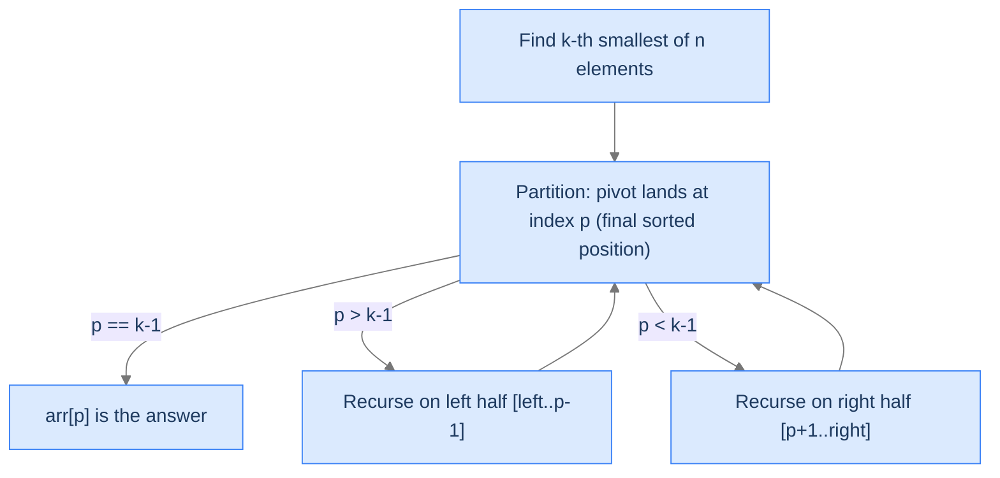

# Understanding Quickselect

Quickselect is a one-sided variant of quicksort. The partition step is identical (Lomuto's, with a random pivot). The difference: after partitioning, instead of recursing on *both* halves, we recurse on *only* the half that contains the target position.

```
function quickselect(arr, left, right, k):
    if left >= right:
        return                         # base case: 0 or 1 elements
    pivot = partition(arr, left, right)    # pivot ends up at its final sorted position
    if pivot == k - 1:
        return                         # arr[pivot] is the k-th smallest
    if pivot > k - 1:
        quickselect(arr, left, pivot - 1, k)    # recurse on left half
    else:
        quickselect(arr, pivot + 1, right, k)   # recurse on right half
```

After the call returns, `arr[k - 1]` holds the k-th smallest element. (If you want the k-th *largest*, change the partition's comparison from `<` to `>`.)

> 🖼 Diagram — Quickselect's recursion. Each step partitions and discards one half. Eventually p == k-1 and we're done.


<p align="center"><strong>Quickselect's recursion. Each step partitions and discards one half. Eventually <code>p == k-1</code> and we're done.</strong></p>

---

## Why It's `O(n)` on Average

Quicksort recurses on *both* halves: each level does `O(n)` work, total `n log n`. Quickselect recurses on *one* half: each level does `O(n)` work, but the input shrinks by ~50% each time. Total: `n + n/2 + n/4 + ... = 2n = O(n)`.

> 🖼 Diagram — Quickselect's geometric cost. Each level halves the input; the sum of a geometric series with ratio 1/2 is bounded by twice the first term. Total O(n) on average.
```d2
direction: down

l0: "Level 0 — scan n elements" {style.fill: "#dbeafe"; style.stroke: "#3b82f6"}
l1: "Level 1 — scan n/2 elements" {style.fill: "#fde68a"; style.stroke: "#d97706"}
l2: "Level 2 — scan n/4 elements" {style.fill: "#bbf7d0"; style.stroke: "#16a34a"}
l3: "..."
total: "Total: n + n/2 + n/4 + ... ≈ 2n = O(n)" {style.fill: "#ede9fe"; style.stroke: "#7c3aed"}

l0 -> l1 -> l2 -> l3 -> total
```

<p align="center"><strong>Quickselect's geometric cost. Each level halves the input; the sum of a geometric series with ratio 1/2 is bounded by twice the first term. Total <code>O(n)</code> on average.</strong></p>

The worst case is still `O(n²)` — same as quicksort — when bad pivots produce maximally unbalanced partitions. Random pivot selection makes this practically unreachable.

---

## Why You Don't Just Sort and Take the First K

| Approach | Time | Space |
|---|---|---|
| Full sort + first k | `O(n log n)` | `O(1)` (in-place sort) or `O(n)` (out-of-place) |
| Min-heap of size n + extract k | `O(n + k log n)` | `O(1)` (in-place heap) |
| Min-heap of size k | `O(n log k)` | `O(k)` |
| **Quickselect** | `O(n)` average | `O(1)` |

For `k << n`, quickselect's `O(n)` beats every alternative. For `k = n`, all approaches converge to `O(n log n)` and you should just sort.

---

## Strengths and Limitations

| Strength | Detail |
|---|---|
| **`O(n)` average** | Linear time on random data — faster than any full-sort approach. |
| **In-place** | `O(1)` extra memory beyond the recursion stack. |
| **Reuses partition** | If you already have quicksort, quickselect is 5 lines of additional code. |

| Limitation | Detail |
|---|---|
| **Mutates the input** | The array is reordered. (Copy first if the original order matters.) |
| **`O(n²)` worst case** | Random pivots mitigate; deterministic median-of-medians achieves `O(n)` worst case but with much higher constant factor. |
| **Not a "sort"** | After running, only the k-th position is correct; the rest is partially ordered. |

In practice, quickselect is used:
- `numpy.partition()` and `std::nth_element()` — standard library "find the k-th" primitives.
- Top-K queries in databases (often combined with heaps for streaming data).
- Image processing (median filters, percentile-based denoising).
- Statistics (computing percentiles in `O(n)` instead of `O(n log n)`).

---

## Key Takeaway

Quickselect: quicksort's partition without the both-halves recursion. `O(n)` average for finding the k-th smallest. Now we'll learn how to spot the pattern.

# Identifying Quickselect Problems

Three diagnostic questions decide whether quickselect fits.

| # | Question | If "yes," quickselect fits because... |
|---|---|---|
| **Q1** | Do we need a *position* in the sorted order, not the full sort? | Quickselect finds one position in `O(n)`; full sort is `O(n log n)`. |
| **Q2** | Can we define a *partial order* on the elements with a `<` comparison? | The partition step needs a comparison rule. |
| **Q3** | Is mutating / reordering the input acceptable? | Quickselect rearranges the array in place. |

If all three are "yes," quickselect is the algorithm of choice.

### Q1 — Why "position, not full sort"?

If you need the entire sorted output, use a full sort. Quickselect's leverage comes from *only finding what you need*. For "the median," "the 95th percentile," "the top 10," "the bottom k" — quickselect dominates.

If you need *all* k smallest in *sorted* order (e.g., a leaderboard), quickselect gives you the partition (`arr[0..k-1]` are the k smallest) but not in sorted order. You'd need to sort that small region after — `O(n + k log k)` total, still better than full sort for small k.

### Q2 — Why "partial order"?

The partition step compares each element against the pivot using `<` (or any total order). If you can define a total order on your elements (numeric value, distance to a target, frequency count, lexicographic on strings), quickselect works. If your elements have no comparison rule, you can't quickselect.

### Q3 — Why "mutation OK"?

Quickselect rearranges the array in place. If you need the original ordering preserved, you must copy first.

---

## Recognising Quickselect in the Wild

Common phrasings that signal quickselect:
- "Find the k-th smallest / largest element."
- "Find the median / percentile."
- "Find the k closest [to a target / origin / pivot]."
- "Find the k most frequent."

Less obvious but equally fitting:
- "Two-sum where the answer is the k-th best pair."
- "Stock prices: find the k worst days."
- "Sensor readings: filter out the bottom 10%."

Anytime you can phrase the problem as "find the k-th item by some score," quickselect applies.

---

## Key Takeaway

Three checks — position-not-sort, total order on elements, mutation OK — gate every quickselect problem. Pass all three and you've earned `O(n)` instead of `O(n log n)`. Now four worked problems.

<!-- ============================================== -->
<!-- SWEEP 2 — missing sections (placeholders only) -->
<!-- ============================================== -->

<!-- TODO: Understanding the Pattern — missing, needs to be written -->
<!--       Guidance: umbrella H2 with the subsections below -->

<!-- TODO: Why Naive Isn't Enough — missing, needs to be written -->
<!--       Guidance: motivation for why the obvious approach fails -->

<!-- TODO: The Core Idea — missing, needs to be written -->
<!--       Guidance: one paragraph: the central trick -->

<!-- TODO: How the Pointers/Window Move — missing, needs to be written -->
<!--       Guidance: mechanics of the moving parts -->

<!-- TODO: The Generic Algorithm — missing, needs to be written -->
<!--       Guidance: numbered steps, no code -->

<!-- TODO: Generic Implementation — missing, needs to be written -->
<!--       Guidance: Python block + Java block of the skeleton -->

<!-- TODO: Complexity Analysis — missing, needs to be written -->
<!--       Guidance: table -->

<!-- TODO: Variants / Taxonomy — missing, needs to be written -->
<!--       Guidance: enumerate sub-shapes of this pattern -->

<!-- TODO: Recognition Checklist — missing, needs to be written -->
<!--       Guidance: 4-question diagnostic — the source of the Problem-section Diagnostic Questions -->

<!-- TODO: Canonical Example — missing, needs to be written -->
<!--       Guidance: fully worked example: brute force → optimised → template fit -->

<!-- TODO: Problems in This Category — missing, needs to be written -->
<!--       Guidance: table with links to the 02-problems/ files -->
