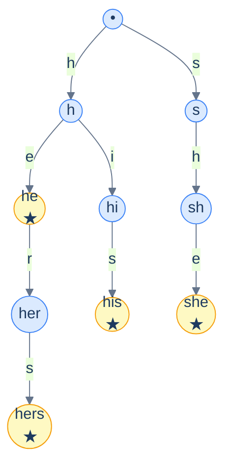

# 8. Aho-Corasick

## The Hook

KMP finds occurrences of *one* pattern in linear time. What if you have *many* patterns — say, 10,000 spam keywords, 1 million product names, or every malware signature in a security database — and you want to find all of them in a stream of text?

The naive approach: run KMP per pattern. `O(K(n + m_avg))` for `K` patterns. For a million patterns over a million-character text: `10¹²` operations. Bad.

**Aho-Corasick** does it in `O(n + Σm_i + matches)`. Build a trie of all patterns. Add **failure links** that point each trie node to the longest proper suffix that is also a prefix of some pattern (the same idea as KMP's failure function, generalised). To match, walk the text through the trie; on every state, follow output links to report all matched patterns ending here.

This algorithm — invented by Alfred Aho and Margaret Corasick at Bell Labs in 1975 — is what makes `grep -F` (fixed-string grep with multiple patterns) fast. It's the workhorse of intrusion detection systems (Snort, Suricata), spam filters, content moderation, and search-engine query routing.

---

## Table of contents

1. [The trie of patterns](#the-trie-of-patterns)
2. [Failure links](#failure-links)
3. [Output links](#output-links)
4. [The matching algorithm](#the-matching-algorithm)
5. [Implementation](#implementation)
6. [Edge cases and pitfalls](#edge-cases-and-pitfalls)
7. [Production reality](#production-reality)
8. [Cross-links](#cross-links)
9. [Final takeaway](#final-takeaway)

***

# The trie of patterns

Start by building a [trie](/cortex/data-structures-and-algorithms/trees-trie-introduction-to-tries) of all the patterns. Each pattern's terminal node is marked.

For patterns `{"he", "she", "his", "hers"}`:



<p align="center"><strong>Trie of patterns. Yellow nodes are pattern endpoints.</strong></p>

***

# Failure links

For every trie node `u`, the **failure link** `fail[u]` points to the longest proper suffix of the string-spelled-by-path-to-u that is also a prefix of some pattern.

For example, the node `"she"` (after walking `s`, `h`, `e`) has failure link to `"he"` — the longest suffix of `"she"` that's also in the trie.

Failure links are computed by BFS from the root. The construction parallels KMP's failure function but on the tree:

***

# Output links

A trie node `u` may not itself be a pattern terminal, but a suffix of the string-at-u might be. We chase failure links to find all such matches.

Optimisation: precompute the **output link** — for each node `u`, the closest pattern-terminal ancestor reachable via failure links. With output links, each match-reporting step is `O(1)` rather than walking the failure chain.

***

# The matching algorithm

**Cost.** `O(n + Σm_i + matches)`. The text is scanned once; the trie has `Σm_i` nodes; each match takes `O(1)` to report (with output links).

***

# Implementation

```python run viz=array viz-root=root
from collections import deque

class ACNode:
    __slots__ = ("children", "fail", "output", "is_end", "depth")
    def __init__(self):
        self.children = {}
        self.fail = None
        self.output = None
        self.is_end = False
        self.depth = 0

def build_aho_corasick(patterns):
    root = ACNode()
    for p in patterns:
        node = root
        for ch in p:
            if ch not in node.children:
                child = ACNode()
                child.depth = node.depth + 1
                node.children[ch] = child
            node = node.children[ch]
        node.is_end = True

    # Build failure links via BFS
    queue = deque()
    for child in root.children.values():
        child.fail = root
        queue.append(child)
    while queue:
        u = queue.popleft()
        for ch, v in u.children.items():
            queue.append(v)
            f = u.fail
            while f is not root and ch not in f.children:
                f = f.fail
            v.fail = f.children.get(ch, root)
            if v.fail is v:
                v.fail = root
            v.output = v.fail if v.fail.is_end else v.fail.output

    return root

def search(T, root):
    state = root
    matches = []
    for i, ch in enumerate(T):
        while state is not root and ch not in state.children:
            state = state.fail
        if ch in state.children:
            state = state.children[ch]
        u = state
        while u is not root:
            if u.is_end:
                matches.append((i - u.depth + 1, u.depth))                                                       # (start, length)
            u = u.output if u.output is not None else root
        if state is root: continue
    return matches


if __name__ == "__main__":
    patterns = ["he", "she", "his", "hers"]
    text = "ushers"
    root = build_aho_corasick(patterns)
    matches = search(text, root)
    print(f"Patterns: {patterns}")
    print(f"Text: '{text}'")
    print(f"Matches (start, length):")
    for s, l in matches:
        print(f"  position {s}: '{text[s:s + l]}'")
```

The Java/C/Scala variants follow the same algorithm. Aho-Corasick is more often implemented in libraries (e.g., the `pyahocorasick` Python package wraps a fast C implementation).

***

# Edge cases and pitfalls

- **Failure link to self.** A pattern that's also a suffix of another pattern can produce `v.fail = v`. Detect and reset to `root`.
- **Output-link chain.** A single position in the text can match multiple patterns (e.g., text `"hers"` matches both `"he"` and `"hers"`). The output-link chain reports all of them.
- **Building order.** Failure links must be computed in BFS (depth-order) — depth-`d` failure links depend on depth-`d-1` failure links being set.
- **Memory for large pattern sets.** A million patterns of average length 10 = 10M trie nodes. With per-node memory of 100 bytes (children map + failure link), that's 1 GB. Use compressed tries or specialised pattern-set libraries for huge sets.
- **Multi-byte characters.** Aho-Corasick handles any alphabet, but mixing alphabet sizes (UTF-8 has 1-4 byte codepoints) breaks the algorithm if you confuse "byte" and "character". Decide which level you operate at and stay consistent.

***

# Production reality

- **`grep -F` (fgrep).** Match multiple fixed strings against a file. Aho-Corasick under the hood.
- **Snort and Suricata** intrusion-detection systems. Pattern sets of malware signatures, attack patterns, etc., matched against network packets at line rate.
- **Spam and content moderation.** Match against millions of bad-word/bad-phrase patterns in real time.
- **The original 1975 paper** by Aho and Corasick describes exactly this use case — a "bibliographic search" tool at Bell Labs.
- **Search-engine query analysis.** Routing user queries by detecting which named entities (people, places, products) appear in them.
- **`pyahocorasick`** (Python), `Boost.Xpressive` (C++), `aho_corasick` (Rust) are the production-ready libraries. Implementation is fiddly enough that few engineers write it from scratch in production.

***

# Memorize

The high-leverage facts to commit to long-term memory — atomic enough for an Anki card, concrete enough to recall under pressure or during production debugging. Aho-Corasick is "KMP for many patterns at once" — the algorithm behind every fixed-string multi-search you've ever used.

## Quick recall

Click any question to reveal the answer.

<details>
<summary><strong>Q:</strong> Total time complexity of Aho-Corasick?</summary>

**A:** `O(n + Σ m_i + matches)`. Build is `O(Σ m_i)`; match scan is `O(n)`; reporting matches adds proportional cost.

</details>
<details>
<summary><strong>Q:</strong> What is a failure link in Aho-Corasick?</summary>

**A:** From a trie node `u` representing string `w`, points to the node representing the longest proper suffix of `w` that's also a prefix of some pattern.

</details>
<details>
<summary><strong>Q:</strong> Why is the construction BFS, not DFS?</summary>

**A:** Failure links at depth `d` depend on failure links at depth `d-1`. BFS visits in depth order; DFS doesn't.

</details>
<details>
<summary><strong>Q:</strong> What are output links and why precompute them?</summary>

**A:** From node `u`, point to the closest pattern-terminal ancestor reachable via failure links. Lets you report all matches at a position in `O(1)` per match instead of walking the failure chain each time.

</details>
<details>
<summary><strong>Q:</strong> Aho-Corasick vs running KMP K times?</summary>

**A:** AC: `O(n + Σ m_i + matches)`, single pass over text. K KMPs: `O(K(n + m_avg))`. AC scales independently of `K`.

</details>
<details>
<summary><strong>Q:</strong> Where does AC ship in production?</summary>

**A:** `grep -F`, Snort/Suricata IDS, spam filters, content moderation, search-engine entity routing. The 1975 paper described the bibliographic-search use case at Bell Labs.

</details>
<details>
<summary><strong>Q:</strong> Memory cost for `K` patterns of avg length `L`?</summary>

**A:** `O(K · L · |Σ|)` worst case (each trie node has alphabet-sized child pointers). Use hash-mapped children for sparse alphabets / huge pattern sets.

</details>

## Code template

```python
from collections import deque

def build_aho_corasick(patterns):
    root = ACNode()
    for p in patterns:
        node = root
        for ch in p:
            node = node.children.setdefault(ch, ACNode())
        node.is_end = True

    # BFS to set failure links
    q = deque()
    for c in root.children.values(): c.fail = root; q.append(c)
    while q:
        u = q.popleft()
        for ch, v in u.children.items():
            q.append(v)
            f = u.fail
            while f is not root and ch not in f.children: f = f.fail
            v.fail = f.children.get(ch, root)
            if v.fail is v: v.fail = root
            v.output = v.fail if v.fail.is_end else v.fail.output
    return root

def search(T, root):
    state, matches = root, []
    for i, ch in enumerate(T):
        while state is not root and ch not in state.children:
            state = state.fail
        if ch in state.children: state = state.children[ch]
        u = state
        while u is not root:
            if u.is_end: matches.append((i - u.depth + 1, u.depth))
            u = u.output if u.output else root
    return matches
```

## Pattern triggers

- **"Match a stream against many fixed patterns"** → Aho-Corasick
- **"`grep -F` style multi-pattern fixed-string search"** → Aho-Corasick
- **"IDS / signature-based malware detection"** → Aho-Corasick
- **"Spam keyword / content moderation"** → Aho-Corasick
- **"Many short DNA motifs against a long sequence"** → Aho-Corasick (or BWT-based for huge inputs)
- **"Single pattern only"** → KMP / Z is simpler
- **"Tens of millions of patterns"** → memory matters; consider compressed-trie variants or sharded AC
- **"Need approximate matching"** → AC doesn't natively support; use Levenshtein automaton or `agrep`

***

# Cross-links

- **Prerequisites:** [KMP](/cortex/data-structures-and-algorithms/strings-kmp) (the failure-function idea), [Trie](/cortex/data-structures-and-algorithms/trees-trie-introduction-to-tries).
- **Generalisation in spirit:** [Suffix Automaton](/cortex/data-structures-and-algorithms/strings-suffix-automaton) — failure-link ideas applied differently.
- **Production deep-dive:** [Network Data Plane](/cortex/data-structures-and-algorithms/dsa-in-real-systems-network-data-plane) — *stub* — IDS engines use Aho-Corasick on per-packet basis.

***

# Final takeaway

Aho-Corasick is KMP for many patterns at once. Three patterns to internalise:

1. **Trie + failure links.** The trie holds all patterns; failure links generalise KMP's failure function. The algorithm is essentially KMP run on every trie state.
2. **Linear time regardless of pattern count.** `O(n + Σm_i + matches)` — no per-pattern overhead beyond the build.
3. **The reason `grep -F` is fast.** Whenever you've used multi-pattern fixed-string search and been impressed by the throughput, you've used Aho-Corasick or a close cousin.

This concludes the Strings module. Combined with the [Trie chapter](/cortex/data-structures-and-algorithms/trees-trie-introduction-to-tries), the module covers naive matching → KMP → Z → Rabin-Karp → trie applications → suffix array → suffix automaton → Aho-Corasick: the canonical senior-engineer string-algorithm survey.

<!-- ============================================== -->
<!-- SWEEP 2 — missing sections (placeholders only) -->
<!-- ============================================== -->

<!-- TODO: Understanding the Problem — missing, needs to be written -->
<!--       Guidance: frame the gap the structure/algorithm fills -->

<!-- TODO: Supported Operations — missing, needs to be written -->
<!--       Guidance: table: operation / time / notes -->

<!-- TODO: Internal Mechanics — missing, needs to be written -->
<!--       Guidance: how it actually works under the hood -->

<!-- TODO: Working Example — missing, needs to be written -->
<!--       Guidance: one fully worked end-to-end example -->

<!-- TODO: Quiz — missing, needs to be written -->
<!--       Guidance: 3–5 questions, each labeled [Recall]/[Reasoning]/[Tradeoff] -->

<!-- TODO: Practice Ladder — missing, needs to be written -->
<!--       Guidance: table: 5 links into pattern problems + hints -->

<!-- TODO: Further Reading — missing, needs to be written -->
<!--       Guidance: annotated: ★ Essential / ◆ Advanced / → Reference -->
