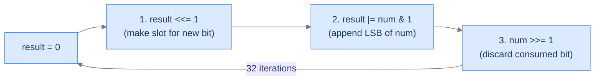
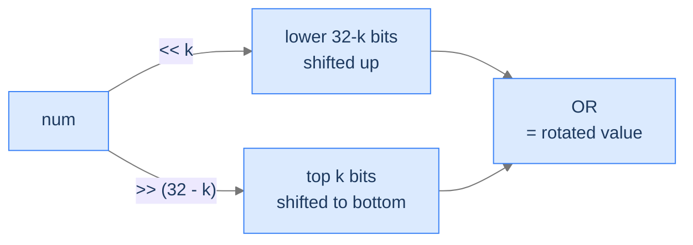

# 3. Bit Restructuring

So far we've inspected, set, and located individual bits. Now we change the *layout* — restructure an integer's bits without changing how many are on. Two canonical operations: **reverse bits** end-to-end (bit 1 swaps with bit 32, bit 2 with bit 31, etc.) and **circular shift** (rotate the bits left or right by `k`, where bits falling off one end wrap around to the other). These show up in cryptography (every block cipher round shuffles bits), checksum computation (CRCs use reversed-bit polynomial representations), networking (byte-order conversions in protocol headers), and graphics (texture address swizzling). Both run in O(1) — no scan over `n` because the work is bounded by the bit-width.

By the end of this lesson you'll know **bit reversal** by LSB-extraction-and-rebuild, and **circular shift** as `(n << k) | (n >> (32 - k))` — the OR-of-two-shifts pattern that wraps bits without losing them.

## Table of contents

1. [Reverse Bits](#reverse-bits)
2. [Circular Shift Bits](#circular-shift-bits)
3. [Final Takeaway](#final-takeaway)

***

# Reverse Bits

## The Problem

Given a 32-bit unsigned integer `num`, return the integer formed by reversing its 32 bits — bit 1 becomes bit 32, bit 2 becomes bit 31, and so on.

```
Input:  num = 28
Output: 939524096
        Binary  00000000 00000000 00000000 00011100
        Reversed 00111000 00000000 00000000 00000000

Input:  num = 1
Output: 2147483648            (highest bit becomes set)

Input:  num = 3415
Output: 3937402880
```

## The Recurrence — LSB Extract, Append

Build the reversed integer one bit at a time. For 32 iterations:
1. Shift `result` left by 1 — make room for one more bit at the bottom.
2. Take the LSB of `num` (`num & 1`) and OR it into `result`'s new bottom slot.
3. Shift `num` right by 1 — discard the bit we just consumed.

After 32 rounds, `num`'s original bit 1 has migrated all the way up to bit 32 in `result`, bit 2 to bit 31, etc. — exactly the reverse layout.



<p align="center"><strong>One iteration extracts <code>num</code>'s LSB and appends it as <code>result</code>'s new LSB. After 32 iterations, the original bit order is reversed end-to-end.</strong></p>

> *Pause. Why 32 iterations exactly? Predict the consequence of stopping early.*

Because the integer has 32 bits — every position must be processed for the reversal to land bits at the correct *symmetric* positions. Stopping at, say, 16 iterations would only reverse the lower half and leave the upper half zero. The loop count is bound to the bit-width, not to `num`'s actual content.

## The Solution


```pseudocode
# Reverse the 32-bit representation of num.
function reverseBits(num):
    result ← 0
    repeat 32 times:
        result ← (result shifted left by 1) bitwise OR (num bitwise AND 1)   # append num's LSB
        num ← num shifted right by 1                                          # discard consumed LSB
    return result bitwise AND 0xFFFFFFFF          # mask to 32 bits
```

```python run
class Solution:
    def reverse_bits(self, num: int) -> int:
        result = 0
        for _ in range(32):
            result = (result << 1) | (num & 1)     # Append num's LSB to result
            num >>= 1                              # Discard the consumed LSB
        return result & 0xFFFFFFFF                 # Mask to 32 bits (Python ints are unbounded)


if __name__ == "__main__":
    sol = Solution()
    print(sol.reverse_bits(28))     # 939524096
    print(sol.reverse_bits(1))      # 2147483648
```

```java run
public class Solution {
    public int reverseBits(int num) {
        int result = 0;
        for (int i = 0; i < 32; i++) {
            result = (result << 1) | (num & 1);
            num >>>= 1;                            // Logical right-shift; ignore sign bit
        }
        return result;
    }

    public static void main(String[] args) {
        System.out.println(new Solution().reverseBits(28));   // 939524096
    }
}
```

```c run
#include <stdio.h>
#include <stdint.h>

uint32_t reverse_bits(uint32_t num) {
    uint32_t result = 0;
    for (int i = 0; i < 32; i++) {
        result = (result << 1) | (num & 1);
        num >>= 1;
    }
    return result;
}

int main(void) {
    printf("%u\n", reverse_bits(28));   /* 939524096 */
    return 0;
}
```

```scala run
class Solution {
  def reverseBits(num: Int): Int = {
    var result = 0
    var n = num
    for (_ <- 0 until 32) {
      result = (result << 1) | (n & 1)
      n = n >>> 1                                   // Unsigned right-shift in Scala
    }
    result
  }
}

object Main extends App {
  println(new Solution().reverseBits(28))   // 939524096
}
```


<details>
<summary><strong>Trace — num = 28 (0b11100)</strong></summary>

```
Initial: result = 0, num = 0b11100

Iter  num         num & 1   result <<= 1  result |= bit  num >>= 1
0     ...11100    0         0             0              ...01110
1     ...01110    0         0             0              ...00111
2     ...00111    1         0             1              ...00011
3     ...00011    1         10            11             ...00001
4     ...00001    1         110           111            ...00000
5–31: num is 0, so we keep shifting result left, appending 0s.

After iteration 31:
  result has 28's lowest 5 bits (11100, processed in reverse order)
  pushed to the top of a 32-bit space.
  result = 0b00111000 00000000 00000000 00000000 = 939524096 ✓
```

</details>

## Complexity

| Aspect | Cost |
|---|---|
| Time | `O(32) = O(1)` — fixed bit-width loop |
| Space | `O(1)` |

## Faster Alternative — Divide and Conquer

For hot loops, the divide-and-conquer approach uses 5 swap stages with magic masks:
1. Swap adjacent bits with masks `0x55555555` and `0xAAAAAAAA`.
2. Swap adjacent pairs with `0x33333333` and `0xCCCCCCCC`.
3. Swap adjacent nibbles with `0x0F0F0F0F` and `0xF0F0F0F0`.
4. Swap adjacent bytes (or use byte-swap intrinsic).
5. Swap halves.

5 ops total, no loop, ~6× faster on most CPUs. Beyond this lesson but worth knowing.

***

# Circular Shift Bits

## The Problem

Given a 32-bit unsigned integer `num`, an integer `k`, and a flag `rotateLeft`, rotate `num`'s bits left by `k` (if `rotateLeft = true`) or right by `k` (otherwise). Bits falling off one end wrap around to the other end — they don't disappear.

```
Input:  num = 28, k = 2, rotateLeft = true
Output: 112
        Binary 00000000 00000000 00000000 00011100
        After  00000000 00000000 00000000 01110000

Input:  num = 1, k = 1, rotateLeft = false
Output: 2147483648            Bit 1 wraps around to bit 32
```

## The Recurrence — Two Shifts ORed Together

Standard left/right shift loses bits that fall off the edge. To wrap them, take *both* shifts and combine:

- **Left rotate by k**: `(num << k) | (num >> (32 - k))`
  - `num << k` shifts left, losing the top `k` bits.
  - `num >> (32 - k)` shifts the top `k` bits down to the bottom.
  - OR combines: top bits land at the bottom, everything shifts left by `k`.

- **Right rotate by k**: `(num >> k) | (num << (32 - k))` — symmetric.



<p align="center"><strong>Left rotation: combine the leftshift (which drops top bits) with a rightshift of <em>complementary</em> distance (which extracts those same top bits and lands them at the bottom). OR the two together for a lossless rotate.</strong></p>

> *Pause. Why does <code>k mod 32</code> matter? Predict the failure for <code>k = 32</code> or <code>k = 64</code>.*

Rotating by 32 is the identity (every bit returns to its original position). Rotating by 64 is the same as rotating by 0. Most CPUs implement shifts with a `k mod 32` mask anyway, but `num >> (32 - k)` becomes `num >> 0 = num` when `k = 32`, which corrupts the OR. The robust implementation always reduces `k` modulo 32 first: `k %= 32`. After that, `k` is in `[0, 32)` and both shifts behave correctly.

## The Solution


```pseudocode
# Treat num as a 32-bit unsigned value and rotate by k bits (left or right).
function circularShiftBits(num, k, rotateLeft):
    SIZE ← 32
    k ← k mod SIZE                                 # rotating by SIZE is a no-op
    num ← num bitwise AND 0xFFFFFFFF
    if rotateLeft:
        return ((num shifted left by k) bitwise OR (num shifted right by (SIZE − k))) bitwise AND 0xFFFFFFFF
    return ((num shifted right by k) bitwise OR (num shifted left by (SIZE − k))) bitwise AND 0xFFFFFFFF
```

```python run
class Solution:
    def circular_shift_bits(self, num: int, k: int, rotate_left: bool) -> int:
        size = 32
        k %= size                                  # Rotating by 32 is no-op; reduce k
        num &= 0xFFFFFFFF                          # Treat num as unsigned 32-bit
        if rotate_left:
            return ((num << k) | (num >> (size - k))) & 0xFFFFFFFF
        return ((num >> k) | (num << (size - k))) & 0xFFFFFFFF


if __name__ == "__main__":
    sol = Solution()
    print(sol.circular_shift_bits(28, 2, True))    # 112
    print(sol.circular_shift_bits(1, 1, False))    # 2147483648
```

```java run
public class Solution {
    public int circularShiftBits(int num, int k, boolean rotateLeft) {
        k %= 32;
        if (rotateLeft) return (num << k) | (num >>> (32 - k));
        return (num >>> k) | (num << (32 - k));
    }

    public static void main(String[] args) {
        System.out.println(new Solution().circularShiftBits(28, 2, true));   // 112
    }
}
```

```c run
#include <stdio.h>
#include <stdint.h>
#include <stdbool.h>

uint32_t circular_shift_bits(uint32_t num, int k, bool rotate_left) {
    k %= 32;
    if (k == 0) return num;
    if (rotate_left) return (num << k) | (num >> (32 - k));
    return (num >> k) | (num << (32 - k));
}

int main(void) {
    printf("%u\n", circular_shift_bits(28, 2, true));    /* 112 */
    return 0;
}
```

```scala run
class Solution {
  def circularShiftBits(num: Int, k: Int, rotateLeft: Boolean): Int = {
    val kk = k % 32
    if (kk == 0) num
    else if (rotateLeft) (num << kk) | (num >>> (32 - kk))
    else (num >>> kk) | (num << (32 - kk))
  }
}

object Main extends App {
  println(new Solution().circularShiftBits(28, 2, true))   // 112
}
```


## Complexity

| Aspect | Cost |
|---|---|
| Time | `O(1)` — two shifts and an OR |
| Space | `O(1)` |

***

# Final Takeaway

Bit restructuring is the "rearrange without losing" branch of bit manipulation. Two shapes, both O(1):

| Operation | Recipe |
|---|---|
| Reverse bits | LSB-extract loop: shift result left, append num's LSB, shift num right |
| Circular shift | OR of two shifts: `(num << k) \| (num >> (size - k))` for left rotate |

**You didn't just learn two restructuring tricks. You internalised the OR-of-complementary-shifts pattern — used in cryptographic round functions, byte-order swaps, and any algorithm that needs lossless bit movement. The reduction `k %= bitwidth` is the small but critical step that prevents undefined behaviour on overshift.**

> *Transfer challenge for the next lesson:* You have an array where every element appears an even number of times *except one* that appears an odd number of times. Find the odd one out in O(n) time and O(1) space — without sorting, without a hash map. Predict the trick.

<details>
<summary><strong>Answer</strong></summary>

XOR all elements together. Each pair of equal values cancels (`a ^ a = 0`), leaving only the odd-occurring element behind. The next lesson exploits this **"XOR cancels duplicates"** property across six progressively richer problems — from finding one odd-occurring element to recovering both a missing *and* duplicated number from a single linear pass.

</details>
