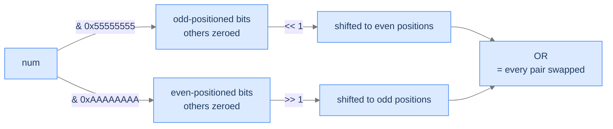

# 5. The Bitmasking Pattern

Bitmasking is bit manipulation's superpower for *combinatorial* problems. Instead of using bits to encode a number, use the bits of an integer to encode a *set membership pattern*: bit i of mask `m` is 1 iff element i is "in" the set. Now subset enumeration becomes counting from 0 to `2^n - 1`; subset operations become bitwise ops; testing membership is a kth-bit check. The trick is that an `n`-bit integer represents *all 2^n subsets* of an `n`-element universe, and you can iterate through them with a plain `for` loop. Combined with the magic-constant tricks for swapping bit groups, bitmasking is the bridge from "set theory" to "fast bit-level code."

By the end of this lesson you'll have written **pairwise bits swap** (using `0x55555555` / `0xAAAAAAAA` masks to swap adjacent pairs in one shot) and **unique subsets** (enumerate every subset of an array via `for mask in 0..2^n`) — together demonstrating the two most-common bitmasking idioms.

## Table of contents

1. [What "Bitmasking" Means](#what-bitmasking-means)
2. [Pairwise Bits Swap](#pairwise-bits-swap)
3. [Unique Subsets](#unique-subsets)
4. [Final Takeaway](#final-takeaway)

***

# What "Bitmasking" Means

Bitmasking has two distinct meanings, both common:

**Meaning A — A constant pattern that selects bits.** A "mask" is a number whose set bits select a region of interest. The kth-bit operations from lesson 1 are the simplest examples; this lesson generalises to multi-bit masks like `0x55555555` (every other bit, starting from bit 1) and `0xAAAAAAAA` (the complement). These masks let you operate on whole groups of bits in parallel — swap odd-positioned bits with even-positioned bits, count bits in groups, etc.

**Meaning B — A subset encoded as bits.** With `n` items, an `n`-bit integer can represent any subset: bit i set ⇒ element i is in. Subsets of `{a, b, c}` map to 8 integers `0..7`:

```
0b000 = 0  →  {}
0b001 = 1  →  {a}
0b010 = 2  →  {b}
0b011 = 3  →  {a, b}
0b100 = 4  →  {c}
0b101 = 5  →  {a, c}
0b110 = 6  →  {b, c}
0b111 = 7  →  {a, b, c}
```

Looping over `mask = 0` through `2^n - 1` enumerates every subset. Inside the loop, `mask & (1 << j)` checks "is element j in?", `mask | (1 << j)` adds, `mask & ~(1 << j)` removes. Set operations become bitwise ops with O(1) cost.

```d2
direction: right
both: "Two flavors of bitmasking" {
  grid-rows: 1
  grid-columns: 2
  grid-gap: 20
  a: |md
    **A — Constant masks**
    `0x55555555` selects odd bits
    `0xAAAAAAAA` selects even bits
    Use for parallel bit-group ops
  |
  b: |md
    **B — Subset encoding**
    Bit i set ⇒ element i is in
    Loop `mask = 0..2^n` enumerates all subsets
    Set ops become bitwise ops
  |
}
```

<p align="center"><strong>Both flavours appear in this lesson. Pairwise bits swap uses the constant-mask flavour; unique subsets uses the subset-encoding flavour.</strong></p>

> *Predict before reading on — for an array of <code>n = 4</code> elements, how many distinct subsets exist?*

`2^4 = 16`, including the empty subset and the full set. The set of *all* subsets is called the **power set**, and its size is always `2^n`.

---

## Key Takeaway

Bitmasking gives you two parallel powers: constant masks for parallel bit-group operations, and subset-encoded masks for combinatorial enumeration in linear-loop time.

***

# Pairwise Bits Swap

## The Problem

Given a 32-bit integer `num`, swap every pair of adjacent bits — bit 1 ↔ bit 2, bit 3 ↔ bit 4, …, bit 31 ↔ bit 32. Return the new value.

```
Input:  num = 1   →  2     (binary 01 → 10)
Input:  num = 31568  →  47008
Input:  num = 5419430  →  10580569
```

<details>
<summary><h2>The Recurrence — Mask Out, Shift, OR</h2></summary>


Two magic constants do the heavy lifting:

```
0x55555555 = 0101 0101 0101 0101 0101 0101 0101 0101   (every odd-positioned bit set)
0xAAAAAAAA = 1010 1010 1010 1010 1010 1010 1010 1010   (every even-positioned bit set)
```

The recipe:
1. **Extract odd-positioned bits**: `num & 0x55555555`. Shift left by 1 to put each at its even-position partner.
2. **Extract even-positioned bits**: `num & 0xAAAAAAAA`. Shift right by 1 to put each at its odd-position partner.
3. **OR**: combine the two shifted halves. The result has every adjacent pair swapped.

```
result = ((num & 0x55555555) << 1) | ((num & 0xAAAAAAAA) >> 1)
```



<p align="center"><strong>Two parallel "shift and reposition" operations, then OR. No loop — every pair swaps in one shot, regardless of bit-width.</strong></p>

> *Pause. Why don't the two shifted halves overlap when ORed?*

Because each half has 1s only in *complementary* positions: after shifts, the first half occupies even positions and the second occupies odd positions. ORing two non-overlapping bit patterns simply combines them.

</details>
<details>
<summary><h2>Solution &amp; Analysis</h2></summary>

### The Solution

```python run
import sys

class Solution:
    def pairwise_bits_swap(self, num: int) -> int:

        # Mask for odd bits (1010...)
        odd_mask = 0xAAAAAAAA

        # Mask for even bits (0101...)
        even_mask = 0x55555555

        # Perform sign extension
        if num < 0:
            sign_extension = 0xFFFFFFFF
            num = num & sign_extension

        # Extract odd and even bits
        odd_bits = num & odd_mask
        even_bits = num & even_mask

        # Right-shift odd bits and left-shift even bits
        swapped = (odd_bits >> 1) | (even_bits << 1)

        # Perform sign extension again
        if num < 0:
            swapped = swapped | sign_extension

        return swapped


# Examples from the problem statement
print(Solution().pairwise_bits_swap(31568))      # 47008
print(Solution().pairwise_bits_swap(5419430))    # 10580569
print(Solution().pairwise_bits_swap(1))          # 2

# Edge cases
print(Solution().pairwise_bits_swap(0))          # 0
print(Solution().pairwise_bits_swap(2))          # 1
print(Solution().pairwise_bits_swap(3))          # 3
print(Solution().pairwise_bits_swap(4))          # 8
print(Solution().pairwise_bits_swap(10))         # 5
```

```java run
public class Main {
    static class Solution {
        public int pairwiseBitsSwap(int num) {

            // Mask for even-positioned bits
            // (10101010101010101010101010101010 in binary) This mask selects
            // the bits at positions 0, 2, 4, 6, ...
            int evenMask = 0xAAAAAAAA;

            // Mask for odd-positioned bits (01010101010101010101010101010101
            // in binary) This mask selects the bits at positions 1, 3, 5, 7,
            // ...
            int oddMask = 0x55555555;

            // Extract the even-positioned bits and shift them to the right
            // by 1 position
            int evenBits = (num & evenMask) >> 1;

            // Extract the odd-positioned bits and shift them to the left by
            // 1 position
            int oddBits = (num & oddMask) << 1;

            // Combine the shifted even and odd bits using bitwise OR
            return (evenBits | oddBits);
        }
    }

    public static void main(String[] args) {
        // Examples from the problem statement
        System.out.println(new Solution().pairwiseBitsSwap(31568));      // 47008
        System.out.println(new Solution().pairwiseBitsSwap(5419430));    // 10580569
        System.out.println(new Solution().pairwiseBitsSwap(1));          // 2

        // Edge cases
        System.out.println(new Solution().pairwiseBitsSwap(0));          // 0
        System.out.println(new Solution().pairwiseBitsSwap(2));          // 1
        System.out.println(new Solution().pairwiseBitsSwap(3));          // 3
        System.out.println(new Solution().pairwiseBitsSwap(4));          // 8
        System.out.println(new Solution().pairwiseBitsSwap(10));         // 5
    }
}
```

### Complexity

| Aspect | Cost |
|---|---|
| Time | `O(1)` — four bitwise ops |
| Space | `O(1)` |

</details>

***

# Unique Subsets

## The Problem

Given an array of `n` distinct elements, return every possible subset (the power set). Order of subsets doesn't matter.

```
Input:  [1, 2, 3]
Output: [[], [1], [2], [1, 2], [3], [1, 3], [2, 3], [1, 2, 3]]   (8 subsets)

Input:  [1]
Output: [[], [1]]

Input:  []
Output: [[]]
```

<details>
<summary><h2>The Recipe — Bitmask Enumeration</h2></summary>


Every subset is one binary choice per element: *include* `arr[i]` or *don't*. Pack those `n` choices into the bits of an integer — bit `j` set ⇒ `arr[j]` is in — and a single `mask` value *is* a subset. There are `2^n` such masks, so a plain outer loop `mask = 0 .. 2^n - 1` walks every subset exactly once.

The recipe: for each `mask`, build its subset by scanning bit positions `j = 0 .. n - 1` and appending `arr[j]` whenever `(mask >> j) & 1` is set. Collect every subset into the output. No recursion, no backtracking — the loop counter does all the enumeration.

```
unique_subsets(arr):
    n = len(arr)
    power_set_size = 1 << n            # 2^n subsets
    for mask in 0 .. power_set_size - 1:
        subset = []
        for j in 0 .. n - 1:
            if (mask >> j) & 1:        # j-th bit set ⇒ include arr[j]
                subset.append(arr[j])
        output.append(subset)
```

The outer loop runs `2^n` times, the inner bit-scan `n` times, so total work `O(n × 2^n)` — and that's *optimal* for outputting every subset, since the total output size is `Σ(n choose k) × k = n × 2^(n-1)`.

```d2
direction: right
loop: "n = 3, mask runs 0 to 7" {
  grid-rows: 4
  grid-columns: 2
  grid-gap: 0
  m0: "mask = 000"
  s0: "{}"
  m1: "mask = 001"
  s1: "{a}"
  m2: "mask = 010"
  s2: "{b}"
  m3: "mask = 011"
  s3: "{a, b}"
}
```

<p align="center"><strong>The 8 subsets for <code>n = 3</code>, each tagged with the bitmask that encodes it. The outer loop visits masks <code>000</code> through <code>111</code> in order, landing on each subset exactly once.</strong></p>

> *Pause. Why does the loop produce every subset exactly once? Predict before reading on.*

Because the map from masks to subsets is a *bijection*: each `n`-bit integer encodes exactly one subset (bit `j` decides whether `arr[j]` is in), and every subset corresponds to exactly one integer (read off which elements it contains). The loop runs the counter `mask` over all `2^n` integers `0 .. 2^n - 1` with no repeats, so it visits each subset once and only once.

</details>
<details>
<summary><h2>Solution &amp; Analysis</h2></summary>

### The Solution

```python run
from typing import List

class Solution:
    def unique_subsets(self, arr: List[int]) -> List[List[int]]:
        n: int = len(arr)

        # Total number of unique_subsets will be 2^n
        power_set_size: int = 1 << n

        # List to store all unique_subsets
        unique_subsets: List[List[int]] = [
            [] for _ in range(power_set_size)
        ]

        # Generate unique_subsets using bitmasking
        for i in range(power_set_size):
            subset: List[int] = []
            for j in range(n):

                # Check if j-th bit is set in i
                if (i >> j) & 1:

                    # Add arr[j] to the current subset
                    subset.append(arr[j])
            unique_subsets[i] = subset

        return unique_subsets


# Examples from the problem statement
print(Solution().unique_subsets([1, 2, 3]))    # [[], [1], [2], [1, 2], [3], [1, 3], [2, 3], [1, 2, 3]]
print(Solution().unique_subsets([1]))          # [[], [1]]
print(Solution().unique_subsets([]))           # [[]]

# Edge cases
print(len(Solution().unique_subsets([1, 2])))        # 4
print(len(Solution().unique_subsets([1, 2, 3, 4])))  # 16
print(Solution().unique_subsets([5]))                # [[], [5]]
```

```java run
import java.util.*;

public class Main {
    static class Solution {
        public List<List<Integer>> uniqueSubsets(int[] arr) {
            int n = arr.length;

            // Total number of uniqueSubsets will be 2^n
            int powerSetSize = 1 << n;

            // List to store all uniqueSubsets
            List<List<Integer>> uniqueSubsets = new ArrayList<>(
                powerSetSize
            );

            // Generate uniqueSubsets using bitmasking
            for (int i = 0; i < powerSetSize; i++) {
                List<Integer> subset = new ArrayList<>();
                for (int j = 0; j < n; j++) {

                    // Check if j-th bit is set in i
                    if (((i >> j) & 1) == 1) {

                        // Add arr[j] to the current subset
                        subset.add(arr[j]);
                    }
                }
                uniqueSubsets.add(subset);
            }

            return uniqueSubsets;
        }
    }

    public static void main(String[] args) {
        // Examples from the problem statement
        System.out.println(new Solution().uniqueSubsets(new int[]{1, 2, 3}));    // [[], [1], [2], [1, 2], [3], [1, 3], [2, 3], [1, 2, 3]]
        System.out.println(new Solution().uniqueSubsets(new int[]{1}));          // [[], [1]]
        System.out.println(new Solution().uniqueSubsets(new int[]{}));           // [[]]

        // Edge cases
        System.out.println(new Solution().uniqueSubsets(new int[]{1, 2}).size());        // 4
        System.out.println(new Solution().uniqueSubsets(new int[]{1, 2, 3, 4}).size());  // 16
        System.out.println(new Solution().uniqueSubsets(new int[]{5}));                  // [[], [5]]
    }
}
```

### Complexity

| Aspect | Cost |
|---|---|
| Time | `O(n × 2^n)` — optimal: output size is `Θ(n × 2^n)` |
| Space | `O(n × 2^n)` for the output |

</details>

***

# Final Takeaway

Bitmasking turns "iterate every subset" — exponential by nature — into a one-line for-loop. And constant masks like `0x55555555` and `0xAAAAAAAA` turn "swap groups of bits" into branchless O(1) code:

| Idiom | Use case |
|---|---|
| `for mask in 0..2^n` | Enumerate every subset of `n` items |
| `mask & (1 << j)` | Test if element `j` is in subset `mask` |
| `mask \| (1 << j)` | Add element `j` to subset |
| `mask & ~(1 << j)` | Remove element `j` |
| `(num & 0x55555555) << 1` | Shift odd-positioned bits to even positions |

**You didn't just learn to enumerate subsets. You learned that any combinatorial problem on `n ≤ 30` items can be solved in `O(2^n × poly(n))` by iterating bit-mask subsets — the foundation of bitmask DP, traveling-salesman-style problems, and packed-state algorithms. Constant masks turn bit-group manipulations into branchless one-liners that compilers love.**

> *Transfer challenge for the next lesson:* You want to compute `num^n` (`num` to the power of `n`) using only multiplication — but `n` could be up to a billion. A naive loop is too slow. Predict how the bits of `n` give you a logarithmic algorithm.

<details>
<summary><strong>Answer</strong></summary>

Write `n` in binary. For each bit set in `n`, multiply the result by `num²ⁱ` (where `i` is the bit's position). The trick: maintain `num` as you iterate, repeatedly squaring it — by the time you reach bit `i`, `num` already equals `original_num^(2^i)`. Total multiplications = number of set bits + bit-width = `O(log n)`. The next lesson formalises this as **fast exponentiation** alongside parity checking and power-of-2 testing — three classic bit-trick applications.

</details>
