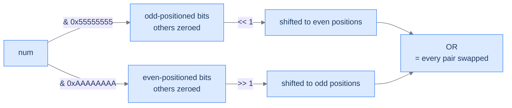

# 5. The Bitmasking Pattern

Bitmasking is bit manipulation's superpower for *combinatorial* problems. Instead of using bits to encode a number, use the bits of an integer to encode a *set membership pattern*: bit i of mask `m` is 1 iff element i is "in" the set. Now subset enumeration becomes counting from 0 to `2^n - 1`; subset operations become bitwise ops; testing membership is a kth-bit check. The trick is that an `n`-bit integer represents *all 2^n subsets* of an `n`-element universe, and you can iterate through them with a plain `for` loop. Combined with the magic-constant tricks for swapping bit groups, bitmasking is the bridge from "set theory" to "fast bit-level code."

By the end of this lesson you'll have written **pairwise bits swap** (using `0x55555555` / `0xAAAAAAAA` masks to swap adjacent pairs in one shot) and **unique subsets** (enumerate every subset of an array via `for mask in 0..2^n`) — together demonstrating the two most-common bitmasking idioms.

## Table of contents

1. [What "Bitmasking" Means](#what-bitmasking-means)
2. [Pairwise Bits Swap](#pairwise-bits-swap)
3. [Unique Subsets](#unique-subsets)
4. [Final Takeaway](#final-takeaway)

***

# What "Bitmasking" Means

Bitmasking has two distinct meanings, both common:

**Meaning A — A constant pattern that selects bits.** A "mask" is a number whose set bits select a region of interest. The kth-bit operations from lesson 1 are the simplest examples; this lesson generalises to multi-bit masks like `0x55555555` (every other bit, starting from bit 1) and `0xAAAAAAAA` (the complement). These masks let you operate on whole groups of bits in parallel — swap odd-positioned bits with even-positioned bits, count bits in groups, etc.

**Meaning B — A subset encoded as bits.** With `n` items, an `n`-bit integer can represent any subset: bit i set ⇒ element i is in. Subsets of `{a, b, c}` map to 8 integers `0..7`:

```
0b000 = 0  →  {}
0b001 = 1  →  {a}
0b010 = 2  →  {b}
0b011 = 3  →  {a, b}
0b100 = 4  →  {c}
0b101 = 5  →  {a, c}
0b110 = 6  →  {b, c}
0b111 = 7  →  {a, b, c}
```

Looping over `mask = 0` through `2^n - 1` enumerates every subset. Inside the loop, `mask & (1 << j)` checks "is element j in?", `mask | (1 << j)` adds, `mask & ~(1 << j)` removes. Set operations become bitwise ops with O(1) cost.

```d2
direction: right
both: "Two flavors of bitmasking" {
  grid-rows: 1
  grid-columns: 2
  grid-gap: 20
  a: |md
    **A — Constant masks**
    `0x55555555` selects odd bits
    `0xAAAAAAAA` selects even bits
    Use for parallel bit-group ops
  |
  b: |md
    **B — Subset encoding**
    Bit i set ⇒ element i is in
    Loop `mask = 0..2^n` enumerates all subsets
    Set ops become bitwise ops
  |
}
```

<p align="center"><strong>Both flavours appear in this lesson. Pairwise bits swap uses the constant-mask flavour; unique subsets uses the subset-encoding flavour.</strong></p>

> *Predict before reading on — for an array of <code>n = 4</code> elements, how many distinct subsets exist?*

`2^4 = 16`, including the empty subset and the full set. The set of *all* subsets is called the **power set**, and its size is always `2^n`.

---

## Key Takeaway

Bitmasking gives you two parallel powers: constant masks for parallel bit-group operations, and subset-encoded masks for combinatorial enumeration in linear-loop time.

***

# Pairwise Bits Swap

## The Problem

Given a 32-bit integer `num`, swap every pair of adjacent bits — bit 1 ↔ bit 2, bit 3 ↔ bit 4, …, bit 31 ↔ bit 32. Return the new value.

```
Input:  num = 1   →  2     (binary 01 → 10)
Input:  num = 31568  →  47008
Input:  num = 5419430  →  10580569
```

## The Recurrence — Mask Out, Shift, OR

Two magic constants do the heavy lifting:

```
0x55555555 = 0101 0101 0101 0101 0101 0101 0101 0101   (every odd-positioned bit set)
0xAAAAAAAA = 1010 1010 1010 1010 1010 1010 1010 1010   (every even-positioned bit set)
```

The recipe:
1. **Extract odd-positioned bits**: `num & 0x55555555`. Shift left by 1 to put each at its even-position partner.
2. **Extract even-positioned bits**: `num & 0xAAAAAAAA`. Shift right by 1 to put each at its odd-position partner.
3. **OR**: combine the two shifted halves. The result has every adjacent pair swapped.

```
result = ((num & 0x55555555) << 1) | ((num & 0xAAAAAAAA) >> 1)
```



<p align="center"><strong>Two parallel "shift and reposition" operations, then OR. No loop — every pair swaps in one shot, regardless of bit-width.</strong></p>

> *Pause. Why don't the two shifted halves overlap when ORed?*

Because each half has 1s only in *complementary* positions: after shifts, the first half occupies even positions and the second occupies odd positions. ORing two non-overlapping bit patterns simply combines them.

## The Solution


```pseudocode
# Swap each adjacent pair of bits (positions 1↔2, 3↔4, …).
# 0xAA…A masks the even positions; 0x55…5 masks the odd positions.
function pairwiseBitsSwap(num):
    evenMask ← 0xAAAAAAAA                          # bits at positions 2, 4, 6, … (1-indexed)
    oddMask  ← 0x55555555                          # bits at positions 1, 3, 5, …
    return ((num bitwise AND evenMask) shifted right by 1)
            bitwise OR ((num bitwise AND oddMask) shifted left by 1)
            bitwise AND 0xFFFFFFFF                 # mask to 32 bits
```

```python run
class Solution:
    def pairwise_bits_swap(self, num: int) -> int:
        even_mask = 0xAAAAAAAA                      # Bits at positions 2, 4, 6, ... (1-indexed)
        odd_mask  = 0x55555555                      # Bits at positions 1, 3, 5, ...
        # Shift even-positioned bits down by 1; shift odd-positioned bits up by 1; OR.
        result = ((num & even_mask) >> 1) | ((num & odd_mask) << 1)
        return result & 0xFFFFFFFF                  # Mask to 32 bits


if __name__ == "__main__":
    sol = Solution()
    print(sol.pairwise_bits_swap(1))         # 2
    print(sol.pairwise_bits_swap(31568))     # 47008
```

```java run
public class Main {
    static class Solution {
        public int pairwiseBitsSwap(int num) {
            int evenMask = 0xAAAAAAAA;
            int oddMask  = 0x55555555;
            return ((num & evenMask) >>> 1) | ((num & oddMask) << 1);
        }
    }

    public static void main(String[] args) {
        System.out.println(new Solution().pairwiseBitsSwap(1));   // 2
    }
}
```

```c run
#include <stdio.h>
#include <stdint.h>

uint32_t pairwise_bits_swap(uint32_t num) {
    return ((num & 0xAAAAAAAA) >> 1) | ((num & 0x55555555) << 1);
}

int main(void) {
    printf("%u\n", pairwise_bits_swap(31568));   /* 47008 */
    return 0;
}
```

```scala run
object Main extends App {
  class Solution {
    def pairwiseBitsSwap(num: Int): Int = {
      ((num & 0xAAAAAAAA) >>> 1) | ((num & 0x55555555) << 1)
    }
  }

  println(new Solution().pairwiseBitsSwap(1))   // 2
}
```


## Complexity

| Aspect | Cost |
|---|---|
| Time | `O(1)` — four bitwise ops |
| Space | `O(1)` |

***

# Unique Subsets

## The Problem

Given an array of `n` distinct elements, return every possible subset (the power set). Order of subsets doesn't matter.

```
Input:  [1, 2, 3]
Output: [[], [1], [2], [1, 2], [3], [1, 3], [2, 3], [1, 2, 3]]   (8 subsets)

Input:  [1]
Output: [[], [1]]

Input:  []
Output: [[]]
```

## The Recurrence — Iterate `mask = 0..2^n - 1`

For each mask in `[0, 2^n)`, decode it into a subset by checking each bit. If bit `j` is set, include `arr[j]` in the subset.

```
for mask in 0 .. 2^n - 1:
    subset = []
    for j in 0 .. n - 1:
        if mask & (1 << j):
            subset.append(arr[j])
    output.append(subset)
```

The outer loop runs `2^n` times; the inner runs `n`. Total work `O(n × 2^n)` — and that's *optimal* for outputting every subset, since the total output size is `Σ(n choose k) × k = n × 2^(n-1)`.

```d2
direction: right
loop: "n = 3, mask runs 0 to 7" {
  grid-rows: 4
  grid-columns: 2
  grid-gap: 0
  m0: "mask = 000"
  s0: "{}"
  m1: "mask = 001"
  s1: "{a}"
  m2: "mask = 010"
  s2: "{b}"
  m3: "mask = 011"
  s3: "{a, b}"
}
```

<p align="center"><strong>The first four iterations for <code>n = 3</code>. Each mask's bit pattern picks exactly one subset; iterating <code>0..7</code> covers all 8.</strong></p>

> *Pause. Why does <code>(mask &gt;&gt; j) & 1</code> work as a test for bit j? Predict the consequence of writing <code>mask & j</code>.*

`mask & j` is meaningless — `j` is an integer, not a single-bit mask. To test bit j, you need a *mask with only bit j set*; the simplest is `(1 << j)`, and then AND. The right-shift form `(mask >> j) & 1` is equivalent: shift bit j to position 0, then test whether position 0 is set. Both forms are common; pick whichever reads better in context.

## The Solution


```pseudocode
# Iterate every n-bit mask in [0, 2ⁿ); each mask encodes one subset.
# Bit j set in mask ⇔ include arr[j] in this subset.
function uniqueSubsets(arr):
    n ← length(arr)
    result ← empty list
    for mask from 0 to (1 shifted left by n) − 1:
        subset ← empty list
        for j from 0 to n − 1:
            if (mask shifted right by j) bitwise AND 1 = 1:
                append arr[j] to subset
        append subset to result
    return result
```

```python run
from typing import List

class Solution:
    def unique_subsets(self, arr: List[int]) -> List[List[int]]:
        n = len(arr)
        # Total subsets = 2^n.  Each mask in [0, 2^n) encodes one subset.
        result: List[List[int]] = []
        for mask in range(1 << n):
            subset = [arr[j] for j in range(n) if (mask >> j) & 1]
            result.append(subset)
        return result


if __name__ == "__main__":
    sol = Solution()
    print(sol.unique_subsets([1, 2, 3]))
    # [[], [1], [2], [1, 2], [3], [1, 3], [2, 3], [1, 2, 3]]
```

```java run
import java.util.*;

public class Main {
    static class Solution {
        public List<List<Integer>> uniqueSubsets(int[] arr) {
            int n = arr.length;
            List<List<Integer>> result = new ArrayList<>();
            for (int mask = 0; mask < (1 << n); mask++) {
                List<Integer> subset = new ArrayList<>();
                for (int j = 0; j < n; j++) {
                    if ((mask & (1 << j)) != 0) subset.add(arr[j]);
                }
                result.add(subset);
            }
            return result;
        }
    }

    public static void main(String[] args) {
        System.out.println(new Solution().uniqueSubsets(new int[]{1, 2, 3}));
    }
}
```

```c run
#include <stdio.h>

void unique_subsets(const int *arr, int n) {
    int total = 1 << n;
    for (int mask = 0; mask < total; mask++) {
        printf("[");
        int first = 1;
        for (int j = 0; j < n; j++) {
            if (mask & (1 << j)) {
                if (!first) printf(", ");
                printf("%d", arr[j]);
                first = 0;
            }
        }
        printf("]\n");
    }
}

int main(void) {
    int a[] = {1, 2, 3};
    unique_subsets(a, 3);
    return 0;
}
```

```scala run
object Main extends App {
  class Solution {
    def uniqueSubsets(arr: Array[Int]): List[List[Int]] = {
      val n = arr.length
      (0 until (1 << n)).map { mask =>
        (0 until n).filter(j => (mask & (1 << j)) != 0).map(arr).toList
      }.toList
    }
  }

  println(new Solution().uniqueSubsets(Array(1, 2, 3)))
}
```


## Complexity

| Aspect | Cost |
|---|---|
| Time | `O(n × 2^n)` — optimal: output size is `Θ(n × 2^n)` |
| Space | `O(n × 2^n)` for the output |

***

# Final Takeaway

Bitmasking turns "iterate every subset" — exponential by nature — into a one-line for-loop. And constant masks like `0x55555555` and `0xAAAAAAAA` turn "swap groups of bits" into branchless O(1) code:

| Idiom | Use case |
|---|---|
| `for mask in 0..2^n` | Enumerate every subset of `n` items |
| `mask & (1 << j)` | Test if element `j` is in subset `mask` |
| `mask \| (1 << j)` | Add element `j` to subset |
| `mask & ~(1 << j)` | Remove element `j` |
| `(num & 0x55555555) << 1` | Shift odd-positioned bits to even positions |

**You didn't just learn to enumerate subsets. You learned that any combinatorial problem on `n ≤ 30` items can be solved in `O(2^n × poly(n))` by iterating bit-mask subsets — the foundation of bitmask DP, traveling-salesman-style problems, and packed-state algorithms. Constant masks turn bit-group manipulations into branchless one-liners that compilers love.**

> *Transfer challenge for the next lesson:* You want to compute `num^n` (`num` to the power of `n`) using only multiplication — but `n` could be up to a billion. A naive loop is too slow. Predict how the bits of `n` give you a logarithmic algorithm.

<details>
<summary><strong>Answer</strong></summary>

Write `n` in binary. For each bit set in `n`, multiply the result by `num²ⁱ` (where `i` is the bit's position). The trick: maintain `num` as you iterate, repeatedly squaring it — by the time you reach bit `i`, `num` already equals `original_num^(2^i)`. Total multiplications = number of set bits + bit-width = `O(log n)`. The next lesson formalises this as **fast exponentiation** alongside parity checking and power-of-2 testing — three classic bit-trick applications.

</details>
