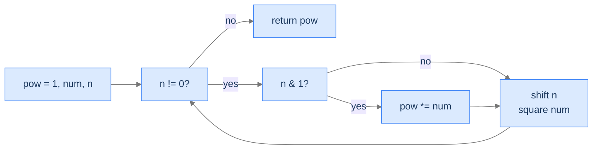

# 6. Bit-Manipulation Applications

The five preceding lessons built the toolkit — kth-bit primitives, set-bit finders, bit reversal and rotation, XOR cancellation, bitmask enumeration. This final lesson is a **showcase**: four classic problems that compose those primitives into elegant constant-time (or logarithmic-time) solutions. **Parity checker** uses `n & 1`. **Power of 2** uses `n & (n - 1) == 0`. **Parity (popcount mod 2)** uses Brian Kernighan's loop. **Power function** uses the bits of the exponent to do exponentiation in O(log n) — the most-cited bit-trick in numerical computing. Each algorithm is a single-line composition of patterns you've already met.

By the end of this lesson, you'll see how the small primitives stack into surprisingly powerful one-liners, and you'll have completed the bit-manipulation section.

## Table of contents

1. [Parity Checker](#parity-checker)
2. [Power of 2](#power-of-2)
3. [Parity Checker II — Set-Bit Parity](#parity-checker-ii--set-bit-parity)
4. [Power Function — Fast Exponentiation](#power-function--fast-exponentiation)
5. [Final Takeaway](#final-takeaway)

***

# Parity Checker

## The Problem

Given an integer, return `"odd"` if it's odd, `"even"` if it's even.

```
Input:  num = 10  →  "even"
Input:  num = 9   →  "odd"
Input:  num = 1   →  "odd"
```

<details>
<summary><h2>The Recurrence</h2></summary>


The least significant bit *is* the parity. `n & 1` returns 1 for odd numbers, 0 for even.

```
parity = "odd" if (n & 1) else "even"
```

> *Pause. Why does this work for negative numbers in two's complement? Predict.*

In two's complement, `-1`'s bit pattern is all-1s, `-2`'s is all-1s except the LSB, and so on. The LSB still alternates between 0 (even) and 1 (odd) as the magnitude grows — same as for positives. So `n & 1` is parity-preserving for any signed integer.

Compare to `n % 2`: for negative numbers in C and similar languages, `(-3) % 2 = -1` (signed remainder), which fails the `== 1` test. `n & 1` always returns `0` or `1`. Use the bitwise check; sidestep the language-specific signed-modulo trap.

</details>
<details>
<summary><h2>The Solution</h2></summary>


```python run
class Solution:
    def parity_checker(self, num: int) -> str:

        # Bitwise AND operation with 1 to check if num is odd
        if num & 1:

            # If num is odd, return "odd"
            return "odd"
        else:

            # If num is even, return "even"
            return "even"


# Examples from the problem statement
print(Solution().parity_checker(10))     # even
print(Solution().parity_checker(9))      # odd
print(Solution().parity_checker(1))      # odd

# Edge cases
print(Solution().parity_checker(0))      # even
print(Solution().parity_checker(2))      # even
print(Solution().parity_checker(-1))     # odd
print(Solution().parity_checker(-2))     # even
print(Solution().parity_checker(100))    # even
```

```java run
public class Main {
    static class Solution {
        public String parityChecker(int num) {

            // Bitwise AND operation with 1 to check if num is odd
            if ((num & 1) == 1) {

                // If num is odd, return "odd"
                return "odd";
            } else {

                // If num is even, return "even"
                return "even";
            }
        }
    }

    public static void main(String[] args) {
        // Examples from the problem statement
        System.out.println(new Solution().parityChecker(10));     // even
        System.out.println(new Solution().parityChecker(9));      // odd
        System.out.println(new Solution().parityChecker(1));      // odd

        // Edge cases
        System.out.println(new Solution().parityChecker(0));      // even
        System.out.println(new Solution().parityChecker(2));      // even
        System.out.println(new Solution().parityChecker(-1));     // odd
        System.out.println(new Solution().parityChecker(-2));     // even
        System.out.println(new Solution().parityChecker(100));    // even
    }
}
```

</details>


***

# Power of 2

## The Problem

Given an integer, return `true` if it's a positive power of 2 (1, 2, 4, 8, …); else `false`.

```
Input:  num = 1   →  true     2^0
Input:  num = 8   →  true     2^3
Input:  num = 3   →  false
```

<details>
<summary><h2>The Recurrence</h2></summary>


A power of 2 has *exactly one* set bit. From lesson 2, `(n & (n - 1)) == 0` exactly when `n` has zero or one set bits. Combine with `n > 0` to exclude zero (which has zero set bits):

```
is_power_of_2 = n > 0 and (n & (n - 1)) == 0
```

> *Pause. Why does <code>n > 0</code> matter? What does <code>(0 & -1) == 0</code> evaluate to?*

In two's complement, `0 - 1 = -1` (all bits 1). `0 & -1 = 0`. Without the `n > 0` guard, the function would return `true` for `n = 0` — but 0 isn't a power of 2 (`2^k > 0` for any integer k). The guard plugs that hole.

</details>
<details>
<summary><h2>The Solution</h2></summary>


```python run
class Solution:
    def power_of2(self, num: int) -> bool:

        # Check if the number is positive
        # and if the bitwise AND of num and (num - 1) is zero
        # If both conditions are true, return True, otherwise False
        return num > 0 and (num & (num - 1)) == 0


# Examples from the problem statement
print(Solution().power_of2(1))      # True
print(Solution().power_of2(8))      # True
print(Solution().power_of2(3))      # False

# Edge cases
print(Solution().power_of2(0))      # False
print(Solution().power_of2(-1))     # False
print(Solution().power_of2(2))      # True
print(Solution().power_of2(16))     # True
print(Solution().power_of2(6))      # False
```

```java run
public class Main {
    static class Solution {
        public boolean powerOf2(int num) {

            // Check if the number is positive
            // and if the bitwise AND of num and (num - 1) is zero
            // If both conditions are true, return true, otherwise false
            return num > 0 && (num & (num - 1)) == 0;
        }
    }

    public static void main(String[] args) {
        // Examples from the problem statement
        System.out.println(new Solution().powerOf2(1));      // true
        System.out.println(new Solution().powerOf2(8));      // true
        System.out.println(new Solution().powerOf2(3));      // false

        // Edge cases
        System.out.println(new Solution().powerOf2(0));      // false
        System.out.println(new Solution().powerOf2(-1));     // false
        System.out.println(new Solution().powerOf2(2));      // true
        System.out.println(new Solution().powerOf2(16));     // true
        System.out.println(new Solution().powerOf2(6));      // false
    }
}
```

</details>


***

# Parity Checker II — Set-Bit Parity

## The Problem

Given an integer `num`, return `"odd"` if its **set bit count** is odd, `"even"` otherwise. (This is *bit parity*, distinct from numerical parity from earlier.)

```
Input:  num = 10   →  "even"   Binary 1010 — 2 set bits → even
Input:  num = 13   →  "odd"    Binary 1101 — 3 set bits → odd
Input:  num = 1    →  "odd"    1 set bit → odd
```

<details>
<summary><h2>The Recurrence</h2></summary>


Use **Brian Kernighan's algorithm** from lesson 4. Each `num & (num - 1)` clears one set bit; toggle a parity flag each iteration. After the loop, the flag's final state is the parity.

```
parity = false
while num != 0:
    parity = not parity
    num = num & (num - 1)
return "odd" if parity else "even"
```

> *Pause. Why iterate <code>n & (n - 1)</code> instead of just shifting and counting <code>n & 1</code>?*

Both work. Kernighan's runs in O(set-bit count); the shift-and-count loop runs in O(bit-width). For sparse integers (few set bits), Kernighan's is much faster. CPUs also expose a `popcount` instruction that's faster than either; in production, prefer the intrinsic. The manual version here illustrates the technique.

</details>
<details>
<summary><h2>The Solution</h2></summary>


```python run
class Solution:
    def parity_checker_ii(self, num: int) -> str:

        # Initialize the parity flag as False (even).
        parity: bool = False

        while num:

            # Toggle the parity flag for every 1 encountered.
            parity = not parity

            # Clear the least significant bit (LSB) of num.
            num = num & (num - 1)

        # If the parity flag is True, return "odd".
        if parity:
            return "odd"

        # If the parity flag is False, return "even".
        else:
            return "even"


# Examples from the problem statement
print(Solution().parity_checker_ii(10))    # even
print(Solution().parity_checker_ii(13))    # odd
print(Solution().parity_checker_ii(1))     # odd

# Edge cases
print(Solution().parity_checker_ii(0))     # even
print(Solution().parity_checker_ii(7))     # odd
print(Solution().parity_checker_ii(15))    # even
print(Solution().parity_checker_ii(3))     # even
print(Solution().parity_checker_ii(5))     # even
```

```java run
public class Main {
    static class Solution {
        public String parityCheckerII(int num) {

            // Initialize the parity flag as false (even).
            boolean parity = false;

            while (num != 0) {

                // Toggle the parity flag for every 1 encountered.
                parity = !parity;

                // Clear the least significant bit (LSB) of num.
                num = num & (num - 1);
            }

            // If the parity flag is true, return "odd".
            if (parity) {
                return "odd";

                // If the parity flag is false, return "even".
            } else {
                return "even";
            }
        }
    }

    public static void main(String[] args) {
        // Examples from the problem statement
        System.out.println(new Solution().parityCheckerII(10));    // even
        System.out.println(new Solution().parityCheckerII(13));    // odd
        System.out.println(new Solution().parityCheckerII(1));     // odd

        // Edge cases
        System.out.println(new Solution().parityCheckerII(0));     // even
        System.out.println(new Solution().parityCheckerII(7));     // odd
        System.out.println(new Solution().parityCheckerII(15));    // even
        System.out.println(new Solution().parityCheckerII(3));     // even
        System.out.println(new Solution().parityCheckerII(5));     // even
    }
}
```

</details>


***

# Power Function — Fast Exponentiation

## The Problem

Given an integer `num` and a non-negative integer `n`, compute `num^n`. Required: O(log n) time.

```
Input:  num = 4, n = 2   →  16
Input:  num = 10, n = 3  →  1000
Input:  num = 2, n = 8   →  256
```

<details>
<summary><h2>The Recurrence — Bits of the Exponent</h2></summary>


Naive multiplication uses `n - 1` operations. We can do it in `log₂(n)` by exploiting binary representation:

`num^n = num^(b₀ + 2·b₁ + 4·b₂ + …)` where `b_i` are the bits of `n`. By the rule `x^(a + b) = x^a · x^b`, this becomes:

```
num^n = num^(b₀)  ×  num^(2·b₁)  ×  num^(4·b₂)  ×  ...
      = num^(2^0 if b₀=1 else 1) × num^(2^1 if b₁=1 else 1) × ...
```

So: keep a running `num`, doubling its exponent each iteration (`num = num * num`). For each *set* bit of `n`, multiply the accumulator `pow` by the current `num`. Iteration cost = `O(log n)`.

```
pow = 1
while n != 0:
    if n & 1:                # bit set in current position?
        pow *= num
    n = n >> 1               # move to the next bit
    num = num * num          # square num for the next bit position
return pow
```



<p align="center"><strong>Each iteration squares <code>num</code> (advancing one binary place) and conditionally multiplies it into <code>pow</code> if that bit of <code>n</code> was set. Total iterations = bit-width of <code>n</code> = O(log n).</strong></p>

> *Pause. For <code>num = 2, n = 8</code> (binary <code>1000</code>), how many multiplications happen? Predict before tracing.*

`8` in binary is `1000`. Three bits are zero (no result-multiplication), one bit (the topmost) is one (one result-multiplication). Plus 4 squarings of `num`. Total ~ 5 multiplications, vs 7 with naive looping. The saving grows: `n = 1000` saves ~990 multiplications.

</details>
<details>
<summary><h2>The Solution</h2></summary>


```python run
class Solution:
    def power_function(self, num: int, n: int) -> int:

        # Initialize result as 1
        pow: int = 1

        # Loop until n becomes 0
        while n != 0:

            # If n is odd, multiply the result by num
            if n & 1:
                pow *= num

            # Divide n by 2
            n = n >> 1

            # Multiply num by itself
            num = num * num

        # Return the result
        return pow


# Examples from the problem statement
print(Solution().power_function(4, 2))     # 16
print(Solution().power_function(10, 3))    # 1000
print(Solution().power_function(2, 8))     # 256

# Edge cases
print(Solution().power_function(5, 0))     # 1
print(Solution().power_function(1, 100))   # 1
print(Solution().power_function(2, 1))     # 2
print(Solution().power_function(3, 4))     # 81
print(Solution().power_function(0, 5))     # 0
```

```java run
public class Main {
    static class Solution {
        public long powerFunction(int num, int n) {

            // Initialize result as 1
            long pow = 1L;

            // Loop until n becomes 0
            while (n != 0) {

                // If n is odd, multiply the result by num
                if ((n & 1) == 1) {
                    pow *= num;
                }

                // Divide n by 2
                n = n >> 1;

                // Multiply num by itself
                num = num * num;
            }

            // Return the result
            return pow;
        }
    }

    public static void main(String[] args) {
        // Examples from the problem statement
        System.out.println(new Solution().powerFunction(4, 2));     // 16
        System.out.println(new Solution().powerFunction(10, 3));    // 1000
        System.out.println(new Solution().powerFunction(2, 8));     // 256

        // Edge cases
        System.out.println(new Solution().powerFunction(5, 0));     // 1
        System.out.println(new Solution().powerFunction(1, 100));   // 1
        System.out.println(new Solution().powerFunction(2, 1));     // 2
        System.out.println(new Solution().powerFunction(3, 4));     // 81
        System.out.println(new Solution().powerFunction(0, 5));     // 0
    }
}
```

</details>
<details>
<summary><strong>Trace — power_function(2, 8)</strong></summary>

```
Initial: pow = 1, num = 2, n = 8 (binary 1000)

Iter 1: n & 1 = 0 → skip multiply. n = 4. num = 4.
Iter 2: n & 1 = 0 → skip. n = 2. num = 16.
Iter 3: n & 1 = 0 → skip. n = 1. num = 256.
Iter 4: n & 1 = 1 → pow = 256. n = 0. num = 65536.

Loop ends. Return pow = 256 ✓.

Total: 4 squarings, 1 multiply into pow. Naive would have been 7 multiplies.
```

</details>
<details>
<summary><h2>Complexity</h2></summary>


| Aspect | Cost |
|---|---|
| Time | `O(log n)` — one iteration per bit of `n` |
| Space | `O(1)` |

Fast exponentiation is the workhorse behind RSA, modular exponentiation in cryptography, and many polynomial-time algorithms that need integer powers.

</details>

***

# Final Takeaway

Four problems, each a one-line composition of primitives:

| Problem | Bit Trick | One-Liner |
|---|---|---|
| Numerical parity | LSB inspection | `n & 1` |
| Power of 2 | Single set-bit test | `n > 0 && (n & (n - 1)) == 0` |
| Bit parity | Kernighan's loop | toggle flag while clearing bits |
| Fast exponentiation | Bits-of-exponent traversal | square num, multiply pow on set bits |

**You finished the bit-manipulation section. Six lessons, ~25 problems, one toolkit. Every algorithm here was a composition of three or four basic primitives — kth-bit operations, `n & (n - 1)`, XOR cancellation, and bitmask enumeration. The deeper lesson: low-level bit code is *not* impenetrable. It's a small algebraic system with predictable operators and a handful of recognised patterns. Once you can name the primitives, you can read any bit-manipulation algorithm in a textbook, library, or interview question and decode its intent on first sight.**

The patterns generalise: bitmask DP for traveling-salesman variants, popcount-based bloom filters, integer encodings of state spaces, branchless conditionals via masks. None of those are bit-manipulation lessons here — but they're built on exactly what you've learned. Bit manipulation is one of those rare topics where **a small investment in fundamentals pays back across hundreds of problems for the rest of your career.**

This concludes the DSA series' algorithms section. Combined with the data-structures sections, the book now covers the canonical algorithms-and-data-structures curriculum in the same depth as the rewrite for arrays and dynamic programming — narrative-first, friction-prompted, full-language-coverage learning resources you can revisit and revise from for years to come.
