# 1. Skip List

## The Hook

A sorted linked list gives you `O(n)` search. A balanced BST gives you `O(log n)` search but requires hundreds of lines of carefully-tested rebalancing code. The **skip list** gives you `O(log n)` search *expected* — with code that's about 30 lines and fits in your head.

The trick: keep multiple sorted linked lists at different "levels". Level 0 contains every element; level 1 contains roughly every other element; level 2 contains every fourth; and so on. Search starts at the highest level, walks right until the next element is too big, drops down a level, repeats. Each drop halves the search space — `O(log n)` total.

Why probabilistic? Each node's height is decided by coin flips at insertion: 50% chance of height ≥ 1, 25% chance of height ≥ 2, 12.5% chance of height ≥ 3, … The structure is *expected* to be balanced; the worst case is `O(n)` but exponentially unlikely.

This chapter is the algorithm. By the end you'll be able to insert, search, and delete in 30 lines, and recognise where skip lists win in production.

---

## Table of contents

1. [The structure](#the-structure)
2. [Search](#search)
3. [Insert and delete](#insert-and-delete)
4. [Implementation](#implementation)
5. [Why expected `O(log n)`](#why-expected-o-log-n)
6. [Edge cases and pitfalls](#edge-cases-and-pitfalls)
7. [Production reality](#production-reality)
8. [Practice ladder](#practice-ladder)
9. [Cross-links](#cross-links)
10. [Final takeaway](#final-takeaway)

***

# The structure

A skip list is a stack of sorted linked lists. Level 0 is the full list. Level 1 contains a random subset (each node has a 50% chance of being in level 1, independently). Level 2 contains a random subset of level 1, and so on.

```mermaid
---
config:
  theme: base
  themeVariables:
    primaryColor: "#dbeafe"
    primaryBorderColor: "#3b82f6"
    primaryTextColor: "#1e3a5f"
    lineColor: "#64748b"
    secondaryColor: "#ede9fe"
    tertiaryColor: "#fef9c3"
---
flowchart LR
  subgraph L3["Level 3"]
    H3((H)) --> N50_3((50)) --> NIL3((nil))
  end
  subgraph L2["Level 2"]
    H2((H)) --> N20_2((20)) --> N50_2((50)) --> NIL2((nil))
  end
  subgraph L1["Level 1"]
    H1((H)) --> N20_1((20)) --> N50_1((50)) --> N70_1((70)) --> NIL1((nil))
  end
  subgraph L0["Level 0"]
    H0((H)) --> N10((10)) --> N20((20)) --> N30((30)) --> N50((50)) --> N70((70)) --> NIL((nil))
  end
```



<p align="center"><strong>A skip list with 3 levels. To search for 30, start at the highest level: from H[3], the next node is 50 (too big); drop to level 2; from H[2], the next is 20 (≤ 30, take it); from 20[2], the next is 50 (too big); drop to level 1; from 20[1], the next is 50 (too big); drop to level 0; walk to 30. Found.</strong></p>

***

# Search

```pseudocode
function search(list, key):
    x ← list.head
    for level from list.maxLevel down to 0:
        while x.forward[level] ≠ nil AND x.forward[level].key < key:
            x ← x.forward[level]
    x ← x.forward[0]                                   # the candidate at level 0
    if x ≠ nil AND x.key = key: return x
    return nil
```

Walk right at the highest level until the next node would overshoot, drop a level, repeat. `O(log n)` expected — each level halves the remaining range.

***

# Insert and delete

To insert key `k`:

1. Find where `k` should go in level 0 (standard search, but record the predecessor at every level).
2. Generate a random height for the new node. Most implementations: while `random() < 0.5`, increment height. Cap at some maximum (e.g., `log₂(max_n)`).
3. Insert into every level up to the new node's height, splicing into each level's linked list using the predecessors recorded in step 1.

Delete is symmetric: find the predecessors at every level, splice out the node from each level it appears in.

```pseudocode
function insert(list, key, value):
    update ← array of predecessors per level
    x ← list.head
    for level from list.maxLevel down to 0:
        while x.forward[level] ≠ nil AND x.forward[level].key < key:
            x ← x.forward[level]
        update[level] ← x

    new_height ← randomHeight()
    new_node ← Node(key, value, height=new_height)
    for level from 0 to new_height - 1:
        new_node.forward[level] ← update[level].forward[level]
        update[level].forward[level] ← new_node

function randomHeight():
    h ← 1
    while random() < 0.5 AND h < MAX_LEVEL:
        h ← h + 1
    return h
```

***

# Implementation

```python run
import random

class SkipNode:
    __slots__ = ("key", "value", "forward")
    def __init__(self, key, value, height):
        self.key = key
        self.value = value
        self.forward = [None] * height                                                       # one per level

class SkipList:
    MAX_LEVEL = 16

    def __init__(self):
        self.head = SkipNode(None, None, self.MAX_LEVEL)
        self.level = 0

    def _random_height(self):
        h = 1
        while random.random() < 0.5 and h < self.MAX_LEVEL:
            h += 1
        return h

    def search(self, key):
        x = self.head
        for level in range(self.level, -1, -1):
            while x.forward[level] is not None and x.forward[level].key < key:
                x = x.forward[level]
        x = x.forward[0]
        if x is not None and x.key == key: return x.value
        return None

    def insert(self, key, value):
        update = [self.head] * self.MAX_LEVEL
        x = self.head
        for level in range(self.level, -1, -1):
            while x.forward[level] is not None and x.forward[level].key < key:
                x = x.forward[level]
            update[level] = x

        candidate = x.forward[0]
        if candidate is not None and candidate.key == key:
            candidate.value = value
            return

        new_height = self._random_height()
        if new_height > self.level:
            for level in range(self.level + 1, new_height):
                update[level] = self.head
            self.level = new_height - 1

        new_node = SkipNode(key, value, new_height)
        for level in range(new_height):
            new_node.forward[level] = update[level].forward[level]
            update[level].forward[level] = new_node

    def delete(self, key):
        update = [self.head] * self.MAX_LEVEL
        x = self.head
        for level in range(self.level, -1, -1):
            while x.forward[level] is not None and x.forward[level].key < key:
                x = x.forward[level]
            update[level] = x

        x = x.forward[0]
        if x is None or x.key != key: return False

        for level in range(self.level + 1):
            if update[level].forward[level] is not x: break
            update[level].forward[level] = x.forward[level]

        while self.level > 0 and self.head.forward[self.level] is None:
            self.level -= 1
        return True


if __name__ == "__main__":
    random.seed(7)
    sl = SkipList()
    for k in [3, 1, 4, 1, 5, 9, 2, 6, 5, 3, 5, 8, 9, 7]:
        sl.insert(k, f"v{k}")

    for k in [4, 7, 0, 9, 10]:
        print(f"search({k}) -> {sl.search(k)}")

    sl.delete(7)
    print(f"after delete(7): search(7) -> {sl.search(7)}")
```

```java run
import java.util.*;

class Solution {
    static final int MAX_LEVEL = 16;
    static class Node {
        int key; Object value;
        Node[] forward;
        Node(int k, Object v, int h) { key = k; value = v; forward = new Node[h]; }
    }
    Node head = new Node(Integer.MIN_VALUE, null, MAX_LEVEL);
    int level = 0;
    Random rng = new Random();

    int randomHeight() {
        int h = 1;
        while (rng.nextDouble() < 0.5 && h < MAX_LEVEL) h++;
        return h;
    }

    Object search(int key) {
        Node x = head;
        for (int lvl = level; lvl >= 0; lvl--) {
            while (x.forward[lvl] != null && x.forward[lvl].key < key) x = x.forward[lvl];
        }
        Node cand = x.forward[0];
        return (cand != null && cand.key == key) ? cand.value : null;
    }

    void insert(int key, Object value) {
        Node[] update = new Node[MAX_LEVEL];
        Node x = head;
        for (int lvl = level; lvl >= 0; lvl--) {
            while (x.forward[lvl] != null && x.forward[lvl].key < key) x = x.forward[lvl];
            update[lvl] = x;
        }
        Node cand = x.forward[0];
        if (cand != null && cand.key == key) { cand.value = value; return; }

        int h = randomHeight();
        if (h > level + 1) { for (int i = level + 1; i < h; i++) update[i] = head; level = h - 1; }
        Node nn = new Node(key, value, h);
        for (int i = 0; i < h; i++) {
            nn.forward[i] = update[i].forward[i];
            update[i].forward[i] = nn;
        }
    }

    public static void main(String[] args) {
        Solution sl = new Solution();
        for (int k : new int[]{3, 1, 4, 1, 5, 9, 2, 6, 5, 3, 5, 8, 9, 7}) sl.insert(k, "v" + k);
        for (int k : new int[]{4, 7, 0, 9, 10}) System.out.println("search(" + k + ") -> " + sl.search(k));
    }
}
```

```c run
#include <stdio.h>
#include <stdlib.h>

#define MAX_LEVEL 16

typedef struct Node {
    int key;
    int value;
    struct Node *forward[MAX_LEVEL];
} Node;

Node *head;
int level = 0;

int random_height() {
    int h = 1;
    while ((rand() & 1) && h < MAX_LEVEL) h++;
    return h;
}

int search(int key) {
    Node *x = head;
    for (int lvl = level; lvl >= 0; lvl--)
        while (x->forward[lvl] && x->forward[lvl]->key < key) x = x->forward[lvl];
    x = x->forward[0];
    if (x && x->key == key) return x->value;
    return -1;
}

void insert(int key, int value) {
    Node *update[MAX_LEVEL];
    Node *x = head;
    for (int lvl = level; lvl >= 0; lvl--) {
        while (x->forward[lvl] && x->forward[lvl]->key < key) x = x->forward[lvl];
        update[lvl] = x;
    }
    int h = random_height();
    if (h > level + 1) { for (int i = level + 1; i < h; i++) update[i] = head; level = h - 1; }
    Node *nn = calloc(1, sizeof(Node));
    nn->key = key; nn->value = value;
    for (int i = 0; i < h; i++) {
        nn->forward[i] = update[i]->forward[i];
        update[i]->forward[i] = nn;
    }
}

int main(void) {
    head = calloc(1, sizeof(Node));
    int keys[] = {3, 1, 4, 1, 5, 9, 2, 6, 5, 3, 5, 8, 9, 7};
    for (int i = 0; i < 14; i++) insert(keys[i], keys[i] * 10);
    for (int k : (int[]){4, 7, 0, 9, 10}) printf("search(%d) -> %d\n", k, search(k));
    return 0;
}
```

```scala run
import scala.util.Random

object Solution {
  val MaxLevel = 16
  class Node(val key: Int, var value: String, height: Int) {
    val forward: Array[Node] = new Array[Node](height)
  }

  val head = new Node(Int.MinValue, null, MaxLevel)
  var level = 0
  private val rng = new Random()

  private def randomHeight(): Int = {
    var h = 1
    while (rng.nextDouble() < 0.5 && h < MaxLevel) h += 1
    h
  }

  def search(key: Int): Option[String] = {
    var x = head
    for (lvl <- level to 0 by -1)
      while (x.forward(lvl) != null && x.forward(lvl).key < key) x = x.forward(lvl)
    val cand = x.forward(0)
    if (cand != null && cand.key == key) Some(cand.value) else None
  }

  def insert(key: Int, value: String): Unit = {
    val update = Array.fill(MaxLevel)(head)
    var x = head
    for (lvl <- level to 0 by -1) {
      while (x.forward(lvl) != null && x.forward(lvl).key < key) x = x.forward(lvl)
      update(lvl) = x
    }
    val cand = x.forward(0)
    if (cand != null && cand.key == key) { cand.value = value; return }

    val h = randomHeight()
    if (h > level + 1) { for (i <- level + 1 until h) update(i) = head; level = h - 1 }
    val nn = new Node(key, value, h)
    for (i <- 0 until h) {
      nn.forward(i) = update(i).forward(i)
      update(i).forward(i) = nn
    }
  }

  def main(args: Array[String]): Unit = {
    val keys = Array(3, 1, 4, 1, 5, 9, 2, 6, 5, 3, 5, 8, 9, 7)
    for (k <- keys) insert(k, s"v$k")
    for (k <- Array(4, 7, 0, 9, 10)) println(s"search($k) -> ${search(k)}")
  }
}
```

***

# Why expected `O(log n)`

Skip lists' analysis is one of the cleanest probabilistic-data-structure proofs.

Each level has expected `n/2^level` elements (50% promotion at each level). The total number of levels is `log₂ n` in expectation, plus a small constant.

A search descends one level at a time. At each level, the expected number of right-moves is at most 2 (proof: the search proceeds by moving right within a level until it would overshoot; the geometric distribution gives expected length 2). Total expected work: `O(log n × 2) = O(log n)`.

The tail is exponentially decaying — the probability that the height exceeds `c log n` is `< 1/n^(c-1)`, vanishingly small for `c ≥ 2`.

***

# Edge cases and pitfalls

- **Skewed RNG.** If your RNG is biased toward staying low, levels will be shorter than expected, making the structure approach a flat linked list. Use a quality RNG.
- **`MAX_LEVEL` cap too low.** A skip list with `n` items needs roughly `log₂ n` levels. For `n = 10⁶`, `MAX_LEVEL = 20` is enough; for `n = 10⁹`, use `30`. Going higher costs nothing.
- **Update array shadows the search.** Both `insert` and `delete` need to record predecessors at each level. This is the place beginners forget; the result is a node that's spliced into level 0 but not levels above.
- **Concurrent modification.** Skip lists are *much* easier to make concurrent than balanced BSTs. Java's `ConcurrentSkipListMap` uses a careful CAS-based scheme. But it's still tricky — don't roll your own concurrent skip list lightly.
- **Memory overhead.** Each node has multiple forward pointers (one per level). Average pointers per node = 2 (geometric series). On 64-bit, that's ~16 bytes overhead per node, comparable to RB-trees but simpler code.

***

# Production reality

- **Redis sorted sets (`zset`).** `src/t_zset.c` is one of the cleanest production skip-list implementations. Each `ZADD` is a skip-list insert; `ZRANGE` walks the level-0 chain. Combined with a hash table for O(1) member-to-score lookup.
- **LevelDB and RocksDB memtables.** The in-memory write buffer (the "memtable") is a skip list. Lock-free reads, single-thread inserts; flushed to a sorted SSTable on disk when full.
- **Java `ConcurrentSkipListMap`.** The lock-free sorted map in `java.util.concurrent`. The default choice when you need a sorted map with concurrent inserts and reads.
- **MemSQL (now SingleStore)** uses skip lists for some in-memory indexes, citing simplicity over RB-trees as a design rationale.
- **Pugh's 1990 paper** ("Skip Lists: A Probabilistic Alternative to Balanced Trees", CACM) is the original. Worth reading once — the analysis is short, intuitive, and beautiful.

***

# Practice ladder

1. **Implement a Skip List.** Insert + search + delete; verify against a sorted reference.
   > *Hint:* the chapter's implementation. Test with random keys, then with sorted keys (which would kill a naive BST but not a skip list).

2. **Range queries.** Add a `range(lo, hi)` method that returns all keys in `[lo, hi]`.
   > *Hint:* find the predecessor of `lo`, then walk level-0 chain until the key exceeds `hi`.

3. **Skip-list-based sorted set.** Build a sorted set on top of a skip list. Implement `add(x)`, `remove(x)`, `contains(x)`, `kth(k)` — the last one needs an augmentation: each forward pointer carries a *span* (number of nodes skipped at level 0).
   > *Hint:* with span info, `kth` is `O(log n)` — descend levels accumulating spans.

4. **Compare against a B-tree.** Implement both for a moderate `n` (say `10⁶`). Measure throughput; observe that the skip list is comparable but uses more pointers and less cache-friendly memory.
   > *Hint:* the comparison usually goes "B-tree wins on cache locality, skip list wins on simplicity and concurrency".

5. **Concurrent skip list.** Implement a simple concurrent skip list using locks per node (not lock-free — that's hard). Test under multi-threaded inserts.
   > *Hint:* lock all `update` predecessors before splicing in. Be careful about lock-ordering deadlocks.

***

# Cross-links

- **Prerequisites:** [Singly Linked List](/cortex/data-structures-and-algorithms/linear-structures-singly-linked-list-introduction-to-singly-linked-lists), [Asymptotic Analysis](/cortex/data-structures-and-algorithms/foundations-asymptotic-analysis).
- **Sibling:** [Self-Balancing BSTs](/cortex/data-structures-and-algorithms/trees-self-balancing-bst-overview-self-balancing-bst-overview) — the alternative.
- **Production deep-dive:** [Redis Internal Encodings](/cortex/data-structures-and-algorithms/dsa-in-real-systems-redis-internal-encodings) — *stub* — Redis sorted sets via skip lists.

***

# Final takeaway

Skip lists are the simplest probabilistic ordered structure. Three patterns to internalise:

1. **Probabilistic balance via coin flips.** Each insertion's level is randomised; the structure is balanced *in expectation*. Worst case `O(n)` is exponentially unlikely for `n ≥ 100`.
2. **Code is shorter than any balanced BST.** ~30 lines for full insert/search/delete vs ~200 for an RB-tree. When code simplicity matters and you can tolerate probabilistic guarantees, skip lists win.
3. **Production-grade, especially for concurrent contexts.** Redis, LevelDB, Java's `ConcurrentSkipListMap` — all chose skip list over balanced BST for the simpler concurrent semantics.
