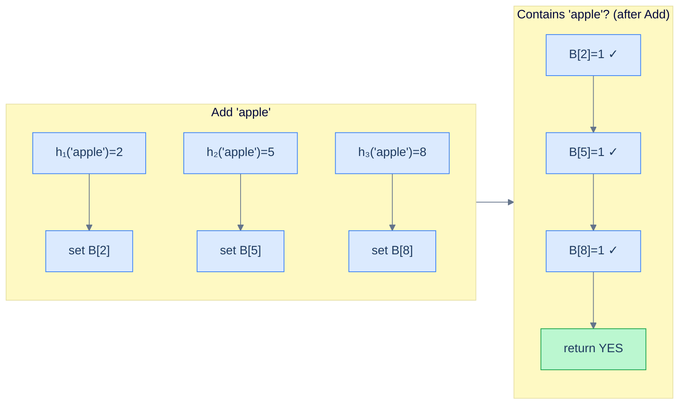

# 2. Bloom Filter

## The Hook

You're a search engine. A user just typed a query. Before sending it to the (expensive) ranker, you want to skip queries that have already been logged in the last 24 hours. A regular hash set of recent queries works — except a 24-hour log might contain a *billion* queries, costing tens of GB. Inflexible.

The **Bloom filter** does the same job in 1 GB or less. The catch: it returns "definitely not in the set" or *"probably in the set"*. There are false positives (it occasionally claims a query is logged when it isn't), but never false negatives (it never claims an actually-logged query is unseen). For this use case, the rare false positive just means "occasionally re-rank a duplicate query" — minor cost. The 10× memory savings is worth it.

The structure: a bit array of `m` bits, plus `k` independent hash functions. To **add** an item, hash it `k` times; set those `k` bits. To **test**, hash it `k` times; if all `k` bits are set, return "probably in"; if any is 0, return "definitely not". A clean idea, deployed everywhere from databases (Cassandra, HBase, RocksDB) to networking (Bitcoin SPV proofs, Chrome's malicious-URL filter).

---

## Table of contents

1. [The bit array and the hashes](#the-bit-array-and-the-hashes)
2. [Tuning `m` and `k`](#tuning-m-and-k)
3. [Implementation](#implementation)
4. [Variants](#variants)
5. [Edge cases and pitfalls](#edge-cases-and-pitfalls)
6. [Production reality](#production-reality)
7. [Practice ladder](#practice-ladder)
8. [Cross-links](#cross-links)
9. [Final takeaway](#final-takeaway)

***

# The bit array and the hashes

A Bloom filter is:

- A bit array `B` of length `m`, all bits initialised to 0.
- `k` independent hash functions `h_1, h_2, …, h_k`, each mapping items uniformly to `[0, m)`.

**Add(`x`):** for `i = 1..k`, set `B[h_i(x)] = 1`.

**Contains(`x`):** for `i = 1..k`, check `B[h_i(x)]`. If any is 0, return False (definitely not in set). If all are 1, return True (probably in).



<p align="center"><strong>Bloom filter: add an item by setting <code>k</code> bits; check by reading those <code>k</code> bits. False positives happen when an unrelated item's <code>k</code> bits happen to all be set by other items.</strong></p>

***

# Tuning `m` and `k`

For a target false-positive rate `p` and `n` expected items:

```
m = -n · ln(p) / (ln 2)²    (bits)
k =  m / n · ln 2           (hash functions)
```

For `n = 10⁹` items at 1% false-positive rate: `m ≈ 9.5 GB`, `k ≈ 7`. At 0.1% FPR: `m ≈ 14 GB`, `k ≈ 10`. Memory grows logarithmically with target FPR — squeeze the FPR another 10× and you pay ~30% more memory.

Compared to a regular hash set: storing `10⁹` 32-byte keys costs `32 GB` minimum. The Bloom filter is 3-10× more compact for typical FPR targets.

***

# Implementation

```python run
import math, hashlib

class BloomFilter:
    def __init__(self, n, p):
        """n = expected items; p = target false-positive rate."""
        self.m = max(1, int(-n * math.log(p) / (math.log(2) ** 2)))
        self.k = max(1, int(self.m / n * math.log(2)))
        self.bits = bytearray((self.m + 7) // 8)
        self.count = 0

    def _hashes(self, x):
        # Use double-hashing trick: hash with two different seeds, combine for k hashes
        data = str(x).encode()
        h1 = int(hashlib.sha1(data).hexdigest()[:16], 16)
        h2 = int(hashlib.sha256(data).hexdigest()[:16], 16)
        for i in range(self.k):
            yield (h1 + i * h2) % self.m

    def add(self, x):
        for h in self._hashes(x):
            self.bits[h // 8] |= 1 << (h % 8)
        self.count += 1

    def __contains__(self, x):
        for h in self._hashes(x):
            if not (self.bits[h // 8] & (1 << (h % 8))):
                return False
        return True


if __name__ == "__main__":
    bf = BloomFilter(n=1000, p=0.01)
    print(f"Bloom filter: m={bf.m} bits ({bf.m / 8:.0f} bytes), k={bf.k} hashes")

    # Add some items
    for w in ["apple", "banana", "cherry", "date", "elderberry"]:
        bf.add(w)

    for w in ["apple", "banana", "fig"]:
        print(f"  '{w}' in filter? {w in bf}")

    # Empirical false-positive check
    bf2 = BloomFilter(n=10_000, p=0.01)
    for i in range(10_000):
        bf2.add(f"item_{i}")
    fp = sum(1 for i in range(20_000, 30_000) if f"item_{i}" in bf2)
    print(f"\nFalse positives: {fp}/10000 = {fp / 100:.2f}%  (target: 1%)")
```

```java run
import java.security.MessageDigest;
import java.util.*;

class Solution {
    int m, k;
    byte[] bits;

    Solution(int n, double p) {
        m = (int) Math.max(1, -n * Math.log(p) / (Math.log(2) * Math.log(2)));
        k = (int) Math.max(1, (double) m / n * Math.log(2));
        bits = new byte[(m + 7) / 8];
    }

    int[] hashes(String x) throws Exception {
        MessageDigest sha1 = MessageDigest.getInstance("SHA-1");
        byte[] d1 = sha1.digest(x.getBytes());
        long h1 = 0, h2 = 0;
        for (int i = 0; i < 8; i++) h1 = (h1 << 8) | (d1[i] & 0xff);
        for (int i = 8; i < 16; i++) h2 = (h2 << 8) | (d1[i] & 0xff);
        int[] out = new int[k];
        for (int i = 0; i < k; i++) out[i] = (int) (((h1 + i * h2) % m + m) % m);
        return out;
    }

    void add(String x) throws Exception {
        for (int h : hashes(x)) bits[h >> 3] |= (byte) (1 << (h & 7));
    }

    boolean contains(String x) throws Exception {
        for (int h : hashes(x)) if ((bits[h >> 3] & (1 << (h & 7))) == 0) return false;
        return true;
    }

    public static void main(String[] args) throws Exception {
        Solution bf = new Solution(1000, 0.01);
        for (String w : new String[]{"apple", "banana", "cherry"}) bf.add(w);
        for (String w : new String[]{"apple", "fig"}) System.out.println(w + " -> " + bf.contains(w));
    }
}
```

***

# Variants

- **Counting Bloom Filter.** Replace each bit with a small counter (e.g., 4 bits). On Add, increment counters. On Delete, decrement. Supports deletes (which standard Bloom filters can't).
- **Cuckoo Filter.** A more recent (~2014) data structure with better space efficiency for the same FPR, plus support for deletions. Used in modern caching systems.
- **Scalable Bloom Filter.** A series of Bloom filters; each new one is larger and has lower FPR. New items go into the latest filter. Membership tests check all filters. Use when you don't know `n` in advance.
- **Spectral Bloom Filter / Quotient Filter.** Variants optimised for specific access patterns or hardware. Niche but real.

***

# Edge cases and pitfalls

- **Cannot delete from standard Bloom filter.** Setting a bit to 0 might affect *other* items that hashed to that bit. Use Counting Bloom Filter or Cuckoo Filter if you need deletes.
- **Saturation.** As you add more items than designed-for, FPR climbs rapidly. Once roughly 50% of bits are set, the filter is barely useful. Plan capacity carefully.
- **Hash quality.** Bloom filters assume the `k` hashes are independent and uniform. Bad hashes (correlated, biased) wreck the FPR. The "double hashing trick" (`h_i(x) = h_1(x) + i · h_2(x)`) approximates `k` independent hashes from just 2.
- **Memory layout.** Random bit access is cache-hostile. For large filters, this matters. Variants like "blocked Bloom filters" group bits by cache line for better locality.
- **Don't store sensitive data.** Bloom filters can be probed: query lots of candidate items; the ones that test positive are likely real. Don't store plaintext password hashes in a Bloom filter and assume they're hidden.

***

# Production reality

- **Cassandra and HBase** use Bloom filters per SSTable to skip disk reads. Before reading a row, check the SSTable's Bloom filter; if it says "no", skip the read entirely. Cuts disk I/O dramatically.
- **RocksDB** uses Bloom filters per SST file (the LSM tree's on-disk component). Same purpose.
- **Bitcoin SPV (Simple Payment Verification).** Lightweight clients send Bloom filters of their wallet addresses to full nodes; the full nodes return only transactions matching the filter. Saves bandwidth without revealing exact wallet contents.
- **Chrome's malicious-URL detection.** Browser ships with a Bloom filter of known malicious URLs. Local check is fast; only on a positive does Chrome consult the central server. Privacy-preserving and fast.
- **Web crawlers (Google, Bing).** Bloom filter of "URLs we've already crawled" — keep memory bounded even with billions of URLs.
- **Database query optimisers.** Bloom filters on join keys can skip rows that won't contribute to the result. PostgreSQL's `pg_bloom` extension provides Bloom-indexes.

***

# Practice ladder

1. **Implement a Bloom Filter.** Use any hashing library; tune `m` and `k` for `n = 10⁴` and `p = 0.01`. Empirically measure FPR.
   > *Hint:* the chapter's implementation. Insert 10k random strings; query 10k different random strings; count how many return True.

2. **Counting Bloom Filter.** Implement with 4-bit counters; support `delete`.
   > *Hint:* counters can saturate at 15 (4-bit max). Above that, delete becomes ambiguous.

3. **Bloom-Filter-Backed Spell-Checker.** Load a dictionary into a Bloom filter; check incoming words against it. Tune for a target FPR.
   > *Hint:* the FPR translates to "fraction of misspelled words flagged as correct". For a usable spell-checker, target FPR ≤ 0.1%.

4. **Distributed Set Intersection via Bloom Filters.** Two parties have item sets `A` and `B`. They want `|A ∩ B|`. Each sends a Bloom filter; intersect bit-wise; estimate from the count of set bits. (This is a privacy-preserving estimation.)
   > *Hint:* the "intersection" of two Bloom filters by AND is not exact, but the count of set bits in the result gives an estimate of the intersection size. Beware: many false positives.

5. **Compare with a hash set.** For 10M strings of average length 32 bytes, measure memory and lookup speed of a Python `set` vs Bloom filter at 1% FPR.
   > *Hint:* hash set: ~640 MB. Bloom filter: ~12 MB at 1% FPR. Hash set has zero false positives; Bloom filter has 1%.

***

# Cross-links

- **Prerequisite:** [Hash Table](/cortex/data-structures-and-algorithms/linear-structures-hash-table-introduction-to-hash-tables) — the underlying primitive (we need good hash functions).
- **Sibling structures:** [Count-Min Sketch](/cortex/data-structures-and-algorithms/probabilistic-and-advanced-count-min-sketch) (frequencies, not membership), [HyperLogLog](/cortex/data-structures-and-algorithms/probabilistic-and-advanced-hyperloglog) (cardinality estimation).

***

# Final takeaway

The Bloom filter is the probabilistic set. Three patterns to internalise:

1. **False positives only.** A Bloom filter never lies "no" but sometimes lies "yes". Whenever that asymmetry is acceptable (cache, skip-list-of-disk-files, malicious-URL probe), Bloom is a memory win.
2. **Tune `m` and `k` from `n` and target FPR.** The two formulas are the entire calibration. Memory grows logarithmically with the target FPR.
3. **Production-grade for "set membership at scale".** Cassandra, RocksDB, Chrome, Bitcoin — every Bloom filter in those systems saves orders of magnitude of memory or bandwidth versus exact methods.
