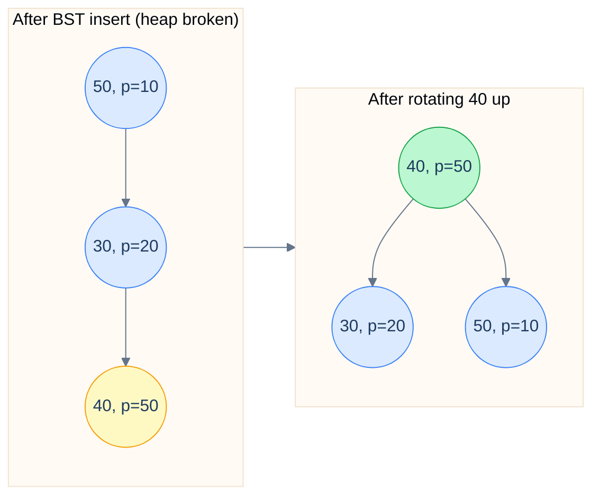

# 5. Treap

## The Hook

You want a balanced BST without the choreography of red-black trees or AVL rotations. The **treap** ("tree + heap") gives it to you in ~50 lines: every node carries a key and a randomly-assigned priority. The tree is BST-ordered on keys *and* heap-ordered on priorities. Insertions splay random priorities through the tree; the result is *expected* `O(log n)` height for any input order.

The randomness is the trick. A worst-case input to a deterministic BST (sorted insert) is no longer adversarial — the random priorities reshuffle the tree into something balanced, regardless of the order keys arrive.

Operations are simpler than RB-tree's: `insert` does standard BST insert, then **rotates up** the new node until the heap property is restored. `delete` rotates the target down to a leaf (using priority comparisons to decide direction), then snips it off. No multi-case rebalance choreography.

This chapter is the algorithm. Treaps don't ship in standard libraries (RB-trees do), but they're a competitive-programming staple and a common alternative when you want a balanced BST you can write yourself.

---

## Table of contents

1. [Key + priority](#key-priority)
2. [Insert: rotate up](#insert-rotate-up)
3. [Delete: rotate down](#delete-rotate-down)
4. [Implementation](#implementation)
5. [Implicit treaps and order statistics](#implicit-treaps-and-order-statistics)
6. [Edge cases and pitfalls](#edge-cases-and-pitfalls)
7. [Production reality](#production-reality)
8. [Cross-links](#cross-links)
9. [Final takeaway](#final-takeaway)

***

# Key + priority

A treap node stores:

- A `key` (the value being indexed; BST-ordered).
- A `priority` (a random integer; max-heap-ordered: parent priority ≥ child priority).

The tree must satisfy *both* orderings simultaneously. With keys fixed, the priority assignment determines the tree's *shape*. With random priorities, the expected shape is balanced (this is essentially Cartesian trees + random priorities = treap).

***

# Insert: rotate up

1. Standard BST insert based on the key.
2. The new node has a fresh random priority. If it's higher than its parent's, rotate it up. Continue rotating up until the heap property is satisfied.



<p align="center"><strong>After BST insert, the new node 40 has higher priority than its parent 30. Rotate up to restore heap order; the BST property is preserved by the rotation's invariant.</strong></p>

***

# Delete: rotate down

1. Find the node by key (standard BST descent).
2. Rotate it down: at each step, rotate towards whichever child has the higher priority. This pushes the target node toward a leaf while maintaining the heap property of the rest of the tree.
3. Once at a leaf, snip.

***

# Implementation

```python run
import random

class TreapNode:
    __slots__ = ("key", "priority", "left", "right")
    def __init__(self, key):
        self.key = key
        self.priority = random.random()
        self.left = self.right = None

def rotate_right(p):
    l = p.left
    p.left = l.right
    l.right = p
    return l

def rotate_left(p):
    r = p.right
    p.right = r.left
    r.left = p
    return r

def insert(node, key):
    if node is None: return TreapNode(key)
    if key < node.key:
        node.left = insert(node.left, key)
        if node.left.priority > node.priority:
            node = rotate_right(node)
    elif key > node.key:
        node.right = insert(node.right, key)
        if node.right.priority > node.priority:
            node = rotate_left(node)
    return node

def delete(node, key):
    if node is None: return None
    if key < node.key:
        node.left = delete(node.left, key); return node
    if key > node.key:
        node.right = delete(node.right, key); return node
    # Found the node; rotate it down
    if node.left is None: return node.right
    if node.right is None: return node.left
    if node.left.priority > node.right.priority:
        node = rotate_right(node)
        node.right = delete(node.right, key)
    else:
        node = rotate_left(node)
        node.left = delete(node.left, key)
    return node

def search(node, key):
    while node:
        if key == node.key: return True
        node = node.left if key < node.key else node.right
    return False

def inorder(node, out):
    if node is None: return
    inorder(node.left, out); out.append(node.key); inorder(node.right, out)


if __name__ == "__main__":
    random.seed(7)
    root = None
    for k in [50, 30, 70, 20, 40, 60, 80, 35, 45]:
        root = insert(root, k)

    out = []; inorder(root, out)
    print(f"in-order: {out}")
    print(f"search 40: {search(root, 40)}")
    print(f"search 99: {search(root, 99)}")

    # Adversarial insert (sorted)
    root2 = None
    for k in range(1, 1001):
        root2 = insert(root2, k)
    # Compute height
    def height(n): return 0 if n is None else 1 + max(height(n.left), height(n.right))
    print(f"\nAfter 1000 sorted inserts, height = {height(root2)}  (log₂ 1000 ≈ 10; treap should be O(log n))")
```

```java run
import java.util.*;

class Solution {
    static Random rng = new Random();
    static class Node {
        int key; double pr; Node left, right;
        Node(int k) { key = k; pr = rng.nextDouble(); }
    }

    static Node rr(Node p) { Node l = p.left; p.left = l.right; l.right = p; return l; }
    static Node rl(Node p) { Node r = p.right; p.right = r.left; r.left = p; return r; }

    static Node insert(Node n, int k) {
        if (n == null) return new Node(k);
        if (k < n.key) {
            n.left = insert(n.left, k);
            if (n.left.pr > n.pr) n = rr(n);
        } else if (k > n.key) {
            n.right = insert(n.right, k);
            if (n.right.pr > n.pr) n = rl(n);
        }
        return n;
    }

    public static void main(String[] args) {
        Node root = null;
        for (int k : new int[]{50, 30, 70, 20, 40, 60, 80}) root = insert(root, k);
        System.out.println("done");
    }
}
```

***

# Implicit treaps and order statistics

A variant called the **implicit treap** uses positions in the tree (in-order rank) as keys instead of value comparisons. With per-node `size` augmentation, you get:

- `kth(k)` — return the k-th smallest in `O(log n)`.
- `split(t, k)` — split the tree into the first `k` elements and the rest in `O(log n)`.
- `merge(a, b)` — merge two trees with all keys in `a` < all keys in `b`, in `O(log n)`.

These primitives let you implement an array-like structure with `O(log n)` insert-anywhere, delete-anywhere, range-update — operations a regular array can't do without `O(n)` shift cost.

***

# Edge cases and pitfalls

- **Random priorities must be unique-enough.** If two nodes get the same priority, the tree shape is ambiguous (and possibly unbalanced). Use enough bits: 64-bit random integers, or floating-point with high entropy.
- **Pseudo-random sequences in tests.** Seed the RNG explicitly when testing for reproducibility.
- **Worst-case `O(n)`.** Like all probabilistic structures, treap has a non-zero probability of bad shape. The probability decays exponentially in `n`, so for any `n ≥ ~50` it's effectively zero.
- **Concurrent modification.** Treaps don't have a natural lock-free implementation. For concurrent contexts, skip lists are usually a better choice.
- **Persistent treaps.** With path-copying (covered in [Persistent Data Structures](/cortex/data-structures-and-algorithms/probabilistic-and-advanced-persistent-data-structures)), treaps make excellent persistent ordered maps. Used in some functional language standard libraries.

***

# Production reality

- **Competitive programming.** Treaps are the most-used balanced BST in competitive programming because the implementation is short and the implicit-treap split/merge primitives solve many sequence problems trivially.
- **Some functional language standard libraries** (OCaml's `Map`, certain Scala collections) use balanced trees; some implementations are treaps.
- **Specialised game / simulation engines** use treaps for "sorted set with random access" use cases where AVL/RB add unwanted complexity.
- **Niche in production code.** Mainstream libraries default to RB-trees; treaps are rare. The reason isn't asymptotics — they're rare because RB-tree implementations exist and are well-tested.

***

# Memorize

The high-leverage facts to commit to long-term memory — atomic enough for an Anki card, concrete enough to recall under pressure or during production debugging. Treaps are the "balanced BST you can write yourself" — competitive programmers reach for them because the code is short and the implicit-treap split/merge primitives unlock a class of sequence problems.

## Quick recall

Click any question to reveal the answer.

<details>
<summary><strong>Q:</strong> Two orderings a treap satisfies?</summary>

**A:** **BST** ordered on keys; **max-heap** ordered on (random) priorities.

</details>

<details>
<summary><strong>Q:</strong> Expected complexity of insert/search/delete?</summary>

**A:** All `O(log n)` expected. Worst case `O(n)` but exponentially unlikely.

</details>

<details>
<summary><strong>Q:</strong> What gives the expected balance?</summary>

**A:** Random priorities. Each random shape is equivalent to inserting in random order — expected height is `O(log n)`.

</details>

<details>
<summary><strong>Q:</strong> Insert procedure?</summary>

**A:** Standard BST insert; assign random priority. Rotate up while the new node's priority exceeds its parent's.

</details>

<details>
<summary><strong>Q:</strong> Delete procedure?</summary>

**A:** Find by key. Rotate down toward whichever child has higher priority (push the target node toward a leaf). Snip when leaf-reached.

</details>

<details>
<summary><strong>Q:</strong> What's an implicit treap?</summary>

**A:** A treap where the implicit "key" is each node's *in-order rank*, augmented with subtree size. Supports `split(t, k)`, `merge(a, b)`, `kth(k)` in `O(log n)` — array-like operations with logarithmic cost.

</details>

<details>
<summary><strong>Q:</strong> Why are treaps rare in production but common in competitive programming?</summary>

**A:** Production has well-tested RB-tree libraries. Competitive needs short code; treap is ~50 lines vs RB-tree's ~150.

</details>

## Code template

```python
import random

class TreapNode:
    __slots__ = ("key", "priority", "left", "right")
    def __init__(self, key):
        self.key, self.priority = key, random.random()
        self.left = self.right = None

def rot_right(p):
    l = p.left; p.left = l.right; l.right = p
    return l

def rot_left(p):
    r = p.right; p.right = r.left; r.left = p
    return r

def insert(node, key):
    if node is None: return TreapNode(key)
    if key < node.key:
        node.left = insert(node.left, key)
        if node.left.priority > node.priority: node = rot_right(node)
    elif key > node.key:
        node.right = insert(node.right, key)
        if node.right.priority > node.priority: node = rot_left(node)
    return node
```

## Pattern triggers

- **"Sorted set with split / merge / kth in log time"** → implicit treap
- **"Want balanced BST with simpler code than RB"** → treap
- **"Insert anywhere in a virtual array, log time"** → implicit treap with subtree-size augment
- **"Cartesian tree on an array"** → treap with priorities = array values
- **"Persistent ordered map"** → persistent treap (path copying)
- **"Concurrent ordered map"** → not treap (no easy lock-free version) — use skip list
- **"Production Java/C++ sorted map"** → use `TreeMap`/`std::map` (RB), not treap

***

# Cross-links

- **Prerequisites:** [BST](/cortex/data-structures-and-algorithms/trees-binary-search-tree-introduction-to-binary-search-trees), [Heap](/cortex/data-structures-and-algorithms/trees-heap-introduction-to-heaps).
- **Sibling balanced BSTs:** [AVL Tree](/cortex/data-structures-and-algorithms/trees-avl-tree-introduction-to-avl-trees), [Red-Black Tree](/cortex/data-structures-and-algorithms/trees-red-black-tree-introduction-to-red-black-trees), [Skip List](/cortex/data-structures-and-algorithms/probabilistic-and-advanced-skip-list).

***

# Final takeaway

Treaps blend BST and heap into a probabilistically-balanced tree. Three patterns to internalise:

1. **BST on keys, heap on priorities.** Two orderings simultaneously; rotations preserve both.
2. **Random priorities = expected balance.** Sorted-insert worst case is gone; the random priorities defuse adversarial input.
3. **Simpler than RB-tree, slightly more random than skip list.** When you need a balanced BST you can write from scratch in 50 lines, treap is the answer.
