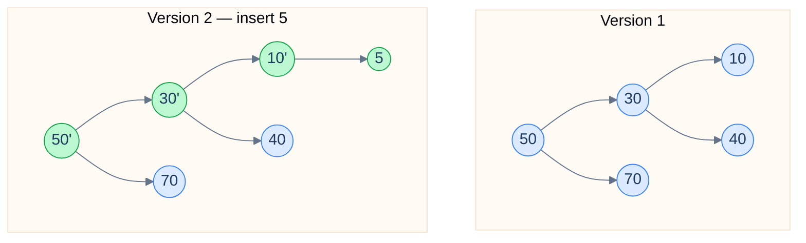

# 6. Persistent Data Structures

## The Hook

When you press Ctrl-Z in a text editor, what data structure makes that work? When you do `git checkout HEAD~1`, what makes the older state of every file instantly available? When a functional-language program holds a million-entry immutable map and lets you "modify" it without copying every entry?

The answer in all three cases is a **persistent data structure**: one where modifications produce a *new* version while preserving the old one, and both versions are accessible. "Persistent" doesn't mean disk-stored — it means *historical*. Every version of the structure is alive simultaneously, sharing structure where possible to avoid copying.

Three implementation strategies dominate:

- **Path copying.** Modifications create copies of every node *along the modification path*. Unmodified subtrees are shared between versions. `O(log n)` extra space per modification on a balanced tree.
- **Fat nodes.** Each node stores a *list* of versioned values. To read at a specific version, look up the right value. `O(1)` extra space per modification but `O(log m)` per read for `m` versions.
- **Path-copying with rollback.** Some libraries store changes in a log; lookups walk the log + a base structure.

This chapter is the introduction. By the end you'll understand path-copying on a BST, see how it powers Git's content-addressed history, and recognise persistence in functional languages.

---

## Table of contents

1. [What "persistent" means](#what-persistent-means)
2. [Path copying on a BST](#path-copying-on-a-bst)
3. [Implementation](#implementation)
4. [The space and time costs](#the-space-and-time-costs)
5. [Production reality](#production-reality)
6. [Edge cases and pitfalls](#edge-cases-and-pitfalls)
7. [Cross-links](#cross-links)
8. [Final takeaway](#final-takeaway)

***

# What "persistent" means

Three flavours of persistence:

- **Partial persistence.** Old versions are *readable*; only the latest is modifiable.
- **Full persistence.** Every version is readable *and* modifiable. Modifications can branch — version 5 might have been created by modifying version 3.
- **Confluent persistence.** Versions can be *merged*. Hardest to implement; rarely needed.

Most practical applications need partial or full persistence. Git's commit history is partial (you don't usually modify an old commit; you create a new one based on it). Functional language data structures are typically partial too.

***

# Path copying on a BST

Take a standard BST. To insert a new key creating version `v + 1`:

1. Walk down the tree from the root following the BST property.
2. *Copy each node along the path*. Modify the copy's relevant child pointer to point at the next copied node.
3. The new root pointer is the persistent version's handle.

The unmodified subtrees of the path are *shared* between the old and new versions — both versions point to the same physical nodes for those subtrees.



<p align="center"><strong>Version 2 of a persistent BST after inserting 5. The path 50→30→10 is copied (green); the right subtree (70) and the right child of 30 (40) are shared with Version 1. Inserting one node costs O(log n) extra storage — proportional to the tree height.</strong></p>

***

# Implementation

A simple persistent BST in Python:

```python run viz=graph viz-root=node
class Node:
    __slots__ = ("key", "left", "right")
    def __init__(self, key, left=None, right=None):
        self.key = key
        self.left = left
        self.right = right

def insert(node, key):
    """Returns a new root for the new version; doesn't modify the old."""
    if node is None: return Node(key)
    if key < node.key:
        return Node(node.key, insert(node.left, key), node.right)
    if key > node.key:
        return Node(node.key, node.left, insert(node.right, key))
    return node                                           # duplicate; reuse

def search(node, key):
    while node:
        if key == node.key: return True
        node = node.left if key < node.key else node.right
    return False

def inorder(node, out):
    if node is None: return
    inorder(node.left, out); out.append(node.key); inorder(node.right, out)


if __name__ == "__main__":
    versions = [None]                                              # versions[0] is empty tree

    for i, k in enumerate([50, 30, 70, 20, 40, 60, 80, 5]):
        new_root = insert(versions[-1], k)
        versions.append(new_root)

    # All versions still accessible
    for v in range(len(versions)):
        out = []; inorder(versions[v], out)
        print(f"version {v}: {out}")

    # Search a specific version
    print(f"\nSearch 5 in version 5: {search(versions[5], 5)}")    # False (5 not yet inserted)
    print(f"Search 5 in version 8: {search(versions[8], 5)}")      # True
```

```java run
public class Main {
    static class Node {
        int key; Node left, right;
        Node(int k, Node l, Node r) { key = k; left = l; right = r; }
    }

    static Node insert(Node n, int k) {
        if (n == null) return new Node(k, null, null);
        if (k < n.key) return new Node(n.key, insert(n.left, k), n.right);
        if (k > n.key) return new Node(n.key, n.left, insert(n.right, k));
        return n;
    }

    public static void main(String[] args) {
        Node[] versions = new Node[10];
        versions[0] = null;
        int[] keys = {50, 30, 70, 20, 40, 60, 80, 5};
        for (int i = 0; i < keys.length; i++) versions[i + 1] = insert(versions[i], keys[i]);
        System.out.println("8 versions of the persistent BST live simultaneously");
    }
}
```

***

# The space and time costs

For a balanced BST of height `O(log n)`:

- **Each modification:** `O(log n)` time, `O(log n)` extra space.
- **Each read at any version:** `O(log n)` time, `O(1)` extra space.
- **`m` versions total:** `O(m log n)` total space.

Compare to "copy the whole tree on each modification": `O(n)` per modification, `O(mn)` total. Path copying is *exponentially* better in space.

For a list (linked or persistent vector), the per-operation cost is `O(log n)` instead of `O(1)` (for arrays) or `O(n)` (for naive copy). Many functional languages accept this `log n` overhead because of the persistence and the implicit thread-safety (immutable structures are inherently thread-safe).

***

# Production reality

- **Git** is the most-deployed persistent structure on the planet. Every commit references its parent and a tree of file blobs; modifications of the tree create new tree objects pointing at unchanged blobs. The "Merkle DAG" we'll see in [DSA in Real Systems: Git Merkle DAG](/cortex/data-structures-and-algorithms/dsa-in-real-systems-git-merkle-dag) — *stub* — is exactly path-copying with content addressing.
- **Functional languages.** Clojure's persistent vectors and maps (the default collections), Scala's immutable collections, Haskell's `Data.Map` and `Data.Sequence` — all use persistence as the foundational property.
- **Undo systems.** Most modern editors (VS Code, IntelliJ) maintain document state as a persistent rope structure. Undo is "switch to a previous version".
- **Database snapshot isolation.** PostgreSQL's MVCC, Oracle's flashback, SQL Server's snapshot isolation — all rely on persistence to give each transaction a consistent view of the database at a specific point in time.
- **CRDTs (Conflict-free Replicated Data Types).** Many CRDTs leverage persistence to merge concurrent edits without conflicts.

***

# Edge cases and pitfalls

- **Memory growth.** Naive persistence retains every version forever. For unbounded edits (a server's request history), garbage-collect old versions. Persistent structures play *very* well with garbage collectors — once no variable references an old version, its unreferenced parts can be collected.
- **Aliasing assumptions break.** Persistent structures rely on *immutability* of nodes once they're shared. If your language allows in-place modification, persistence is undermined. Use `final`/`const` everywhere.
- **Concurrent persistent updates.** Persistent reads are inherently lock-free. Persistent writes are also lock-free *if* your language has a CAS for the version pointer.
- **Cache locality.** Path-copying creates a chain of newly-allocated nodes; the cache behaviour is similar to a linked list. For tight inner loops on a single version, mutable arrays beat persistent vectors.
- **Path copying isn't free.** Each modification touches `O(log n)` nodes. For "modify this huge tree once and discard the old version", in-place mutation is faster.

***

# Memorize

The high-leverage facts to commit to long-term memory — atomic enough for an Anki card, concrete enough to recall under pressure or during production debugging. Persistence + structural sharing is the trick behind every undo system, every functional language's immutable map, and Git itself.

## Quick recall

Click any question to reveal the answer.

<details>
<summary><strong>Q:</strong> What does "persistent" mean for a data structure?</summary>

**A:** Modifications produce *new versions* while preserving older ones. Both old and new are accessible.

</details>
<details>
<summary><strong>Q:</strong> Three flavours of persistence?</summary>

**A:** **Partial** — old versions readable, only latest modifiable. **Full** — every version readable + modifiable. **Confluent** — versions can be merged.

</details>
<details>
<summary><strong>Q:</strong> Path-copying cost on a balanced BST?</summary>

**A:** `O(log n)` time and space per modification. Only the path from root to modified node is copied; everything else is shared.

</details>
<details>
<summary><strong>Q:</strong> Why does this share so much with previous versions?</summary>

**A:** Unmodified subtrees are referenced by both versions. Editing one node changes only `O(log n)` nodes' references along the path; `O(n − log n)` nodes are untouched.

</details>
<details>
<summary><strong>Q:</strong> Why do functional languages "get persistence for free"?</summary>

**A:** Immutability means nodes never change. New versions naturally share references with old ones. The cost (`log n` overhead) is the price of immutability.

</details>
<details>
<summary><strong>Q:</strong> Production systems built on persistence?</summary>

**A:** **Git** (Merkle DAG of commits/trees/blobs), **Clojure / Scala / Haskell** persistent collections, **Postgres MVCC** (each transaction sees a snapshot), **VS Code / IntelliJ undo** (rope structure).

</details>
<details>
<summary><strong>Q:</strong> When is path copying the wrong choice?</summary>

**A:** **Tight inner loop on a single version** — mutable arrays are faster (cache-friendly). **One-shot transformation, discard old** — in-place beats persistence.

</details>

## Code template

```python
class Node:
    __slots__ = ("key", "left", "right")
    def __init__(self, key, left=None, right=None):
        self.key, self.left, self.right = key, left, right

def insert(node, key):
    """Returns NEW root for the new version; doesn't modify the old."""
    if node is None: return Node(key)
    if key < node.key:
        return Node(node.key, insert(node.left, key), node.right)
    if key > node.key:
        return Node(node.key, node.left, insert(node.right, key))
    return node                                 # duplicate; reuse

# All previous versions remain accessible:
# v0 = None
# v1 = insert(v0, 5)
# v2 = insert(v1, 3)
# v0, v1, v2 all live simultaneously.
```

## Pattern triggers

- **"Undo / redo"** → persistent rope or persistent BST
- **"Snapshot isolation in a database"** → MVCC = persistence
- **"Branch and merge file trees"** → Git's Merkle DAG
- **"Functional / immutable collections in production"** → Clojure/Scala persistent maps and vectors
- **"CRDT / collaborative editing"** → persistence enables clean merges
- **"Hot inner loop, single version"** → use mutable; persistence pays an unaffordable `log n`
- **"Memory growing forever"** → garbage-collect old versions; persistence + GC pair well

***

# Cross-links

- **Prerequisites:** [BST](/cortex/data-structures-and-algorithms/trees-binary-search-tree-introduction-to-binary-search-trees), [Amortized Analysis](/cortex/data-structures-and-algorithms/foundations-amortized-analysis).
- **Production deep-dive:** [Git's Merkle DAG](/cortex/data-structures-and-algorithms/dsa-in-real-systems-git-merkle-dag) — *stub* — Git as a persistent data structure.

***

# Final takeaway

Persistent structures retain history while sharing structure. Three patterns to internalise:

1. **Path copying is the default technique.** Copy the modified path; share the rest. `O(log n)` extra space per modification on balanced trees.
2. **Persistence enables time travel.** Undo, snapshot isolation, branch-and-merge — all become trivial when every version is alive simultaneously.
3. **Functional languages get persistence "for free".** Immutability + structural sharing = persistence. The cost (the `log n` factor) is the trade-off; the benefit is implicit thread-safety and historical access.

This concludes the Probabilistic and Advanced module. Six chapters covering skip lists, Bloom filters, Count-Min sketches, HyperLogLog, treaps, and persistent structures — the structures that earn their place when exact methods become too expensive or too rigid.

<!-- ============================================== -->
<!-- SWEEP 2 — missing sections (placeholders only) -->
<!-- ============================================== -->

<!-- TODO: Understanding the Problem — missing, needs to be written -->
<!--       Guidance: frame the gap the structure/algorithm fills -->

<!-- TODO: Supported Operations — missing, needs to be written -->
<!--       Guidance: table: operation / time / notes -->

<!-- TODO: Internal Mechanics — missing, needs to be written -->
<!--       Guidance: how it actually works under the hood -->

<!-- TODO: Working Example — missing, needs to be written -->
<!--       Guidance: one fully worked end-to-end example -->

<!-- TODO: Quiz — missing, needs to be written -->
<!--       Guidance: 3–5 questions, each labeled [Recall]/[Reasoning]/[Tradeoff] -->

<!-- TODO: Practice Ladder — missing, needs to be written -->
<!--       Guidance: table: 5 links into pattern problems + hints -->

<!-- TODO: Further Reading — missing, needs to be written -->
<!--       Guidance: annotated: ★ Essential / ◆ Advanced / → Reference -->
