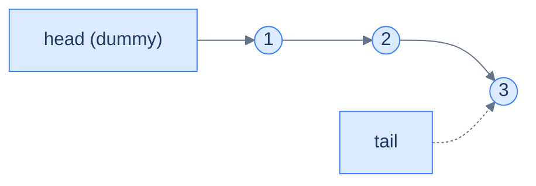

# 2. Lock-Free Queue

## The Hook

A producer-consumer queue is the most-used concurrent data structure in software. Whenever you have one thread producing work and another consuming it — request handling, event loops, background workers, GPU command submission — you need a queue that handles concurrent enqueue/dequeue without serialising threads.

The naive approach is a `std::queue` plus a `std::mutex`. Both producer and consumer take the lock. Under low contention, fine. Under heavy contention, the mutex becomes the bottleneck — every enqueue serialises with every dequeue, and lock-acquisition cost dominates.

The **Michael-Scott queue** (1996) does this lock-free. Enqueues and dequeues both use CAS on `head` and `tail` pointers. Two threads can enqueue concurrently without blocking each other (both succeed via CAS retries). Same for dequeues. Producer and consumer never block each other except in pathological CAS-retry cases.

This chapter is the algorithm. By the end you'll have implemented a working lock-free queue in C, recognise the standard tricks (sentinel nodes, ABA mitigation), and know which queue to reach for in production (spoiler: usually a library, not your own implementation).

---

## Table of contents

1. [The Michael-Scott shape](#the-michael-scott-shape)
2. [Enqueue](#enqueue)
3. [Dequeue](#dequeue)
4. [Implementation](#implementation)
5. [Edge cases and pitfalls](#edge-cases-and-pitfalls)
6. [Production reality](#production-reality)
7. [Cross-links](#cross-links)
8. [Final takeaway](#final-takeaway)

***

# The Michael-Scott shape

A singly-linked list with two pointers: `head` (the dummy sentinel) and `tail` (the last node). The first real element is `head.next`.

<strong>Michael-Scott queue: a linked list with sentinel <code>head</code> and a <code>tail</code> pointer. The dummy sentinel simplifies the empty-queue case.</strong>

The dummy sentinel is the key trick — it means `head` is never null, even when the queue is empty. The empty queue has `head == tail` pointing at the sentinel.

***

# Enqueue

Enqueue is conceptually: "create a new node; CAS-link it onto `tail.next`; advance `tail`."

Two CASes per enqueue: one to link the new node into the list, one to advance `tail`. The second CAS is *best-effort* — if it fails (another thread advanced tail first), we don't retry; the next enqueue will fix it.

The "help advance lagging tail" branch is essential — without it, an enqueuer could complete its first CAS but be preempted before the second, leaving `tail` stale. Other enqueuers help advance.

***

# Dequeue

The `first == last && next == null` case is "actually empty". The `first == last && next ≠ null` case is "tail is lagging behind; we help" — same as the enqueue branch.

***

# Implementation

A working Michael-Scott queue in C with C11 atomics:

The Java/Scala versions use `AtomicReference`; the Python implementation falls back to `threading.Lock` because Python's GIL makes "real" lock-free benchmarks meaningless. Production code uses `java.util.concurrent.ConcurrentLinkedQueue` (a Michael-Scott implementation), `boost::lockfree::queue`, or one of the higher-performance variants below.

***

# Edge cases and pitfalls

- **The ABA problem.** Without ABA mitigation, the dequeue's `head` CAS can succeed on a recycled node, leading to corrupted state. Standard fixes: tagged pointers (double-CAS on a pointer + version counter), hazard pointers, or rely on a GC.
- **Memory reclamation.** When you dequeue, you free the dummy. But if another thread is still reading that node, you've created a use-after-free. GCed languages (Java, Go) avoid this; C/C++/Rust need hazard pointers or epoch-based reclamation.
- **The "help advance tail" branch is non-optional.** Skipping it gives correct behaviour in the common case but can deadlock if the original enqueuer is preempted.
- **`weak` vs `strong` CAS.** In ARM (LL/SC), `weak` allows spurious failures; the loop is fine since you'll retry. `strong` is more expensive on weak-memory architectures.
- **MPMC vs SPSC vs SPMC vs MPSC.** Different concurrency patterns admit different optimisations:
  - **SPSC** (single producer, single consumer): the simplest, can use just a ring buffer with two atomic counters. No CAS needed.
  - **MPMC** (multiple of each): the Michael-Scott queue.
  - **MPSC** (multi-producer, single-consumer): used in actor frameworks. CAS on enqueue, no CAS on dequeue.
  Each has dedicated production-grade implementations.

***

# Production reality

- **Java's `java.util.concurrent.ConcurrentLinkedQueue`** is a Michael-Scott implementation. Used internally by `Executor`s, `ForkJoinPool`, and many higher-level concurrency primitives.
- **.NET's `System.Collections.Concurrent.ConcurrentQueue`** uses a similar lock-free design.
- **Boost.Lockfree.Queue** for C++ — fixed-size MPMC queue with optional tagged-pointer ABA mitigation.
- **JCTools** for Java — high-performance lock-free queues optimised for specific producer/consumer patterns. Used by Netty, Vert.x, Apache Kafka.
- **The LMAX Disruptor** — a different design (ring buffer with sequence numbers) that avoids most CAS contention by giving each producer and consumer their own slot.
- **Linux kernel `kfifo`** — SPSC ring buffer used in many drivers.
- **Apache Kafka producers** internally use lock-free queues for batching; LinkedIn's original Kafka design relied heavily on these.
- **RUST's `crossbeam_channel`** is a state-of-the-art MPMC channel used by Tokio and many Rust async runtimes.

***

# Memorize

The high-leverage facts to commit to long-term memory — atomic enough for an Anki card, concrete enough to recall under pressure or during production debugging. The Michael-Scott queue is the canonical lock-free queue; once you can sketch the two-CAS-per-enqueue pattern, you've understood every JVM/CLR concurrent queue implementation.

## Quick recall

Click any question to reveal the answer.

<strong>Q:</strong> What does the dummy sentinel node do in Michael-Scott?

**A:** Simplifies the empty-queue case. `head == tail == sentinel` means empty; otherwise the first real element is `head.next`. Both pointers always non-null.

<strong>Q:</strong> How many CASes per enqueue?

**A:** Two. **CAS 1**: link new node onto `tail.next`. **CAS 2**: advance `tail` (best-effort; lagging tail fixed by next enqueuer).

<strong>Q:</strong> Why "best-effort" on the tail-advance CAS?

**A:** If it fails, another thread already advanced `tail`. No retry needed; correctness is preserved by the help-the-lagging-tail branch in subsequent operations.

<strong>Q:</strong> What's the "help advance lagging tail" branch?

**A:** A reader/writer that finds `tail.next` non-null knows tail is stale and CASes `tail` forward themselves. Cooperative; ensures no thread can stall the queue by being preempted.

<strong>Q:</strong> Variants you should know by name?

**A:** **MPMC** (multi-producer, multi-consumer) — Michael-Scott. **SPSC** (single producer, single consumer) — ring buffer with two atomic counters; no CAS needed. **MPSC** (used in actor frameworks). **SPMC** (rare).

<strong>Q:</strong> Why is memory reclamation hard in C/C++ but easy in Java?

**A:** Java's GC won't free a node while any thread holds a reference. C/C++ need hazard pointers, RCU, or tagged-pointer ABA mitigation to defer frees safely.

<strong>Q:</strong> What does the LMAX Disruptor do differently?

**A:** Ring buffer with per-producer/per-consumer sequence numbers. Avoids most CAS contention by giving each thread its own slot to advance.

## Code template

## Pattern triggers

- **"Producer-consumer queue, mostly Java/.NET"** → `ConcurrentLinkedQueue` / `ConcurrentQueue` (Michael-Scott)
- **"Producer-consumer in C/C++/Rust"** → `boost::lockfree::queue`, JCTools, `crossbeam_channel`
- **"Single producer, single consumer"** → SPSC ring buffer (no CAS needed)
- **"Many threads contending on one queue"** → consider Disruptor pattern (per-slot sequence numbers)
- **"Use-after-free in lock-free queue"** → memory reclamation strategy missing (hazard pointers or RCU)
- **"Don't roll your own"** → use a library; correct lock-free queues are fiddly

***

# Cross-links

- **Prerequisites:** [CAS and Atomics](/cortex/data-structures-and-algorithms/concurrency-and-systems-cas-and-atomics), [Queue](/cortex/data-structures-and-algorithms/linear-structures-queue-introduction-to-queues).
- **Sibling structures:** [Concurrent Hash Map](/cortex/data-structures-and-algorithms/concurrency-and-systems-concurrent-hash-map), [RCU and Hazard Pointers](/cortex/data-structures-and-algorithms/concurrency-and-systems-rcu-and-hazard-pointers).

***

# Final takeaway

The Michael-Scott queue is the canonical lock-free queue. Three patterns to internalise:

1. **Two CASes per enqueue.** Link the new node, then advance tail. The second is best-effort; lagging tail is fixed by the next enqueuer.
2. **Cooperative behaviour.** Both enqueuers and dequeuers help advance a lagging tail. Without this, preempted threads can stall the structure.
3. **Memory reclamation is the hard part.** Lock-free in GCed languages: clean and easy. In C/C++/Rust: hazard pointers or epoch-based reclamation. Skipping reclamation entirely is a memory leak; doing it wrong is a use-after-free.

<!-- ============================================== -->
<!-- SWEEP 2 — missing sections (placeholders only) -->
<!-- ============================================== -->

<!-- TODO: Understanding the Problem — missing, needs to be written -->
<!--       Guidance: frame the gap the structure/algorithm fills -->

<!-- TODO: Supported Operations — missing, needs to be written -->
<!--       Guidance: table: operation / time / notes -->

<!-- TODO: Internal Mechanics — missing, needs to be written -->
<!--       Guidance: how it actually works under the hood -->

<!-- TODO: Working Example — missing, needs to be written -->
<!--       Guidance: one fully worked end-to-end example -->

<!-- TODO: Quiz — missing, needs to be written -->
<!--       Guidance: 3–5 questions, each labeled [Recall]/[Reasoning]/[Tradeoff] -->

<!-- TODO: Practice Ladder — missing, needs to be written -->
<!--       Guidance: table: 5 links into pattern problems + hints -->

<!-- TODO: Further Reading — missing, needs to be written -->
<!--       Guidance: annotated: ★ Essential / ◆ Advanced / → Reference -->
