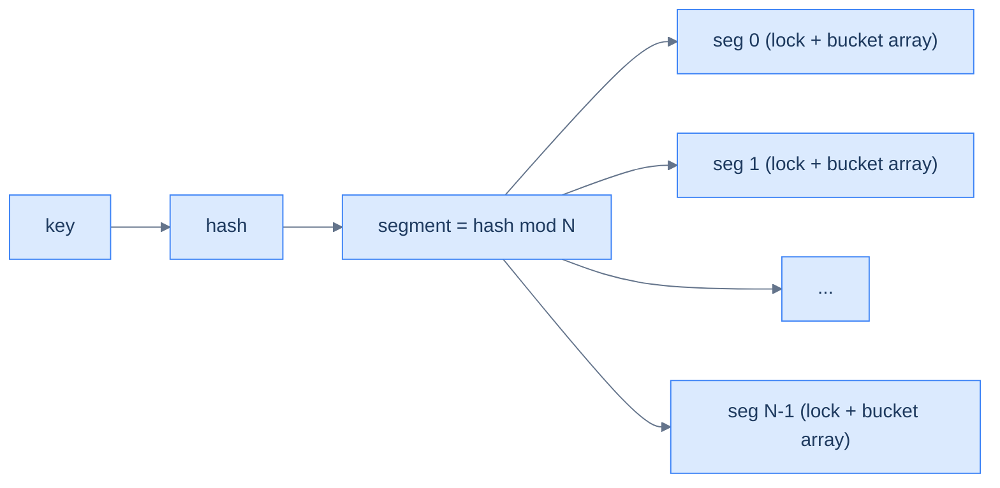

# 3. Concurrent Hash Map

## The Hook

A regular `HashMap` plus a `synchronized` block around every operation works, but serialises all access. Under high concurrency, every read or write blocks until others finish — a hash map this is *not*; this is a queue with a hash interface.

A **concurrent hash map** lets multiple threads read and write *concurrently* with minimal blocking. The strategies vary:

- **Striping (lock per bucket).** Divide the table into `N` segments; each segment has its own lock. Threads writing to different segments don't block each other. Java's pre-Java 8 `ConcurrentHashMap`.
- **Lock-free reads, locked writes.** Reads use no lock at all (relying on volatile reads); writes lock only the affected bucket. Java's modern `ConcurrentHashMap`.
- **CAS-based fully lock-free.** Both reads and writes are lock-free, using CAS on bucket heads. More complex; used in some specialised libraries.

The performance and correctness guarantees vary across these designs. This chapter sketches the strategies, focusing on Java's `ConcurrentHashMap` (the most-deployed implementation) and the trade-offs.

---

## Table of contents

1. [The contention problem](#the-contention-problem)
2. [Striping (segment locks)](#striping-segment-locks)
3. [Lock-free reads, locked writes](#lock-free-reads-locked-writes)
4. [Linearizability and weakly consistent iterators](#linearizability-and-weakly-consistent-iterators)
5. [Implementation](#implementation)
6. [Edge cases and pitfalls](#edge-cases-and-pitfalls)
7. [Production reality](#production-reality)
8. [Cross-links](#cross-links)
9. [Final takeaway](#final-takeaway)

***

# The contention problem

A `synchronized` HashMap has a single global lock. With four threads doing 1M operations each:

| Implementation | Throughput |
|---|---|
| `synchronized HashMap` | 1× (baseline) |
| Striped (16 segments) | ~10× (proportional to segment count) |
| Java's `ConcurrentHashMap` | ~30× (lock-free reads + fine-grained writes) |
| Specialised lock-free | ~50× (no locks at all, but more complex) |

The win comes from *fewer collisions on lock acquisition*. Below contention, all approaches are similar; under contention, the design choices matter dramatically.

***

# Striping (segment locks)

The pre-Java 8 design. The table is partitioned into `N` segments (typically 16). Each segment is itself a small hash map with its own lock. To read/write key `k`:

1. Compute `segment = h(k) mod N`.
2. Acquire `segment.lock`.
3. Operate on `segment`.
4. Release.

`N` simultaneous writers can proceed in parallel as long as their keys hash to different segments.



<p align="center"><strong>Stripe-locked hash map. Each segment is a mini-hash-map with its own lock. Two threads writing to different segments don't block.</strong></p>

***

# Lock-free reads, locked writes

Java 8 redesigned `ConcurrentHashMap`. New strategy:

- **Reads** require no lock. The buckets are stored in a `volatile` array; reading a bucket head is just a volatile read. Walking the bucket's chain is also lock-free as long as you hold the head reference.
- **Writes** acquire a lock on the *individual bucket* (not the whole segment). With `n` buckets and few collisions, contention is minimal.

This design relies on:
- The bucket head pointer is `volatile` → readers see fresh values.
- The bucket entries are immutable once linked → readers can safely walk the chain even while a writer is updating the bucket.
- Writers serialise via per-bucket locks.

The result: under realistic workloads, the new `ConcurrentHashMap` is 2-5× faster than the segmented version, with simpler internals.

***

# Linearizability and weakly consistent iterators

Concurrent maps usually guarantee **linearizability** for individual operations — `put`, `get`, `remove` each appear to happen at a single instant.

But *iteration* is harder. Java's `ConcurrentHashMap.iterator()` is **weakly consistent**: it doesn't throw `ConcurrentModificationException` (unlike non-concurrent maps), but it makes no guarantees about whether elements added during iteration are visible. The iterator reflects "some recent state" of the map.

For analytics use cases (count entries periodically), weakly consistent iteration is exactly what you want. For "snapshot iteration" use cases, you need a different structure (immutable map or copy-on-write).

***

# Implementation

A simplified Java-style striped concurrent hash map in pseudocode and Java:

```pseudocode
class StripedConcurrentMap:
    buckets ← array of N segments
    each segment ← (lock, bucket_array)

    function put(key, value):
        seg ← buckets[hash(key) % N]
        with seg.lock:
            insert/replace in seg.bucket_array

    function get(key):
        seg ← buckets[hash(key) % N]
        with seg.lock:                              # could be lock-free in modern designs
            return lookup in seg.bucket_array
```

```java run
import java.util.concurrent.*;
import java.util.concurrent.locks.*;

class Solution {
    // Use Java's built-in ConcurrentHashMap; stripped-down example.
    static ConcurrentHashMap<String, Integer> map = new ConcurrentHashMap<>();

    public static void main(String[] args) throws Exception {
        ExecutorService pool = Executors.newFixedThreadPool(4);
        for (int t = 0; t < 4; t++) {
            final int tid = t;
            pool.submit(() -> {
                for (int i = 0; i < 10000; i++) {
                    map.merge("key_" + (i % 100), 1, Integer::sum);
                }
            });
        }
        pool.shutdown();
        pool.awaitTermination(10, TimeUnit.SECONDS);
        System.out.println("100 unique keys, total value: " +
            map.values().stream().mapToInt(Integer::intValue).sum() +
            " (expected " + 4 * 10000 + ")");
    }
}
```

```python run
import threading
from collections import defaultdict

class StripedHashMap:
    """Simple striped hash map for educational use."""
    def __init__(self, num_stripes=16):
        self.num_stripes = num_stripes
        self.stripes = [(threading.Lock(), {}) for _ in range(num_stripes)]

    def _stripe(self, key):
        return self.stripes[hash(key) % self.num_stripes]

    def put(self, key, value):
        lock, table = self._stripe(key)
        with lock:
            table[key] = value

    def get(self, key, default=None):
        lock, table = self._stripe(key)
        with lock:
            return table.get(key, default)

    def merge(self, key, value, merger):
        lock, table = self._stripe(key)
        with lock:
            table[key] = merger(table.get(key, 0), value)


if __name__ == "__main__":
    m = StripedHashMap(num_stripes=16)

    def worker():
        for i in range(10000):
            m.merge(f"key_{i % 100}", 1, lambda a, b: a + b)

    threads = [threading.Thread(target=worker) for _ in range(4)]
    for t in threads: t.start()
    for t in threads: t.join()

    total = sum(m.get(f"key_{i}", 0) for i in range(100))
    print(f"100 keys, total value: {total} (expected {4 * 10000})")
```

***

# Edge cases and pitfalls

- **Don't iterate while concurrently modifying** unless your map's iterator is documented as concurrent-safe. Even then, expect "weakly consistent" iteration.
- **Atomic compound operations.** `if (map.containsKey(k)) map.put(k, v)` is *not* atomic in any concurrent map — another thread could insert/remove between the check and the put. Use `putIfAbsent`, `replace`, or `compute` for atomic compound operations.
- **`size()` may be approximate.** Some concurrent maps' `size()` is a best-effort estimate (Java's `ConcurrentHashMap.size()` walks all stripes; under heavy concurrency, the result can be slightly stale). For exact counts, you may need additional synchronisation.
- **Hashing performance matters more.** Concurrent maps amortise the cost across threads; a slow hash function multiplies the contention. Use `String.hashCode()` (good) over custom slow hashes.
- **HashDoS.** Concurrent maps are vulnerable to the same hash-flood attacks as non-concurrent ones. Java 8's `ConcurrentHashMap` switches buckets to TreeMap once collision chains exceed a threshold — a defensive measure.
- **Memory overhead.** Striped maps use more memory than non-concurrent (per-segment locks, possibly per-segment internal state). For embedded contexts, this matters.

***

# Production reality

- **Java's `java.util.concurrent.ConcurrentHashMap`** — the de facto standard. Used by every JVM-based service for caching, request routing, session storage. Source is in `src/java.base/share/classes/java/util/concurrent/ConcurrentHashMap.java`.
- **`.NET`'s `System.Collections.Concurrent.ConcurrentDictionary`** — striped lock-free design.
- **Go's `sync.Map`** — optimised for read-heavy workloads with infrequent writes. The default Go `map` is *not* concurrent-safe.
- **C++ has no standard concurrent hash map.** Common third-party choices: Folly's `ConcurrentHashMap`, TBB's `concurrent_hash_map`, junction's lock-free maps.
- **Caching libraries** (Caffeine, Guava Cache, Memcached's internals) all use concurrent hash maps as primary storage.
- **Distributed caches** (Redis, Memcached) at scale, internally use lock-free primitives in their event-loop-based servers — different design pattern.

***

# Cross-links

- **Prerequisites:** [Hash Table](/cortex/data-structures-and-algorithms/linear-structures-hash-table-introduction-to-hash-tables), [CAS and Atomics](/cortex/data-structures-and-algorithms/concurrency-and-systems-cas-and-atomics).
- **Sibling structures:** [Lock-Free Queue](/cortex/data-structures-and-algorithms/concurrency-and-systems-lock-free-queue), [Skip List](/cortex/data-structures-and-algorithms/probabilistic-and-advanced-skip-list) (for sorted concurrent maps).

***

# Final takeaway

Concurrent hash maps are the workhorse of multi-threaded code. Three patterns to internalise:

1. **Lock granularity is the design knob.** Single global lock < segment locks < per-bucket locks < lock-free. Each step buys throughput at the cost of complexity.
2. **Use atomic compound operations.** `putIfAbsent`, `compute`, `merge` — never check-then-act manually under concurrency.
3. **Java's `ConcurrentHashMap` is the gold standard.** When in doubt, use it. Reading its source is a master class in concurrent programming.
