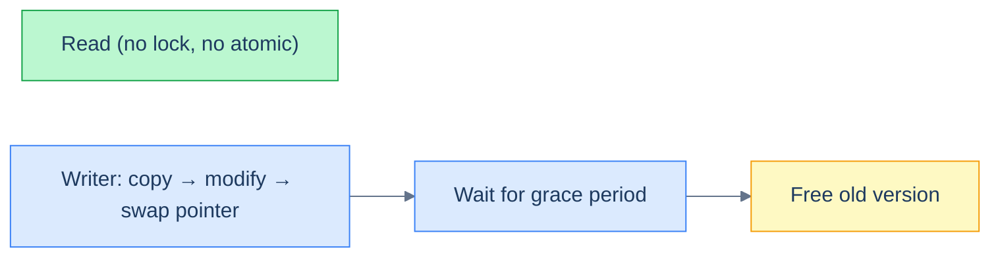

# 4. RCU and Hazard Pointers

## The Hook

You've built a lock-free queue with CAS. Enqueue and dequeue work correctly. But there's a problem: when do you `free` an old node?

If you free immediately upon dequeue, another thread might still be reading the node — *use after free*, undefined behaviour. If you never free, you have a memory leak. The lock-free programming community has two standard answers: **RCU** (Read-Copy-Update) and **hazard pointers**.

Both solve the same problem — *safe memory reclamation in lock-free contexts* — with different trade-offs:

- **RCU.** Defer freeing until every reader has passed a "quiescent point" (e.g., context-switched, or run another iteration of its main loop). Cheap reads (no per-node tracking), more expensive writes.
- **Hazard pointers.** Each reader publishes a per-thread "I'm currently reading this pointer" marker. Writers scan all readers' markers before freeing; if a node's address appears, defer the free. More expensive reads, simpler reasoning.

The Linux kernel uses RCU pervasively. User-space lock-free libraries lean toward hazard pointers. Both are *the* answer to "how do you free memory in a lock-free environment".

---

## Table of contents

1. [Why GC isn't the answer in C/C++](#why-gc-isnt-the-answer-in-c-c)
2. [RCU](#rcu)
3. [Hazard pointers](#hazard-pointers)
4. [Comparison](#comparison)
5. [Implementation sketch](#implementation-sketch)
6. [Edge cases and pitfalls](#edge-cases-and-pitfalls)
7. [Production reality](#production-reality)
8. [Cross-links](#cross-links)
9. [Final takeaway](#final-takeaway)

***

# Why GC isn't the answer in C/C++

A garbage-collected language solves this trivially: while any thread holds a reference, the GC won't free the node. Java's `ConcurrentLinkedQueue` works without explicit reclamation — the GC handles it.

C, C++, and Rust don't have built-in tracing GC for shared structures. They rely on either:

- Reference counting (`shared_ptr` in C++, `Arc` in Rust). Read overhead: every dereference touches the count. *Bad for lock-free hot paths.*
- Manual reclamation strategies: RCU, hazard pointers, epoch-based reclamation.

For lock-free *throughput-critical* code, manual is the default.

***

# RCU

RCU (Read-Copy-Update) is the Linux kernel's preferred reclamation strategy for read-mostly data structures. The model:

1. **Readers** access data without any explicit synchronisation. They might see slightly stale data — that's OK as long as they're internally consistent.
2. **Writers** copy the data structure (or at least the affected portion), modify the copy, then atomically swap the pointer. The old version is *not freed immediately* — it's queued for reclamation.
3. **Grace period.** A grace period elapses when *every* reader has passed a quiescent point. The kernel can detect this efficiently (preempt-disabled regions are RCU read-side critical sections; a context switch ends them). Once a grace period passes, the old version can safely be freed.

The result: readers pay essentially nothing. Writers pay a "wait for grace period" cost (often milliseconds). Best for read-mostly: routing tables, configuration, kernel data structures with rare writes.



<p align="center"><strong>RCU lifecycle: writers can't free old data immediately because readers might still hold references. They wait for a grace period — a window during which every existing reader has finished — before reclaiming.</strong></p>

***

# Hazard pointers

A hazard pointer is a per-thread *publication* of "the address I'm currently reading". Each reader has a slot in a global table; before dereferencing a pointer, the reader writes the pointer's address to its slot.

When a writer wants to free a node, it scans the hazard-pointer table. If any thread's slot equals the node's address, the writer can't free yet — instead, it queues the node for delayed reclamation. Periodically, threads scan the queue and free nodes whose addresses are no longer hazardous.

```pseudocode
# Reader
hp[thread_id] ← node           # publish hazard
read node->data
hp[thread_id] ← NULL           # release hazard

# Writer
unlink(node)
old_hp ← snapshot of all hp slots
queue_for_reclamation(node)
periodically: free nodes whose address isn't in any hp slot
```

***

# Comparison

| | RCU | Hazard Pointers |
|---|---|---|
| Read cost | Zero (no atomic op) | One atomic write per pointer dereference |
| Write cost | Wait for grace period (milliseconds) | Lower (no global wait, but scan hazard table) |
| Best for | Read-mostly | Mixed read/write |
| Memory bound | Bounded queue per CPU | Bounded by number of threads |
| Implementation | Requires runtime support (Linux kernel) | Self-contained in user-space |
| Standard library? | Linux kernel | C++26 `std::atomic_hazard_pointer` (proposed) |

The Linux kernel uses RCU because the cost of waiting for a grace period is amortised across many writes. User-space libraries usually use hazard pointers because grace-period detection without OS help is hard.

***

# Implementation sketch

A hazard-pointer-protected lock-free stack pop in C-style pseudocode:

```pseudocode
function pop(stack, hp):
    do:
        old_top ← stack.top
        if old_top = NULL: return NULL
        hp.write(old_top)                    # publish hazard
        if old_top ≠ stack.top:              # changed before we published?
            continue                          # retry
    while !CAS(&stack.top, old_top, old_top.next)
    hp.clear()                                # release hazard
    queue_for_reclamation(old_top)            # don't free yet
    return old_top.data

function reclaim_periodically():
    for node in reclamation_queue:
        if node.address not in any hp:
            free(node)
            remove from queue
```

The crucial step is the *re-check* after publishing the hazard pointer. Without it, the writer might have freed the node between our `top` read and our hp write.

For full implementation, see Folly's `HazPtr` (`folly/synchronization/HazPtr.h`) or the standard hazard-pointer library in your platform.

***

# Edge cases and pitfalls

- **Hazard-pointer count.** Each thread typically has 2–4 hazard pointer slots. Operations that need to read more pointers concurrently (e.g., walking a linked list) must rotate through hazard pointers. Get this wrong and you'll free a node mid-traversal.
- **Reclamation queue growth.** If writers free much faster than threads pass quiescent points / clear hazards, the reclamation queue grows unboundedly. Bound it by triggering scans more aggressively, or apply backpressure.
- **RCU and traditional locks don't mix freely.** RCU read-side critical sections cannot block on a sleeping lock; the kernel disables preemption during them. User-space RCU (URCU library) has different rules.
- **ABA still matters.** Hazard pointers and RCU don't eliminate the ABA problem; they prevent *use after free*. If your lock-free structure has logical ABA bugs, you still need tagged pointers or version counters.
- **Performance isn't free.** Hazard pointers add an atomic write per pointer dereference. For deeply nested data structures (tree traversal), this overhead adds up. RCU has no read overhead but writers pay grace-period costs.
- **Don't overuse RCU.** RCU shines for read-mostly. For balanced read-write, fine-grained locks or lock-free with hazard pointers usually beat it.

***

# Production reality

- **The Linux kernel** uses RCU pervasively: routing tables (`net/ipv4/route.c`), the file-descriptor table, dcache, namespace lookups, lockdep traces, and dozens more. The `Documentation/RCU/` directory in the kernel source is a master class.
- **liburcu** (User-space RCU) is the Linux RCU model exported as a user-space library. Used by Userspace TPM, lttng-ust, some database engines.
- **Folly's `HazPtr`** is the canonical C++ hazard-pointer library. Used by RocksDB and other Facebook OSS projects.
- **The Boost Lockfree library** uses tagged pointers (a separate ABA mitigation strategy — pair pointer with a version counter that increments on every modification).
- **Crossbeam's `epoch`** crate (Rust) is an epoch-based reclamation library — a third strategy distinct from RCU and hazard pointers but solving the same problem.
- **Java**: doesn't need any of this; the GC handles reclamation. This is one of the JVM's biggest concurrency advantages over C++.

***

# Cross-links

- **Prerequisites:** [CAS and Atomics](/cortex/data-structures-and-algorithms/concurrency-and-systems-cas-and-atomics), [Lock-Free Queue](/cortex/data-structures-and-algorithms/concurrency-and-systems-lock-free-queue).
- **Production deep-dive:** Linux kernel's RCU implementation; the [Linux Red-Black Tree chapter](/cortex/data-structures-and-algorithms/dsa-in-real-systems-linux-red-black-tree-in-the-cfs-scheduler) — *stub* — uses RCU for some lock-free traversals.

***

# Final takeaway

Memory reclamation in lock-free code requires deliberate strategies. Three patterns to internalise:

1. **GC solves this trivially in Java/Go; C/C++/Rust need explicit strategies.** Pick RCU for read-mostly, hazard pointers for mixed workloads.
2. **The "free immediately" mistake is a use-after-free.** Lock-free structures *defer* freeing; the only question is by how long and via what mechanism.
3. **The Linux kernel is the textbook example.** RCU is one of the kernel's most distinctive features. Reading its docs and source teaches you concurrent programming the way nothing else does.
