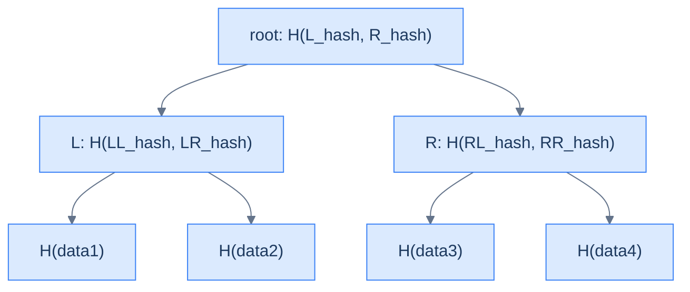

# 5. Distributed Data Structures (Teaser)

## The Hook

Concurrent data structures (the previous chapters of this module) live on one machine. **Distributed** data structures live across many machines, connected by an unreliable network, where any machine can fail at any time and the network can partition. The toolkit grows accordingly.

This chapter is a teaser, not a deep dive. Distributed systems is its own multi-book subject; this chapter sketches three of the structures that show up over and over: **CRDTs** (Conflict-free Replicated Data Types), **Merkle trees**, and **vector clocks**. Each appears in production systems you've used: Riak, Cassandra, Bitcoin, Git, Apache Kafka, Cosmos DB, Cloudflare's Workers KV.

If any of these structures sounds interesting, the references at the end point to deeper resources.

---

## Table of contents

1. [The challenges](#the-challenges)
2. [CRDTs](#crdts)
3. [Merkle trees](#merkle-trees)
4. [Vector clocks](#vector-clocks)
5. [Production reality](#production-reality)
6. [Where to go next](#where-to-go-next)
7. [Cross-links](#cross-links)
8. [Final takeaway](#final-takeaway)

***

# The challenges

Distributed data structures face problems concurrent ones don't:

- **Network partitions.** Two nodes might be alive but unable to communicate. Partition tolerance is a hard requirement (the "P" in CAP theorem).
- **Asynchronous failures.** A network round-trip can take milliseconds, seconds, or never complete. You can't wait synchronously for distant nodes.
- **Replicated state.** Each node has its own copy of the state; convergence between copies is the goal, not the assumption.
- **Eventually consistent.** Strong consistency requires synchronous coordination (Paxos, Raft) which is expensive. Many systems choose *eventual* consistency: replicas converge over time without requiring synchronous writes.

The structures below address subsets of these challenges.

***

# CRDTs

A **CRDT (Conflict-free Replicated Data Type)** is a data structure designed so that concurrent updates from different nodes can be merged *automatically*, without conflict resolution.

There are two flavours:

- **State-based (CvRDT).** Each node periodically sends its full state to others. Receivers merge via a *commutative, associative, idempotent* `merge` function (a join in lattice theory). Examples: G-Counter (grow-only counter), G-Set (grow-only set).
- **Operation-based (CmRDT).** Each node broadcasts operations (insert, increment) to others. Operations must be commutative — order doesn't matter. Causal delivery (via vector clocks) is usually required.

A simple example: **the LWW (Last-Writer-Wins) Register.** Each node tags its writes with a timestamp. Merge takes the value with the highest timestamp. Commutative, associative; eventual consistency is automatic.

A more complex example: **the OR-Set (Observed-Remove Set).** Each element insertion is tagged with a unique ID. Removal references those IDs. The set is an `add-set` of (element, id) pairs minus a `remove-set` of IDs. Merge unions both sets. Insertions and removals commute correctly.

CRDTs power most modern collaborative editors (Figma, Google Docs internally), distributed counters (Twitter's like counters across data centers), and offline-capable mobile apps that sync state when reconnecting.

***

# Merkle trees

A **Merkle tree** is a tree where each non-leaf node stores a hash of its children's contents. Leaf hashes are typically content hashes of the underlying data.

<strong>Merkle tree: every node hashes its children. The root hash uniquely identifies the entire tree contents. Two trees with identical roots are guaranteed identical (modulo hash collisions).</strong>

Properties:

- **Tamper detection.** Any change to a leaf changes its hash, propagating up to the root. Verifying integrity = verifying the root.
- **Efficient diff.** To compare two replicas, exchange root hashes. If equal, done. If unequal, recurse into mismatched subtrees. `O(log n)` round-trips even for huge trees.
- **Proof of inclusion.** To prove leaf `x` is in the tree without sharing the whole tree, share `x`'s sibling-hashes along its path to the root. Verifier checks the path computes to the known root. `O(log n)` proof size.

Used by:

- **Bitcoin and other blockchains.** Each block contains a Merkle root of all transactions; nodes can prove transaction inclusion in `O(log n)`.
- **Git.** The commit graph is a Merkle tree where each commit's hash includes its parent's hash and its tree object's hash.
- **Distributed databases.** Cassandra and DynamoDB use Merkle trees for anti-entropy (replica reconciliation): periodically compare Merkle roots to find divergent partitions.
- **Certificate Transparency.** A public log of TLS certificates, organised as a Merkle tree.

***

# Vector clocks

A **vector clock** is a generalisation of "timestamp" for distributed systems. Each node maintains a vector indexed by all nodes; `vc[i]` is "the latest event from node `i` that this node knows about".

When node `i` performs a local event: increment `vc[i]`. When sending a message: include `vc`. When receiving: take the element-wise max with the local clock, then increment local `vc[receiver]`.

Two events `a` and `b` are causally ordered:
- `a` happened-before `b` iff every component of `vc(a)` ≤ corresponding `vc(b)` and at least one is strictly less.
- `a` and `b` are *concurrent* iff neither happened-before the other.

Vector clocks let distributed systems reason about *causal* (not wall-clock) ordering — essential for many CRDTs and for log-replication consistency.

A simpler variant is the **Lamport clock**: a single integer per node, incremented on every local event and updated to `max(local, received) + 1` on receive. Lamport clocks give *total* ordering (with ties broken by node ID) but don't distinguish concurrent events from causally ordered ones.

***

# Production reality

- **Riak's Eventually Consistent Database.** Uses CRDTs as a first-class feature; users can declare data types as G-Counter, OR-Set, etc.
- **Apache Cassandra and DynamoDB.** Use Merkle trees for anti-entropy; vector clocks (or vector-clock-like systems) for conflict detection across replicas.
- **CockroachDB.** Uses Raft (a consensus algorithm — not covered here but conceptually adjacent) plus Merkle-tree-based snapshots for replication.
- **Bitcoin and Ethereum.** Merkle trees for transaction proofs; "Merkle-Patricia tries" in Ethereum for state.
- **Git.** A Merkle DAG (covered in detail in [DSA in Real Systems: Git Merkle DAG](/cortex/data-structures-and-algorithms/dsa-in-real-systems-git-merkle-dag) — *stub*).
- **Apache Kafka.** Uses partition logs with monotonic offsets — a Lamport-clock-like mechanism per partition for ordering.
- **Cloudflare Durable Objects** and **Microsoft Azure Cosmos DB** offer "session consistency" or "bounded staleness" — distributed-data-structure abstractions over their replicated stores.

***

# Where to go next

This chapter is intentionally a teaser. Three resources for going deeper:

1. **Designing Data-Intensive Applications** by Martin Kleppmann — the canonical book on distributed-systems data structures and trade-offs.
2. **Distributed Systems** by Maarten van Steen and Andrew Tanenbaum — academic survey with depth on CRDTs and consensus.
3. **Aphyr's "Jepsen" series** ([jepsen.io](https://jepsen.io)) — formal testing of distributed databases; the bug reports are educational about what *actually* goes wrong in distributed structures.

***

# Memorize

The high-leverage facts to commit to long-term memory — atomic enough for an Anki card, concrete enough to recall under pressure or during production debugging. This chapter is a teaser, but these facts are the entry point for every distributed-systems conversation.

## Quick recall

Click any question to reveal the answer.

<strong>Q:</strong> What's a CRDT and why does it matter?

**A:** **Conflict-free Replicated Data Type.** Designed so concurrent updates from different nodes merge automatically without conflict resolution. Enables eventual consistency without per-write coordination.

<strong>Q:</strong> State-based vs operation-based CRDTs?

**A:** **State-based (CvRDT)**: nodes send full state; receivers merge via a commutative-associative-idempotent `merge`. **Op-based (CmRDT)**: nodes broadcast operations; ops must commute; usually requires causal delivery.

<strong>Q:</strong> What does a Merkle tree's root hash uniquely identify?

**A:** The entire tree's contents. Two trees with identical roots are guaranteed identical (modulo hash collisions, which are cryptographically negligible).

<strong>Q:</strong> Cost of comparing two large replicated trees via Merkle hashing?

**A:** `O(log n)` round-trips: exchange root hashes; recurse only into subtrees with mismatched hashes. Used by Cassandra and DynamoDB for anti-entropy.

<strong>Q:</strong> Vector clock vs Lamport clock?

**A:** **Lamport** (single integer per node) — total order, doesn't distinguish concurrent from causally-ordered events. **Vector** (vector indexed by node) — partial order, captures causal relationships and detects concurrency.

<strong>Q:</strong> Two events `a` and `b` are *concurrent* in a vector-clock system iff?

**A:** Neither `vc(a) ≤ vc(b)` nor `vc(b) ≤ vc(a)`. Both vectors have at least one component the other lacks.

<strong>Q:</strong> Production examples of each?

**A:** **CRDTs**: Riak, Redis CRDB, collaborative editors. **Merkle trees**: Bitcoin/Ethereum, Git, Cassandra anti-entropy. **Vector clocks**: DynamoDB, version-vector replication.

## Source pointers

- **CRDT papers**: Marc Shapiro et al., *"A comprehensive study of CRDTs"* (INRIA tech report, 2011).
- **Merkle tree**: Ralph Merkle's original 1979 thesis; modern usage in Bitcoin's `block_index` and Git's `tree` objects.
- **Vector clocks**: Mattern (1989) and Fidge (1988) papers — both short.
- **Designing Data-Intensive Applications** by Martin Kleppmann — the canonical book.
- **Jepsen reports** at [jepsen.io](https://jepsen.io) — what actually goes wrong in production.

## Pattern triggers

- **"Two replicas, eventual consistency, no coordinator"** → CRDT
- **"Compare two large trees efficiently"** → Merkle root + recursive descent on mismatches
- **"Detect causal ordering of events across machines"** → vector clock
- **"Need a total order, OK with arbitrary tiebreak"** → Lamport clock
- **"Replicate counter across data centers"** → G-Counter (CRDT)
- **"Replicate set with adds and removes"** → OR-Set (CRDT)
- **"Anti-entropy / find diverged partitions"** → Merkle tree comparison
- **"Concurrent edits with auto-merge"** → CRDT (Figma, Google Docs internals)
- **"Strong consistency required"** → not eventual consistency; use Paxos / Raft

***

# Cross-links

- **Prerequisites:** [CAS and Atomics](/cortex/data-structures-and-algorithms/concurrency-and-systems-cas-and-atomics), [Binary Tree](/cortex/data-structures-and-algorithms/trees-binary-tree-introduction-to-binary-trees) (Merkle is a tree).
- **Production deep-dive:** [Git's Merkle DAG](/cortex/data-structures-and-algorithms/dsa-in-real-systems-git-merkle-dag) — *stub*.

***

# Final takeaway

Distributed data structures are an entire discipline. Three patterns to internalise:

1. **CRDTs let replicas converge without coordination.** Choose the data type once; concurrent updates merge automatically. Eventual consistency without per-write synchronisation.
2. **Merkle trees identify "what changed" cheaply.** Compare roots; recurse into mismatched subtrees. The basis for blockchain, Git, and replica reconciliation.
3. **Vector clocks order causally, not chronologically.** Wall-clock timestamps disagree across machines; vector clocks capture the *causal* relationships that actually matter for correctness.

This concludes the Concurrency and Systems module. Five chapters from CAS through distributed structures — a working tour of how DSA changes when "one machine, one thread" stops being the assumption.
