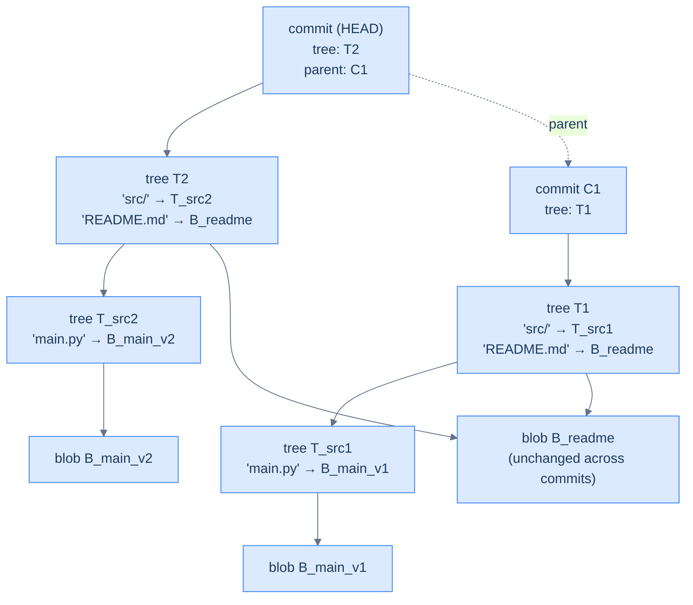

# 4. Git's Merkle DAG

## The Hook

When you run `git commit`, Git creates a few new files in `.git/objects/`. When you run `git log`, Git walks them. When you run `git merge`, Git walks them and creates more. Git's apparent magic — that you can branch, merge, rewrite history, and never lose anything — comes from one structural fact: Git's repository is a **Merkle DAG of immutable, content-addressed objects**.

The four object types — **blob**, **tree**, **commit**, **tag** — are nodes in the DAG. Each object is content-addressed: its file name is the SHA-1 of its contents. This means:

- **Identity = content.** Two objects with the same content are the same object. Git deduplicates automatically.
- **Tampering is detectable.** Change a file → its blob's hash changes → its containing tree's hash changes → the commit referencing that tree's hash changes → the parent commit's hash changes ... cascade.
- **Versions are free.** Past commits don't go anywhere. They live in `.git/objects/`, accessible by their hash.

This chapter is the tour: from `.git/objects/` to `git fsck`, from how `git diff` works to why `git push` is fast.

---

## Table of contents

1. [The four object types](#the-four-object-types)
2. [Content addressing and SHA-1](#content-addressing-and-sha-1)
3. [The DAG of commits](#the-dag-of-commits)
4. [Persistence and structural sharing](#persistence-and-structural-sharing)
5. [Smart diff via tree comparison](#smart-diff-via-tree-comparison)
6. [Pack files: compression at scale](#pack-files-compression-at-scale)
7. [Edge cases and pitfalls](#edge-cases-and-pitfalls)
8. [Cross-links](#cross-links)
9. [Final takeaway](#final-takeaway)

***

# The four object types

- **Blob.** A file's contents. No filename, no path — just bytes.
- **Tree.** A directory listing. Each entry: (mode, name, hash of either a blob or another tree). Recursive: a tree contains trees, just like a filesystem directory contains directories.
- **Commit.** A snapshot. Contains: hash of root tree, hash(es) of parent commits (zero for initial commit, two for merge commits), author, committer, message.
- **Tag.** An annotated label pointing at a commit, with its own message and author.



<p align="center"><strong>Two consecutive Git commits. The README hasn't changed, so both trees point to the same blob. Persistence and structural sharing in one diagram.</strong></p>

***

# Content addressing and SHA-1

Each object is stored at `.git/objects/<first-2-chars>/<remaining-38-chars>` where the 40-character hex string is the SHA-1 of:

```
<type> <length>\0<content>
```

To create an object, Git computes the hash, then writes the zlib-compressed object to the path derived from the hash. To read, the reverse.

SHA-1 has been deprecated cryptographically (collisions were demonstrated in 2017). Git is in transition to SHA-256 (`git init --object-format=sha256`) but most repositories still use SHA-1. The cryptographic weakness is rarely exploitable in practice — generating a Git collision still costs millions of dollars in compute.

***

# The DAG of commits

The "history" of a Git repository is the **commit graph** — a DAG of commits linked by parent pointers. A linear history is a chain. A merge commit has two parents. An octopus merge has more.

```
        A — B — C — D (main)
             \   /
              E (feature)
```

`A`, `B`, `C`, `E` are normal commits. `D` is a merge commit with parents `C` and `E`. `git log` walks this DAG; `git merge` creates new commits that join two branches.

Operations on the DAG:

- **`git log`** — DFS or BFS from HEAD, ordering by author/committer date.
- **`git diff A B`** — recursively compare A's tree against B's tree, descend into differing subtrees.
- **`git merge A B`** — find the lowest common ancestor of A and B (LCA on the DAG), three-way-merge the trees.
- **`git rebase`** — replay commits on a different parent (creating new commits with new hashes).
- **`git blame`** — for each line of a file, find the most recent commit that introduced or changed it (a depth-first walk back through the parent chain).

***

# Persistence and structural sharing

Git is the most-deployed [persistent data structure](/cortex/data-structures-and-algorithms/probabilistic-and-advanced-persistent-data-structures) on the planet. Every commit is *immutable*; modifications create new objects sharing the unchanged ones.

Editing one file in a 100,000-file repository creates:

- 1 new blob (the modified file).
- A handful of new trees (the modified path back to the root).
- 1 new commit.

The other 99,999 files' blobs are unchanged — they're shared with the previous commit's trees.

This is the same path-copying technique covered in the [Persistent Data Structures chapter](/cortex/data-structures-and-algorithms/probabilistic-and-advanced-persistent-data-structures). Git applied it to a filesystem.

***

# Smart diff via tree comparison

`git diff A B` is conceptually:

```pseudocode
function diff_trees(treeA, treeB):
    if treeA = treeB: return  # same hash → identical content, skip
    for each entry name common to A and B:
        if A[name].hash = B[name].hash: continue  # same hash → unchanged
        if both are blobs: emit text diff
        if both are trees: recurse
        else: emit add/remove
    for each entry only in A: emit removal
    for each entry only in B: emit addition
```

The early-exit "same hash → identical" is the optimisation that makes `git diff` fast even on huge trees. Subdirectories that haven't changed are short-circuited at the hash comparison; you don't have to descend.

***

# Pack files: compression at scale

Storing every object as a separate file costs filesystem-block overhead per object. A repository with millions of objects (Linux kernel: ~6M objects) would be inefficient.

Git's solution: **pack files**. After the loose-object directory grows, `git gc` (or `git push`) compacts objects into pack files: a single binary file containing many objects, plus an index file for quick lookup. Within a pack file, similar objects (e.g., consecutive versions of the same file) are stored as **deltas** — one full version plus a compressed difference for each successor.

The delta encoding inside a pack is the same idea as a diff — store one base, encode the others as edits. Combined with zlib compression, pack files reduce repository size by 5-10× compared to loose objects.

***

# Edge cases and pitfalls

- **Commit hash collisions.** SHA-1 collisions are demonstrated; Git in 2017 added the SHAttered detection logic. Practically, you won't see a collision in real-world use.
- **Garbage collection.** Objects unreachable from any branch or tag are eligible for collection by `git gc --prune`. The default keeps them for 14 days for safety.
- **Submodules** are pointers to other repositories — they store the *commit hash* of the submodule, not the contents. Cloning recursively follows the pointers.
- **`.git/info/exclude` and `.gitignore`** affect what's *staged*, not what's in commits. Once committed, files are in the DAG; removing them later requires `git filter-branch` or `git filter-repo`.
- **Force-push rewrites history.** `git push --force` replaces the remote's branch pointer with yours; old commits become unreachable, eligible for GC. Lost work, *not* lost data — until GC runs.
- **`git reflog` is a safety net.** Local operations leave breadcrumbs in `.git/logs/HEAD`; recovery is often possible even after dramatic mistakes.

***

# Cross-links

- **Prerequisites:** [Persistent Data Structures](/cortex/data-structures-and-algorithms/probabilistic-and-advanced-persistent-data-structures), [Distributed Data Structures (Teaser)](/cortex/data-structures-and-algorithms/concurrency-and-systems-distributed-data-structures-teaser) (Merkle trees).
- **Source reference:** [Pro Git book](https://git-scm.com/book), Chapter 10 ("Git Internals"); the Git source at [github.com/git/git](https://github.com/git/git).

***

# Final takeaway

Git is the canonical Merkle DAG. Three patterns to internalise:

1. **Content addressing.** Identity = SHA-1 of contents. Deduplication and tamper detection in one rule.
2. **Persistence via path copying.** Editing one file creates a few new tree objects; the rest of the repository is structurally shared with previous commits.
3. **Every Git operation is a graph traversal.** `log`, `diff`, `merge`, `blame` — all walk the DAG. Once you've internalised the structure, the commands stop being magic and start being algorithms.
