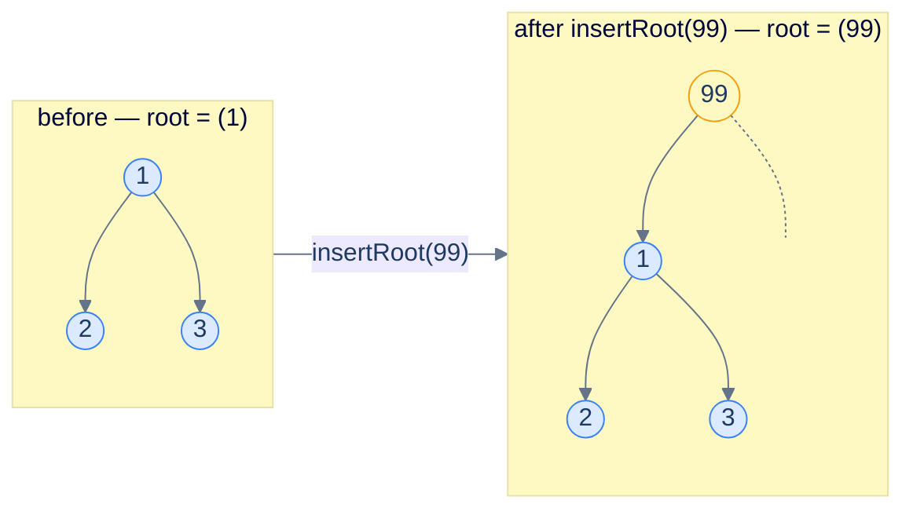
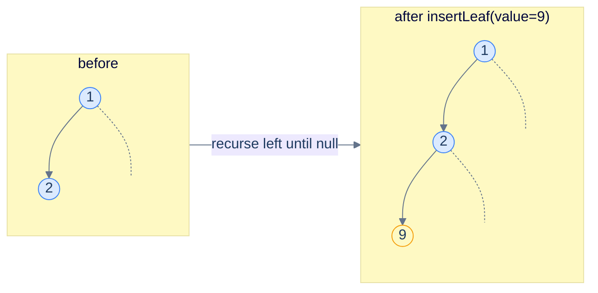
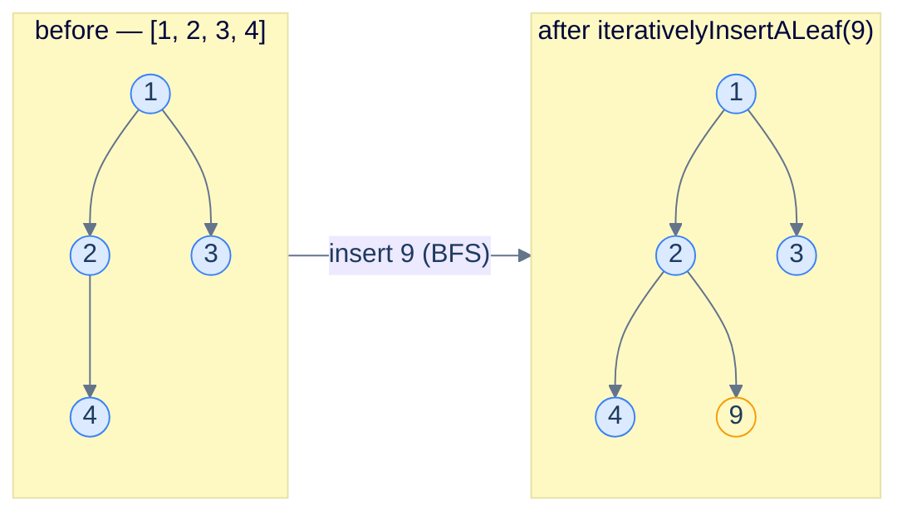
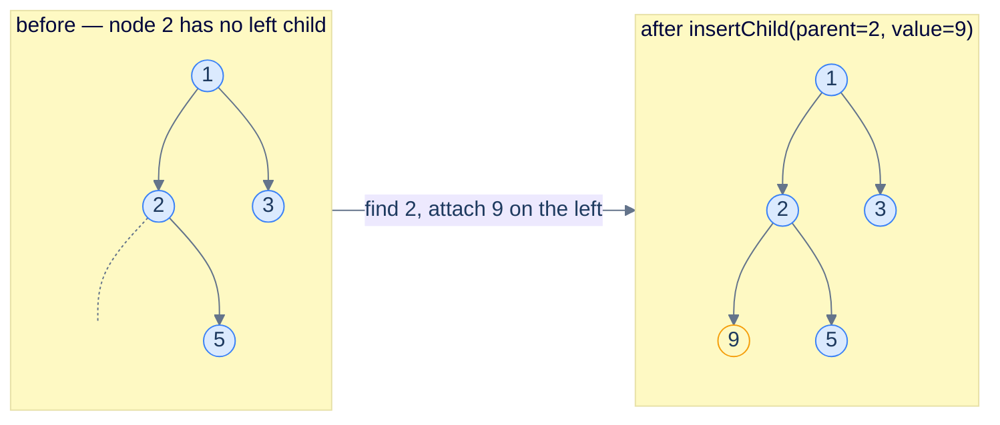
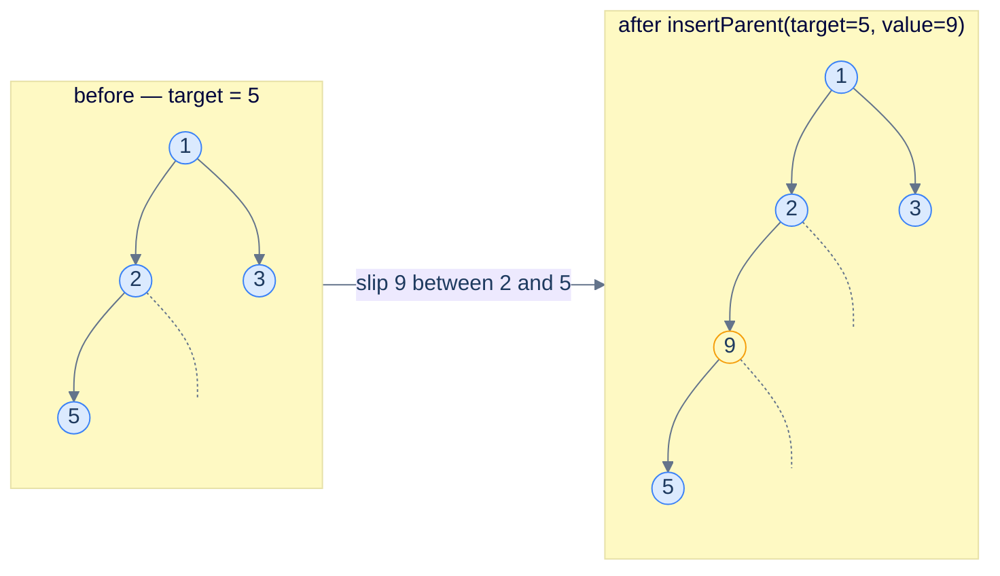

# 7. Insertion in Binary Trees

## The Hook

Trees in real software are *living* — they grow, they shrink, they get reshaped. The DOM gets new elements when a click handler fires. A parser appends a new clause as more tokens stream in. A BST indexes a new row inserted into a database. A game-tree expands as the engine looks one ply deeper. Every tree algorithm sooner or later needs an answer to: **how do I add a new node to an existing tree?**

For a *binary search tree*, the answer is dictated by the BST invariant — there's exactly one place every new value can legally go, and you find it by walking the tree. We'll see that algorithm in the next chapter. But a **plain binary tree** has no such invariant. A new node can land *anywhere*: as a new root, as a leaf attached to some interior node, as a child slipped in next to an existing one, or even as a new *parent* wedged between an existing node and its current parent. This lesson covers all four flavours.

The four insertion variants share a structure but differ in their precise mechanics. **Inserting at the root** is the easiest — no traversal, just allocate and re-link. **Inserting a leaf** is the next easiest — do any traversal, attach the new node to the first available `null` slot. **Inserting a child** of a *named* node requires a *search*: find the right place, then attach. **Inserting a parent** is the trickiest — you must find the affected node *and* the affected node's *parent*, so you can re-route the parent's pointer through the new node.

Each variant in this lesson appears in real codebases: insert-at-root for top-down rebuilds, insert-a-leaf for breadth-first expansion (BFS-based tree builders), insert-a-child for ad-hoc tree mutation (browser DOM `appendChild`), insert-a-parent for tree-rewriting passes in compilers (introducing wrapper nodes). All four implementations land in Python and Java, with mermaid diagrams showing exactly which pointers change.

---

## Table of contents

- [7. Insertion in Binary Trees](#7-insertion-in-binary-trees)
  - [The Hook](#the-hook)
  - [Table of contents](#table-of-contents)
- [Insert at the root](#insert-at-the-root)
    - [Implementation](#implementation)
    - [Complexity](#complexity)
- [Insert a leaf — recursive](#insert-a-leaf--recursive)
    - [Implementation](#implementation-1)
    - [Complexity](#complexity-1)
- [Insert a leaf — iterative (level-order)](#insert-a-leaf--iterative-level-order)
    - [Implementation](#implementation-2)
    - [Complexity](#complexity-2)
- [Insert a child of a named node](#insert-a-child-of-a-named-node)
    - [Implementation](#implementation-3)
    - [Complexity](#complexity-3)
- [Insert a parent above a named node](#insert-a-parent-above-a-named-node)
    - [Implementation](#implementation-4)
    - [Complexity](#complexity-4)

***

# Insert at the root

The simplest case: take the existing tree and shove a new node *above* it. The old root becomes a child of the new root. No traversal, no searching — pure pointer surgery in O(1).

Two sub-cases:

1. **Tree is empty** (`root == null`) → the new node *is* the new tree.
2. **Tree is non-empty** → create a new node, link the existing tree as one of its children (left, by convention), return it.



<p align="center"><strong>Insert at root — the new node sits on top, the old tree hangs off as the left subtree (right is empty by convention). Two pointer assignments, no traversal.</strong></p>

> **Algorithm**
>
> -   **Step 1:** Create `newRoot = TreeNode(value)`.
> -   **Step 2:** If the tree is non-empty, set `newRoot.left = oldRoot` (or `newRoot.right`, your call).
> -   **Step 3:** Return `newRoot`.

<details>
<summary><h2>Solution &amp; Analysis</h2></summary>

### Implementation

```python run
from typing import Optional
from collections import deque


class TreeNode:
    def __init__(self, val=0, left=None, right=None):
        self.val = val
        self.left = left
        self.right = right


def from_level_order(values):
    """Build tree from list like [1, 2, 3, None, 4]. None means missing child."""
    if not values:
        return None
    root = TreeNode(values[0])
    queue = [root]
    i = 1
    while queue and i < len(values):
        node = queue.pop(0)
        if i < len(values) and values[i] is not None:
            node.left = TreeNode(values[i])
            queue.append(node.left)
        i += 1
        if i < len(values) and values[i] is not None:
            node.right = TreeNode(values[i])
            queue.append(node.right)
        i += 1
    return root


def to_level_order(root):
    """Serialize tree to level-order list with None for missing children."""
    if not root:
        return []
    result = []
    queue = deque([root])
    while queue:
        node = queue.popleft()
        if node:
            result.append(node.val)
            queue.append(node.left)
            queue.append(node.right)
        else:
            result.append(None)
    while result and result[-1] is None:
        result.pop()
    return result


class Solution:
    def insert_root(
        self, root: Optional[TreeNode], data: int
    ) -> Optional[TreeNode]:

        # Create a new node with the given data value
        new_root = TreeNode(data)

        # Set the current root as the left child of the new node
        new_root.left = root

        # Return the new root
        return new_root


# Examples from the problem statement
print(to_level_order(Solution().insert_root(from_level_order([1, 2, 3, 4, None, None, 7, 9]), 5)))   # [5, 1, None, 2, 3, 4, None, None, 7, 9]
print(to_level_order(Solution().insert_root(from_level_order([1, 8, 4, None, 6]), 10)))               # [10, 1, None, 8, 4, None, 6]

# Edge cases
print(to_level_order(Solution().insert_root(None, 1)))                                                # [1]
print(to_level_order(Solution().insert_root(from_level_order([1]), 2)))                               # [2, 1]
print(to_level_order(Solution().insert_root(from_level_order([1, None, 2, None, 3]), 0)))             # [0, 1, None, None, 2, None, 3]
print(to_level_order(Solution().insert_root(from_level_order([5, 5, 5]), 5)))                         # [5, 5, None, 5, 5]
```

```java run
import java.util.*;

public class Main {
    static class TreeNode {
        int val;
        TreeNode left;
        TreeNode right;
        TreeNode() {}
        TreeNode(int val) { this.val = val; }
    }

    static TreeNode fromLevelOrder(Integer... values) {
        if (values.length == 0 || values[0] == null) return null;
        TreeNode root = new TreeNode(values[0]);
        java.util.Deque<TreeNode> queue = new java.util.ArrayDeque<>();
        queue.add(root);
        int i = 1;
        while (!queue.isEmpty() && i < values.length) {
            TreeNode node = queue.poll();
            if (i < values.length && values[i] != null) {
                node.left = new TreeNode(values[i]);
                queue.add(node.left);
            }
            i++;
            if (i < values.length && values[i] != null) {
                node.right = new TreeNode(values[i]);
                queue.add(node.right);
            }
            i++;
        }
        return root;
    }

    static List<Integer> toLevelOrder(TreeNode root) {
        List<Integer> result = new ArrayList<>();
        if (root == null) return result;
        Deque<TreeNode> queue = new LinkedList<>();
        queue.add(root);
        while (!queue.isEmpty()) {
            TreeNode node = queue.poll();
            if (node != null) {
                result.add(node.val);
                queue.add(node.left);
                queue.add(node.right);
            } else {
                result.add(null);
            }
        }
        while (!result.isEmpty() && result.get(result.size() - 1) == null) {
            result.remove(result.size() - 1);
        }
        return result;
    }

    static class Solution {
        public TreeNode insertRoot(TreeNode root, int data) {

            // Create a new node with the given data value
            TreeNode newRoot = new TreeNode(data);

            // Set the current root as the left child of the new node
            newRoot.left = root;

            // Return the new root
            return newRoot;
        }
    }

    public static void main(String[] args) {
        // Examples from the problem statement
        System.out.println(toLevelOrder(new Solution().insertRoot(fromLevelOrder(1, 2, 3, 4, null, null, 7, 9), 5)));   // [5, 1, null, 2, 3, 4, null, null, 7, 9]
        System.out.println(toLevelOrder(new Solution().insertRoot(fromLevelOrder(1, 8, 4, null, 6), 10)));               // [10, 1, null, 8, 4, null, 6]

        // Edge cases
        System.out.println(toLevelOrder(new Solution().insertRoot(null, 1)));                                            // [1]
        System.out.println(toLevelOrder(new Solution().insertRoot(fromLevelOrder(1), 2)));                               // [2, 1]
        System.out.println(toLevelOrder(new Solution().insertRoot(fromLevelOrder(1, null, 2, null, 3), 0)));             // [0, 1, null, null, 2, null, 3]
        System.out.println(toLevelOrder(new Solution().insertRoot(fromLevelOrder(5, 5, 5), 5)));                         // [5, 5, null, 5, 5]
    }
}
```

### Complexity

> **Time:** O(1) — one allocation, two assignments. **Space:** O(1) — one new node.

</details>

***

# Insert a leaf — recursive

If the application doesn't care *where* the new node lands as long as it's a leaf, the easiest option is to walk the tree until you find a `null` child slot, then attach there. The recursive version walks left-first; the iterative version (next section) walks level-by-level.

<details>
<summary><h2>Algorithm — recursive</h2></summary>


> **Algorithm**
>
> -   **recursivelyInsertALeaf(root, data):**
>     -   If `root` is `null`, return a new `TreeNode(data)` — it becomes the root.
>     -   Else if `root.left` is `null`, set `root.left = TreeNode(data)`.
>     -   Else if `root.right` is `null`, set `root.right = TreeNode(data)`.
>     -   Else (both children present) recurse into the left subtree: `recursivelyInsertALeaf(root.left, data)`.
>     -   Return `root`.

At each node the policy is "fill a missing child here if there is one — left first, then right — otherwise descend left". This is the simplest correct policy. It still leans left when it has to descend, so calling it repeatedly produces a *left-leaning* tree, which is fine when you don't care about balance — and is one of the reasons applications that *do* care use BSTs / balanced trees instead.



<p align="center"><strong>Recursive leaf insertion — descends left until it hits a <code>null</code>, then attaches the new node. The result accumulates as a left chain if you keep inserting.</strong></p>

</details>
<details>
<summary><h2>Solution &amp; Analysis</h2></summary>

### Implementation

```python run
from typing import Optional
from collections import deque


class TreeNode:
    def __init__(self, val=0, left=None, right=None):
        self.val = val
        self.left = left
        self.right = right


def from_level_order(values):
    """Build tree from list like [1, 2, 3, None, 4]. None means missing child."""
    if not values:
        return None
    root = TreeNode(values[0])
    queue = [root]
    i = 1
    while queue and i < len(values):
        node = queue.pop(0)
        if i < len(values) and values[i] is not None:
            node.left = TreeNode(values[i])
            queue.append(node.left)
        i += 1
        if i < len(values) and values[i] is not None:
            node.right = TreeNode(values[i])
            queue.append(node.right)
        i += 1
    return root


def to_level_order(root):
    """Serialize tree to level-order list with None for missing children."""
    if not root:
        return []
    result = []
    queue = deque([root])
    while queue:
        node = queue.popleft()
        if node:
            result.append(node.val)
            queue.append(node.left)
            queue.append(node.right)
        else:
            result.append(None)
    while result and result[-1] is None:
        result.pop()
    return result


class Solution:
    def recursively_insert_a_leaf(
        self, root: Optional[TreeNode], data: int
    ) -> Optional[TreeNode]:

        # If the tree is empty, create a new node and return it
        # as the root
        if root is None:
            return TreeNode(data)

        # Recursively insert into the left subtree
        if root.left is None:
            root.left = TreeNode(data)

        # Recursively insert into the right subtree
        elif root.right is None:
            root.right = TreeNode(data)

        # If both left and right subtrees are not None,
        # recursively try inserting into the left subtree
        else:
            self.recursively_insert_a_leaf(root.left, data)

        return root


# Examples from the problem statement
print(to_level_order(Solution().recursively_insert_a_leaf(from_level_order([1, 2, 3, 4, None, None, 7, 9]), 5)))  # [1, 2, 3, 4, 5, None, 7, 9]
print(to_level_order(Solution().recursively_insert_a_leaf(from_level_order([1, 8, 4, None, 6]), 10)))              # [1, 8, 4, 10, 6]

# Edge cases
print(to_level_order(Solution().recursively_insert_a_leaf(None, 1)))                                               # [1]
print(to_level_order(Solution().recursively_insert_a_leaf(from_level_order([1]), 2)))                              # [1, 2]
print(to_level_order(Solution().recursively_insert_a_leaf(from_level_order([1, 2]), 3)))                           # [1, 2, 3]
print(to_level_order(Solution().recursively_insert_a_leaf(from_level_order([1, 2, 3, 4, 5, 6, 7]), 8)))           # [1, 2, 3, 4, 5, 6, 7, 8]
print(to_level_order(Solution().recursively_insert_a_leaf(from_level_order([1, None, 2, None, 3]), 4)))            # [1, 4, 2, None, None, None, 3]
```

```java run
import java.util.*;

public class Main {
    static class TreeNode {
        int val;
        TreeNode left;
        TreeNode right;
        TreeNode() {}
        TreeNode(int val) { this.val = val; }
    }

    static TreeNode fromLevelOrder(Integer... values) {
        if (values.length == 0 || values[0] == null) return null;
        TreeNode root = new TreeNode(values[0]);
        java.util.Deque<TreeNode> queue = new java.util.ArrayDeque<>();
        queue.add(root);
        int i = 1;
        while (!queue.isEmpty() && i < values.length) {
            TreeNode node = queue.poll();
            if (i < values.length && values[i] != null) {
                node.left = new TreeNode(values[i]);
                queue.add(node.left);
            }
            i++;
            if (i < values.length && values[i] != null) {
                node.right = new TreeNode(values[i]);
                queue.add(node.right);
            }
            i++;
        }
        return root;
    }

    static List<Integer> toLevelOrder(TreeNode root) {
        List<Integer> result = new ArrayList<>();
        if (root == null) return result;
        Deque<TreeNode> queue = new LinkedList<>();
        queue.add(root);
        while (!queue.isEmpty()) {
            TreeNode node = queue.poll();
            if (node != null) {
                result.add(node.val);
                queue.add(node.left);
                queue.add(node.right);
            } else {
                result.add(null);
            }
        }
        while (!result.isEmpty() && result.get(result.size() - 1) == null) {
            result.remove(result.size() - 1);
        }
        return result;
    }

    static class Solution {
        public TreeNode recursivelyInsertALeaf(TreeNode root, int data) {

            // If the tree is empty, create a new node and return it
            // as the root
            if (root == null) {
                return new TreeNode(data);
            }

            // Recursively insert into the left subtree
            if (root.left == null) {
                root.left = new TreeNode(data);
            }

            // Recursively insert into the right subtree
            else if (root.right == null) {
                root.right = new TreeNode(data);
            }

            // If both left and right subtrees are not null,
            // recursively try inserting into the left subtree
            else {
                recursivelyInsertALeaf(root.left, data);
            }

            return root;
        }
    }

    public static void main(String[] args) {
        // Examples from the problem statement
        System.out.println(toLevelOrder(new Solution().recursivelyInsertALeaf(fromLevelOrder(1, 2, 3, 4, null, null, 7, 9), 5)));  // [1, 2, 3, 4, 5, null, 7, 9]
        System.out.println(toLevelOrder(new Solution().recursivelyInsertALeaf(fromLevelOrder(1, 8, 4, null, 6), 10)));              // [1, 8, 4, 10, 6]

        // Edge cases
        System.out.println(toLevelOrder(new Solution().recursivelyInsertALeaf(null, 1)));                                           // [1]
        System.out.println(toLevelOrder(new Solution().recursivelyInsertALeaf(fromLevelOrder(1), 2)));                              // [1, 2]
        System.out.println(toLevelOrder(new Solution().recursivelyInsertALeaf(fromLevelOrder(1, 2), 3)));                           // [1, 2, 3]
        System.out.println(toLevelOrder(new Solution().recursivelyInsertALeaf(fromLevelOrder(1, 2, 3, 4, 5, 6, 7), 8)));           // [1, 2, 3, 4, 5, 6, 7, 8]
        System.out.println(toLevelOrder(new Solution().recursivelyInsertALeaf(fromLevelOrder(1, null, 2, null, 3), 4)));            // [1, 4, 2, null, null, null, 3]
    }
}
```

### Complexity

> **Time:** O(h) where `h` is the path the recursion takes (depth of the leftmost null). **Space:** O(h) for the recursion stack.

</details>

***

# Insert a leaf — iterative (level-order)

A nicer policy when you want to keep the tree *roughly balanced* by default: do a level-order (BFS) traversal and insert at the *first* `null` slot you encounter. This produces a *complete* binary tree as you insert — exactly what a binary heap requires.



<p align="center"><strong>Iterative leaf insertion using BFS — the queue marches level by level (visit 1, then 2), finds the first empty slot (node 2's right), and attaches the new node 9 there. Repeated insertions keep the tree complete.</strong></p>

> **Algorithm**
>
> -   **Step 1:** If `root` is `null`, return `TreeNode(value)`.
> -   **Step 2:** Initialise a queue containing `root`. Loop:
>     -   Pop front node `n`.
>     -   If `n.left`  is `null` → set `n.left  = TreeNode(value)`, return root.
>     -   Else enqueue `n.left`.
>     -   If `n.right` is `null` → set `n.right = TreeNode(value)`, return root.
>     -   Else enqueue `n.right`.

<details>
<summary><h2>Solution &amp; Analysis</h2></summary>

### Implementation

```python run viz=binary-tree viz-root=tree
from typing import Optional
from queue import Queue
from collections import deque


class TreeNode:
    def __init__(self, val=0, left=None, right=None):
        self.val = val
        self.left = left
        self.right = right


def from_level_order(values):
    """Build tree from list like [1, 2, 3, None, 4]. None means missing child."""
    if not values:
        return None
    root = TreeNode(values[0])
    queue = [root]
    i = 1
    while queue and i < len(values):
        node = queue.pop(0)
        if i < len(values) and values[i] is not None:
            node.left = TreeNode(values[i])
            queue.append(node.left)
        i += 1
        if i < len(values) and values[i] is not None:
            node.right = TreeNode(values[i])
            queue.append(node.right)
        i += 1
    return root


def to_level_order(root):
    """Serialize tree to level-order list with None for missing children."""
    if not root:
        return []
    result = []
    queue = deque([root])
    while queue:
        node = queue.popleft()
        if node:
            result.append(node.val)
            queue.append(node.left)
            queue.append(node.right)
        else:
            result.append(None)
    while result and result[-1] is None:
        result.pop()
    return result


class Solution:
    def iteratively_insert_a_leaf(
        self, root: Optional[TreeNode], data: int
    ) -> Optional[TreeNode]:

        # If the tree is empty, create a new node and return it
        if root is None:
            return TreeNode(data)

        # Use a queue to perform level-order traversal
        queue = Queue()
        queue.put(root)

        while not queue.empty():
            node = queue.get()

            # Check if the left child is null, if so, insert the new node
            # here
            if node.left is None:
                node.left = TreeNode(data)
                return root
            else:
                queue.put(node.left)

            # Check if the right child is null, if so, insert the new
            # node here
            if node.right is None:
                node.right = TreeNode(data)
                return root
            else:
                queue.put(node.right)

        return root


# A single worked example — the Visualise button traces exactly this run.
tree = from_level_order([1, 2, 3, 4])
print(to_level_order(Solution().iteratively_insert_a_leaf(tree, 9)))  # [1, 2, 3, 4, 9]
```

```java run
import java.util.*;

public class Main {
    static class TreeNode {
        int val;
        TreeNode left;
        TreeNode right;
        TreeNode() {}
        TreeNode(int val) { this.val = val; }
    }

    static TreeNode fromLevelOrder(Integer... values) {
        if (values.length == 0 || values[0] == null) return null;
        TreeNode root = new TreeNode(values[0]);
        java.util.Deque<TreeNode> queue = new java.util.ArrayDeque<>();
        queue.add(root);
        int i = 1;
        while (!queue.isEmpty() && i < values.length) {
            TreeNode node = queue.poll();
            if (i < values.length && values[i] != null) {
                node.left = new TreeNode(values[i]);
                queue.add(node.left);
            }
            i++;
            if (i < values.length && values[i] != null) {
                node.right = new TreeNode(values[i]);
                queue.add(node.right);
            }
            i++;
        }
        return root;
    }

    static List<Integer> toLevelOrder(TreeNode root) {
        List<Integer> result = new ArrayList<>();
        if (root == null) return result;
        Deque<TreeNode> queue = new LinkedList<>();
        queue.add(root);
        while (!queue.isEmpty()) {
            TreeNode node = queue.poll();
            if (node != null) {
                result.add(node.val);
                queue.add(node.left);
                queue.add(node.right);
            } else {
                result.add(null);
            }
        }
        while (!result.isEmpty() && result.get(result.size() - 1) == null) {
            result.remove(result.size() - 1);
        }
        return result;
    }

    static class Solution {
        public TreeNode iterativelyInsertALeaf(TreeNode root, int data) {

            // If the tree is empty, create a new node and return it
            if (root == null) {
                return new TreeNode(data);
            }

            // Use a queue to perform level-order traversal
            Queue<TreeNode> queue = new LinkedList<>();
            queue.add(root);

            while (!queue.isEmpty()) {
                TreeNode node = queue.poll();

                // Check if the left child is null, if so, insert the new
                // node here
                if (node.left == null) {
                    node.left = new TreeNode(data);
                    return root;
                } else {
                    queue.add(node.left);
                }

                // Check if the right child is null, if so, insert the new
                // node here
                if (node.right == null) {
                    node.right = new TreeNode(data);
                    return root;
                } else {
                    queue.add(node.right);
                }
            }

            return root;
        }
    }

    public static void main(String[] args) {
        // Examples from the problem statement
        System.out.println(toLevelOrder(new Solution().iterativelyInsertALeaf(fromLevelOrder(1, 2, 3, 4, null, null, 7, 9), 5)));  // [1, 2, 3, 4, 5, null, 7, 9]
        System.out.println(toLevelOrder(new Solution().iterativelyInsertALeaf(fromLevelOrder(1, 8, 4, null, 6), 10)));              // [1, 8, 4, 10, 6]

        // Edge cases
        System.out.println(toLevelOrder(new Solution().iterativelyInsertALeaf(null, 1)));                                           // [1]
        System.out.println(toLevelOrder(new Solution().iterativelyInsertALeaf(fromLevelOrder(1), 2)));                              // [1, 2]
        System.out.println(toLevelOrder(new Solution().iterativelyInsertALeaf(fromLevelOrder(1, 2), 3)));                           // [1, 2, 3]
        System.out.println(toLevelOrder(new Solution().iterativelyInsertALeaf(fromLevelOrder(1, 2, 3, 4, 5, 6, 7), 8)));           // [1, 2, 3, 4, 5, 6, 7, 8]
        System.out.println(toLevelOrder(new Solution().iterativelyInsertALeaf(fromLevelOrder(1, null, 2, null, 3), 4)));            // [1, 4, 2, null, null, null, 3]
    }
}
```


> **Note on the Rust implementation:** True BFS over a Rust `Option<Box<TreeNode>>` tree requires either `unsafe` (for raw-pointer queues) or `Rc<RefCell<...>>` (for shared mutable references). For teaching purposes we substitute a recursive variant that achieves the same result — pre-order rather than BFS, so the *ordering policy* differs slightly but the contract ("attach to the first available null slot") is preserved.

### Complexity

> **Time:** O(N) worst case (visit every node before finding a slot in a complete tree). **Space:** O(W) for the queue, where W is the maximum width.

</details>

***

# Insert a child of a named node

Given a *parent value* and a *new value*, find the parent in the tree and slip a new node in as its **left child**. Two design points:

1. **Where to attach** — the policy here is "**always left**": the new node becomes the parent's left child, and whatever the parent had as its left subtree gets re-hung underneath the new node. The insert always succeeds — there is no "both slots full" rejection.
2. **What if the parent isn't found** — return the tree unchanged (no-op).

The implementation is a straightforward DFS over the whole tree, re-linking when it finds the parent.



<p align="center"><strong>Insert as a child — locate the parent node first, then slip the new node in as its left child. The parent's previous left subtree is re-hung under the new node (here it was empty, so the new node ends up a leaf).</strong></p>

> **Algorithm**
>
> -   **insertChild(root, parent, data):**
>     -   If `root` is `null`, return `null` (empty subtree, nothing to do).
>     -   If `root.val == parent`:
>         -   Create `newNode = TreeNode(data)`.
>         -   Set `newNode.left = root.left` (re-hang the old left subtree).
>         -   Set `root.left = newNode`.
>         -   Return `root`.
>     -   Else recurse into both subtrees: `root.left = insertChild(root.left, …)`, `root.right = insertChild(root.right, …)`.
>     -   Return `root`.

<details>
<summary><h2>Solution &amp; Analysis</h2></summary>

### Implementation

```python run
from typing import Optional
from collections import deque


class TreeNode:
    def __init__(self, val=0, left=None, right=None):
        self.val = val
        self.left = left
        self.right = right


def from_level_order(values):
    """Build tree from list like [1, 2, 3, None, 4]. None means missing child."""
    if not values:
        return None
    root = TreeNode(values[0])
    queue = [root]
    i = 1
    while queue and i < len(values):
        node = queue.pop(0)
        if i < len(values) and values[i] is not None:
            node.left = TreeNode(values[i])
            queue.append(node.left)
        i += 1
        if i < len(values) and values[i] is not None:
            node.right = TreeNode(values[i])
            queue.append(node.right)
        i += 1
    return root


def to_level_order(root):
    """Serialize tree to level-order list with None for missing children."""
    if not root:
        return []
    result = []
    queue = deque([root])
    while queue:
        node = queue.popleft()
        if node:
            result.append(node.val)
            queue.append(node.left)
            queue.append(node.right)
        else:
            result.append(None)
    while result and result[-1] is None:
        result.pop()
    return result


class Solution:
    def insert_child(
        self, root: Optional[TreeNode], parent: int, data: int
    ) -> Optional[TreeNode]:

        # If the root is null, there's nothing to do, return null
        if not root:
            return root

        # Search for the parent node in the tree
        if root.val == parent:

            # If the parent is found, insert the new node as the left
            # child
            new_node = TreeNode(data)

            # Attach the existing left child to the new node
            new_node.left = root.left

            # Set the new node as the left child of the parent
            root.left = new_node

            # Return the root (no change to the root itself)
            return root

        # Recurse for the left and right subtrees
        root.left = self.insert_child(root.left, parent, data)
        root.right = self.insert_child(root.right, parent, data)

        # Return the root of the tree
        return root


# Examples from the problem statement
print(to_level_order(Solution().insert_child(from_level_order([1, 2, 3, 4, None, None, 7, 9]), 3, 5)))  # [1, 2, 3, 4, None, 5, 7, 9]
print(to_level_order(Solution().insert_child(from_level_order([1, 8, 4, None, 6]), 10, 20)))             # [1, 8, 4, None, 6]

# Edge cases
print(to_level_order(Solution().insert_child(None, 1, 5)))                                               # []
print(to_level_order(Solution().insert_child(from_level_order([1]), 1, 2)))                              # [1, 2]
print(to_level_order(Solution().insert_child(from_level_order([1, 2, 3]), 1, 9)))                        # [1, 9, 3, 2]
print(to_level_order(Solution().insert_child(from_level_order([1, 2, 3, 4, 5, 6, 7]), 5, 99)))          # [1, 2, 3, 4, 5, 6, 7, None, None, 99]
print(to_level_order(Solution().insert_child(from_level_order([1, 2, 3]), 99, 0)))                       # [1, 2, 3]
```

```java run
import java.util.*;

public class Main {
    static class TreeNode {
        int val;
        TreeNode left;
        TreeNode right;
        TreeNode() {}
        TreeNode(int val) { this.val = val; }
    }

    static TreeNode fromLevelOrder(Integer... values) {
        if (values.length == 0 || values[0] == null) return null;
        TreeNode root = new TreeNode(values[0]);
        java.util.Deque<TreeNode> queue = new java.util.ArrayDeque<>();
        queue.add(root);
        int i = 1;
        while (!queue.isEmpty() && i < values.length) {
            TreeNode node = queue.poll();
            if (i < values.length && values[i] != null) {
                node.left = new TreeNode(values[i]);
                queue.add(node.left);
            }
            i++;
            if (i < values.length && values[i] != null) {
                node.right = new TreeNode(values[i]);
                queue.add(node.right);
            }
            i++;
        }
        return root;
    }

    static List<Integer> toLevelOrder(TreeNode root) {
        List<Integer> result = new ArrayList<>();
        if (root == null) return result;
        Deque<TreeNode> queue = new LinkedList<>();
        queue.add(root);
        while (!queue.isEmpty()) {
            TreeNode node = queue.poll();
            if (node != null) {
                result.add(node.val);
                queue.add(node.left);
                queue.add(node.right);
            } else {
                result.add(null);
            }
        }
        while (!result.isEmpty() && result.get(result.size() - 1) == null) {
            result.remove(result.size() - 1);
        }
        return result;
    }

    static class Solution {
        public TreeNode insertChild(TreeNode root, int parent, int data) {

            // If the root is null, there's nothing to do, return null
            if (root == null) {
                return root;
            }

            // Search for the parent node in the tree
            if (root.val == parent) {

                // If the parent is found, insert the new node as the left
                // child
                TreeNode newNode = new TreeNode(data);

                // Attach the existing left child to the new node
                newNode.left = root.left;

                // Set the new node as the left child of the parent
                root.left = newNode;

                // Return the root (no change to the root itself)
                return root;
            }

            // Recurse for the left and right subtrees
            root.left = insertChild(root.left, parent, data);
            root.right = insertChild(root.right, parent, data);

            // Return the root of the tree
            return root;
        }
    }

    public static void main(String[] args) {
        // Examples from the problem statement
        System.out.println(toLevelOrder(new Solution().insertChild(fromLevelOrder(1, 2, 3, 4, null, null, 7, 9), 3, 5)));  // [1, 2, 3, 4, null, 5, 7, 9]
        System.out.println(toLevelOrder(new Solution().insertChild(fromLevelOrder(1, 8, 4, null, 6), 10, 20)));             // [1, 8, 4, null, 6]

        // Edge cases
        System.out.println(toLevelOrder(new Solution().insertChild(null, 1, 5)));                                           // []
        System.out.println(toLevelOrder(new Solution().insertChild(fromLevelOrder(1), 1, 2)));                              // [1, 2]
        System.out.println(toLevelOrder(new Solution().insertChild(fromLevelOrder(1, 2, 3), 1, 9)));                        // [1, 9, 3, 2]
        System.out.println(toLevelOrder(new Solution().insertChild(fromLevelOrder(1, 2, 3, 4, 5, 6, 7), 5, 99)));          // [1, 2, 3, 4, 5, 6, 7, null, null, 99]
        System.out.println(toLevelOrder(new Solution().insertChild(fromLevelOrder(1, 2, 3), 99, 0)));                       // [1, 2, 3]
    }
}
```

### Complexity

> **Time:** O(N) worst case — the parent might be the last node we visit. **Space:** O(h) for recursion.

</details>

***

# Insert a parent above a named node

The trickiest variant. Given a *target* value, slip a new node *between* the target and its current parent — making the new node the new child of the original parent and the new parent of the target.

There are two cases to handle separately:

1. **Target is the root** → no original parent to re-route. The new node becomes the new root, with the old root as its child. (Same shape as "insert at root".)
2. **Target is not the root** → find the target's *parent*, swap pointers.

The trick is that you need *both* the target *and* the target's parent — you can't re-route the parent's pointer if you don't have the parent. The clean way: at every node, *check its own children* for a value match. The node that owns the target as a child is exactly the parent, so it can do the re-link itself. One more detail — the new node must take over the *same side* the target was on: if the target was a left child, the target becomes the new node's **left** child; if it was a right child, the **right** child. That keeps the rest of the tree's shape intact.



<p align="center"><strong>Insert a parent — node 9 takes 5's old position as the left child of 2; 5 becomes 9's left child. Node 2's pointer is the one that gets re-routed; the recursion locates that re-route point.</strong></p>

> **Algorithm**
>
> -   **Step 1:** If `root` is `null`, return `null`.
> -   **Step 2:** If the root itself is the target (`root.val == child`), return a new node with `root` as its left child — it becomes the new tree root.
> -   **Step 3:** If `root.left` is the target, allocate a new wrapper node, set the wrapper's *left* child to the old `root.left`, point `root.left` at the wrapper, return `root`.
> -   **Step 4:** If `root.right` is the target, do the mirror: set the wrapper's *right* child to the old `root.right`, point `root.right` at the wrapper, return `root`.
> -   **Step 5:** Otherwise recurse into both subtrees and return `root`.

<details>
<summary><h2>Solution &amp; Analysis</h2></summary>

### Implementation

```python run
from typing import Optional
from collections import deque


class TreeNode:
    def __init__(self, val=0, left=None, right=None):
        self.val = val
        self.left = left
        self.right = right


def from_level_order(values):
    """Build tree from list like [1, 2, 3, None, 4]. None means missing child."""
    if not values:
        return None
    root = TreeNode(values[0])
    queue = [root]
    i = 1
    while queue and i < len(values):
        node = queue.pop(0)
        if i < len(values) and values[i] is not None:
            node.left = TreeNode(values[i])
            queue.append(node.left)
        i += 1
        if i < len(values) and values[i] is not None:
            node.right = TreeNode(values[i])
            queue.append(node.right)
        i += 1
    return root


def to_level_order(root):
    """Serialize tree to level-order list with None for missing children."""
    if not root:
        return []
    result = []
    queue = deque([root])
    while queue:
        node = queue.popleft()
        if node:
            result.append(node.val)
            queue.append(node.left)
            queue.append(node.right)
        else:
            result.append(None)
    while result and result[-1] is None:
        result.pop()
    return result


class Solution:
    def insert_parent(
        self, root: Optional[TreeNode], child: int, data: int
    ) -> Optional[TreeNode]:

        # If root is null, return null (base case)
        if root is None:
            return None

        # If root itself is the child, new node becomes the root
        if root.val == child:
            new_node = TreeNode(data)
            new_node.left = root
            return new_node

        # Check if the left child matches the child
        if root.left and root.left.val == child:
            new_node = TreeNode(data)

            # Set existing left child as new node's left child
            new_node.left = root.left

            # Update parent's left child to new node
            root.left = new_node
            return root

        # Check if the right child matches the child
        if root.right and root.right.val == child:
            new_node = TreeNode(data)

            # Set existing right child as new node's right child
            new_node.right = root.right

            # Update parent's right child to new node
            root.right = new_node
            return root

        # Recurse for the left and right subtrees
        root.left = self.insert_parent(root.left, child, data)
        root.right = self.insert_parent(root.right, child, data)

        # Return the root of the tree
        return root


# Examples from the problem statement
print(to_level_order(Solution().insert_parent(from_level_order([1, 2, 3, 4, None, None, 7, 9]), 7, 5)))   # [1, 2, 3, 4, None, None, 5, 9, None, None, 7]
print(to_level_order(Solution().insert_parent(from_level_order([1, 8, 4, None, 6]), 10, 20)))              # [1, 8, 4, None, 6]

# Edge cases
print(to_level_order(Solution().insert_parent(None, 1, 5)))                                                # []
print(to_level_order(Solution().insert_parent(from_level_order([1]), 1, 0)))                               # [0, 1]
print(to_level_order(Solution().insert_parent(from_level_order([1, 2, 3]), 2, 9)))                         # [1, 9, 3, 2]
print(to_level_order(Solution().insert_parent(from_level_order([1, 2, 3]), 3, 9)))                         # [1, 2, 9, None, None, None, 3]
print(to_level_order(Solution().insert_parent(from_level_order([1, 2, 3]), 99, 0)))                        # [1, 2, 3]
```

```java run
import java.util.*;

public class Main {
    static class TreeNode {
        int val;
        TreeNode left;
        TreeNode right;
        TreeNode() {}
        TreeNode(int val) { this.val = val; }
    }

    static TreeNode fromLevelOrder(Integer... values) {
        if (values.length == 0 || values[0] == null) return null;
        TreeNode root = new TreeNode(values[0]);
        java.util.Deque<TreeNode> queue = new java.util.ArrayDeque<>();
        queue.add(root);
        int i = 1;
        while (!queue.isEmpty() && i < values.length) {
            TreeNode node = queue.poll();
            if (i < values.length && values[i] != null) {
                node.left = new TreeNode(values[i]);
                queue.add(node.left);
            }
            i++;
            if (i < values.length && values[i] != null) {
                node.right = new TreeNode(values[i]);
                queue.add(node.right);
            }
            i++;
        }
        return root;
    }

    static List<Integer> toLevelOrder(TreeNode root) {
        List<Integer> result = new ArrayList<>();
        if (root == null) return result;
        Deque<TreeNode> queue = new LinkedList<>();
        queue.add(root);
        while (!queue.isEmpty()) {
            TreeNode node = queue.poll();
            if (node != null) {
                result.add(node.val);
                queue.add(node.left);
                queue.add(node.right);
            } else {
                result.add(null);
            }
        }
        while (!result.isEmpty() && result.get(result.size() - 1) == null) {
            result.remove(result.size() - 1);
        }
        return result;
    }

    static class Solution {
        public TreeNode insertParent(TreeNode root, int child, int data) {

            // If root is null, return null (base case)
            if (root == null) {
                return null;
            }

            // If root itself is the child, new node becomes the root
            if (root.val == child) {
                TreeNode newNode = new TreeNode(data);
                newNode.left = root;
                return newNode;
            }

            // Check if the left child matches the child
            if (root.left != null && root.left.val == child) {
                TreeNode newNode = new TreeNode(data);

                // Set existing left child as new node's left child
                newNode.left = root.left;

                // Update parent's left child to new node
                root.left = newNode;
                return root;
            }

            // Check if the right child matches the child
            if (root.right != null && root.right.val == child) {
                TreeNode newNode = new TreeNode(data);

                // Set existing right child as new node's right child
                newNode.right = root.right;

                // Update parent's right child to new node
                root.right = newNode;
                return root;
            }

            // Recurse for the left and right subtrees
            root.left = insertParent(root.left, child, data);
            root.right = insertParent(root.right, child, data);

            // Return the root of the tree
            return root;
        }
    }

    public static void main(String[] args) {
        // Examples from the problem statement
        System.out.println(toLevelOrder(new Solution().insertParent(fromLevelOrder(1, 2, 3, 4, null, null, 7, 9), 7, 5)));   // [1, 2, 3, 4, null, null, 5, 9, null, null, 7]
        System.out.println(toLevelOrder(new Solution().insertParent(fromLevelOrder(1, 8, 4, null, 6), 10, 20)));              // [1, 8, 4, null, 6]

        // Edge cases
        System.out.println(toLevelOrder(new Solution().insertParent(null, 1, 5)));                                            // []
        System.out.println(toLevelOrder(new Solution().insertParent(fromLevelOrder(1), 1, 0)));                               // [0, 1]
        System.out.println(toLevelOrder(new Solution().insertParent(fromLevelOrder(1, 2, 3), 2, 9)));                         // [1, 9, 3, 2]
        System.out.println(toLevelOrder(new Solution().insertParent(fromLevelOrder(1, 2, 3), 3, 9)));                         // [1, 2, 9, null, null, null, 3]
        System.out.println(toLevelOrder(new Solution().insertParent(fromLevelOrder(1, 2, 3), 99, 0)));                        // [1, 2, 3]
    }
}
```

### Complexity

> **Time:** O(N) — worst case the target is the last node visited. **Space:** O(h) for recursion.

</details>
<details>
<summary><h2>Final Takeaway</h2></summary>


Four insertion variants, four characteristic shapes — knowing which one to reach for is half the work in any tree-mutation interview. Three things to walk away with:

1. **Insertion is just *find + relink*.** Every variant breaks down into "locate the affected node" plus "swap a few pointers". The locating part is the tree walk you already learned; the relinking is two or three assignments. Don't overcomplicate it.
2. **Returning `node` from a recursive insert is the cleanest pattern.** The caller writes `node.left = insert(node.left, ...)`. The subroutine handles the "create new node" and "modify existing" cases uniformly. This pattern recurs across BST insertion, BST deletion, AVL rebalancing — internalise it now.
3. **Insert-a-parent is the canonical "rewrite" pass.** Compilers, optimisers, and tree-rewriting systems use exactly this shape: find a target, allocate a wrapper, splice it in. Once you're comfortable with it on a binary tree, the same pattern generalises to ASTs and IRs.

> *Coming up — with the basic CRUD operations done, the chapter pivots to <strong>traversal patterns</strong>. The next eleven lessons each codify a recurring problem-solving recipe — preorder stateless, preorder stateful, postorder stateless, postorder stateful, root-to-leaf, level-order, LCA, simultaneous traversal, and a final practice mix. Together they cover the vast majority of binary-tree interview problems you'll ever see.*

</details>
