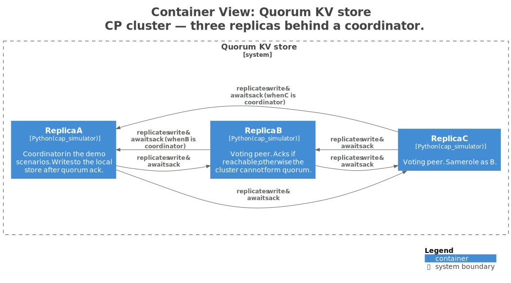

# 4. The CAP theorem and PACELC, honestly

## TL;DR
> CAP says: *during a network partition*, a distributed system can guarantee at most two of {Consistency, Availability, Partition-tolerance}. Since partitions are not optional in the real world, you actually choose between **C and A**. PACELC fixes CAP's biggest blind spot by adding: *Else, when there's no partition, you trade off **L**atency vs **C**onsistency*. We will *feel* the trade-off with a runnable simulator before we touch the math.

## 1. Motivation

In **2000**, Eric Brewer gave a keynote at PODC titled *Towards Robust Distributed Systems*. On slide 14 he stated what he called the "CAP conjecture": you cannot have all three of consistency, availability, and partition-tolerance simultaneously. In 2002, [Gilbert and Lynch proved it](https://users.ece.cmu.edu/~adrian/731-sp04/readings/GL-cap.pdf) (formally, for asynchronous networks).

For the next ten years, every blog post explaining CAP got it slightly wrong. The most common error: *"Pick two of three"*. This is **not what CAP says**. As Brewer himself wrote in [his 2012 retraction-and-clarification piece](https://www.infoq.com/articles/cap-twelve-years-later-how-the-rules-have-changed/), partitions are not a choice — they happen whether you want them or not. The real choice is *what your system does **during** a partition*.

Then in **2010**, Daniel Abadi at Yale published a [short paper](https://dbmsmusings.blogspot.com/2010/04/problems-with-cap-and-yahoos-little.html) pointing out that CAP only describes the system's behaviour during the rare event of a partition — but says nothing about its behaviour the rest of the time. The rest of the time, you trade *latency* against *consistency* — every replication mechanism, every quorum-vs-eventually-consistent choice, every async-vs-sync-replication knob. That trade-off is **PACELC**: *if a Partition, choose Availability or Consistency; **Else**, choose Latency or Consistency*.

The PACELC version is the one a senior engineer carries around. CAP is the version you find on whiteboards. We will teach the senior version.

## 2. Intuition (Analogy)

Imagine **two siblings sharing a single Google Doc**. They are usually at the same kitchen table but occasionally one of them takes a road trip to a cabin with no internet. Each of them types ideas into the doc.

Now consider three operating modes:

**Mode A — "Strict editor":** every keystroke either reaches the other sibling within 50 ms or **no keystroke is allowed at all**. The cabin sibling cannot type anything until they are back online. The doc never has conflicts. *Consistent and unavailable on the road.* This is **CP**.

**Mode B — "Permissive editor":** both siblings keep typing whether they can sync or not. When the cabin sibling returns, the doc has two divergent versions and somebody — Google's CRDT engine, or the sibling — has to merge them. Neither sibling was ever blocked. *Available, but the doc is briefly inconsistent.* This is **AP**.

**Mode C — "Pretend the road trip will not happen":** "Of course we are always online! Why are you asking?" → cabin sibling types into a frozen window, comes back to find their changes lost, and never trusts the editor again. This is the *non-existent* option that bad architecture diagrams keep promising. **There is no third mode.**

Now extend the analogy. Even when *both siblings are at the kitchen table* — no road trip, no partition, *perfect* network — the editor still has a choice every keystroke:

> *"Do I send this keystroke to the other sibling and wait for their ACK before showing it on the screen? Or do I show it immediately and let the ACK arrive a few milliseconds later?"*

The first option is **slower but always consistent** (you see what they see). The second is **faster but briefly inconsistent** (your screen leads theirs). That is **PACELC's *Else*** — the choice you pay every day, not just during the rare cabin trip.

## 3. Formal Definition

### CAP, precisely

For an *asynchronous network model* (Gilbert & Lynch's setting):

| Letter | Property | Plain English |
|---|---|---|
| **C — Consistency** | Linearizability — every read sees the most recently committed write. | "If I write `x = 5` and then read `x`, I get `5`. Guaranteed. Across all replicas." |
| **A — Availability** | Every non-failing node returns a non-error response in finite time. | "Every healthy server answers every request, eventually." |
| **P — Partition tolerance** | The system continues to operate even when arbitrary messages between nodes are lost. | "When the network drops messages, the system does not just give up." |

**The theorem:** in any system that may experience a partition, you cannot guarantee both C and A simultaneously.

**The misunderstanding:** "Pick two of three." Wrong. *P is not a choice.* Networks partition. Every distributed system *must* be P. So the live choice is between:

- **CP**: refuse to answer (or answer with an error) when consistency cannot be guaranteed during a partition. *Sacrifices availability.*
- **AP**: keep answering on every partitioned side; accept that different nodes may temporarily disagree. *Sacrifices linearizable consistency.*

There is no third option. Saying "we are CA" is saying "we do not run on a network", which means you are running on a single machine and CAP does not apply. (Some single-machine systems are sold as "CA" for marketing reasons. Roll your eyes when you read this.)

### PACELC, precisely

Daniel Abadi's extension:

> *If there is a Partition (P), how does the system trade off **A**vailability vs **C**onsistency?*
> *Else, how does it trade off **L**atency vs **C**onsistency?*

A system gets a two-letter classification — one for each scenario:

| System | PACELC class | Meaning |
|---|---|---|
| Spanner, FoundationDB | **PC + EC** | Refuse during partition; prioritise consistency over latency normally. |
| MongoDB (default) | **PC + EC** | Same. |
| Cassandra, DynamoDB | **PA + EL** | Stay available during partition; prioritise low latency over strong consistency normally. |
| ZooKeeper, etcd | **PC + EC** | Used as the "boring, correct" coordinator everywhere. |
| MySQL with async replication | **PA + EL** | The async replica may fall behind, even with no partition. |
| MySQL with sync replication | **PC + EC** | Replicas always caught up; writes pay the cross-replica latency. |

Two stable engineering instincts emerge:

1. **PC + EC** systems are for *truth-of-record* data — money, identity, inventory, anything where the answer "I am not sure" is preferable to a wrong answer.
2. **PA + EL** systems are for *experience* data — likes, views, presence, search, anything where "stale by 30 seconds" is fine and "unavailable for 30 seconds" is a disaster.

Most real companies run **both kinds side by side**. We will see this directly in [Capstone 38 (news feed)](../7.capstones/38-news-feed.md) and [Capstone 44 (payments)](../7.capstones/44-payment-system.md).

## 4. Worked Example

Let's design two services and pick CAP/PACELC for each.

### Service 1 — Like-counting on social posts

- "Wrong by one like for 30 seconds": nobody dies.
- "Refuse to count likes during a partition": users complain, retention drops.

**Pick AP** during partition. **Pick L** (low latency) normally. → **PA + EL**.

Real-world: Cassandra. Twitter, Instagram, and Reddit all use Cassandra-class stores for this exact workload.

### Service 2 — Bank account balance

- "Wrong by $100 for 30 seconds": regulator visit; potential fraud.
- "Refuse the transfer for 30 seconds during a regional partition": annoying, but customers retry.

**Pick CP** during partition. **Pick C** (strong) normally. → **PC + EC**.

Real-world: Spanner. Stripe and most modern fintech run their ledger on a Spanner-class store.

### Service 3 — Mixed system (the realistic case)

A modern e-commerce site runs **both at once**:

- Product catalogue (read-heavy, "stale by 5 min is fine") → **PA + EL**
- Inventory counter ("can never sell what we don't have") → **PC + EC**
- Cart state (per-user, never multi-region contended) → **PC + EC**
- Recommendations (read-heavy, eventual is fine) → **PA + EL**
- Order placement (atomic, money involved) → **PC + EC**
- Reviews / ratings (eventual, never urgent) → **PA + EL**

The site is not a single CAP/PACELC class. It is a *portfolio* of stores, each chosen for its own workload.

> **Friction prompt — before reading on:**
> A messaging app needs to deliver messages between two users. The product manager says: "*messages should never appear out of order, and the app should always be available, and we have users in 50 countries.*" Which property must give? *(Hint: it is the one most users do not realise they will accept.)*

<details>
<summary><strong>Solution</strong></summary>

Strict global ordering of messages requires *consensus across regions for every message* — at minimum 100–250 ms of cross-region RTT per message. That kills both latency and per-region availability during a regional outage.

WhatsApp, Slack, and iMessage all give up **strict global ordering** in favour of *causal ordering* (messages within one conversation are ordered; messages across conversations may be reordered briefly). This is the [right amount of consistency](https://jepsen.io/consistency) for the actual user experience and lets the system stay AP during partitions.

The PM did not realise they were asking for the impossible. Your job was to translate.

</details>

## 5. Build It

The lesson ships with a full runnable simulator at [`examples/04-cap-pacelc-simulator/`](https://github.com/ani2fun/codefolio/tree/main/content/cortex/system-design/01-foundations/examples/04-cap-pacelc-simulator). It is a 3-node KV store with **injectable partitions** and **two pluggable consistency modes (CP / AP)**. The C4 Container view below — rendered from [`diagrams/cp-cluster.dsl`](https://github.com/ani2fun/codefolio/tree/main/content/cortex/system-design/01-foundations/diagrams/cp-cluster.dsl) via `make diagrams` — shows the topology the simulator implements:


<p align="center"><strong>C4 Container view — three replicas of the quorum KV store. Every arrow between replicas is a "replicate write & await ack" edge that gets blocked by an injected partition.</strong></p>

Run it locally:

```bash
git clone https://github.com/ani2fun/codefolio.git
cd codefolio/content/cortex/system-design/01-foundations/examples/04-cap-pacelc-simulator
just test                      # 8 tests, locks down the (mode × partition × op) matrix
just demo                      # 8 narrated scenarios — read the output line by line
```

A taste of the demo output:

```
=== Scenario 4 — AP mode, partition {A | B,C} — both sides keep writing ===
  ✓  write via A (lone)                                      acked_by=['A']
  ✓  write via B (with C)                                    acked_by=['B', 'C']
  ✓  read  x   via A                                         value=from_A_side
  ✓  read  x   via B                                         value=from_BC_side   ← divergence!
  AP keeps everyone writeable, but the cluster has *split-brain* until heal.

=== Scenario 5 — AP heal reconciles via last-writer-wins ===
  ✓  after heal — node A                                     value=from_BC_side (ts=3)
  ✓  after heal — node B                                     value=from_BC_side (ts=3)
  ✓  after heal — node C                                     value=from_BC_side (ts=3)
  After heal, all nodes converge on the *latest* timestamped write.
```

The core abstraction is a 200-line `Cluster` class. Inline:

```python run
# Pseudocode of the simulator's cluster — see the repo for the full version.
from enum import Enum

class Mode(Enum):
    CP = "CP"   # writes need a quorum; minority refuses on partition
    AP = "AP"   # both sides accept; reconcile via last-writer-wins on heal

def write(cluster, key, value, coordinator):
    # 1. Find peers we can still talk to (a partition drops some pairs).
    reachable = cluster.reachable_from(coordinator)
    majority  = len(cluster.nodes) // 2 + 1

    if cluster.mode is Mode.CP:
        if len(reachable) < majority:
            # Cannot guarantee durability — refuse rather than commit something
            # that might disagree with the majority side later.
            return "refused: no quorum"
        # Replicate to every reachable peer (≥ majority by definition here).
        for n in reachable:
            n.local_write(key, value, ts=cluster.next_clock())
        return f"committed (acked by {reachable})"

    # AP: write locally + opportunistically replicate to whoever is reachable.
    for n in reachable:
        n.local_write(key, value, ts=cluster.next_clock())
    return f"accepted locally (acked by {reachable})"
```

**Now break it.** Open `src/cap_simulator/demo.py` and add a 9th scenario:

> Start in AP mode. Write `x=1` via A. Partition {A | B,C}. Write `x=alice` via A and `x=bob` via B. Heal. *Predict* the value before reading it. Then run.

You will discover that **last-writer-wins silently lost one of the writes** — even though both writes returned success. That is the price of AP, made visible. In production, you would defend against it with vector clocks, CRDTs, or application-level conflict resolution. We will see CRDTs in [Capstone 11 — collaborative editor](../7.capstones/45-multiplayer-game-backend.md) (Google Docs / Figma).

## 6. Trade-offs & Complexity

| Property | CP (strong) | AP (eventual) |
|---|---|---|
| **Behaviour during partition** | Minority side rejects writes (and often reads) | Both sides accept reads and writes |
| **Behaviour after heal** | Nothing to reconcile (only one side wrote) | Reconciliation: LWW, vector clocks, or CRDTs |
| **Write latency (no partition)** | quorum-bound: ~max p99 of (n/2 + 1) replicas | local-bound: ~p99 of one disk write |
| **Read consistency** | Linearizable (with linearizable read enabled) | Eventually consistent; bounded staleness |
| **Operational complexity** | Lower — at most one truth | Higher — application must handle conflicts |
| **Use cases** | Money, inventory, identity, sequence numbers | Likes, views, presence, search, recommendations |
| **Examples** | Spanner, FoundationDB, etcd, ZooKeeper, CockroachDB | Cassandra, DynamoDB, Riak, Voldemort |

**The cost of CP, normally:** every write waits for a quorum. In a 3-node cluster across the same datacentre, that adds maybe 1 ms. Across regions (~50–250 ms RTT), it adds a *lot*. This is why globally-distributed strongly-consistent systems (Spanner) are expensive engineering — they need atomic clocks (TrueTime) to bound the cost.

**The cost of AP, after a partition:** the application must handle conflicts. "Last-writer-wins" is the simplest strategy and the easiest to lose data with. Vector clocks let the application *detect* a conflict and decide. CRDTs let the application *avoid* the conflict by design (counters, sets, registers with merge functions). All three are real engineering you have to invest in.

## 7. Edge Cases & Failure Modes

- **Believing CAP applies to single-datacentre systems.** Inside one datacentre, partitions are extremely rare. CAP *technically* still applies but in practice you tune for latency, not partitions. PACELC's "Else" tells the real story.
- **Calling a system "CA".** Either it is single-machine (CAP irrelevant), or it is lying about its partition behaviour (most common — the system silently fails closed during a partition and the docs do not say so).
- **Confusing eventual consistency with "any old answer".** Real eventual-consistency systems guarantee *bounded staleness* and *monotonic reads* if you ask for them. We will get into this in [Lesson 13 — Consistency models](../2.building-blocks/13-consistency-models.md). If a vendor says "eventually consistent" and cannot quote a staleness bound, walk away.
- **Forgetting that "linearizable" reads are an *option* in CP systems.** Many CP systems (etcd, Spanner) offer "stale read" or "follower read" knobs that trade some consistency for lower latency. Knowing they exist is what distinguishes a senior from a junior using the same database.
- **Designing for the partition that never happens.** If partitions in your network occur once a year for 30 seconds, designing the entire architecture around the rare partition is a bad investment. Design for the *common* case (no partition, low latency), but have a *plan* for partition (drain shedding, fail-closed, alerting).
- **Sync replication != CP.** A system that "synchronously replicates" but does not require a quorum of acks (just one) is *not* CP — a single failure can lose the write.
- **Two-phase commit is not magic.** 2PC blocks on the slowest participant and does not survive coordinator failure cleanly. Modern alternatives — Raft, Paxos, Spanner's Paxos+TrueTime, Calvin — are what production uses. We cover them in [Lesson 14](../2.building-blocks/14-consensus-paxos-and-raft.md).

## 8. Practice

> **Exercise 1 — Classify five systems.**
> For each, name its **PACELC** class and a one-sentence justification: PostgreSQL with sync streaming replication; Redis with Sentinel and async replication; DynamoDB with strongly-consistent reads enabled; etcd; Memcached.
>
> <details>
> <summary>Solution</summary>
>
> - **PostgreSQL sync streaming**: PC + EC. Sync ack delays the write; minority can be cut off if the primary fails over.
> - **Redis with Sentinel + async repl**: PA + EL. Async replica can lag; failover may lose the last few writes.
> - **DynamoDB with strongly-consistent reads**: PC + EC for the strong path (it really does refuse / fail over rather than serve stale on partition); PA + EL is the *default* read mode.
> - **etcd**: PC + EC. Raft-based; refuses minority writes; serves linearizable reads via leader.
> - **Memcached**: barely qualifies as a distributed store — there is no replication, so partition behaviour is "the cache is just gone for that shard". Pragmatically AP-flavoured.
>
> </details>

> **Exercise 2 — Add a 9th scenario to the simulator.**
> Edit `src/cap_simulator/demo.py` and add a scenario that demonstrates **lost writes under last-writer-wins**: in AP mode, partition the cluster, write a different value from each side, heal, and observe which write survived. Use the Lamport timestamps printed in the snapshot.
>
> Now: which write would survive if the *earlier* timestamp had been generated *after* the later one — for example because the two clocks drifted? *(Hint: this is exactly why production AP systems use vector clocks or CRDTs instead of plain LWW.)*

> **Exercise 3 — The PM conversation.**
> A product manager asks: *"Can we make this auth system globally available with sub-50 ms response time everywhere, with strong consistency on session tokens?"*
>
> Write a 3-paragraph response (in plain English, no jargon) explaining (a) why all three together are not possible, (b) which combination most auth systems actually pick (and why), and (c) what would have to be true for the PM's full ask to become possible.
>
> <details>
> <summary>Solution sketch</summary>
>
> All three together require global consensus on every write within ~50 ms — but cross-region RTT alone is 100–250 ms. Physics blocks the goal.
>
> Most auth systems pick **regional CP + global eventual sync**: sessions are strongly consistent within a region, eventually replicated to other regions for read. A user logging in from another continent gets directed back to their home region, or a new session is issued and the old one is invalidated lazily. AWS IAM, Google Identity, and Azure AD all do approximately this.
>
> The PM's full ask becomes possible only with (1) sub-50 ms cross-region RTT (does not exist), or (2) acceptance of stale tokens (loses strong consistency), or (3) per-region tokens that do not need to be globally agreed (changes the security model). Pick whichever the product can actually live with.
>
> </details>

## In the Wild

- **[Eric Brewer — CAP twelve years later](https://www.infoq.com/articles/cap-twelve-years-later-how-the-rules-have-changed/)** (2012) — the author of CAP corrects the most common misunderstanding of his own theorem. Required reading.

- **[Daniel Abadi — Problems with CAP, and Yahoo's little known NoSQL system](https://dbmsmusings.blogspot.com/2010/04/problems-with-cap-and-yahoos-little.html)** (2010) — the post that introduced PACELC and reframed the conversation.

- **[Kyle Kingsbury — Jepsen analysis archive](https://jepsen.io/analyses)** — the gold standard for actually measuring how each major distributed database behaves under partition. Pick any analysis (MongoDB, Cassandra, etcd, CockroachDB) and watch how a real expert *probes* the consistency claims.

- **[Google — Spanner: Google's Globally-Distributed Database](https://research.google/pubs/spanner-googles-globally-distributed-database/)** (2012) — the paper that introduced TrueTime and showed that *with* hardware support, you can get globally-distributed strong consistency at low cost. Read it after Lesson 14.

- **[Werner Vogels — Eventually Consistent](https://www.allthingsdistributed.com/2008/12/eventually_consistent.html)** (2008) — Amazon CTO's classic essay on what "eventual consistency" actually means and what the practical sub-models are (read-your-writes, monotonic reads, etc.).

---

**Next:** the *normal day* trade-off PACELC pointed at — **latency vs throughput** — and the two ridiculously simple equations (Little's Law and the USL) that explain why doubling servers does not double throughput. → [Lesson 5 — Latency, throughput, and the USL](./05-latency-throughput-usl.md)
