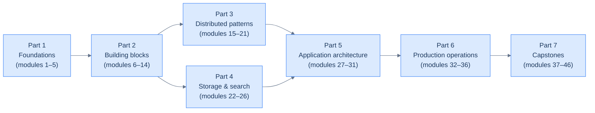

# 🏗️ System Design

> A serious, hands-on track for building production systems — written for curious beginners, not interview-cram readers.

This track teaches you to design and operate real software systems the way senior engineers do at serious technology companies. It is **not** an interview cheat sheet. By the time you finish, you will have built tiny working versions of load balancers, rate limiters, replicated stores, search indexes, payment flows, and chat backends — and you will be able to walk into an architecture review and contribute meaningfully.

## Who this is for

- **Undergraduate students** who can write a Python loop, an `if/else`, and a function — and want to know how Twitter, Netflix, Uber, and Stripe actually work under the hood.
- **High-school programmers** who are curious about distributed systems and tired of vague YouTube explainers.
- **Working engineers** who can build a CRUD app and want a structured path to senior-level systems thinking.

We assume **zero** prior systems knowledge. We do not assume you have ever heard of Kafka, Raft, CAP, or sharding. By the end of [Part 1](/cortex/system-design/foundations-index) you will have heard of all of them, and you will have *used* most of them.

## The four promises this track makes you

The four axes we measure ourselves against:

1. **Runnable.** Every architectural concept ships with code you can clone and run. `docker compose up`, click "Run", or a single `just test` — and the example works on your laptop.
2. **Quantitative.** No hand-waving. If we say "a memory access is fast and a network call is slow", you will see the actual numbers and an analogy that makes them stick.
3. **Visual.** Every non-trivial idea has at least one diagram, authored as code in the repo (Mermaid, D2, or Structurizr DSL — the three tools senior engineers actually use).
4. **Honest about trade-offs.** We never say "this is the right way". We say "if you want X, pick A; if you can tolerate Y, pick B; here are the numbers behind the trade-off."

If a lesson fails any of these four, it is not done.

## Curriculum at a glance

<strong>The dependency graph. Foundations first, then building blocks; storage and patterns are independent; capstones are last.</strong>

| Part | What you learn | Modules |
|---|---|---|
| **[1. Foundations](/cortex/system-design/foundations-index)** | The mental model: latency hierarchy, estimation, CAP/PACELC, Little's Law | 1–5 |
| **[2. Building blocks](/cortex/system-design/building-blocks-index)** | Networking, load balancing, caching, databases (RDBMS + NoSQL), replication, sharding, consistency, consensus | 6–14 |
| **[3. Distributed patterns](/cortex/system-design/distributed-patterns-index)** | Queues, pub/sub, idempotency, outbox + CDC, sagas, rate limiting, circuit breakers | 15–21 |
| **[4. Storage & search at scale](/cortex/system-design/storage-and-search-index)** | LSM vs B-trees, probabilistic data structures, time-series, search, object storage | 22–26 |
| **[5. Application architecture](/cortex/system-design/application-architecture-index)** | Monolith vs microservices, API design, service mesh, authn/authz, multi-tenancy | 27–31 |
| **[6. Production operations](/cortex/system-design/production-operations-index)** | Observability, deployment strategies, autoscaling, chaos engineering, postmortems | 32–36 |
| **[7. Capstones](/cortex/system-design/capstones-index)** | Design 10 famous systems end-to-end with C4 diagrams + working prototypes | 37–46 |

## How to use this section

- **Linear path:** start at [Part 1, module 1](/cortex/system-design/foundations-what-system-design-means) and walk through to the capstones. Each lesson takes 30–90 minutes including the lab.
- **Reference path:** if you already know the basics, jump to a specific lesson and use the inline links to back-fill missing context.
- **Capstone-first path:** if you learn best from concrete problems, skim Parts 1–2, then dive into a [capstone](/cortex/system-design/capstones-index) and follow links back to the building blocks you need.

## A note on the audience

We default to the voice of a kind, deeply experienced senior engineer explaining things to a curious 17-year-old over coffee. Concrete. Honest. Funny when it helps. Willing to say "this design is bad and here is why people still use it."

When something is genuinely hard, we say so. When something has been over-hyped (looking at you, "microservices fix everything"), we push back with evidence.

Welcome. Open [Part 1, module 1](/cortex/system-design/foundations-what-system-design-means) and let's go.
