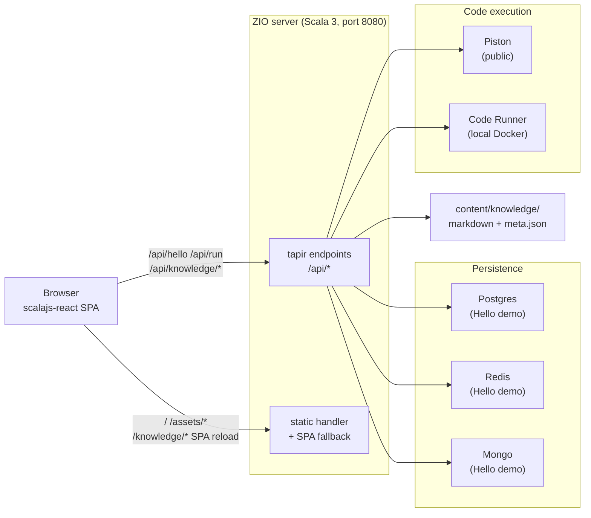

## What is this?

**Codefolio** is the engine behind `aniketkakde.com`. It's a single-binary Scala 3 application that serves:

1. A **portfolio site** — Hero, About, Experience, Projects, Certifications.
2. A **knowledge base** — long-form notes (the chapter you're reading lives here).
3. A **runnable code playground** — `python run` and friends in chapters actually execute against a sandboxed runner.
4. A **demo page** at `/demo` that exercises Postgres, Redis, and MongoDB in a single round-trip — kept around as a smoke test of the persistence layer.

The whole thing is one process listening on `:8080`. In production it ships as a single Docker image. In development it's two processes (Vite on `:5173` for the SPA, ZIO server on `:8080` for the API), with Vite proxying `/api/*` to the server.

## The 30-second tour

Every box is something you can grep for in the repo:

- The **SPA** is `client/src/main/scala/codefolio/client/`. Entry point: `Main.scala`, then `Router.scala`.
- The **server** is `server/src/main/scala/codefolio/server/`. Entry point: `Main.scala`, then `HttpApp.scala`.
- The **shared** OpenAPI types live in `shared/` — generated from `api/openapi.yaml`.
- The **knowledge content** is in `content/knowledge/`.
- The **local Code Runner** is in `runner/` (a small Node container).

## Tech stack at a glance

| Layer | Tech | Why this and not X? |
| --- | --- | --- |
| Server runtime | **ZIO 2** | Effect-typed concurrency; layers handle DI without a separate framework. |
| HTTP | **zio-http + tapir** | tapir gives us OpenAPI generation, type-safe endpoints, and Swagger UI for free. |
| Codegen | **sbt-openapi-codegen** | One YAML defines requests, responses, and schemas; both server and client compile against the same types. No drift, no hand-written DTOs. |
| Frontend | **Scala.js + scalajs-react 3.0** | One language across stack; the same `Endpoints.RunRequest` case class is used in the browser and in the JVM. |
| Markdown | **unified / remark / rehype** in TS | The remark/rehype ecosystem is JS-native; we wrap it in **one** TypeScript module instead of facading 30+ plugins from Scala. |
| Styling | **Tailwind 3.4** | Downgraded from v4 to keep `tailwindcss-animate` and the shadcn HSL theme. |
| Persistence | **HikariCP + Lettuce + Mongo sync** | The Hello demo exercises all three. The portfolio itself is content-from-files (no DB writes from prod traffic). |

## Mental model

Three things to keep in your head as you navigate the code:

1. **The OpenAPI spec is the source of truth.** Whenever a request shape, response shape, or endpoint changes, edit `api/openapi.yaml` first; codegen will recompile both sides and break the world until you update them. That's a feature.
2. **Markdown is rendered in the browser, not on the server.** The server hands the SPA a raw `string` of markdown plus tiny frontmatter. The SPA runs the unified pipeline, gets back HTML with **placeholder divs** for runnable blocks, mermaid, and D2, then walks the article and React-mounts Scala.js components into each placeholder. (See [The Markdown Pipeline](./markdown-pipeline).)
3. **The frontend is one bundle.** Heavy chunks (`shiki`, `mermaid`, `d2`, `katex`) are split via Vite's `manualChunks` and `import()`-ed only on chapter pages, so the home page bundle stays small.

## What this guide covers

| Chapter | What you'll learn |
| --- | --- |
| [Repository Tour](./repository-tour) | Module layout; the OpenAPI codegen flow; what each top-level directory is for. |
| [Request Lifecycle](./request-lifecycle) | A click → response trace for `/api/run` and a chapter fetch. Where errors get translated. |
| [The Markdown Pipeline](./markdown-pipeline) | The unified pipeline, the placeholder pattern, and why we use exactly **one** TS module. |
| [Local Development](./local-development) | `bin/dev`, sbt quirks, env vars, and the foot-guns we've already stepped on. |
| [Extending the Project](./extending) | Add a knowledge chapter; add an API endpoint; add a runnable language. |

If you read those five chapters end-to-end you should be able to make almost any change confidently. If something here is wrong or unclear, fix it — this book lives in the same repo as the code it describes.
