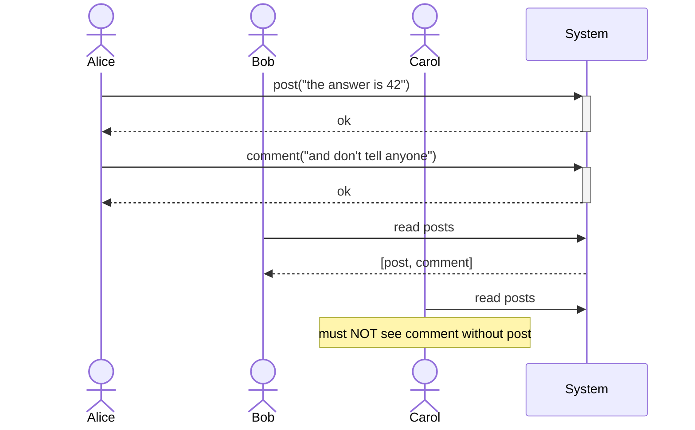

## What "consistency" actually means

When two clients hit a distributed system at almost the same time, they don't always see the same thing. **Consistency models** are formal contracts about what's allowed and what's not — they define which interleavings of operations a system promises will appear to its clients.

The trade-off is brutal but predictable:

> Stronger consistency → simpler reasoning, harder implementation, worse latency, lower availability under partition.

That sentence is the whole game.

## The spectrum

From strongest to weakest, the models we care about most:

### Linearizability

Every operation appears to take effect at a single instant between its invocation and response. The system *looks* like a single machine.

- **Pros**: trivial reasoning, no surprises.
- **Cons**: requires coordination on every write — costly, and impossible during a partition (CAP).

### Sequential consistency

There's *some* total order of operations that respects each client's program order — but that order doesn't have to match real time.

### Causal consistency

If operation A happens-before operation B (i.e. B was issued knowing A), every observer sees A before B. Concurrent operations may be seen in different orders.

A classic example:



Causal consistency rules out the "comment without post" anomaly without paying for full linearizability.

### Eventual consistency

If updates stop, all replicas eventually converge to the same value. That's it. No timing guarantees, no ordering — and yet, with the right merge function, surprisingly useful.

## A quick comparison

| Model                  | Reads see latest write | Cross-client ordering | Cost                  |
| ---------------------- | ---------------------- | --------------------- | --------------------- |
| Linearizable           | Always                 | Total, real-time      | High (coordination)   |
| Sequential             | Always (per session)   | Total, but not RT     | High                  |
| Causal                 | If causally related    | Partial (causal)      | Medium                |
| Eventual               | Eventually             | None                  | Low                   |

## Picking one

The honest answer: **don't pick "the strongest you can afford."** Pick the weakest model that lets you write the application correctly. Strong consistency is a tax — you pay it on every operation, forever, even when you don't need it.

```typescript
// A registration flow probably needs linearizable username uniqueness.
async function register(username: string) {
    if (await store.get(`user:${username}`)) {
        throw new Error("Username taken");
    }
    await store.put(`user:${username}`, JSON.stringify({ createdAt: Date.now() }));
}

// A page-view counter just needs eventual consistency.
async function recordView(pageId: string) {
    await store.increment(`views:${pageId}`);
}
```

Same store, different consistency requirements per call site. Real systems are full of this. Tuneable consistency (Cassandra, ScyllaDB) makes it explicit; quorum systems (Dynamo, Riak) let you dial it per operation.

## The CAP theorem, briefly

Brewer's CAP theorem says: in the presence of a **P**artition, you must choose between **C**onsistency and **A**vailability. You cannot have all three.

In practice, partitions are rare but happen, and the question is what your system does when one occurs:

- **CP systems** (etcd, ZooKeeper) refuse writes on the minority side. Correct, but unavailable.
- **AP systems** (Cassandra, Dynamo) accept writes on both sides. Available, but you'll have to reconcile divergent state.

CAP is a useful sketch, not a proof of impossibility — see PACELC for the full picture, which adds latency-vs-consistency trade-offs even in the absence of partitions.

We'll see all of this play out in the next chapter on replication and quorums.
