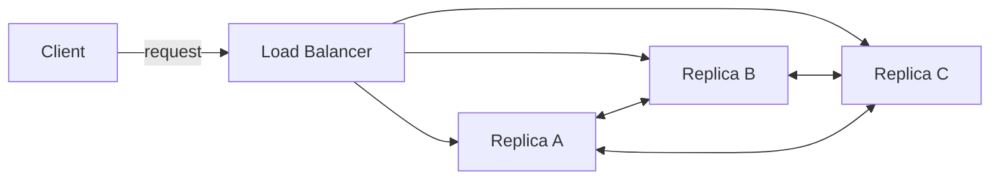

## Why distributed systems

When a single machine can no longer keep up — too much data, too many requests, or too high a reliability bar — we spread the work across many machines. That sounds simple, but the moment more than one machine is involved, every assumption we relied on locally starts to leak: messages get lost, clocks drift, processes crash mid-operation, and partitions cut the network in half.

The literature usually frames this as **three goals** we'd like to achieve at the same time:

- **Scalability** — handle more load by adding more machines.
- **Availability** — keep responding even when components fail.
- **Performance** — keep latency low.

And **two adversaries** that fight back:

1. Concurrency — operations happen at the same time across many nodes.
2. Partial failure — some nodes work, others don't, and we can't always tell which.

## What this guide covers

This guide is a working set of notes I keep refining as I read, build, and re-read the seminal papers. Expect:

| Area              | Topics                                                          |
| ----------------- | --------------------------------------------------------------- |
| **Foundations**   | Consistency models, replication, quorums, the CAP theorem       |
| **Coordination**  | Consensus (Paxos, Raft), distributed locks, leader election     |
| **Storage**       | Replicated logs, LSM trees, distributed file systems            |
| **Patterns**      | Event sourcing, sagas, idempotency, exactly-once semantics      |

Each chapter starts from the **problem**, walks through one or two solutions, and lands on the trade-offs. The goal is not exhaustive coverage but the kind of working intuition that lets you read a new paper or design doc and instantly know what questions to ask.

## A simple shape to keep in mind

Most distributed system problems boil down to a few interacting concerns. Here's the shape we'll keep returning to:



Three replicas, a load balancer, a client. The questions that follow:

The same shape, drawn in [D2](https://d2lang.com/) for variety:

```d2
client: Client {shape: person}
lb: Load Balancer {shape: hexagon}
a: Replica A
b: Replica B
c: Replica C

client -> lb: request
lb -> a
lb -> b
lb -> c
a <-> b
b <-> c
a <-> c
```


- Which replica handles a write?
- How do the others find out?
- What does the client see if a replica is down?
- What does the client see if the network splits the replicas in half?

Every chapter is, in some sense, a different answer to those four questions.

## A small example

Throughout this guide we'll use a running example: a simple key-value store. Each operation looks like:

```typescript
type KvStore = {
    get(key: string): Promise<string | null>;
    put(key: string, value: string): Promise<void>;
    delete(key: string): Promise<void>;
};
```

Innocuous on a single machine. Diabolical on a thousand.

Try a quick sanity check on a single-machine map — click **Run** to execute it in a sandbox. Switch tabs to compare the same example across languages:

```python run
store = {}

def put(k, v):
    store[k] = v

def get(k):
    return store.get(k)

put("color", "blue")
put("count", "42")
print(get("color"))
print(get("count"))
print(get("missing"))
```

```java run
import java.util.HashMap;
import java.util.Map;

public class Main {
    static final Map<String, String> store = new HashMap<>();

    static void put(String k, String v) { store.put(k, v); }
    static String get(String k) { return store.get(k); }

    public static void main(String[] args) {
        put("color", "blue");
        put("count", "42");
        System.out.println(get("color"));
        System.out.println(get("count"));
        System.out.println(get("missing"));
    }
}
```

```typescript run
const store = new Map<string, string>();

const put = (k: string, v: string) => store.set(k, v);
const get = (k: string) => store.get(k) ?? null;

put("color", "blue");
put("count", "42");
console.log(get("color"));
console.log(get("count"));
console.log(get("missing"));
```

## A bit of math

We'll occasionally lean on quorum arithmetic. The classic result is that a write quorum $W$ and read quorum $R$ on a cluster of $N$ replicas guarantee strong consistency when:

$$
W + R > N
$$

This single inequality drives a surprising amount of practical design — Cassandra's tuneable consistency, Dynamo's hinted handoff, etcd's Raft majority — all variations on this theme.

Onward.
